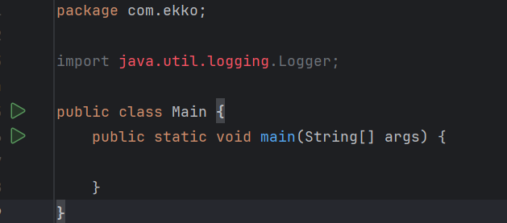
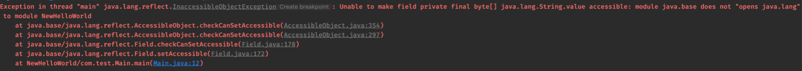
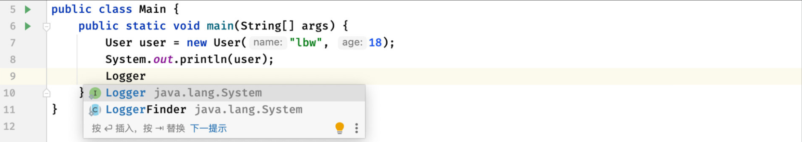
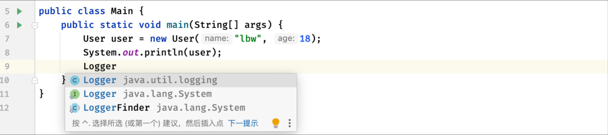

## Java9

Java 9的主要特性有，全新的模块机制、接口的private方法等。

### 模块机制

#### 简介

当我们导入一个`jar`包作为依赖时（包括JDK官方库），实际上很多功能我们并不会用到，但是由于它们是属于同一个依赖捆绑在一起，这样就会导致我们可能只用到一部分内容，但是需要引用一个完整的类库

实际上我们可以把用不到的类库排除掉，大大降低依赖库的规模。

于是，Java 9引入了**模块机制**来对这种情况进行优化，在之前的我们的项目是这样的：


而在引入模块机制之后：


可以看到，模块可以由一个或者多个在一起的 Java 包组成，通过将这些包分出不同的模块，我们就可以按照模块的方式进行管理了。

##### 实现包的分离管理

这里我们创建一个新的项目，并在`src`目录下，新建`module-info.java`文件表示此项目采用模块管理机制：

```java
module NewHelloWorld {  //模块名称随便起一个就可以，但是注意必须是唯一的，以及模块内的包名也得是唯一的，即使模块不同
    
}
```

接着我们来创建一个主类：

```
package com.ekko;

public class Main {
    public static void main(String[] args) {
        System.out.println("Hello World");
    }
}

```

程序可以正常运行，貌似和之前没啥区别，不过我们发现，JDK为我们提供的某些框架不见了

Java为我们提供的`logging`相关日志库，即 `java.util.loggin`

我们发现现在不见了，实际上它就是被作为一个模块单独存在，这里我们需进行**模块导入**：

```java
module NewHelloWorld {  //模块名称随便起一个就可以
    requires java.logging;   
    //除了JDK的一些常用包之外，只有我们明确需要的模块才会导入依赖库
    //当然如果要导入JavaSE的所有依赖，想之前一样的话，直接 requires java.se;  即可
}
```

这里我们导入java.logging相关模块后，就可以正常使用Logger了

否则，如果未在 `module-info.java` 中导入，会提示找不到



模块化机制提供了另一个级别的Java代码可见性、可访问性的控制。

##### 提高安全性

尝试通过反射获取JDK提供的类中的字段：

```java
//Java17版本的String类
public final class String
    implements java.io.Serializable, Comparable<String>, CharSequence,
               Constable, ConstantDesc {
    @Stable
    private final byte[] value; 
     //自JDK9后，为了提高性能，String底层数据存放的是byte[]而不是char[]
    ....
    }
```

```java
public static void main(String[] args) throws NoSuchFieldException, IllegalAccessException {
    Class<String> stringClass = String.class;
    Field field = stringClass.getDeclaredField("value");
    //这里我们通过反射来获取String类中的value字段
    field.setAccessible(true);
    //由于是private访问权限，所以我们修改一下
    System.out.println(field.get("ABCD"));
}
```

但是我们发现，在程序运行之后，修改操作被阻止了：



反射 API 的 Java 9 封装和安全性得到了改进，如果模块没有明确授权给其他模块使用反射的权限，那么其他模块是不允许使用反射进行修改的。

#### 介绍

首先模块具有四种类型：

- **系统模块：** 来自JDK和JRE的模块（官方提供的模块，比如我们上面用的）
  我们也可以直接使用`java --list-modules`命令来列出所有的模块，不同的模块会导出不同的包供我们使用。

- **应用程序模块：** 我们自己写的Java模块项目。

- **自动模块：** 可能有些库并不是Java 9以上的模块项目，这种时候就需要做兼容了，默认情况下是**直接导出所有的包**，可以访问所有其他模块提供的类，不然之前版本的库就用不了了。

- **未命名模块：** 我们自己创建的一个Java项目，如果没有创建`module-info.java`，那么会按照未命名模块进行处理
  未命名模块同样可以访问所有其他模块提供的类，这样我们之前写的Java 8代码才能正常地在Java 9以及之后的版本下运行。
  不过，由于没有使用Java 9的模块新特性，未命名模块只能**默认暴露给其他未命名的模块和自动模块**，应用程序模块无法访问这些类（实际上就是传统Java 8以下的编程模式，因为没有模块只需要导包就行）

#### 例子

这里我们就来创建两个项目，看看如何使用模块机制

首先我们在项目A中，添加一个`User`类，然后在项目B使用：

```java
package com.test;

public class User {
    String name;
    int age;

    public User(String name, int age) {
        this.name = name;
        this.age = age;
    }

    @Override
    public String toString() {
        return name+" ("+age+"岁)";
    }
}
```

接着我们编写一下项目A的模块设置：

```java
module module.a {
    exports com.test;
}
```

这里我们将`com.test`包下所有内容都暴露出去，默认情况下**所有的包都是私有**的，就算其他项目将此项目作为依赖也无法使用。

接着我们现在想要在项目B中使用项目A的User类，我们需要进行导入：

```java
module module.b {
    requires module.a;
}
```

现在我们就可以在Main类中使用模块`module.a`中暴露出来的包内容了：

```java
import com.test.User;   
//如果模块module.a不暴露，那么将无法导入

public class Main {
    public static void main(String[] args) {
        User user = new User("penguin", 18);
        System.out.println(user);
    }
}
```

当然除了普通的`exports`进行包的暴露之外，我们也可以直接指定将包暴露给**指定的模块**：

```java
module module.a {
    exports com.test to module.b;   
    //这里我们将com.test包暴露给指定的模块module.b，非指定的模块即使导入也无法使用
}
```

##### 依赖传递 `transitive`

如果模块`module.a`依赖于其他模块，那么会不会传递给依赖于模块`module.a`的模块呢？

默认是不传递的

```java
module module.a {
    exports com.test to module.b;   //使用exports将com.test包下所有内容暴露出去，这样其他模块才能导入
    requires java.logging;   //这里添加一个模块的依赖
}
```



可以看到，在模块`module.b`中，并**没有进行依赖传递**，说明哪个模块导入的依赖只能哪个模块用

但是现在我们希望依赖可以传递，就是哪个模块用了什么依赖，依赖此模块的模块也会自动进行依赖，我们可以通过一个关键字解决：

```java
module module.a {
    exports com.test to module.b;   
    //使用exports将com.test包下所有内容暴露出去，这样其他模块才能导入
    requires transitive java.logging;   
    //使用transitive来向其他模块传递此依赖
}
```

现在就可以使用了：



##### 开启反射 `open`

还有我们前面演示的反射，我们发现如果我们依赖了一个模块，是没办法直接进行反射操作的

那么怎么样才可以使用反射呢？我们可以为其他模块开放某些运行使用反射的类：

```java
open module module.a {   
  //直接添加open关键字开放整个模块的反射权限
    exports com.test to module.b;
}
```

```java
module module.a {
    exports com.test to module.b;
    opens com.test;   
    //通过使用opens关键字来为其他模块开放反射权限
    //也可以指定目标开放反射 opens com.test to module.b;
}
```

##### 指定实现 `uses` + `provides`

我们还可以指定模块需要使用的抽象类或是接口实现：

```java
package com.test;

public interface Test {
}
```

```java
open module module.a {
    exports com.test to module.b;
    uses com.test.Test;  
    //使用uses指定，Test是一个接口（比如需要的服务等），模块需要使用到
}
```

我们可以在模块B中去实现一下，然后声明我们提供了实现类：

```java
package com.main;

import com.test.Test;

public class TestImpl implements Test {

}
```

```java
module module.b {
    requires module.a;   //导入项目A的模块，此模块暴露了com.test包
    provides com.test.Test with com.main.TestImpl;  //声明此模块提供了Test的实现类
}
```

##### 简单使用

了解了以上的相关知识后，我们就可以简单地进行模块的使用了。比如现在我们创建了一个新的Maven项目

然后我们导入了lombok框架的依赖，如果我们不创建`module-info.java`文件，那么就是一个未命名模块，未命名模块默认可以使用其他所有模块提供的类，实际上就是我们之前的开发模式：

```java
package com.test;

import lombok.extern.java.Log;

@Log
public class Main {
    public static void main(String[] args) {
        log.info("Hello World!");   //使用lombok提供的注解，可以正常运行
    }
}
```

现在我们希望按照全新的模块化开发模式来进行开发，将我们的项目从未命名模块改进为应用程序模块，所以我们先创建好`module-info.java`文件：

```java
module com.test {
}
```

我们还需要去依赖对应的模块：

```java
module com.test {
    requires lombok;   //lombok模块
    requires java.logging;    //JUL日志模块，也需要使用到
}
```

这样我们就可以正常使用了。
