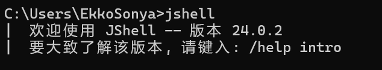
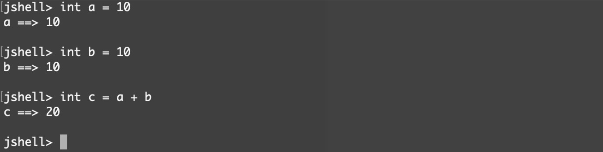
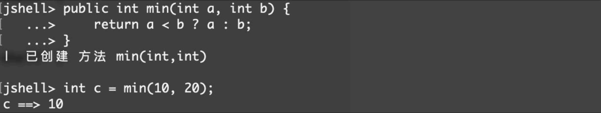
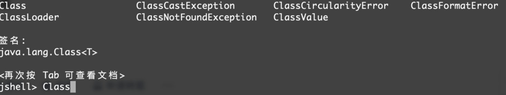
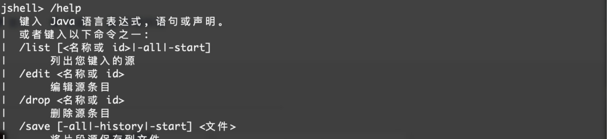
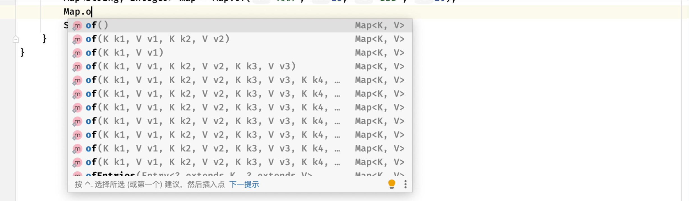

## Java9

### JShell交互式编程

Java 9为我们通过了一种交互式编程工具`JShell`



环境配置完成后，我们只需要输入`jshell`命令即可开启交互式编程了，它支持我们一条一条命令进行操作。

比如我们来做一个简单的计算：



我们一次输入一行（可以不加分号），先定义一个a=10和b=10，然后定义c并得到a+b的结果，可以看到还是非常方便的，但是注意语法还是和Java是一样的。



我们也可以快速创建一个方法供后续的调用。当我们按下Tab键还可以进行自动补全：



除了直接运行我们写进去的代码之外，它还支持使用命令，输入`help`来查看命令列表：



比如我们可以使用`/vars`命令来展示当前定义的变量列表：


当我们不想使用jshell时，直接输入`/exit`退出即可

### 接口中的private方法

接口中的方法默认是 `public abstract`

在Java 8中，接口中 的方法支持添加`default`关键字来添加默认实现：

```java
public interface Test {
    default void test(){
        System.out.println("我是test方法默认实现");
    }
}
```

而在Java 9中，接口再次得到强化，现在接口中可以存在**私有方法**了：

```java
public interface Test {
    default void test(){
        System.out.println("我是test方法默认实现");
        this.inner();   
        //接口中方法的默认实现可以直接调用接口中的私有方法
    }
    
    private void inner(){   
        //声明一个私有方法
        System.out.println("我是接口中的私有方法！");
    }
}
```

注意私有方法必须要提供方法体，因为权限为私有的，也只有这里能进行方法的具体实现了，并且此方法只能被接口中的其他私有方法或是默认实现调用。

### 集合类新增工厂方法 `xx.of()`

在之前，如果我们想要快速创建一个Map只能：

```java
public static void main(String[] args) {
    Map<String, Integer> map = new HashMap<>();   //要快速使用Map，需要先创建一个Map对象，然后再添加数据
    map.put("AAA", 19);
    map.put("BBB", 23);

    System.out.println(map);
}
```

而在Java 9之后，我们可以直接通过`of`方法来快速创建了：

```java
public static void main(String[] args) {
    Map<String, Integer> map = Map.of("AAA", 18, "BBB", 20);  //直接一句搞定

    System.out.println(map);
}
```

是不是感觉非常方便，of方法还被重载了很多次，分别适用于快速创建包含0~10对键值对的Map：



但是注意，通过这种方式创建的Map和通过Arrays创建的List比较类似，也是**无法进行修改**的。

当然，除了Map之外，其他的集合类都有相应的`of`方法：

```java
public static void main(String[] args) {
    Set<String> set = Set.of("BBB", "CCC", "AAA");  //注意Set中元素顺序并不一定你的添加顺序
    List<String> list = List.of("AAA", "CCC", "BBB");   //好耶，再也不用Arrays了
}
```

### 改进的 Stream API

这里不是指进行IO操作的流，而是JDK1.8新增的Stream API，通过它大大方便了我们的编程。

```java
public static void main(String[] args) {
    Stream
            .of("A", "B", "B", "C")
            //这里我们可以直接将一些元素封装到Stream中
            .filter(s -> s.equals("B"))
            //通过过滤器过滤
            .distinct()
            //去重
            .forEach(System.out::println);   //最后打印
}
```

自从有了Stream，我们对于集合的一些操作就大大地简化了，对集合中元素的批量处理，只需要在Stream中一气呵成

如此方便的框架，在Java 9得到了进一步的增强：

#### `ofNullable`

```java
public static void main(String[] args) {
    Stream
            .of(null)   //如果传入null会报错
            .forEach(System.out::println);

    Stream
            .ofNullable(null) 
            //使用新增的ofNullable方法，这样就不会了，不过这样的话流里面就没东西了
            .forEach(System.out::println);
}
```

#### 利用 `Stream` 来迭代生成数据 `iterate`

还有，我们可以通过迭代快速生成一组数据（实际上Java 8就有了，这里新增的是允许结束迭代的）：

```java
public static void main(String[] args) {
    Stream
            .iterate(0, i -> i + 1)   //Java8只能像这样生成无限的流，第一个参数是种子，就是后面的UnaryOperator的参数i一开始的值，最后会返回一个值作为i的新值，每一轮都会执行UnaryOperator并生成一个新值到流中，这个是源源不断的，如果不加limit()进行限制的话，将无限生成下去。
            .limit(20)   //这里限制生成20个
            .forEach(System.out::println); 
}
```

```java
public static void main(String[] args) {
    Stream
            //不知道怎么写？参考一下：for (int i = 0;i < 20;i++)
            .iterate(0, i -> i < 20, i -> i + 1)  //快速生成一组0~19的int数据，中间可以添加一个断言，表示什么时候结束生成
            .forEach(System.out::println);
}
```

#### 数据截断 `takeWhile` + `dropWhile`

Stream还新增了对数据的截断操作，比如我们希望在读取到某个元素时截断，不再继续操作后面的元素：

```java
public static void main(String[] args) {
    Stream
            .iterate(0, i -> i + 1)
            .limit(20)
            .takeWhile(i -> i < 10)   //当i小于10时正常通过，一旦大于等于10直接截断
            .forEach(System.out::println);
}
```

```java
public static void main(String[] args) {
    Stream
            .iterate(0, i -> i + 1)
            .limit(20)
            .dropWhile(i -> i < 10)   
            //和上面相反，上来就是截断状态，只有当满足条件时再开始通过
            .forEach(System.out::println);
}
```

但实际上还是遍历了20个，只不过会删除其他不符合条件的

### 其他小型变动

`Try-with-resource`语法现在不需要再完整的声明一个变量了，我们可以直接将现有的变量丢进去：

```java
public static void main(String[] args) throws IOException {
    InputStream inputStream = Files.newInputStream(Paths.get("pom.xml"));
    try (inputStream) {   //单独丢进try中，效果是一样的
        for (int i = 0; i < 100; i++)
            System.out.print((char) inputStream.read());
    }
}
```

在Java 8中引入了`Optional`类，它很好的解决了判空问题：

```java
public static void main(String[] args) throws IOException {
    test(null);
}

public static void test(String s){
    //比如现在我们想执行 System.out.println(str.toLowerCase())
    //但是由于我们不清楚给进来的str到底是不是null，如果是null的话会引起空指针异常
    //但是去单独进行一次null判断写起来又不太简洁，这时我们可以考虑使用Optional进行包装
    Optional
            .ofNullable(s)
            .ifPresent(str -> System.out.println(str.toLowerCase()));
}
```

这种写法就有点像Kotlin或是JS中的语法：

```kotlin
fun main() {
    test(null)
}

fun test(str : String?){   //传入的String对象可能为null，这里类型写为String?
    println(str?.lowercase())   // ?.表示只有不为空才进行调用
}
```

在Java 9新增了一些更加方便的操作：

```java
public static void main(String[] args) {
    String str = null;
    Optional.ofNullable(str).ifPresentOrElse(s -> {  //通过使用ifPresentOrElse，我们同时处理两种情况
        System.out.println("被包装的元素为："+s);     //第一种情况和ifPresent是一样的
    }, () -> {
        System.out.println("被包装的元素为null");   //第二种情况是如果为null的情况
    });
}
```

我们也可以使用`or()`方法快速替换为另一个Optional类：

```java
public static void main(String[] args) {
    String str = null;
    Optional.ofNullable(str)
      .or(() -> Optional.of("AAA"))   //如果当前被包装的类不是null，依然返回自己，但是如果是null，那就返回Supplier提供的另一个Optional包装
      .ifPresent(System.out::println);
}
```

当然还支持直接转换为Stream，这里就不多说了。

在Java 8及之前，匿名内部类是没办法使用钻石运算符进行自动类型推断的：

```java
public abstract class Test<T>{   //这里我们写一个泛型类
    public T t;

    public Test(T t) {
        this.t = t;
    }

    public abstract T test();
}
```

```java
public static void main(String[] args) throws IOException {
    Test<String> test = new Test<>("AAA") {
        //在低版本这样写是会直接报错的，因为匿名内部类不支持自动类型推断，但是很明显我们这里给的参数是String类型的，所以明明有机会进行类型推断，却还是要我们自己填类型，就很蠢
        //在Java 9之后，这样的写法终于可以编译通过了
        @Override
        public String test() {
            return t;
        }
    };
}
```

当然除了以上的特性之外还有Java 9的多版本JAR包支持、CompletableFuture API的改进等，因为不太常用，这里就不做介绍了。
