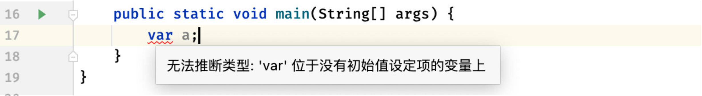
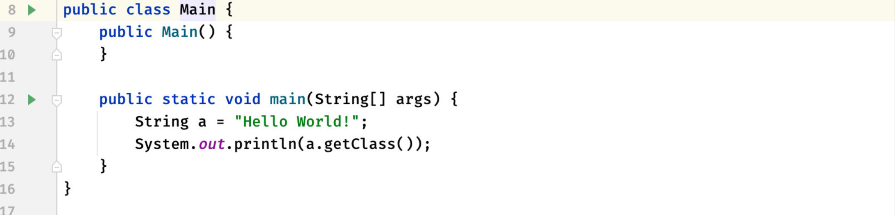
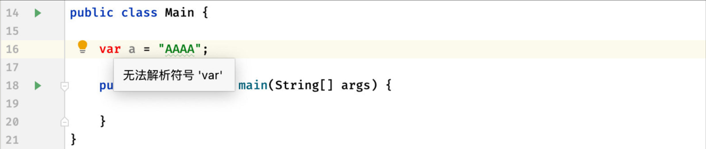

## Java10

Java 10主要带来的是一些内部更新，相比Java 9带来的直观改变不是很多，其中比较突出的就是局部变量类型推断了

### 局部变量类型推断 `var`

在Java中，我们可以使用自动类型推断：

```java
public static void main(String[] args) {
    // String a = "Hello World!";   之前我们定义变量必须指定类型
    var a = "Hello World!";   //现在我们使用var关键字来自动进行类型推断，因为完全可以从后面的值来判断是什么类型
}
```

但是注意，`var`关键字必须位于**有初始值设定的变量**上，否则鬼知道你要用什么类型。



我们来看看是不是类型也能正常获取：

```java
public static void main(String[] args) {
    var a = "Hello World!";
    System.out.println(a.getClass());
}
```

这里虽然是有了var关键字进行自动类型推断，但是最终还是会变成String类型，得到的Class也是String类型。

但是Java终究不像JS那样进行动态推断，这种类型推断仅仅发生在编译期间，到最后编译完成后还是会变成具体类型的：



并且`var`关键字仅适用于局部变量，我们是没办法在其他地方使用的，比如类的成员变量：



有关Java 10新增的一些其他改进，这里就不提了。

## Java11

Java 11 是继Java 8之后的又一个TLS长期维护版本，在Java 17出现之前，一直都是此版本作为广泛使用的版本，其中比较关键的是用于Lambda的形参局部变量语法。

### 用于Lambda的形参局部变量语法

在Java 10我们认识了`var`关键字，它能够直接让局部变量自动进行类型推断，不过它不支持在lambda中使用：


但是实际上这里是完全可以进行类型推断的，所以在Java 11，终于是支持了，这样编写就不会报错了：


### 针对于String类的方法增强

在Java 11为String新增一些更加方便的操作：

```java
public static void main(String[] args) {
    var str = "AB\nC\nD";
    System.out.println(str.isBlank());    //isBlank方法用于判断是否字符串为空或者是仅包含空格
    str
            .lines()   //根据字符串中的\n换行符进行切割，分为多个字符串，并转换为Stream进行操作
            .forEach(System.out::println);
}
```

我们还可以通过`repeat()`方法来让字符串重复拼接：

```java
public static void main(String[] args) {
    String str = "ABCD";   //比如现在我们有一个ABCD，但是现在我们想要一个ABCDABCD这样的基于原本字符串的重复字符串
    System.out.println(str.repeat(2));  //一个repeat就搞定了
}
```

我们也可以快速地进行空格去除操作：

```java
public static void main(String[] args) {
    String str = " A B C D ";
    System.out.println(str.strip());   //去除首尾空格
    System.out.println(str.stripLeading());  //去除首部空格
    System.out.println(str.stripTrailing());   //去除尾部空格
}
```

### 全新的HttpClient使用

在Java 9的时候其实就已经引入了全新的Http Client API，用于取代之前比较老旧的HttpURLConnection类，新的API支持最新的HTTP2和WebSocket协议。

```java
public static void main(String[] args) throws URISyntaxException, IOException, InterruptedException {
    HttpClient client = HttpClient.newHttpClient();   
    //直接创建一个新的HttpClient
    //现在我们只需要构造一个Http请求实体，就可以让客户端帮助我们发送出去了（实际上就跟浏览器访问类似）
    HttpRequest request = HttpRequest.newBuilder().uri(new URI("https://www.baidu.com")).build();
    //现在我们就可以把请求发送出去了，注意send方法后面还需要一个响应体处理器（内置了很多）这里我们选择ofString直接吧响应实体转换为String字符串
    HttpResponse<String> response = client.send(request, HttpResponse.BodyHandlers.ofString());
    //来看看响应实体是什么吧
    System.out.println(response.body());
}
```

利用全新的客户端，我们甚至可以轻松地做一个爬虫（仅供学习使用，别去做违法的事情，爬虫玩得好，牢饭吃到饱），比如现在我们想去批量下载某个网站的壁纸：

网站地址：<https://pic.netbian.com/4kmeinv/>

我们随便点击一张壁纸，发现网站的URL格式为：


并且不同的壁纸似乎都是这样：<https://pic.netbian.com/tupian/数字.html>，好了差不多可以开始整活了：

```java
public static void main(String[] args) throws URISyntaxException, IOException, InterruptedException {
    HttpClient client = HttpClient.newHttpClient();
    for (int i = 0; i < 10; i++) {  //先不要一次性获取太多，先来10个
        HttpRequest request = HttpRequest.newBuilder().uri(new URI("https://pic.netbian.com/tupian/"+(29327 + i)+".html")).build();  //这里我们按照规律，批量获取
        HttpResponse<String> response = client.send(request, HttpResponse.BodyHandlers.ofString());
        System.out.println(response.body());  //这里打印一下看看网页
    }
}
```

可以看到，最后控制台成功获取到这些图片的网站页面了：


接着我们需要来观察一下网站的HTML具体怎么写的，把图片的地址提取出来：


好了，知道图片在哪里就好办了，直接字符串截取：

```java
public static void main(String[] args) throws URISyntaxException, IOException, InterruptedException {
    HttpClient client = HttpClient.newHttpClient();
    for (int i = 0; i < 10; i++) {
        ...
        String html = response.body();
        
        String prefix = "<a href=\"\" id=\"img\"> imageResponse = client.send(imageRequest, HttpResponse.BodyHandlers.ofInputStream());
        //拿到输入流和文件输出流
        InputStream imageInput = imageResponse.body();
        FileOutputStream stream = new FileOutputStream("images/"+i+".jpg"); //一会要保存的格式
        try (stream;imageInput){  //直接把要close的变量放进来就行，简洁一些了
            int size;   //下面具体保存过程的不用我多说了吧
            byte[] data = new byte[1024];  
            while ((size = imageInput.read(data)) > 0) {  
                stream.write(data, 0, size);
            }
        }
    }
}
```

我们现在来看看效果吧，美女的图片已经成功保存到本地了：


当然，这仅仅是比较简单的爬虫，不过我们的最终目的还是希望各位能够学会使用新的HttpClient API。
