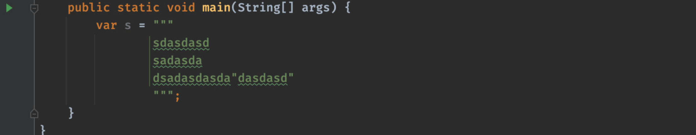
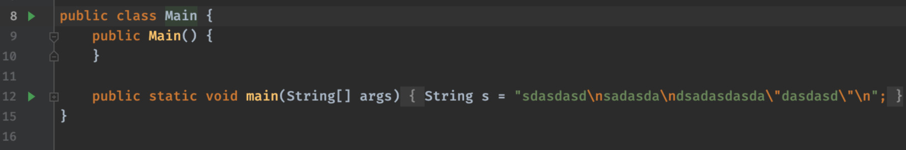
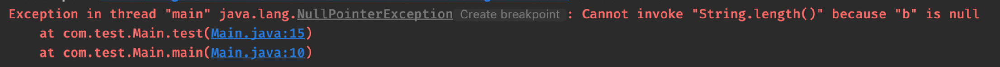
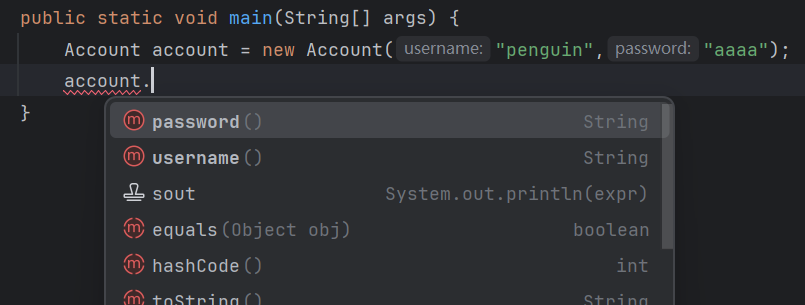
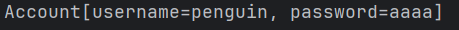
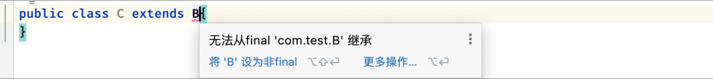
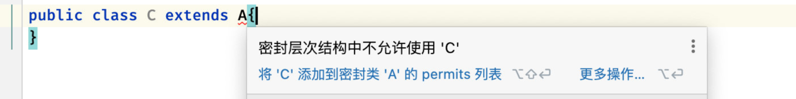

## Java 12-16 新特性

由于Java版本的更新迭代速度自Java 9开始为半年更新一次

Java 8到Java 9隔了整整三年，所以各个版本之间的更新内容比较少了。


Java12-16这五个版本并非长期支持版本，所以很多特性都是一种处于实验性功能

12/13版本引入了一些实验性功能，并根据反馈进行调整，最后在后续版本中正式开放使用。

### 新的switch语法

在Java 12引入全新的switch语法，让我们使用switch语句更加的灵活

比如我们想要编写一个根据成绩得到等级的方法：

```java
/**
 * 传入分数（范围 0 - 100）返回对应的等级：
 *      100-90：优秀
 *      70-80：良好
 *      60-70：及格
 *      0-60：寄
 * @param score 分数
 * @return 等级
 */
public static String grade(int score){
    
}
```

现在我们想要使用switch来实现这个功能，之前的写法是：

```java
public static String grade(int score){
    score /= 10;  
    //既然分数段都是整数，那就直接整除10
    String res = null;
    switch (score) {
        case 10:
        case 9:
            res =  "优秀";
            break;
        case 8:
        case 7:
            res = "良好";
            break;
        case 6:
            res = "及格";
            break;
        default:
            res = "不及格";
            break;
    }
    return res;
}
```

#### `switch` 新语法

但是现在我们可以使用新的特性了：

```java
public static String grade(int score){
    score /= 10;  
    //既然分数段都是整数，那就直接整除10
    return switch (score) {   
        //增强版switch语法
        case 10, 9 -> "优秀";   
        //语法那是相当的简洁，而且也不需要我们自己考虑break或是return来结束switch了
        case 8, 7 -> "良好"; 
        case 6 -> "及格";
        default -> "不及格";
    };
}
```

不过最后编译出来的样子，貌似还是和之前是一样的

#### 详细规则

这种全新的switch语法称为`switch表达式`，它的意义不仅仅体现在语法的精简上，我们来看看它的详细规则：

```java
var res = switch (obj) {   
    //这里和之前的switch语句是一样的，但是注意这样的switch是有返回值的，所以可以被变量接收
    case [匹配值, ...] -> "优秀";
    // case后直接添加匹配值，匹配值可以存在多个，需要使用逗号隔开
    // 使用 -> 来返回如果匹配此case语句的结果
    case ...   //根据不同的分支，可以存在多个case
    default -> "不及格";   
    //注意，表达式要求必须涵盖所有的可能，所以是需要添加default的
};
```

那么如果我们并不是能够马上返回，而是需要做点什么其他的工作才能返回结果呢？

```java
var res = switch (obj) {   //增强版switch语法
    case [匹配值, ...] -> "优秀";
    default -> {   
        //我们可以使用花括号来将整套逻辑括起来
        //... 我是其他要做的事情
        yield  "不及格";  //注意处理完成后需要返回最终结果，但是这样并不是使用return，而是yield关键字
    }
};
```

当然，也可以像这样：

```java
var res = switch (args.length) {   //增强版switch语法
    case [匹配值, ...]:
        yield "AAA";   //传统的:写法，通过yield指定返回结果，同样不需要break
    default:
            System.out.println("默认情况");
        yield "BBB";
};
```

这种全新的语法，可以说极大地方便了我们的编码，不仅代码简短，而且语义明确。唯一遗憾的是依然不支持区间匹配。

**注意：** switch表达式在Java 14才正式开放使用，所以我们项目的代码级别需要调整到14以上。

### 文本块 - 三引号

如果你学习过Python，一定知道三引号：

```python
#当我们需要使用复杂字符串时，可能字符串中包含了很多需要转义的字符，比如双引号等，这时我们就可以使用三引号来囊括字符串
multi_line =  """
                nice to meet you!
                  nice to meet you!
                      nice to meet you!
                """
print multi_line
```

没错，Java13也带了这样的特性，旨在方便我们编写复杂字符串，这样就不用再去用那么多的转义字符了：



可以看到，Java中也可以使用这样的三引号来表示字符串

我们可以随意在里面使用特殊字符，包括双引号等，但是最后编译出来的结果实际上还是会变成一个之前这样使用了转义字符的字符串：



**注意：** 文本块表达式在Java 15才正式开放使用，所以我们项目的代码级别需要调整到15以上。

### 新的instanceof语法

在Java 14，instanceof迎来了一波小更新

比如我们之前要重写一个类的`equals`方法：

```java
public class Student {
    private final String name;

    public Student(String name) {
        this.name = name;
    }

    @Override
    public boolean equals(Object obj) {
        if(obj instanceof Student) {   //首先判断是否为Student类型
            Student student = (Student) obj;  //如果是，那么就类型转换
            return student.name.equals(this.name);  //最后比对属性是否一样
        }
        return false;
    }
}
```

在之前我们一直都是采用这种**先判断类型，然后类型转换，最后才能使用的方式**

但是这个版本instanceof加强之后，我们就不需要了，我们可以直接将student替换为模式变量, 只需要在比较后面加个变量名，等于比较完就强制转换

```java
public class Student {
    private final String name;

    public Student(String name) {
        this.name = name;
    }

    @Override
    public boolean equals(Object obj) {
        if(obj instanceof Student student) {   
            //在比较完成的屁股后面，直接写变量名字，而这个变量就是类型转换之后的
            return student.name.equals(this.name);  
        }
        return false;
    }
}
```

在使用`instanceof`判断类型成立后，**会自动强制转换类型为指定类型**，简化了我们手动转换的步骤。

**注意：** 新的instanceof语法在Java 16才正式开放使用，所以我们项目的代码级别需要调整到16以上。

### 空指针异常的改进

相信各位小伙伴在调试代码时，经常遇到空指针异常，比如下面的这个例子：

```java
public static void test(String a, String b){
    int length = a.length() + b.length();   //可能给进来的a或是b为null
    System.out.println(length);
}
```

那么为空时，就会直接：


但是由于我们这里a和b都调用了`length()`方法，虽然空指针异常告诉我们问题出现在这一行，但是到底是a为null还是b为null呢？我们是没办法直接得到的（遇到过这种问题的扣个1吧，只能调试，就很头疼）

但是当我们在Java 14或更高版本运行时：



这里会明确指出是哪一个变量调用出现了空指针。

### 记录类型 `record`

继类、接口、枚举、注解之后的又一新类型，"记录 `record`"

在Java 14中首次出场，这一出场，Lombok的噩梦来了。

在实际开发中，很多的类仅仅只是充当**一个实体类**罢了，保存的是**一些不可变数据**

比如我们从数据库中查询的账户信息，最后会被映射为一个实体类：

```java
@Data
public class Account {   
    //使用Lombok，一个注解就搞定了
    String username;
    String password;
}
```

Lombok可以说是简化代码的神器了，他能在编译时自动生成`getter`和`setter`、构造方法、toString()方法等实现

而**记录类型**本质上也是一个普通的类

是`final`类型且继承自`java.lang.Record`抽象类

它会在编译时，会自动编译出 `public get` `hashcode` 、`equals`、`toString` 等方法。

```java
public record Account(String username, String password) {
    //直接把字段写在括号中
}
```

使用起来也是非常方便，自动生成了构造方法和成员字段的公共get方法：



并且toString也是被重写了的：



`equals()`方法仅做成员字段之间的值比较，也是帮助我们实现好了的：

```java
Account account0 = new Account("Admin", "123456");
Account account1 = new Account("Admin", "123456");   //两个属性都是一模一样的
System.out.println(account0.equals(account1));  //得到true
```

是不是感觉这种类型就是专门为这种实体类而生的。

```java
public record Account(String username, String password) implements Runnable {  
    //支持实现接口，但是不支持继承，因为继承的坑位已经默认被占了

    @Override
    public void run() {
        
    }
}
```

**注意：** 记录类型在Java 16才正式开放使用，所以我们项目的代码级别需要调整到16以上。

## Java 17 新特性

Java 17作为新的LTS长期维护版本

### 密封类型 `sealed` + `permits`

密封类型可以说是Java 17正式推出的又一重磅类型

它在Java 15首次提出并测试了两个版本。

在Java中，我们可以通过继承（extends关键字）来实现类的能力复用、扩展与增强。

但有的时候，可能并不是所有的类我们都希望能够被继承。

所以，我们需要对继承关系有一些限制的控制手段，而密封类的作用就是**限制类的继承**。

实际上在之前我们如果**不希望别人继承我们的类**，可以直接添加`final`关键字：

```java
public final class A{   //添加final关键字后，不允许对此类继承
    
}
```

这样有一个缺点，如果添加了`final`关键字，那么无论是谁，包括我们自己也是没办法实现继承的

但是现在我们有一个需求，只允许我们自己写的类继承A，但是不允许别人写的类继承A，这时该咋写？在Java 17之前想要实现就很麻烦。

但是现在我们可以使用**密封类型** `sealed` 来实现这个功能：

```java
public sealed class A permits B{   
    //在class关键字前添加sealed关键字，表示此类为密封类型
    // permits后面跟上允许继承的类型，多个子类使用逗号隔开

}
```

#### 要求

密封类型有以下要求：

- 可以基于普通类、抽象类、接口，也可以是继承自其他抽象类的子类或是实现其他接口的类等。

- **必须有子类继承**，且不能是匿名内部类或是lambda的形式。

- `sealed`写在原来`final`的位置，但是不能和`final`、`non-sealed`关键字同时出现，只能选择其一。

- 继承的子类必须**显式标记**为`final`、`sealed`或是`non-sealed`类型。

标准的声明格式如下：

```java
public sealed [abstract] [class/interface] 类名 [extends 父类] [implements 接口, ...] permits [子类, ...]{
        //里面的该咋写咋写
}
```

注意子类格式为：

```java
public [final/sealed/non-sealed] class 子类 extends 父类 {
    //必须继承自父类
    //final类型：任何类不能再继承当前类，到此为止，已经封死了。
    //sealed类型：同父类，需要指定由哪些类继承。
    //non-sealed类型：重新开放为普通类，任何类都可以继承。
}
```

比如现在我们写了这些类：

```java
public sealed class A  permits B{   //指定B继承A

}
```

```java
public final class B extends A {   //在子类final，彻底封死

}
```

我们可以看到其他的类无论是继承A还是继承B都无法通过编译：





但是如果此时我们主动将B设定为`non-sealed`类型：

```java
public non-sealed class B extends A {

}
```

这样就可以正常继承了，因为B指定了`non-sealed`主动放弃了密封特性，这样就显得非常灵活了。

当然我们也可以**通过反射来获取类是否为密封类型**：

```java
public static void main(String[] args) {
    Class<A> a = A.class;
    System.out.println(a.isSealed());   //是否为密封
}
```
