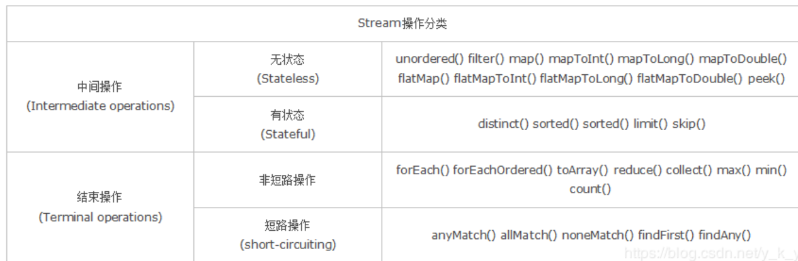

## `Consumer`

`Consumer`是Java 8中的一个函数式接口，它位于`java.util.function`包中。

定义了一个名为`accept`的抽象方法，该方法接受一个参数并且不返回任何结果。

换句话说，`Consumer`接口表示一个消费者，它可以对给定的对象**执行某些操作，但不产生任何结果**。

### 接口声明

```java
public interface Consumer<T> {

    /**
     * Performs this operation on the given argument.
     *
     * @param t the input argument
     */
    void accept(T t);

    /**
     * Returns a composed {@code Consumer} that performs, in sequence, this
     * operation followed by the {@code after} operation. If performing either
     * operation throws an exception, it is relayed to the caller of the
     * composed operation.  If performing this operation throws an exception,
     * the {@code after} operation will not be performed.
     *
     * @param after the operation to perform after this operation
     * @return a composed {@code Consumer} that performs in sequence this
     * operation followed by the {@code after} operation
     * @throws NullPointerException if {@code after} is null
     */
    default Consumer<T> andThen(Consumer<? super T> after) {
        Objects.requireNonNull(after);
        return (T t) -> { accept(t); after.accept(t); };
    }
}
```

主要就两个方法：

#### `accept`

核心方法是`accept`，该方法接受一个参数，并在方法体内定义具体的操作

这是抽象方法，也是我们需要给的

具体示例：

```java
// Lambda表达式简化
Consumer<String> printer = (s) -> System.out.println(s);

// 使用 accept 方法执行操作
printer.accept("Hello, World!");
```

#### `addThen`

第二个是 `addThen`，为了方便 `Consumer` 链式操作

`Consumer`接口还支持链式操作，也就是将多个`Consumer`组合在一起，形成一个新的`Consumer`。

这可以通过`andThen`方法来实现，该方法允许将两个`Consumer`连接在一起，顺序执行。

```java
Consumer<String> upperCasePrinter = (s) -> System.out.println(s.toUpperCase());
Consumer<String> lowerCasePrinter = (s) -> System.out.println(s.toLowerCase());

// 使用 andThen 方法连接两个 Consumer
Consumer<String> combinedPrinter = upperCasePrinter.andThen(lowerCasePrinter);

combinedPrinter.accept("Hello, World!");
```

传递的参数都是一样的不会被上一个影响，都是`Hello, World!`

## `Optional`

Optional 类是一个可以为null的容器对象。如果值存在则isPresent()方法会返回true，调用get()方法会返回该对象。

Optional 是个容器：它可以保存类型T的值，或者仅仅保存null。Optional提供很多有用的方法，这样我们就不用显式进行空值检测。

Optional 类的引入很好的解决空指针异常。

```java
import java.util.Optional;
 
public class Java8Tester {
   public static void main(String args[]){
   
      Java8Tester java8Tester = new Java8Tester();
      Integer value1 = null;
      Integer value2 = new Integer(10);
        
      // Optional.ofNullable - 允许传递为 null 参数
      Optional<Integer> a = Optional.ofNullable(value1);
        
      // Optional.of - 如果传递的参数是 null，抛出异常 NullPointerException
      Optional<Integer> b = Optional.of(value2);
      System.out.println(java8Tester.sum(a,b));
   }
    
   public Integer sum(Optional<Integer> a, Optional<Integer> b){
    
      // Optional.isPresent - 判断值是否存在
        
      System.out.println("第一个参数值存在: " + a.isPresent());
      System.out.println("第二个参数值存在: " + b.isPresent());
        
      // Optional.orElse - 如果值存在，返回它，否则返回默认值
      Integer value1 = a.orElse(new Integer(0));
        
      //Optional.get - 获取值，值需要存在
      Integer value2 = b.get();
      return value1 + value2;
   }
}
```

## `Stream`

Stream 是 Java8 中处理集合的关键抽象概念，它可以指定你希望对集合进行的操作，可以执行非常复杂的查找、过滤和映射数据等操作。

使用Stream API 对集合数据进行操作，就类似于使用 SQL 执行的数据库查询。也可以使用 Stream API 来并行执行操作。

### 特点

- 不是数据结构，不会保存数据。

- 不会修改原来的数据源，它会将操作后的数据保存到另外一个对象中。（保留意见：毕竟peek方法可以修改流中元素）

- 惰性求值，流在中间处理过程中，只是对操作进行了记录，并不会立即执行，需要等到执行终止操作的时候才会进行实际的计算。

### 操作

`Stream`可以由**数组或集合**创建，对流的操作分为两种：

- 中间操作，每次返回一个新的流，可以有多个
  （筛选filter、映射map、排序sorted、去重组合skip—limit）

- 终端操作，每个流只能进行一次终端操作，终端操作结束后流无法再次使用。 
  终端操作会产生一个新的集合或值。（遍历foreach、匹配find–match、规约reduce、聚合max–min–count、收集collect）



```java
List<String> list = new ArrayList<>();
list.add("武汉加油");
list.add("中国加油");
list.add("世界加油");
list.add("世界加油");

long count = list.stream().distinct().count();
System.out.println(count);
```

中间操作不会立即执行，只有等到终端操作的时候，流才开始真正地遍历，用于映射、过滤等。通俗点说，就是一次遍历执行多个操作，性能就大大提高了。

### 创建流

如果是**数组**的话，可以使用 `Arrays.stream()` 或者 `Stream.of()`创建流

如果是**集合**的话，可以直接使用 `stream()` 方法创建流，因为该方法已经添加到 Collection 接口中。

查看 `Stream` 源码的话，你会发现 `of()` 方法内部其实调用了`Arrays.stream()` 方法。

```java
public static<T> Stream<T> of(T... values) {
    return Arrays.stream(values);
}
```

另外，集合还可以调用 `parallelStream()` 方法创建并发流，默认使用的是 `ForkJoinPool.commonPool()`线程池。

### 操作流

#### 过滤 `filter`

```java
public class FilterStreamDemo {
    public static void main(String[] args) {
        List<String> list = new ArrayList<>();
        list.add("周杰伦");
        list.add("王力宏");
        list.add("陶喆");
        list.add("林俊杰");
        Stream<String> stream = list.stream().filter(element -> element.contains("王"));
        stream.forEach(System.out::println);
    }
}
```

#### 映射 `map`

把一个流中的元素转化成新的流中的元素

map() 方法接收的是一个 Function（Java 8 新增的一个函数式接口，接受一个输入参数 T，返回一个结果 R）类型的参数，此时参数 为 String 类的 length 方法

也就是把 `Stream<String>` 的流转成一个 `Stream<Integer>` 的流

新的流中的内容被修改为对应字符串的长度

```java
public class MapStreamDemo {
    public static void main(String[] args) {
        List<String> list = new ArrayList<>();
        list.add("周杰伦");
        list.add("王力宏");
        list.add("陶喆");
        list.add("林俊杰");
        Stream<Integer> stream = list.stream().map(String::length);
        stream.forEach(System.out::println);
    }
}
```

#### 匹配

Stream 类提供了三个方法可供进行元素匹配，它们分别是：

- `anyMatch()`，只要有一个元素匹配传入的条件，就返回 true。

- `allMatch()`，只有有一个元素不匹配传入的条件，就返回 false；如果全部匹配，则返回 true。

- `noneMatch()`，只要有一个元素匹配传入的条件，就返回 false；如果全部不匹配，则返回 true。

#### 组合 `reduce`

`reduce()` 方法的主要作用是把 `Stream` 中的元素组合起来，它有两种用法：

- `Optional<T> reduce(BinaryOperator<T> accumulator)`
  没有起始值，只有一个参数，就是运算规则，此时返回 `Optional`。

- `T reduce(T identity, BinaryOperator<T> accumulator)`
  有起始值，有运算规则，两个参数，此时返回的类型和起始值类型一致。

```java
public class ReduceStreamDemo {
    public static void main(String[] args) {
        Integer[] ints = {0, 1, 2, 3};
        List<Integer> list = Arrays.asList(ints);

        Optional<Integer> optional = list.stream().reduce((a, b) -> a + b);
        Optional<Integer> optional1 = list.stream().reduce(Integer::sum);
        System.out.println(optional.orElse(0));
        System.out.println(optional1.orElse(0));

        int reduce = list.stream().reduce(6, (a, b) -> a + b);
        System.out.println(reduce);
        int reduce1 = list.stream().reduce(6, Integer::sum);
        System.out.println(reduce1);
    }
}
```

### 转换流 `collect()`

```java
public class CollectStreamDemo {
    public static void main(String[] args) {
        List<String> list = new ArrayList<>();
        list.add("周杰伦");
        list.add("王力宏");
        list.add("陶喆");
        list.add("林俊杰");

        String[] strArray = list.stream().toArray(String[]::new);
        System.out.println(Arrays.toString(strArray));

        List<Integer> list1 = list.stream().map(String::length).collect(Collectors.toList());
        List<String> list2 = list.stream().collect(Collectors.toCollection(ArrayList::new));
        System.out.println(list1);
        System.out.println(list2);

        String str = list.stream().collect(Collectors.joining(", ")).toString();
        System.out.println(str);
    }
}
```

`toArray()` 方法可以将流转换成数组

来看一下 `toArray()` 方法的源码。

```java
<A> A[] toArray(IntFunction<A[]> generator);
```

也就是说 `String[]::new` 是一个 `IntFunction`，一个可以产生所需的新数组的函数，可以通过反编译字节码看看它到底是什么：

```java
String[] strArray = (String[])list.stream().toArray((x$0) -> {
    return new String[x$0];
});
System.out.println(Arrays.toString(strArray));
```

也就是相当于返回了一个指定长度的字符串数组。

当我们需要把一个集合按照某种规则转成另外一个集合的时候，就可以配套使用 `map()` 方法和 `collect()` 方法。

```java
List<Integer> list1 = list.stream().map(String::length).collect(Collectors.toList());
```

通过 `stream()` 方法创建集合的流后，再通过 `map(String:length)` 将其映射为字符串长度的一个新流，最后通过 `collect()`方法将其转换成新的集合。

`Collectors` 是一个收集器的工具类，内置了一系列收集器实现，比如说 toList() 方法将元素收集到一个新的 java.util.List 中；比如说 toCollection() 方法将元素收集到一个新的 java.util.ArrayList 中；比如说 joining() 方法将元素收集到一个可以用分隔符指定的字符串中。

## `Builder`

一般构建对象时会有两种方法：

1. 通过构造函数来构建
2. 一个默认的构造函数，然后用 `setter` 方法设置

比如一个api结果返回值的类Result，其在代码中频繁被使用：

```java
public class Result<T> {
    private int code;
    private String message;
    private T data;

    public Result(int code, String message, T data) {
        this.code = code;
        this.message = message;
        this.data = data;
    }

    public Result() {
    }

    public int getCode() {
        return code;
    }

    public void setCode(int code) {
        this.code = code;
    }

    public String getMessage() {
        return message;
    }

    public void setMessage(String message) {
        this.message = message;
    }

    public T getData() {
        return data;
    }

    public void setData(T data) {
        this.data = data;
    }

    @Override
    public String toString() {
        return "Result{" +
                "code=" + code +
                ", message='" + message + '\'' +
                ", data=" + data +
                '}';
    }
}
```

如果要使用它，一般的方法是：

```java
public class Main {
    public static void main(String[] args) {
        //方法1，使用全量的构造函数
        Result<String> result1 = new Result<>(200, "success", "");

        //方法2，使用空的构造函数加setter函数赋值
        Result<String> result2 = new Result<>();
        result2.setCode(200);
        result2.setMessage("success");
        result2.setData("");
    }
}
```

这两种使用方法的弊端有：

1. 方法一：当只需要部分参数的时候需要再定义个构造函数（比如失败的情况只需要code和message，结果肯定是空，因此不需要data），且一旦参数较多，则构造函数冗长；
2. 方法二：setter冗长；

### 建造者模式

其实是一种设计模式，叫做建造者模式，它的含义是将一个复杂的对象的构建与它的表示分离，同样的构建过程可以创建不同的表示

可以在 `Result` 内加入一个 `Builder` 类:

```java
public static final class Builder<T> {
    private int code;
    private String message;
    private T data;

    private Builder() {
    }

    public Builder code(int val) {
        code = val;
        return this;
    }

    public Builder message(String val) {
        message = val;
        return this;
    }

    public Builder data(T val) {
        data = val;
        return this;
    }

    public Result build() {
        return new Result(this);
    }
}
```

然后使用的时候：

```java
Result<String> result3 = new Result.Builder<>().code(404).message("failure").build();
Result<String> result4 = Result.newBuilder().code(404).message("failure").build();
```

所以只需要构造一个 `builder`，通过 `Result.builder()` 然后根据属性调用对应的方法进行修改，最后使用 `build()` 就可以创造出不同的对象

### `Lombok` 中的 `@Builder`

lombok 用 `@Builder` 来辅助设计

`@Builder`可以让你以下面显示的那样调用你的代码，来初始化你的实例对象：

```java
Person.builder()
      .name("Adam Savage")
      .city("San Francisco")
      .job("Mythbusters")
      .job("Unchained Reaction")
      .build();
```

`@Builder`可以放在类，构造函数或方法上。 虽然放在类上和放在构造函数上这两种模式是最常见的用例，但@Builder最容易用放在方法的用例来解释

具体操作：

使用`@Builder`注释的方法具体实现了：

- 一个名为`FooBuilder`的内部静态类，并具有和实体类**一致的属性**（称为构建器）。

- 在构建器中：对于目标类中的所有的属性和未初始化的final字段，都会在构建器中创建对应属性；

- 在构建器中：创建一个无参的default构造函数。

- 在构建器中：对于实体类中的每个参数，都会对应创建类似于`setter`的方法，方法名与该参数名相同。 并且返回值是**构建器本身**（**便于链式调用**）

- 在构建器中：一个`build()`方法，调用此方法，就会根据设置的值进行创建实体对象。

- 在构建器中：同时也会生成一个`toString()`方法。

- 在实体类中：会创建一个`builder()`方法，它的目的是用来创建构建器。

```java
@Builder
public class User {
    private String username;
    private String password;
}
 
// 编译后：
public class User {
    private String username;
    private String password;
    User(String username, String password) {
        this.username = username; this.password = password;
    }
    public static User.UserBuilder builder() {
        return new User.UserBuilder();
    }
 
    public static class UserBuilder {
        private String username;
        private String password;
        UserBuilder() {}
 
        public User.UserBuilder username(String username) {
            this.username = username;
            return this;
        }
        public User.UserBuilder password(String password) {
            this.password = password;
            return this;
        }
        public User build() {
            return new User(this.username, this.password);
        }
        public String toString() {
            return "User.UserBuilder(username=" + this.username + ", password=" + this.password + ")";
        }
    }
}
```
