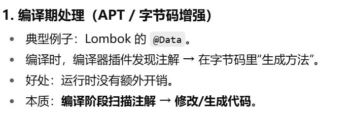
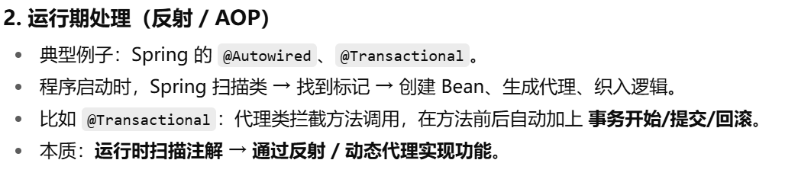
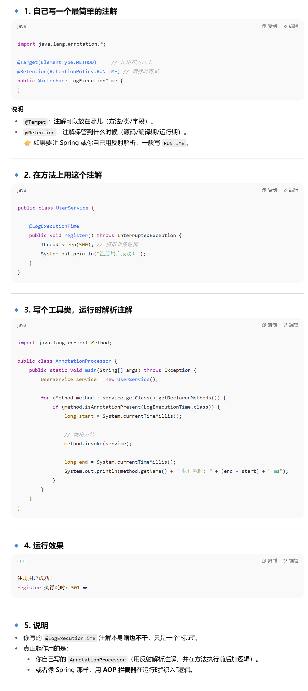
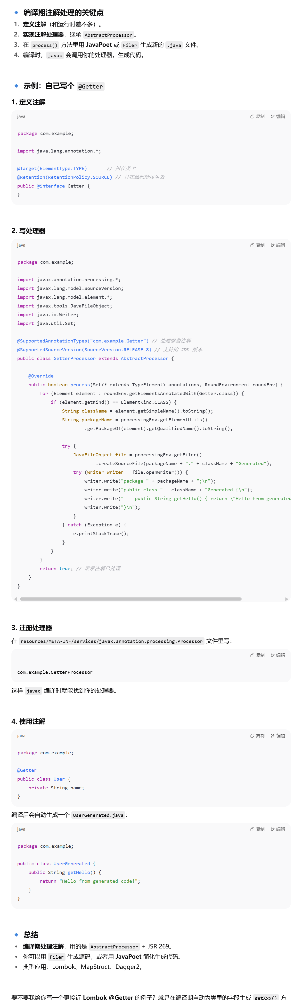

首先，注解的使用分成两类

- 编译期生效（Lombok：改写字节码，帮你生成方法）
- 运行期生效（Spring：反射 + AOP，帮你注入 Bean、加事务、AoP等）

个人目前感觉

注解就是一个标记，在代码编译或者运行时可以通过一些手段找到对应标记的东西

然后基于此，相当于打了个坐标，然后在此上面进行一些自己的处理

主要就是定义注解，然后使用注解，最后写个注解处理器来捕获并处理

#### 写一个运行期的注解使用

#### 编译期的注解使用

