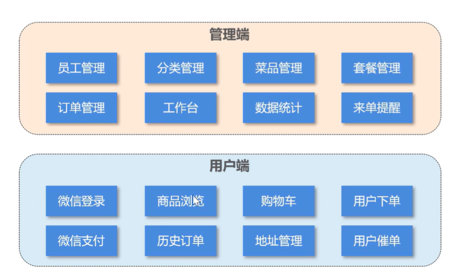
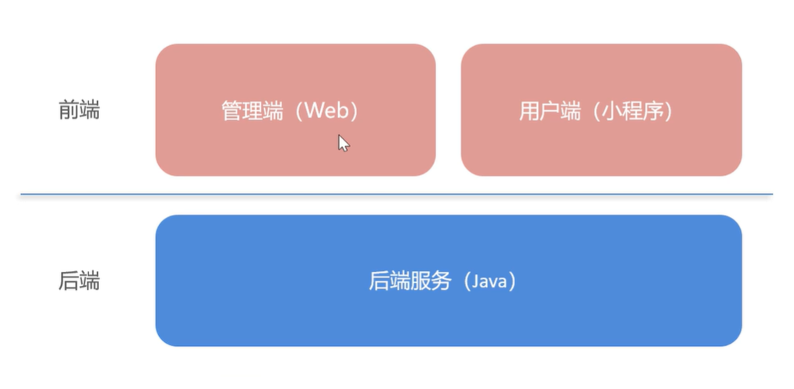
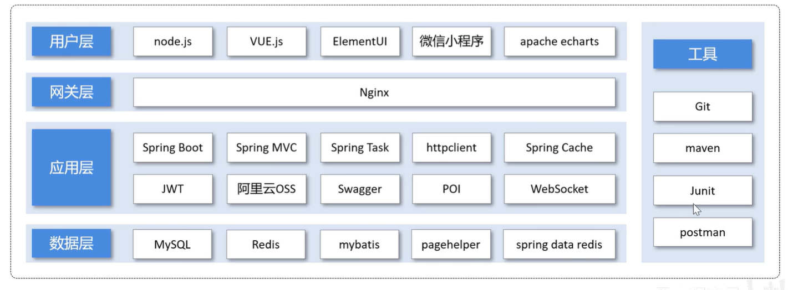
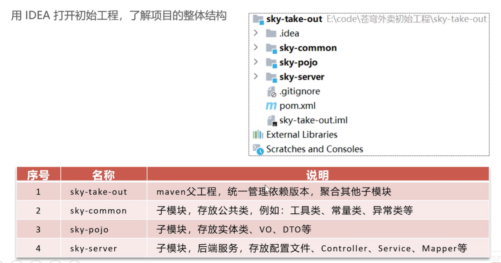
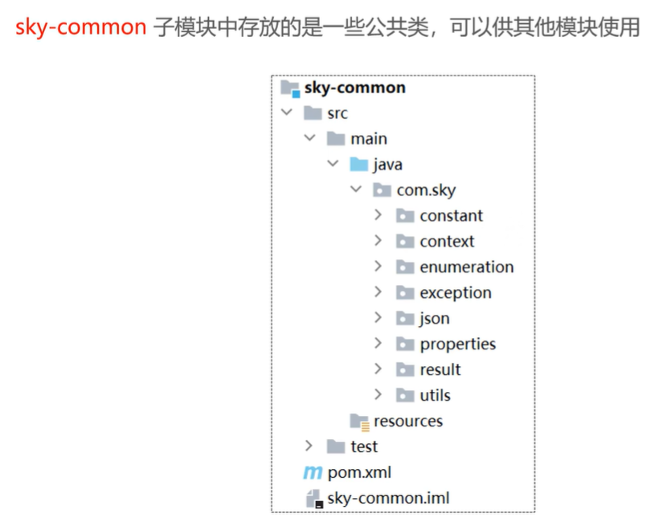
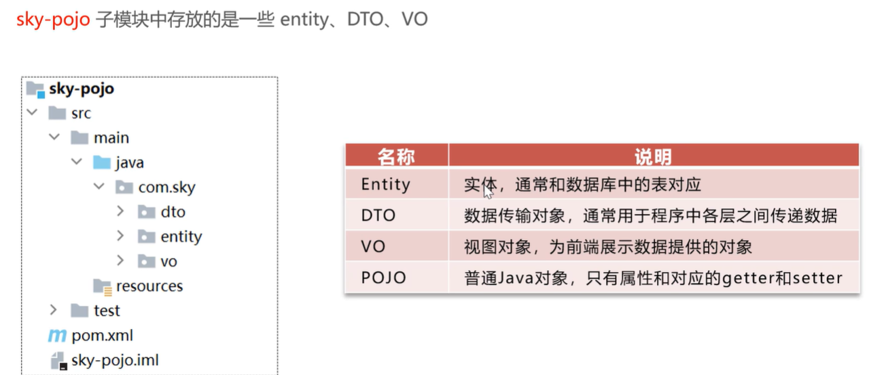
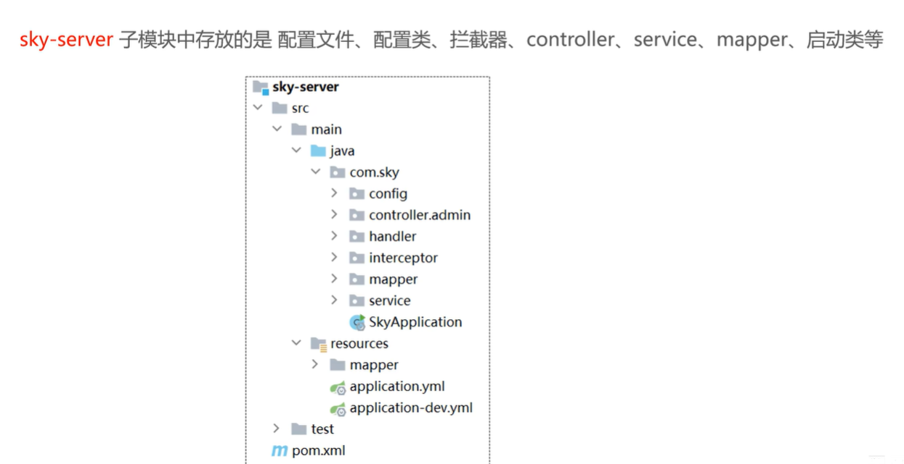
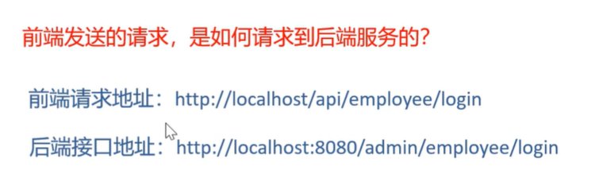

## 苍穹外卖

### 介绍

#### 功能架构



##### 管理端功能

员工登录/退出 , 员工信息管理 , 分类管理 , 菜品管理 , 套餐管理 , 菜品口味管理 , 订单管理 ，数据统计，来单提醒。

##### 用户端功能

微信登录 , 收件人地址管理 , 用户历史订单查询 , 菜品规格查询 , 购物车功能 , 下单 , 支付、分类及菜品浏览。

#### 整体结构



#### 技术选型



(1). 用户层
本项目中在构建系统管理后台的前端页面，我们会用到H5、Vue.js、ElementUI、apache echarts(展示图表)等技术。而在构建移动端应用时，我们会使用到微信小程序。

(2). 网关层
Nginx是一个服务器，主要用来作为Http服务器，部署静态资源，访问性能高。在Nginx中还有两个比较重要的作用： 反向代理和负载均衡， 在进行项目部署时，要实现Tomcat的负载均衡，就可以通过Nginx来实现。

(3). 应用层
SpringBoot： 快速构建Spring项目, 采用 "约定优于配置" 的思想, 简化Spring项目的配置开发。 SpringMVC：SpringMVC是spring框架的一个模块，springmvc和spring无需通过中间整合层进行整合，可以无缝集成。 Spring Task: 由Spring提供的定时任务框架。 httpclient: 主要实现了对http请求的发送。 Spring Cache: 由Spring提供的数据缓存框架 JWT: 用于对应用程序上的用户进行身份验证的标记。 阿里云OSS: 对象存储服务，在项目中主要存储文件，如图片等。 Swagger： 可以自动的帮助开发人员生成接口文档，并对接口进行测试。 POI: 封装了对Excel表格的常用操作。 WebSocket: 一种通信网络协议，使客户端和服务器之间的数据交换更加简单，用于项目的来单、催单功能实现。

(4). 数据层
MySQL： 关系型数据库, 本项目的核心业务数据都会采用MySQL进行存储。 Redis： 基于key-value格式存储的内存数据库, 访问速度快, 经常使用它做缓存。 Mybatis： 本项目持久层将会使用Mybatis开发。 pagehelper: 分页插件。 spring data redis: 简化java代码操作Redis的API。

(5). 工具
git: 版本控制工具, 在团队协作中, 使用该工具对项目中的代码进行管理。 maven: 项目构建工具。 junit：单元测试工具，开发人员功能实现完毕后，需要通过junit对功能进行单元测试。 postman: 接口测工具，模拟用户发起的各类HTTP请求，获取对应的响应结果。

### 后端搭建

#### 碰到问题

找不到符号 (更该jdk版本23——>17)

配置属性类

#### 项目结构

基于maven进行项目构建，进行分模块开发



##### sky-common



##### sky-pojo



##### sky-server



#### nginx反向代理和负载均衡



##### 1. nginx反向代理

这种就是通过nginx来反向代理，将前端发送的动态请求由 nginx 转发到后端服务器，从而避免跨域等问题

**nginx 反向代理的好处：**

- 提高访问速度

  因为nginx本身可以进行缓存，如果访问的同一接口，并且做了数据缓存，nginx就直接可把数据返回，不需要真正地访问服务端，从而提高访问速度。

- 进行负载均衡

  所谓负载均衡,就是把大量的请求按照我们指定的方式均衡的分配给集群中的每台服务器。

- 保证后端服务安全

  因为一般后台服务地址不会暴露，所以使用浏览器不能直接访问，可以把nginx作为请求访问的入口，请求到达nginx后转发到具体的服务中，从而保证后端服务的安全。

**nginx 反向代理的配置方式：**

```nginx
server{
    listen 80;
    server_name localhost;
    
    location /api/{
        proxy_pass http://localhost:8080/admin/; #反向代理
    }
}
```

**proxy_pass**: 该指令是用来设置代理服务器的地址，可以是主机名称，IP地址加端口号等形式。

如上代码的含义是：监听80端口号， 然后当我们访问 <http://localhost:80/api/../..> 这样的接口的时候，它会通过 location /api/ {} 这样的反向代理到 <http://localhost:8080/admin/> 上来。

##### 2. 负载均衡

当如果服务以集群的方式进行部署时，那nginx在转发请求到服务器时就需要做相应的负载均衡。其实，负载均衡从本质上来说也是基于反向代理来实现的，最终都是转发请求。

**nginx 负载均衡的配置方式：**

```nginx
upstream webservers{
    server 192.168.100.128:8080;
    server 192.168.100.129:8080;
}
server{
    listen 80;
    server_name localhost;
    
    location /api/{
        proxy_pass http://webservers/admin;#负载均衡
    }
}
```

**upstream**: 如果代理服务器是一组服务器的话，我们可以使用upstream指令配置后端服务器组。

如上代码的含义是：监听80端口号， 然后当我们访问 <http://localhost:80/api/../..> 这样的接口的时候，它会通过 location /api/ {} 这样的反向代理到 <http://webservers/admin>，根据webservers名称找到一组服务器，根据设置的负载均衡策略(默认是轮询)转发到具体的服务器。

**注：**upstream后面的名称可自定义，但要上下保持一致。

**nginx 负载均衡策略：**

| **名称**   | **说明**                                               |
| ---------- | ------------------------------------------------------ |
| 轮询       | 默认方式                                               |
| weight     | 权重方式，默认为1，权重越高，被分配的客户端请求就越多  |
| ip_hash    | 依据ip分配方式，这样每个访客可以固定访问一个后端服务   |
| least_conn | 依据最少连接方式，把请求优先分配给连接数少的后端服务   |
| url_hash   | 依据url分配方式，这样相同的url会被分配到同一个后端服务 |
| fair       | 依据响应时间方式，响应时间短的服务将会被优先分配       |

### 完善登录功能

**问题**：员工表中的密码是明文存储，安全性太低

**解决思路：**

1. 将密码加密后存储，提高安全性
2. 使用MD5加密方式对明文密码加密

**实现步骤：**

1. 修改数据库中明文密码，改为MD5加密后的密文

2. 修改Java代码，前端提交的密码进行MD5加密后再跟数据库中密码比对

   打开EmployeeServiceImpl.java，修改比对密码

   ```java
   /**
        * 员工登录
        *
        * @param employeeLoginDTO
        * @return
        */
       public Employee login(EmployeeLoginDTO employeeLoginDTO) {
   
           //1、根据用户名查询数据库中的数据
          
           //2、处理各种异常情况（用户名不存在、密码不对、账号被锁定）
           //.......
           //密码比对
           // TODO 后期需要进行md5加密，然后再进行比对
           password = DigestUtils.md5DigestAsHex(password.getBytes());
           if (!password.equals(employee.getPassword())) {
               //密码错误
               throw new PasswordErrorException(MessageConstant.PASSWORD_ERROR);
           }
   
           //........
   
           //3、返回实体对象
           return employee;
       }
   ```
