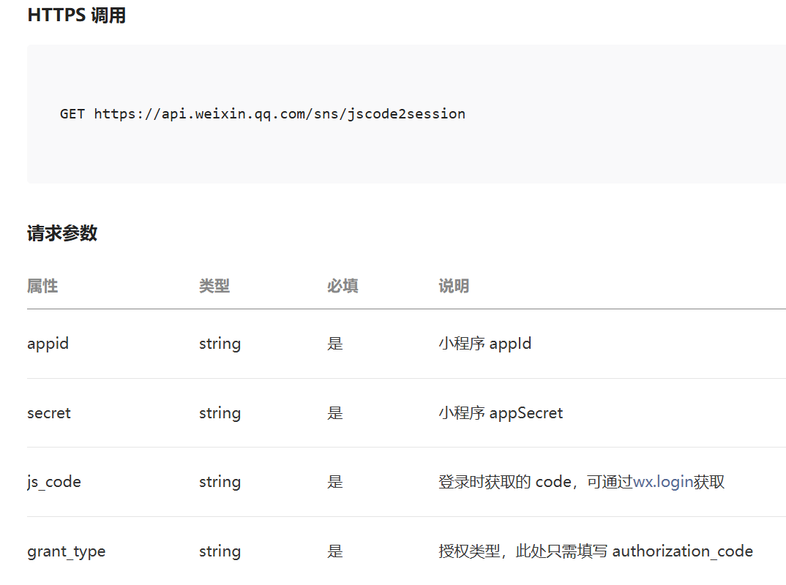
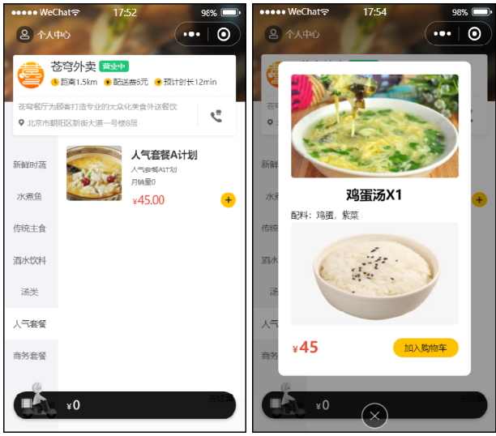
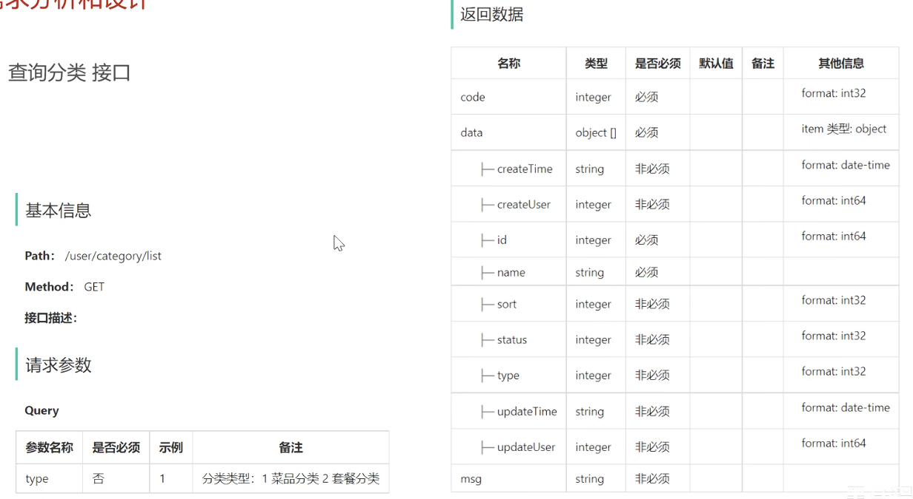
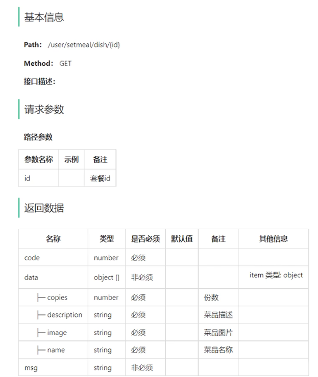

## 微信小程序开发

小程序是一种新的开放能力，开发者可以快速地开发一个小程序。可以在微信内被便捷地获取和传播，同时具有出色的使用体验

### 入门案例

实际上，小程序的开发本质上属于前端开发，主要使用JavaScript开发，咱们现在的定位主要还是在后端，所以，对于小程序开发简单了解即可

在进行小程序开发时，需要先去注册一个小程序，在注册的时候，它实际上又分成了不同的注册的主体。我们可以以个人的身份来注册一个小程序，当然，也可以以企业政府、媒体或者其他组织的方式来注册小程序。那么，不同的主体注册小程序，最终开放的权限也是不一样的。比如以个人身份来注册小程序，是无法开通支付权限的。若要提供支付功能，必须是企业、政府或者其它组织等。所以，不同的主体注册小程序后，可开发的功能是不一样的。

小程序包含一个描述整体程序的 app 和多个描述各自页面的 page。一个小程序主体部分由三个文件组成，必须放在项目的根目录

**app.js**：必须存在，主要存放小程序的逻辑代码

**app.json**：必须存在，小程序配置文件，主要存放小程序的公共配置

**app.wxss**：非必须存在，主要存放小程序公共样式表，类似于前端的CSS样式

对小程序主体三个文件了解后，其实一个小程序又有多个页面。比如说，有商品浏览页面、购物车的页面、订单支付的页面、商品的详情页面等等，存放在pages目录

主要编写语法可以看文档，类似Vue

### 实现微信登录

#### 微信登录流程

微信登录：<https://developers.weixin.qq.com/miniprogram/dev/framework/open-ability/login.html>


##### 步骤分析

1. 小程序端，调用`wx.login()`获取code，就是授权码。
2. 小程序端，调用`wx.request()`发送请求并携带code，请求开发者服务器(自己编写的后端服务)。
3. 开发者服务端，通过`HttpClient`向微信接口服务发送请求，并携带appId+appsecret+code三个参数。
4. 开发者服务端，接收微信接口服务返回的数据，`session_key`+`opendId`等。`opendId`是微信用户的唯一标识。
5. 开发者服务端，自定义登录态，生成令牌(token)和openid等数据返回给小程序端，方便后绪请求身份校验。
6. 小程序端，收到自定义登录态，存储storage。
7. 小程序端，后绪通过`wx.request()`发起业务请求时，携带`token`。
8. 开发者服务端，收到请求后，通过携带的`token`，解析当前登录用户的id。
9. 开发者服务端，身份校验通过后，继续相关的业务逻辑处理，最终返回业务数据。



#### 需求分析

用户进入到小程序的时候，微信授权登录之后才能点餐。需要获取当前微信用户的相关信息，比如昵称、头像等，这样才能够进入到小程序进行下单操作。是基于微信登录来实现小程序的登录功能，没有采用传统账户密码登录的方式。若第一次使用小程序来点餐，就是一个新用户，需要把这个新的用户保存到数据库当中完成自动注册。

**业务规则**

- 基于微信登录实现小程序的登录功能
- 如果是新用户需要自动完成注册

#### 接口设计

通过微信登录的流程，如果要完成微信登录的话，最终就要获得微信用户的openid。

在小程序端获取授权码后，向后端服务发送请求，并携带授权码，这样后端服务在收到授权码后，就可以去请求微信接口服务。最终，后端向小程序返回openid和token等数据

基于上述的登录流程，就可以设计出该接口的**请求参数**和**返回数据**


**说明**：请求路径`/user/user/login`,第一个user代表用户端，第二个user代表用户模块。

#### 表设计

当用户第一次使用小程序时，会完成自动注册，把用户信息存储到**user**表中

| **字段名**  | **数据类型** | **说明**           | **备注** |
| ----------- | ------------ | ------------------ | -------- |
| id          | bigint       | 主键               | 自增     |
| openid      | varchar(45)  | 微信用户的唯一标识 |          |
| name        | varchar(32)  | 用户姓名           |          |
| phone       | varchar(11)  | 手机号             |          |
| sex         | varchar(2)   | 性别               |          |
| id_number   | varchar(18)  | 身份证号           |          |
| avatar      | varchar(500) | 微信用户头像路径   |          |
| create_time | datetime     | 注册时间           |          |

**说明**：手机号字段比较特殊，个人身份注册的小程序没有权限获取到微信用户的手机号。如果是以企业的资质
注册的小程序就能够拿到微信用户的手机号

#### 代码开发

##### 定义相关配置

##### 1. DTO结构设计 (接收参数)

```java
/**
 * UserLoginDTO.java
 * C端用户登录
 */
@Data
public class UserLoginDTO implements Serializable {
    private String code;
}
```

##### 2. VO结构设计 (返回参数)

```java
@Data
@Builder
@NoArgsConstructor
@AllArgsConstructor
public class UserLoginVO implements Serializable {
    private Long id;
    private String openid;
    private String token;
}
```

##### 3. `Controller`层

```java
@RestController
@RequestMapping("/user/user")
@Slf4j
@Api("用户端相关操作")
public class UserController {

    @Autowired
    private UserService userService;
    @Autowired
    private JwtProperties jwtProperties;

    /**
     * 微信用户登录
     * @return
     */
    @PostMapping("/login")
    @ApiOperation("微信用户登录")
    public Result<UserLoginVO> login(@RequestBody UserLoginDTO userLoginDTO) {
        log.info("用户登录code: {}", userLoginDTO.getCode());
        User user = userService.wxLogin(userLoginDTO);

        // 根据用户id设置 jwt 令牌 — token
        Map<String, Object> claims = new HashMap<>();
        claims.put(JwtClaimsConstant.USER_ID,user.getId());
        String token = JwtUtil.createJWT(jwtProperties.getUserSecretKey(), jwtProperties.getUserTtl(), claims);

        UserLoginVO userLoginVO = UserLoginVO.builder()
                .id(user.getId())
                .openid(user.getOpenid())
                .token(token)
                .build();
        return Result.success(userLoginVO);
    }
}
```

##### 4. `Service`层接口

```java
public interface UserService {
    /**
     * 微信登录
     * @param userLoginDTO
     * @return
     */
    User wxLogin(UserLoginDTO userLoginDTO);
}
```

##### 4. `Service`层实现类

```java
@Service
public class UserServiceImpl implements UserService {

    public static final String WX_LOGIN = "https://api.weixin.qq.com/sns/jscode2session";

    @Autowired
    private WeChatProperties weChatProperties;

    @Autowired
    private UserMapper userMapper;

    @Override
    public User wxLogin(UserLoginDTO loginDTO) {

        String openid = getOpenid(loginDTO.getCode());

        // 判断 openid 是否为空，为空表示登录失败
        if(openid == null)
            throw new LoginFailedException("登录失败");

        // 判断当前用户是否为新用户
        User user = userMapper.getByOpenid(openid);

        //如果是新用户，自动完成注册
        if(user == null){
            user = User.builder()
                    .openid(openid)
                    .createTime(LocalDateTime.now())
                    .build();
            userMapper.insert(user);//后绪步骤实现
        }

        //返回这个用户对象
        return user;
    }

    /**
     * 调用微信接口服务，获取微信用户的openid
     * @param code
     * @return
     */
    private String getOpenid(String code) {
        Map<String,String> paramMap = new HashMap<>();
        paramMap.put("appid", weChatProperties.getAppid());
        paramMap.put("secret", weChatProperties.getSecret());
        paramMap.put("grant_type", "authorization_code");
        paramMap.put("js_code", code);

        String json = HttpClientUtil.doGet(WX_LOGIN, paramMap);

        JSONObject obj = JSON.parseObject(json);
        String openid = obj.getString("openid");

        return openid;
    }
}
```

##### 5. `Mapper`层

```java
@Mapper
public interface UserMapper {

    @Select("select * from user where openid = #{openId}")
    public User getByOpenid(String openId);

    public void insert(User user);
}

```

对应 `mapper.xml` 文档

```xml
<?xml version="1.0" encoding="UTF-8" ?>
<!DOCTYPE mapper PUBLIC "-//mybatis.org//DTD Mapper 3.0//EN"
        "http://mybatis.org/dtd/mybatis-3-mapper.dtd" >
<mapper namespace="com.sky.mapper.UserMapper">
    <insert id="insert" useGeneratedKeys="true" keyProperty="id">
        insert into user (openid, name, phone, sex, id_number, avatar, create_time) VALUES (#{openid}, #{name}, #{phone}, #{sex}, #{idNumber}, #{avatar}, #{createTime})
    </insert>
</mapper>
```

##### 6. 拦截器设置

因为需要判断用户是否登录，通过截取对应请求头设定的`token`值来进行判断，所以需要拦截器进行jwt校验

编写拦截器`JwtTokenUserInterceptor`:

```java
/**
 * jwt令牌校验的拦截器
 */
@Component
@Slf4j
public class JwtTokenUserInterceptor implements HandlerInterceptor {

    @Autowired
    private JwtProperties jwtProperties;

    /**
     * 校验jwt
     *
     * @param request
     * @param response
     * @param handler
     * @return
     * @throws Exception
     */
    public boolean preHandle(HttpServletRequest request, HttpServletResponse response, Object handler) throws Exception {
        //判断当前拦截到的是Controller的方法还是其他资源
        if (!(handler instanceof HandlerMethod)) {
            //当前拦截到的不是动态方法，直接放行
            return true;
        }

        //1、从请求头中获取令牌
        String token = request.getHeader(jwtProperties.getAdminTokenName());

        //2、校验令牌
        try {
            log.info("jwt校验:{}", token);
            Claims claims = JwtUtil.parseJWT(jwtProperties.getUserSecretKey(), token);
            Long userId = Long.valueOf(claims.get(JwtClaimsConstant.USER_ID).toString());
            log.info("当前用户的id：", userId);
            BaseContext.setCurrentId(userId);
            //3、通过，放行
            return true;
        } catch (Exception ex) {
            //4、不通过，响应401状态码
            response.setStatus(401);
            return false;
        }
    }
}
```

在`WebMvcConfiguration`配置类中注册对应拦截器：

```java
protected void addInterceptors(InterceptorRegistry registry) {
  log.info("开始注册自定义拦截器...");
  registry.addInterceptor(jwtTokenAdminInterceptor)
          .addPathPatterns("/admin/**")
          .excludePathPatterns("/admin/employee/login");

  registry.addInterceptor(jwtTokenUserInterceptor)
          .addPathPatterns("/user/**")
          .excludePathPatterns("/user/user/login")
          .excludePathPatterns("/user/shop/status");
}
```

### 导入商品浏览功能代码

#### 需求分析设计

用户登录成功后跳转到系统首页，在首页需要根据分类来展示菜品和套餐。如果菜品设置了口味信息，需要展示 `选择规格` 按钮，否则显示 `+` 按钮

菜品相应功能效果图：


套餐相应功能效果图：



#### 接口设计

据上述原型图先**粗粒度**设计接口，共包含4个接口。

**接口设计**

- 查询分类
- 根据分类id查询菜品
- 根据分类id查询套餐
- 根据套餐id查询包含的菜品

接下来**细粒度**分析每个接口，明确每个接口的请求方式、请求路径、传入参数和返回值

##### 1) 查询分类 `GET /user/category/list`



##### 2) 根据分类id查询菜品 `GET /user/dish/list`


##### 3) 根据分类id查询套餐 `GET /user/setmeal/list?category=??`


##### 4) 根据套餐id查询包含的菜品 `GET /user/setmeal/dish/{category_id}`

