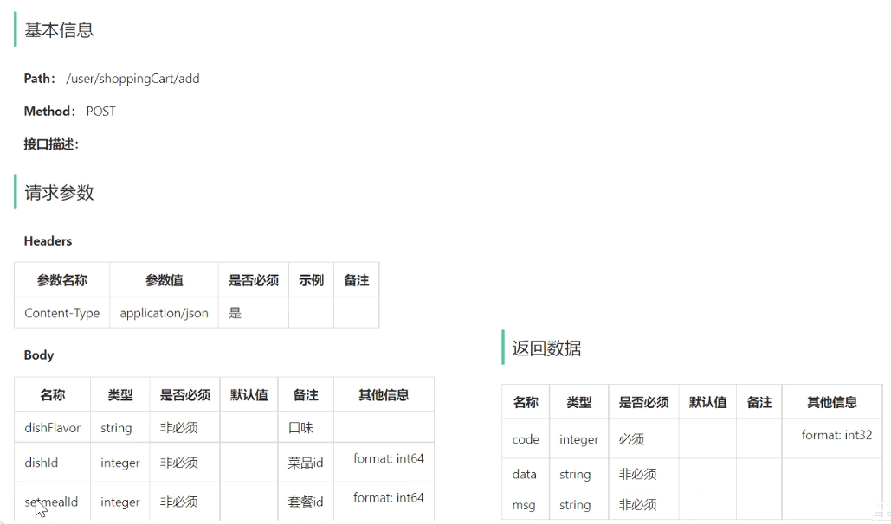

## 内容

- 缓存菜品
- 缓存套餐
- 添加购物车
- 查看购物车
- 清空购物车

功能实现：**缓存商品**、**购物车**

## 添加购物车

用户可以将菜品或者套餐添加到购物车

对于菜品来说，如果设置了口味信息，则需要选择规格后才能加入购物车;

对于套餐来说，可以直接点击 + 号将当前套餐加入购物车

在购物车中可以修改菜品和套餐的数量，也可以清空购物车

### 接口设计

对应的添加购物车接口 (这是加入购物车，所以一次是加入一个，不会同时存在dishId 和 setmealId)



### 表设计

用户的购物车数据，也是需要保存在数据库中的，购物车对应的数据表为shopping_cart表，具体表结构如下：

| **字段名**  | **数据类型**  | **说明**     | **备注** |
| ----------- | ------------- | ------------ | -------- |
| id          | bigint        | 主键         | 自增     |
| name        | varchar(32)   | 商品名称     | 冗余字段 |
| image       | varchar(255)  | 商品图片路径 | 冗余字段 |
| user_id     | bigint        | 用户id       | 逻辑外键 |
| dish_id     | bigint        | 菜品id       | 逻辑外键 |
| setmeal_id  | bigint        | 套餐id       | 逻辑外键 |
| dish_flavor | varchar(50)   | 菜品口味     |          |
| number      | int           | 商品数量     |          |
| amount      | decimal(10,2) | 商品单价     | 冗余字段 |
| create_time | datetime      | 创建时间     |          |

**说明**

- 购物车数据是关联用户的，在表结构中，我们需要记录，每一个用户的购物车数据是哪些
- 菜品列表展示出来的既有套餐，又有菜品，如果用户选择的是套餐，就保存套餐ID(setmeal_id)，如果用户选择的是菜品，就保存菜品ID(dish_id)
- 对同一个菜品/套餐，如果选择多份不需要添加多条记录，增加数量number即可

### 代码开发

#### DTO设计 `ShoppingCartDTO`

```java
@Data
public class ShoppingCartDTO implements Serializable {
    private Long dishId;
    private Long setmealId;
    private String dishFlavor;
}
```

#### Controller层 `ShoppingCartController`

```java
@RestController
@RequestMapping("/user/shoppingCart")
@Slf4j
@Api(tags = "C端购物车相关接口")
public class ShoppingCartController {
  @Autowired
  private ShoppingCartService shoppingCartService;

  /**
   * 添加购物车
   * @param shoppingCartDTO
   * @return
   */
  @PostMapping("/add")
  @ApiOperation("添加购物车")
  public Result<Void> add(@RequestBody ShoppingCartDTO shoppingCartDTO) {
      log.info("添加购物车，商品信息为:{}", shoppingCartDTO);
      shoppingCartService.addShoppingCart(shoppingCartDTO);
      return Result.success();
  }
}
```

#### Service层接口 `ShoppingCartService`

```java
public interface ShoppingCartService {
  /**
   * 添加购物车
   * @param shoppingCartDTO
   */
  void addShoppingCart(ShoppingCartDTO shoppingCartDTO);
}
```

#### Service层实现类 `ShoppingCartServiceImpl`

```java
@Service
public class ShoppingCartServiceImpl implements ShoppingCartService {

  @Autowired
  private ShoppingCartMapper shoppingCartMapper;

  @Autowired
  private SetmealMapper setmealMapper;

  @Autowired
  private DishMapper dishMapper;

  @Override
  public void addShoppingCart(ShoppingCartDTO shoppingCartDTO) {

      ShoppingCart shoppingCart = new ShoppingCart();
      BeanUtils.copyProperties(shoppingCartDTO, shoppingCart);
      // 获取用户user_id
      shoppingCart.setUserId(BaseContext.getCurrentId());

      // 判断当前加入到购物车的商品是否已经存在
      List<ShoppingCart> list = shoppingCartMapper.list(shoppingCart);

      // 如果存在，直接数量加一
      if(list != null && !list.isEmpty()) {
          shoppingCart = list.get(0);
          shoppingCart.setNumber(shoppingCart.getNumber() + 1);
          shoppingCartMapper.updateNumberById(shoppingCart);
      }else{
          // 不存在 需要插入数据
          Long dishId = shoppingCartDTO.getDishId();
          if(dishId != null) {
              //添加到购物车的是菜品
              Dish dish = dishMapper.getById(dishId);
              shoppingCart.setName(dish.getName());
              shoppingCart.setImage(dish.getImage());
              shoppingCart.setAmount(dish.getPrice());
          }else{
              //添加到购物车的是套餐
              Setmeal setmeal = setmealMapper.getById(shoppingCartDTO.getSetmealId());
              shoppingCart.setName(setmeal.getName());
              shoppingCart.setImage(setmeal.getImage());
              shoppingCart.setAmount(setmeal.getPrice());
          }
          shoppingCart.setNumber(1);
          shoppingCart.setCreateTime(LocalDateTime.now());
          shoppingCartMapper.insert(shoppingCart);
      }
  }
}
```

#### Mapper层 `ShoppingCartMapper`

##### `Mapper`层接口

```java
@Mapper
public interface ShoppingCartMapper {
  /**
   * 条件查询
   *
   * @param shoppingCart
   * @return
   */
  List<ShoppingCart> list(ShoppingCart shoppingCart);

  /**
   * 更新商品数量
   *
   * @param shoppingCart
   */
  @Update("update shopping_cart set number = #{number} where id = #{id}")
  void updateNumberById(ShoppingCart shoppingCart);

  /**
   * 插入购物车数据
   *
   * @param shoppingCart
   */
  @Insert("insert into shopping_cart (name, user_id, dish_id, setmeal_id, dish_flavor, number, amount, image, create_time) " +
          " values (#{name},#{userId},#{dishId},#{setmealId},#{dishFlavor},#{number},#{amount},#{image},#{createTime})")
  void insert(ShoppingCart shoppingCart);
}
```

##### 创建ShoppingCartMapper.xml

```xml
<?xml version="1.0" encoding="UTF-8" ?>
<!DOCTYPE mapper PUBLIC "-//mybatis.org//DTD Mapper 3.0//EN"
        "http://mybatis.org/dtd/mybatis-3-mapper.dtd" >
<mapper namespace="com.sky.mapper.ShoppingCartMapper">
    <select id="list" resultType="com.sky.entity.ShoppingCart">
        select * from shopping_cart
        <where>
            <if test="userId != null">
                and user_id = #{userId}
            </if>
            <if test="dishId != null">
                and dish_id = #{dishId}
            </if>
            <if test="setmealId != null">
                and setmeal_id = #{setmealId}
            </if>
            <if test="dishFlavor != null">
                and dish_flavor = #{dishFlavor}
            </if>
        </where>
        order by create_time asc
    </select>
</mapper>
```

## 查看购物车

当用户添加完菜品和套餐后，可进入到购物车中，查看购物中的菜品和套餐

### 接口设计 `GET /user/shoppingCart/list`


### 代码开发

#### `Controller`层

```java
@GetMapping("/list")
@ApiOperation("查看购物车")
public Result<List<ShoppingCart>> getShoppingCarts() {
    return Result.success(shoppingCartService.getShoppingCarts());
}
```

#### `Service`接口层

```java
/**
 * 查看购物车
 * @return
 */
List<ShoppingCart> getShoppingCarts();
```

#### `Service`实现层

```java
/**
 * 查看购物车
 * @return
 */
@Override
public List<ShoppingCart> getShoppingCarts() {
    Long userId = BaseContext.getCurrentId();
    ShoppingCart shoppingCart = new ShoppingCart();
    shoppingCart.setUserId(userId);
    return shoppingCartMapper.list(shoppingCart);
}
```

## 清空购物车

当点击清空按钮时，会把购物车中的数据全部清空

### 接口设计 `DELETE /user/shoppingCART/clean`


### 代码开发

#### `Controller`层

```java
/**
 * 清空购物车
 * @return
 */
@DeleteMapping("/clean")
@ApiOperation("清空购物车")
public Result<Void> clean(){
    shoppingCartService.clean();
    return Result.success();
}
```

#### `Service`接口层

```java
 /**
 * 清空购物车
 * @return
 */
void clean();
```

#### `Service`实现层

```java
/**
 * 清空购物车
 * @return
 */
@Override
public void clean() {
    Long userId = BaseContext.getCurrentId();
    shoppingCartMapper.deleteByUserId(userId);
}
```

#### `Mapper`层

```java
/**
 * 清空购物车
 * @param userId
 */
@Delete("delete from shopping_cart where user_id = #{userId}")
void deleteByUserId(Long userId);
```
