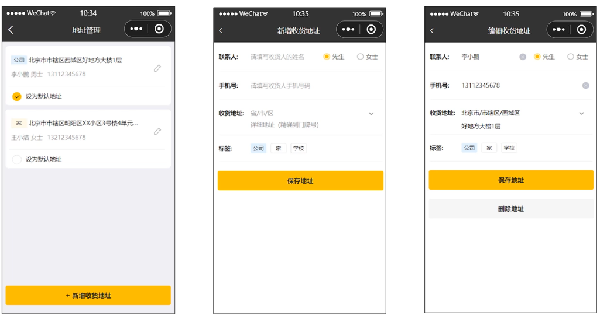
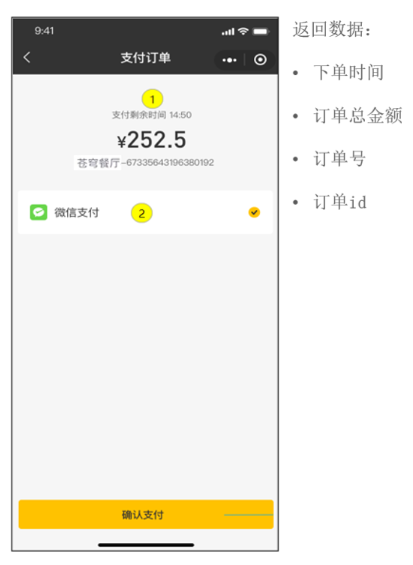

## 内容

- 导入地址簿功能代码
- 用户下单
- 订单支付

## 导入地址簿功能代码

### 需求分析

#### 产品原型

地址簿，指的是消费者用户的地址信息，用户登录成功后可以维护自己的地址信息。同一个用户可以有多个地址信息，但是只能有一个**默认地址**



对于地址簿管理，我们需要实现以下几个功能：

- 查询地址列表
- 新增地址
- 修改地址
- 删除地址
- 设置默认地址
- 查询默认地址

#### 接口设计

根据上述原型图先**粗粒度**设计接口，共包含7个接口

**接口设计：**

- 新增地址
- 查询登录用户所有地址
- 查询默认地址
- 根据id修改地址
- 根据id删除地址
- 根据id查询地址
- 设置默认地址

接下来**细粒度**分析每个接口，明确每个接口的请求方式、请求路径、传入参数和返回值

1). 新增地址 `POST /user/addressBook`

2). 查询登录用户所有地址 `GET /user/addressBook/list`

3). 查询默认地址 `GET /user/addressBook/default`

4). 修改地址 `PUT /user/addressBook`

5). 根据id删除地址 `DELETE /user/addressBook/{id}`

6). 根据id查询地址 `GET /user/addressBook/{id}`

7). 设置默认地址 `PUT /user/addressBook/default`

#### 数据表设计 `address_book`

用户的地址信息会存储在address_book表，即地址簿表中。具体表结构如下：

| **字段名**    | **数据类型** | **说明**     | **备注**       |
| ------------- | ------------ | ------------ | -------------- |
| id            | bigint       | 主键         | 自增           |
| user_id       | bigint       | 用户id       | 逻辑外键       |
| consignee     | varchar(50)  | 收货人       |                |
| sex           | varchar(2)   | 性别         |                |
| phone         | varchar(11)  | 手机号       |                |
| province_code | varchar(12)  | 省份编码     |                |
| province_name | varchar(32)  | 省份名称     |                |
| city_code     | varchar(12)  | 城市编码     |                |
| city_name     | varchar(32)  | 城市名称     |                |
| district_code | varchar(12)  | 区县编码     |                |
| district_name | varchar(32)  | 区县名称     |                |
| detail        | varchar(200) | 详细地址信息 | 具体到门牌号   |
| label         | varchar(100) | 标签         | 公司、家、学校 |
| is_default    | tinyint(1)   | 是否默认地址 | 1是 0否        |

这里面有一个字段is_default，实际上我们在设置默认地址时，只需要更新这个字段就可以了

#### 代码导入

对于这一类的单表的增删改查，我们已经写过很多了，基本的开发思路都是一样的，那么本小节的用户地址簿管理的增删改查功能，我们就不再一一实现了，基本的代码我们都已经提供了，直接导入进来，做一个测试即可

## 用户下单

### 需求分析

#### 产品原型

**用户下单业务说明**

在电商系统中，用户是通过下单的方式通知商家，用户已经购买了商品，需要商家进行备货和发货

用户下单后会产生订单相关数据，订单数据需要能够体现如下信息

用户将菜品或者套餐加入购物车后，可以点击购物车中的 "去结算" 按钮，页面跳转到订单确认页面，点击 "去支付" 按钮则完成下单操作

**用户点餐业务流程(效果图)**


#### 接口分析 设计 `POST /user/order/submit`




#### 表设计

用户下单业务对应的数据表为`orders`表和`order_detail`表(一对多关系,一个订单关联多个订单明细)：

| 表名         | 含义       | 说明                                                         |
| ------------ | ---------- | ------------------------------------------------------------ |
| orders       | 订单表     | 主要存储订单的基本信息(如: 订单号、状态、金额、支付方式、下单用户、收件地址等) |
| order_detail | 订单明细表 | 主要存储订单详情信息(如: 该订单关联的套餐及菜品的信息)       |

具体的表结构如下:

**1). orders订单表**

| **字段名**              | **数据类型**  | **说明**     | **备注**                                        |
| ----------------------- | ------------- | ------------ | ----------------------------------------------- |
| id                      | bigint        | 主键         | 自增                                            |
| number                  | varchar(50)   | 订单号       |                                                 |
| status                  | int           | 订单状态     | 1待付款 2待接单 3已接单 4派送中 5已完成 6已取消 |
| user_id                 | bigint        | 用户id       | 逻辑外键                                        |
| address_book_id         | bigint        | 地址id       | 逻辑外键                                        |
| order_time              | datetime      | 下单时间     |                                                 |
| checkout_time           | datetime      | 付款时间     |                                                 |
| pay_method              | int           | 支付方式     | 1微信支付 2支付宝支付                           |
| pay_status              | tinyint       | 支付状态     | 0未支付 1已支付 2退款                           |
| amount                  | decimal(10,2) | 订单金额     |                                                 |
| remark                  | varchar(100)  | 备注信息     |                                                 |
| phone                   | varchar(11)   | 手机号       | 冗余字段                                        |
| address                 | varchar(255)  | 详细地址信息 | 冗余字段                                        |
| consignee               | varchar(32)   | 收货人       | 冗余字段                                        |
| cancel_reason           | varchar(255)  | 订单取消原因 |                                                 |
| rejection_reason        | varchar(255)  | 拒单原因     |                                                 |
| cancel_time             | datetime      | 订单取消时间 |                                                 |
| estimated_delivery_time | datetime      | 预计送达时间 |                                                 |
| delivery_status         | tinyint       | 配送状态     | 1立即送出 0选择具体时间                         |
| delivery_time           | datetime      | 送达时间     |                                                 |
| pack_amount             | int           | 打包费       |                                                 |
| tableware_number        | int           | 餐具数量     |                                                 |
| tableware_status        | tinyint       | 餐具数量状态 | 1按餐量提供 0选择具体数量                       |

**2). order_detail订单明细表**

| **字段名**  | **数据类型**  | **说明**     | **备注** |
| ----------- | ------------- | ------------ | -------- |
| id          | bigint        | 主键         | 自增     |
| name        | varchar(32)   | 商品名称     | 冗余字段 |
| image       | varchar(255)  | 商品图片路径 | 冗余字段 |
| order_id    | bigint        | 订单id       | 逻辑外键 |
| dish_id     | bigint        | 菜品id       | 逻辑外键 |
| setmeal_id  | bigint        | 套餐id       | 逻辑外键 |
| dish_flavor | varchar(50)   | 菜品口味     |          |
| number      | int           | 商品数量     |          |
| amount      | decimal(10,2) | 商品单价     |          |

**说明**: 用户提交订单时，需要往订单表`orders`中插入一条记录，并且需要往`order_detail`中插入一条或多条记录

### 代码开发

#### DTO设计 `OrdersSubmitDTO`

```java
@Data
public class OrdersSubmitDTO implements Serializable {
    //地址簿id
    private Long addressBookId;
    //付款方式
    private int payMethod;
    //备注
    private String remark;
    //预计送达时间
    @JsonFormat(shape = JsonFormat.Shape.STRING, pattern = "yyyy-MM-dd HH:mm:ss")
    private LocalDateTime estimatedDeliveryTime;
    //配送状态  1立即送出  0选择具体时间
    private Integer deliveryStatus;
    //餐具数量
    private Integer tablewareNumber;
    //餐具数量状态  1按餐量提供  0选择具体数量
    private Integer tablewareStatus;
    //打包费
    private Integer packAmount;
    //总金额
    private BigDecimal amount;
}
```

#### VO设计

根据用户下单接口的返回结果设计VO

在sky-pojo模块，OrderSubmitVO.java已定义

```java
@Data
@Builder
@NoArgsConstructor
@AllArgsConstructor
public class OrderSubmitVO implements Serializable {
    //订单id
    private Long id;
    //订单号
    private String orderNumber;
    //订单金额
    private BigDecimal orderAmount;
    //下单时间
    private LocalDateTime orderTime;
}
```

#### Controller层 `OrderController.submit()`

```java
/**
 * 订单
 */
@RestController("userOrderController")
@RequestMapping("/user/order")
@Slf4j
@Api(tags = "C端-订单接口")
public class OrderController {
    @Autowired
    private OrderService orderService;
    /**
     * 用户下单
     *
     * @param ordersSubmitDTO
     * @return
     */
    @PostMapping("/submit")
    @ApiOperation("用户下单")
    public Result<OrderSubmitVO> submit(@RequestBody OrdersSubmitDTO ordersSubmitDTO) {
        log.info("用户下单：{}", ordersSubmitDTO);
        OrderSubmitVO orderSubmitVO = orderService.submitOrder(ordersSubmitDTO);
        return Result.success(orderSubmitVO);
    } 

}
```

#### Service层接口 `OrderService.submitOrder()`

```java
public interface OrderService {
/**
 * 用户下单
 * @param ordersSubmitDTO
 * @return
 */
OrderSubmitVO submitOrder(OrdersSubmitDTO ordersSubmitDTO);
}
```

#### Service层实现类 `OrderServiceImpl`

```java
/**
 * 订单
 */
@Service
@Slf4j
public class OrderServiceImpl implements OrderService {
    @Autowired
    private OrderMapper orderMapper;
    @Autowired
    private OrderDetailMapper orderDetailMapper;
    @Autowired
    private ShoppingCartMapper shoppingCartMapper;
    @Autowired
    private AddressBookMapper addressBookMapper;


    /**
     * 用户下单
     *
     * @param ordersSubmitDTO
     * @return
     */
    @Transactional
    public OrderSubmitVO submitOrder(OrdersSubmitDTO ordersSubmitDTO) {
        //异常情况的处理（收货地址为空、超出配送范围、购物车为空）
        AddressBook addressBook = addressBookMapper.getById(ordersSubmitDTO.getAddressBookId());
        if (addressBook == null) {
            throw new AddressBookBusinessException(MessageConstant.ADDRESS_BOOK_IS_NULL);
        }

        Long userId = BaseContext.getCurrentId();
        ShoppingCart shoppingCart = new ShoppingCart();
        shoppingCart.setUserId(userId);

        //查询当前用户的购物车数据
        List<ShoppingCart> shoppingCartList = shoppingCartMapper.list(shoppingCart);
        if (shoppingCartList == null || shoppingCartList.size() == 0) {
            throw new ShoppingCartBusinessException(MessageConstant.SHOPPING_CART_IS_NULL);
        }

        //构造订单数据
        Orders order = new Orders();
        BeanUtils.copyProperties(ordersSubmitDTO,order);
        order.setPhone(addressBook.getPhone());
        order.setAddress(addressBook.getDetail());
        order.setConsignee(addressBook.getConsignee());
        order.setNumber(String.valueOf(System.currentTimeMillis()));
        order.setUserId(userId);
        order.setStatus(Orders.PENDING_PAYMENT);
        order.setPayStatus(Orders.UN_PAID);
        order.setOrderTime(LocalDateTime.now());

        //向订单表插入1条数据
        orderMapper.insert(order);

        //订单明细数据
        List<OrderDetail> orderDetailList = new ArrayList<>();
        for (ShoppingCart cart : shoppingCartList) {
            OrderDetail orderDetail = new OrderDetail();
            BeanUtils.copyProperties(cart, orderDetail);
            orderDetail.setOrderId(order.getId());
            orderDetailList.add(orderDetail);
        }

        //向明细表插入n条数据
        orderDetailMapper.insertBatch(orderDetailList);

        //清理购物车中的数据
        shoppingCartMapper.deleteByUserId(userId);

        //封装返回结果
        OrderSubmitVO orderSubmitVO = OrderSubmitVO.builder()
                .id(order.getId())
                .orderNumber(order.getNumber())
                .orderAmount(order.getAmount())
                .orderTime(order.getOrderTime())
                .build();

        return orderSubmitVO;
    }
}
```

#### Mapper层 `OrderMapper | OrderDetailMapper`

##### 创建OrderMapper接口和对应的xml映射文件

`OrderMapper.java`

```java
@Mapper
public interface OrderMapper {
    /**
     * 插入订单数据
     * @param order
     */
    void insert(Orders order);
}

```

`OrderMapper.xml`

```xml
<?xml version="1.0" encoding="UTF-8" ?>
<!DOCTYPE mapper PUBLIC "-//mybatis.org//DTD Mapper 3.0//EN" "http://mybatis.org/dtd/mybatis-3-mapper.dtd" >
<mapper namespace="com.sky.mapper.OrderMapper">

    <insert id="insert" parameterType="Orders" useGeneratedKeys="true" keyProperty="id">
        insert into orders
        (number, status, user_id, address_book_id, order_time, checkout_time, pay_method, pay_status, amount, remark,
         phone, address, consignee, estimated_delivery_time, delivery_status, pack_amount, tableware_number,
         tableware_status)
        values (#{number}, #{status}, #{userId}, #{addressBookId}, #{orderTime}, #{checkoutTime}, #{payMethod},
                #{payStatus}, #{amount}, #{remark}, #{phone}, #{address}, #{consignee},
                #{estimatedDeliveryTime}, #{deliveryStatus}, #{packAmount}, #{tablewareNumber}, #{tablewareStatus})
    </insert>
</mapper>

```

#### 创建OrderDetailMapper接口和对应的xml映射文件

`OrderDetailMapper.java`

```java
@Mapper
public interface OrderDetailMapper {
    /**
     * 批量插入订单明细数据
     * @param orderDetails
     */
    void insertBatch(List<OrderDetail> orderDetails);
}
```

`OrderDetailMapper.xml`

```xml
<?xml version="1.0" encoding="UTF-8" ?>
<!DOCTYPE mapper PUBLIC "-//mybatis.org//DTD Mapper 3.0//EN" "http://mybatis.org/dtd/mybatis-3-mapper.dtd" >
<mapper namespace="com.sky.mapper.OrderDetailMapper">

    <insert id="insertBatch" parameterType="list">
        insert into order_detail
        (name, order_id, dish_id, setmeal_id, dish_flavor, number, amount, image)
        values
        <foreach collection="orderDetails" item="od" separator=",">
            (#{od.name},#{od.orderId},#{od.dishId},#{od.setmealId},#{od.dishFlavor},
             #{od.number},#{od.amount},#{od.image})
        </foreach>
    </insert>
</mapper>
```
