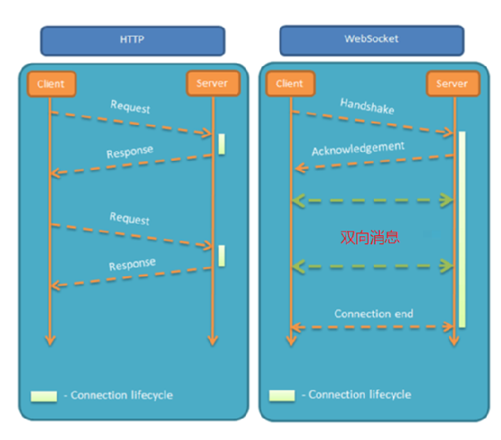
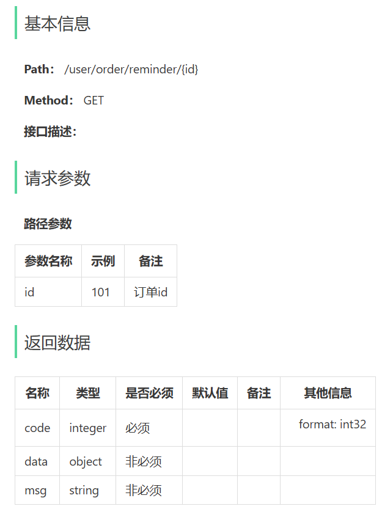

## 内容

- Spring Task
- 订单状态定时处理
- WebSocket
- 来单提醒
- 客户催单

功能实现：**订单状态定时处理**、**来单提醒**和**客户催单**

## WebSocket

WebSocket 是基于 TCP 的一种新的**网络协议**。它实现了浏览器与服务器全双工通信——浏览器和服务器只需要完成一次握手，两者之间就可以创建**持久性**的连接， 并进行**双向**数据传输。

**HTTP协议和WebSocket协议对比**

- HTTP是**短连接**
- WebSocket是**长连接**
- HTTP通信是**单向**的，基于请求响应模式
- WebSocket支持**双向**通信
- HTTP和WebSocket底层都是TCP连接



### WebSocket缺点

服务器长期维护长连接需要一定的成本
各个浏览器支持程度不一
WebSocket 是长连接，受网络限制比较大，需要处理好重连

WebSocket并不能完全取代HTTP，它只适合在特定的场景下使用

### WebSocket应用场景

1). 视频弹幕

2). 网页聊天

3). 体育实况更新

4). 股票基金报价实时更新

### 简单案例

实现浏览器与服务器全双工通信。浏览器既可以向服务器发送消息，服务器也可主动向浏览器推送消息

#### 1). 导入WebSocket的maven坐标

```xml
<dependency>
    <groupId>org.springframework.boot</groupId>
    <artifactId>spring-boot-starter-websocket</artifactId>
</dependency>
```

#### 2). 导入WebSocket服务端组件WebSocketServer，用于和客户端通信

```java
/**
 * WebSocket服务
 */
@Component
@ServerEndpoint("/ws/{sid}")
public class WebSocketServer {

    //存放会话对象
    private static Map<String, Session> sessionMap = new HashMap();

    /**
     * 连接建立成功调用的方法
     */
    @OnOpen
    public void onOpen(Session session, @PathParam("sid") String sid) {
        System.out.println("客户端：" + sid + "建立连接");
        sessionMap.put(sid, session);
    }

    /**
     * 收到客户端消息后调用的方法
     *
     * @param message 客户端发送过来的消息
     */
    @OnMessage
    public void onMessage(String message, @PathParam("sid") String sid) {
        System.out.println("收到来自客户端：" + sid + "的信息:" + message);
    }

    /**
     * 连接关闭调用的方法
     *
     * @param sid
     */
    @OnClose
    public void onClose(@PathParam("sid") String sid) {
        System.out.println("连接断开:" + sid);
        sessionMap.remove(sid);
    }

    /**
     * 群发
     *
     * @param message
     */
    public void sendToAllClient(String message) {
        Collection<Session> sessions = sessionMap.values();
        for (Session session : sessions) {
            try {
                //服务器向客户端发送消息
                session.getBasicRemote().sendText(message);
            } catch (Exception e) {
                e.printStackTrace();
            }
        }
    }

}
```

#### 3). 导入配置类`WebSocketConfiguration`，注册WebSocket的服务端组件

```java
/**
 * WebSocket配置类，用于注册WebSocket的Bean
 */
@Configuration
public class WebSocketConfiguration {

    // 作用是将 WebSocket 端点（如 @ServerEndpoint 注解的类）注册为 Spring 管理的 Bean
    // ServerEndpointExporter 会扫描带有 @ServerEndpoint 注解的类，并自动将它们注册为 WebSocket 端点。
    @Bean
    public ServerEndpointExporter serverEndpointExporter() {
        return new ServerEndpointExporter();
    }
}
```

#### 4). 导入定时任务类WebSocketTask，定时向客户端推送数据

```java
@Component
public class WebSocketTask {
    @Autowired
    private WebSocketServer webSocketServer;

    /**
     * 通过WebSocket每隔5秒向客户端发送消息
     */
    @Scheduled(cron = "0/5 * * * * ?")
    public void sendMessageToClient() {
        webSocketServer.sendToAllClient("这是来自服务端的消息：" + DateTimeFormatter.ofPattern("HH:mm:ss").format(LocalDateTime.now()));
    }
}
```

## 来单提醒

### 需求分析和设计

用户下单并且支付成功后，需要第一时间通知外卖商家。

通知的形式有如下两种：

- 语音播报
- 弹出提示框

#### 设计思路

- 通过WebSocket实现管理端页面和服务端保持长连接状态
- 当客户支付后，调用WebSocket的相关API实现服务端向管理端页面推送消息
- 管理端页面客户浏览器解析服务端推送的消息，判断是来单提醒还是客户催单，进行相应的消息提示和语音播报
- 约定服务端发送给管理端浏览器的数据格式为JSON，字段包括：type，orderId，content
  - type 为消息类型，1为来单提醒 2为客户催单
  - orderId 为订单id
  - content 为消息内容

其实就是后端与管理端之间建立`socket`, 用户端不需要，只是在支付完成时来触发后端通知

### 代码开发

在OrderServiceImpl中注入WebSocketServer对象，修改paySuccess方法

```java
@Autowired
private WebSocketServer webSocketServer;

@Override
public void paySuccess(String outTradeNo) {
    // 当前登录用户id
    Long userId = BaseContext.getCurrentId();

    // 根据订单号查询当前用户的订单
    Orders ordersDB = orderMapper.getByNumberAndUserId(outTradeNo, userId);

    // 根据订单id更新订单的状态、支付方式、支付状态、结账时间
    Orders orders = Orders.builder()
            .id(ordersDB.getId())
            .status(Orders.TO_BE_CONFIRMED)
            .payStatus(Orders.PAID)
            .checkoutTime(LocalDateTime.now())
            .build();

    orderMapper.update(orders);

    Map<String, Object> map = new HashMap<>();
    map.put("type", 1);//消息类型，1表示来单提醒
    map.put("orderId", orders.getId());
    map.put("content", "订单号：" + outTradeNo);

    //通过WebSocket实现来单提醒，向管理端浏览器推送消息
    webSocketServer.sendToAllClient(JSON.toJSONString(map));
}
```

## 客户催单

### 需求分析和设计

用户在小程序中点击催单按钮后，需要第一时间通知外卖商家。通知的形式有如下两种：

- 语音播报
- 弹出提示框

### 设计思路

- 通过WebSocket实现管理端页面和服务端保持长连接状态
- 当用户点击催单按钮后，调用WebSocket的相关API实现服务端向客户端推送消息
- 客户端浏览器解析服务端推送的消息，判断是来单提醒还是客户催单，进行相应的消息提示和语音播报
  约定服务端发送给客户端浏览器的数据格式为JSON，字段包括：type，orderId，content
  - type 为消息类型，1为来单提醒 2为客户催单
  - orderId 为订单id
  - content 为消息内容

当用户点击催单按钮时，向服务端发送请求

#### 接口设计(催单)



### 代码开发

#### Controller层

根据用户催单的接口定义，在`user/OrderController`中创建催单方法

```java
/**
 * 客户催单
 * @param orderId
 * @return
 */
@GetMapping("/reminder/{orderId}")
@ApiOperation("催单")
public Result<Void> reminder(@PathVariable Long orderId) {
    log.info("客户催单：{}", orderId);
    orderService.reminder(orderId);
    return Result.success();
}
```

#### Service层

##### 接口层

```java
/**
 * 用户催单
 * @param id
 */
void reminder(Long id);
```

##### 实现层

```java
/**
 * 客户催单
 * @param orderId
 */
@Override
public void reminder(Long orderId) {
    Orders ordersDB = orderMapper.getById(orderId);

    if (ordersDB == null) {
        throw new OrderBusinessException(MessageConstant.ORDER_STATUS_ERROR);
    }

    Map<String, Object> map = new HashMap<>();
    map.put("type", 2);//消息类型，2表示客户催单
    map.put("orderId", orderId);
    map.put("content", "订单号：" + ordersDB.getNumber());

    //通过WebSocket实现来单提醒，向管理端浏览器推送消息
    webSocketServer.sendToAllClient(JSON.toJSONString(map));
}
```
