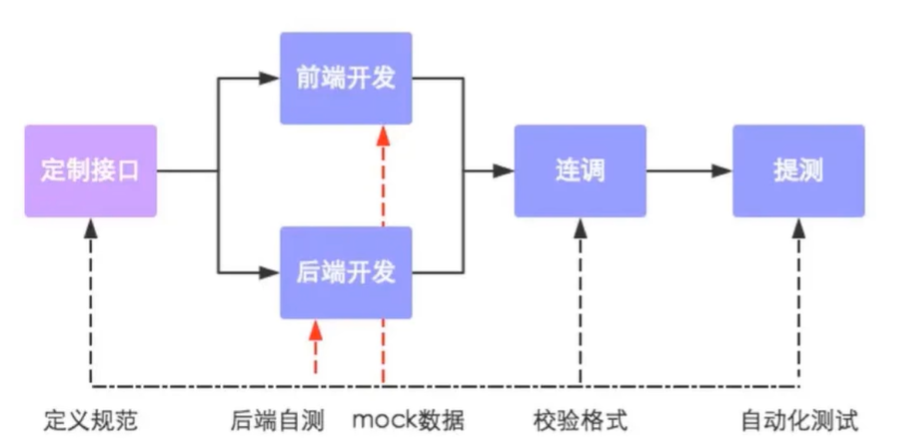

## 苍穹外卖

### 接口文档导入

前企业主流的前后端分离开发方式，那么这种方式就要求我们之前需要先将接口定义好，这样前后端人员才能并行开发。其实，在真实的企业开发中，接口设计过程其实是一个非常漫长的过程，可能需要多次开会讨论调整，甚至在开发的过程中才会发现某些接口定义还需要再调整，这种情况其实是非常常见的

**前后端分离开发流程**：



#### 接口管理平台

将课程资料中提供的项目接口导入YApi。访问地址：<https://yapi.pro/>

#### Swagger  (knife4j)

Swagger 是一个规范和完整的框架，用于生成、描述、调用和可视化 RESTful 风格的 Web 服务(<https://swagger.io/>)。 它的主要作用是：

1. 使得前后端分离开发更加方便，有利于团队协作

2. 接口的文档在线自动生成，降低后端开发人员编写接口文档的负担

3. 功能测试

   Spring已经将Swagger纳入自身的标准，建立了Spring-swagger项目，现在叫Springfox。通过在项目中引入Springfox ，即可非常简单快捷的使用Swagger。

knife4j是为Java MVC框架集成Swagger生成Api文档的增强解决方案,前身是swagger-bootstrap-ui,取名kni4j是希望它能像一把匕首一样小巧,轻量,并且功能强悍!

目前，一般都使用knife4j框架。

##### 使用步骤

1. 导入 knife4j 的maven坐标

   在pom.xml中添加依赖

   ```xml
   <dependency>
      <groupId>com.github.xiaoymin</groupId>
      <artifactId>knife4j-spring-boot-starter</artifactId>
   </dependency>
   ```

2. 在配置类中加入 knife4j 相关配置

   WebMvcConfiguration.java

   ```java
   /**
        * 通过knife4j生成接口文档
        * @return
   */
    @Bean
    public Docket docket() {
        ApiInfo apiInfo = new ApiInfoBuilder()
                .title("苍穹外卖项目接口文档")
                .version("2.0")
                .description("苍穹外卖项目接口文档")
                .build();
        Docket docket = new Docket(DocumentationType.SWAGGER_2)
                .apiInfo(apiInfo)
                .select()
                .apis(RequestHandlerSelectors.basePackage("com.sky.controller"))
                .paths(PathSelectors.any())
                .build();
        return docket;
    }
   ```

3. 设置静态资源映射，否则接口文档页面无法访问

   WebMvcConfiguration.java

   ```java
   /**
        * 设置静态资源映射
        * @param registry
   */
   protected void addResourceHandlers(ResourceHandlerRegistry registry) {
           registry.addResourceHandler("/doc.html").addResourceLocations("classpath:/META-INF/resources/");
           registry.addResourceHandler("/webjars/**").addResourceLocations("classpath:/META-INF/resources/webjars/");
   }
   ```

##### Swagger 常用注解

通过注解可以控制生成的接口文档，使接口文档拥有更好的可读性，常用注解如下：

| **注解**          | **说明**                                               |
| ----------------- | ------------------------------------------------------ |
| `@Api`              | 用在类上，例如Controller，表示对类的说明               |
| `@ApiMode`l         | 用在类上，例如entity、DTO、VO                          |
| `@ApiModelProperty` | 用在属性上，描述属性信息                               |
| `@ApiOperation`     | 用在方法上，例如Controller的方法，说明方法的用途、作用 |

接下来，使用上述注解，生成可读性更好的接口文档
