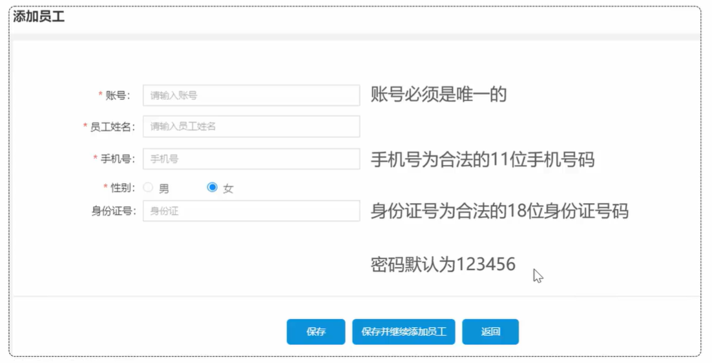
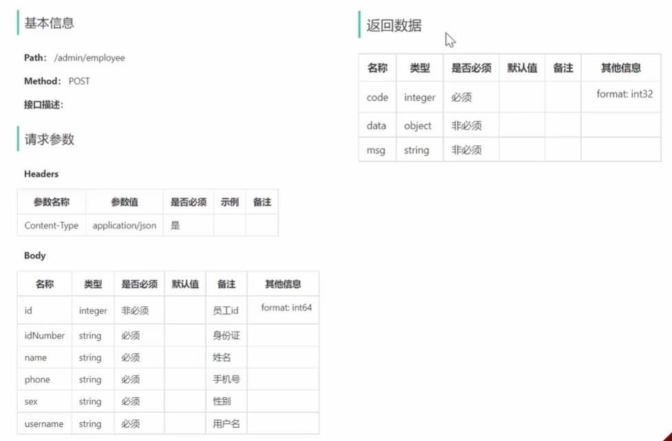
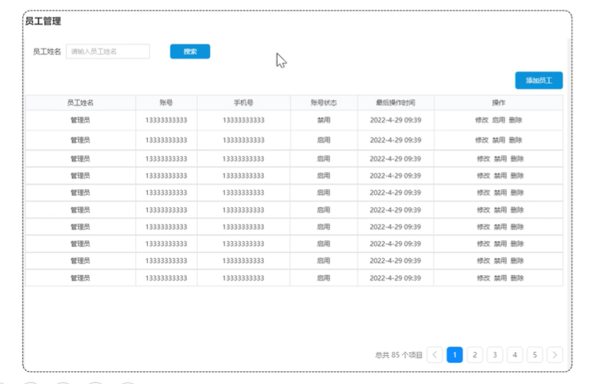
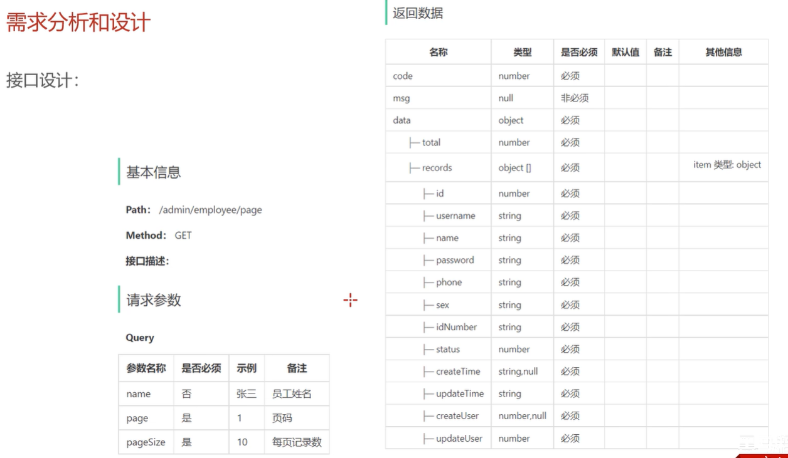

## 苍穹外卖

### 实现功能

- 新增员工
- 员工分页查询
- 启用禁用员工账号
- 编辑员工
- 导入分类模块功能代码

### 1. 新增员工 `/admin/employee`

#### 产品原型



1. 账号必须是唯一的
2. 手机号为合法的11位手机号码
3. 身份证号为合法的18位身份证号码
4. 密码默认为123456

#### 接口设计



明确新增员工接口的**请求路径、请求方式、请求参数、返回数据**。

约定：

- **管理端**发出的请求，统一使用**/admin**作为前缀。
- **用户端**发出的请求，统一使用**/user**作为前缀。

#### 表设计

新增员工，其实就是将我们新增页面录入的员工数据插入到employee表。

**employee表结构：**

| **字段名**  | **数据类型** | **说明**     | **备注**    |
| ----------- | ------------ | ------------ | ----------- |
| id          | bigint       | 主键         | 自增        |
| name        | varchar(32)  | 姓名         |             |
| username    | varchar(32)  | 用户名       | 唯一        |
| password    | varchar(64)  | 密码         |             |
| phone       | varchar(11)  | 手机号       |             |
| sex         | varchar(2)   | 性别         |             |
| id_number   | varchar(18)  | 身份证号     |             |
| status      | Int          | 账号状态     | 1正常 0锁定 |
| create_time | Datetime     | 创建时间     |             |
| update_time | datetime     | 最后修改时间 |             |
| create_user | bigint       | 创建人id     |             |
| update_user | bigint       | 最后修改人id |             |

其中，employee表中的status字段已经设置了默认值1，表示状态正常。

#### 代码开发

##### DTO设计

当前端提交的数据和实体类中对应的属性差别比较大时，建议使用DTO来封装数据

`EmployeeDTO`

```java
package com.sky.dto;
import lombok.Data;
import java.io.Serializable;
@Data
public class EmployeeDTO implements Serializable {
    private Long id;
    private String username;
    private String name;
    private String phone;
    private String sex;
    private String idNumber;
}
```

##### `Controller`层创建方法

`@RequestBody`: 把前端发送的 JSON（或 XML、表单数据等）自动反序列化成 Java 对象。

EmployeeController中创建新增员工方法

```java
   /**
     * 新增员工
     * @param employeeDTO
     * @return
     */
    @PostMapping
    @ApiOperation("新增员工")
    public Result<Void> save(@RequestBody EmployeeDTO employeeDTO) {
        log.info("新增员工：{}", employeeDTO);
        employeeService.save(employeeDTO);
        return Result.success();
    }
```

##### `Service`层

###### 接口部分

在EmployeeService接口中声明新增员工方法

```java
   /**
     * 新增员工
     * @param employeeDTO
     */
    void save(EmployeeDTO employeeDTO);
```

###### 实现类部分

在EmployeeServiceImpl中实现新增员工方法

```java
   /**
     * 新增员工
     *
     * @param employeeDTO
     */
    public void save(EmployeeDTO employeeDTO) {
        Employee employee = new Employee();

        //对象属性拷贝
        BeanUtils.copyProperties(employeeDTO, employee);

        //设置账号的状态，默认正常状态 1表示正常 0表示锁定
        employee.setStatus(StatusConstant.ENABLE);

        //设置密码，默认密码123456
        employee.setPassword(DigestUtils.md5DigestAsHex(PasswordConstant.DEFAULT_PASSWORD.getBytes()));

        //设置当前记录的创建时间和修改时间
        employee.setCreateTime(LocalDateTime.now());
        employee.setUpdateTime(LocalDateTime.now());

        //设置当前记录创建人id和修改人id
        employee.setCreateUser(10L);
        //目前写个假数据，后期修改
        employee.setUpdateUser(10L);

        employeeMapper.insert(employee);//后续步骤定义
    }
```

##### `Mapper`层

在EmployeeMapper中声明insert方法

```java
   /**
     * 插入员工数据
     * @param employee
     */
    @Insert("insert into employee (name, username, password, phone, sex, id_number, create_time, update_time, create_user, update_user,status) " +
    "values " +
    "(#{name},#{username},#{password},#{phone},#{sex},#{idNumber},#{createTime},#{updateTime},#{createUser},#{updateUser},#{status})")
    void insert(Employee employee);
```

#### 功能测试

代码已经发开发完毕，对新增员工功能进行测试。

**功能测试实现方式：**

- 通过接口文档测试
- 通前后端联调测试

#### 代码完善

目前，程序存在的问题主要有两个：

- 录入的用户名已存，抛出的异常后没有处理
- 新增员工时，创建人id和修改人id设置为固定值

接下来，我们对上述两个问题依次进行分析和解决。

##### 1. 捕获重复命名异常

通过全局异常处理器来处理。

进入到sky-server模块，com.sky.hander包下，GlobalExceptionHandler.java添加方法

```java
    /**
     * 处理SQL异常
     * @param ex
     * @return
     */
    @ExceptionHandler
    public Result exceptionHandler(SQLIntegrityConstraintViolationException ex){
        //Duplicate entry 'zhangsan' for key 'employee.idx_username'
        String message = ex.getMessage();
        if(message.contains("Duplicate entry")){
            String[] split = message.split(" ");
            String username = split[2];
            String msg = username + MessageConstant.ALREADY_EXISTS;
            return Result.error(msg);
        }else{
            return Result.error(MessageConstant.UNKNOWN_ERROR);
        }
    }
```

进入到sky-common模块，在MessageConstant.java添加

```java
public static final String ALREADY_EXISTS = "已存在";
```

##### 2. 新增员工对应修改人id同步

通过`ThreadLocal`在每次请求时动态存取当前登录员工的id。

ThreadLocal 并不是一个Thread，而是Thread的局部变量。
ThreadLocal为每个线程提供单独一份存储空间，具有线程隔离的效果，只有在线程内才能获取到对应的值，线程外则不能访问。

**常用方法：**

- public void set(T value)    设置当前线程的线程局部变量的值
- public T get()     返回当前线程所对应的线程局部变量的值
- public void remove()        移除当前线程的线程局部变量

在拦截器中解析出当前登录员工id，并放入线程局部变量中：

在sky-server模块中，拦截器：

```java
package com.sky.interceptor;

/**
 * jwt令牌校验的拦截器
 */
@Component
@Slf4j
public class JwtTokenAdminInterceptor implements HandlerInterceptor {

    @Autowired
    private JwtProperties jwtProperties;

    /**
     * 校验jwt
     *
     * @param request
     * @param response
     * @param handler
     * @return
     * @throws Exception
     */
    public boolean preHandle(HttpServletRequest request, HttpServletResponse response, Object handler) throws Exception {
        
      //.............................
       
        //2、校验令牌
        try {
            //.................
            Claims claims = JwtUtil.parseJWT(jwtProperties.getAdminSecretKey(), token);
            Long empId = Long.valueOf(claims.get(JwtClaimsConstant.EMP_ID).toString());
            log.info("当前员工id：", empId);
            /////将用户id存储到ThreadLocal////////
            BaseContext.setCurrentId(empId);
            ////////////////////////////////////
            //3、通过，放行
            return true;
        } catch (Exception ex) {
            //......................
        }
    }
}
```

在Service中获取线程局部变量中的值：

```java
   /**
     * 新增员工
     *
     * @param employeeDTO
     */
    public void save(EmployeeDTO employeeDTO) {
        //.............................

        //设置当前记录创建人id和修改人id
        employee.setCreateUser(BaseContext.getCurrentId());//目前写个假数据，后期修改
        employee.setUpdateUser(BaseContext.getCurrentId());

        employeeMapper.insert(employee);
    }
```

### 2. 员工分页查询 `/admin/employee/page?`

#### 产品原型

系统中的员工很多的时候，如果在一个页面中全部展示出来会显得比较乱，不便于查看，所以一般的系统中都会以分页的方式来展示列表数据。而在我们的分页查询页面中, 除了分页条件以外，还有一个查询条件 "员工姓名"。



- 根据页码展示员工信息
- 每页展示10条数据
- 分页查询时可以根据需要，输入员工姓名进行查询

#### 接口设计



- 请求参数类型为Query，不是json格式提交，在路径后直接拼接。/admin/employee/page?name=zhangsan
- 返回数据中records数组中使用Employee实体类对属性进行封装。

#### 代码开发

##### DTO设计

根据请求参数进行封装，在sky-pojo模块中

```java
@Data
public class EmployeePageQueryDTO implements Serializable {
    //员工姓名
    private String name;
    //页码
    private int page;
    //每页显示记录数
    private int pageSize;
}
```

##### 封装`PageResult`

后面所有的分页查询，统一都封装为PageResult对象。

在sky-common模块

```java
package com.sky.result;
import lombok.AllArgsConstructor;
import lombok.Data;
import lombok.NoArgsConstructor;
import java.io.Serializable;
import java.util.List;
/**
 * 封装分页查询结果
 */
@Data
@AllArgsConstructor
@NoArgsConstructor
public class PageResult implements Serializable {
    private long total; //总记录数
    private List records; //当前页数据集合
}
```

然后传给前端，对应为 `Result<PageResult>`，也就对应最终返回的情况

data里面的内容 —— `PageResult`

sql limit 关键字

##### Controller层

在sky-server模块中，com.sky.controller.admin.EmployeeController中添加分页查询方法。

```java
/**
 * 员工分页查询
 * @param employeePageQueryDTO
 * @return
 */
@GetMapping("/page")
@ApiOperation("分页查询")
public Result<PageResult> page(EmployeePageQueryDTO employeePageQueryDTO) {
   log.info("员工分页查询，参数为：{}", employeePageQueryDTO);
   PageResult pageResult = employeeService.pageQuery(employeePageQueryDTO);//后续定义
   return Result.success(pageResult);
}
```

##### Service层接口

```java
/**
 * 分页查询
 * @param employeePageQueryDTO
 * @return
 */
PageResult pageQuery(EmployeePageQueryDTO employeePageQueryDTO);
```

##### Service层实现类

此处使用 mybatis 的分页插件 PageHelper 来简化分页代码的开发。底层基于 mybatis 的拦截器实现。

```java
/**
 * 分页查询
 *
 * @param employeePageQueryDTO
 * @return
 */
public PageResult pageQuery(EmployeePageQueryDTO employeePageQueryDTO) {
   // select * from employee limit 0,10
   //开始分页查询
   PageHelper.startPage(employeePageQueryDTO.getPage(), employeePageQueryDTO.getPageSize());

   Page<Employee> page = employeeMapper.pageQuery(employeePageQueryDTO);//后续定义

   long total = page.getTotal();
   List<Employee> records = page.getResult();

   return new PageResult(total, records);
}
```

##### Mapper层

在 EmployeeMapper 中声明 pageQuery 方法：

```java
/**
 * 分页查询
 * @param employeePageQueryDTO
 * @return
 */
Page<Employee> pageQuery(EmployeePageQueryDTO employeePageQueryDTO);
```

在 `src/main/resources/mapper/EmployeeMapper.xml` 中编写SQL：

```sql
<select id="pageQuery" resultType="com.sky.entity.Employee">
    select * from employee
    <where>
        <if test="name != null and name != ''">
            and name like concat('%',#{name},'%')
        </if>
    </where>
    order by create_time desc
</select>
```

#### 代码完善

**问题描述**：操作时间字段显示有问题。

##### 方法一

在属性上加上注解，对日期进行格式化

```java
//@JsonFormat(pattern = "yyyy-MM-dd HH:mm:ss")
private LocalDateTime createTime;
```

但这种方式，需要在每个时间属性上都要加上该注解，使用较麻烦，不能全局处理。

##### 方法二 (扩展SpringMVC的消息转换器)

在WebMvcConfiguration中扩展SpringMVC的消息转换器，统一对日期类型进行格式处理

```java
/**
 * 扩展Spring MVC框架的消息转化器
 * @param converters
 */
protected void extendMessageConverters(List<HttpMessageConverter<?>> converters) {
   log.info("扩展消息转换器...");
   //创建一个消息转换器对象
   MappingJackson2HttpMessageConverter converter = new MappingJackson2HttpMessageConverter();
   //需要为消息转换器设置一个对象转换器，对象转换器可以将Java对象序列化为json数据
   converter.setObjectMapper(new JacksonObjectMapper());
   //将自己的消息转化器加入容器中
   converters.add(0,converter);
    }
```

```java
/**
 * 对象映射器:基于jackson将Java对象转为json，或者将json转为Java对象
 * 将JSON解析为Java对象的过程称为 [从JSON反序列化Java对象]
 * 从Java对象生成JSON的过程称为 [序列化Java对象到JSON]
 */
public class JacksonObjectMapper extends ObjectMapper {

    public static final String DEFAULT_DATE_FORMAT = "yyyy-MM-dd";
    //public static final String DEFAULT_DATE_TIME_FORMAT = "yyyy-MM-dd HH:mm:ss";
    public static final String DEFAULT_DATE_TIME_FORMAT = "yyyy-MM-dd HH:mm";
    public static final String DEFAULT_TIME_FORMAT = "HH:mm:ss";

    public JacksonObjectMapper() {
        super();
        //收到未知属性时不报异常
        this.configure(FAIL_ON_UNKNOWN_PROPERTIES, false);

        //反序列化时，属性不存在的兼容处理
        this.getDeserializationConfig().withoutFeatures(DeserializationFeature.FAIL_ON_UNKNOWN_PROPERTIES);

        SimpleModule simpleModule = new SimpleModule()
                .addDeserializer(LocalDateTime.class, new LocalDateTimeDeserializer(DateTimeFormatter.ofPattern(DEFAULT_DATE_TIME_FORMAT)))
                .addDeserializer(LocalDate.class, new LocalDateDeserializer(DateTimeFormatter.ofPattern(DEFAULT_DATE_FORMAT)))
                .addDeserializer(LocalTime.class, new LocalTimeDeserializer(DateTimeFormatter.ofPattern(DEFAULT_TIME_FORMAT)))
                .addSerializer(LocalDateTime.class, new LocalDateTimeSerializer(DateTimeFormatter.ofPattern(DEFAULT_DATE_TIME_FORMAT)))
                .addSerializer(LocalDate.class, new LocalDateSerializer(DateTimeFormatter.ofPattern(DEFAULT_DATE_FORMAT)))
                .addSerializer(LocalTime.class, new LocalTimeSerializer(DateTimeFormatter.ofPattern(DEFAULT_TIME_FORMAT)));

        //注册功能模块 例如，可以添加自定义序列化器和反序列化器
        this.registerModule(simpleModule);
    }
}
```
