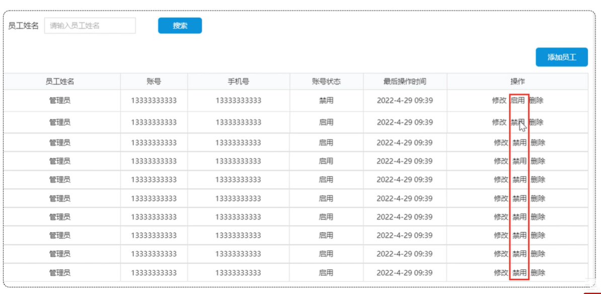
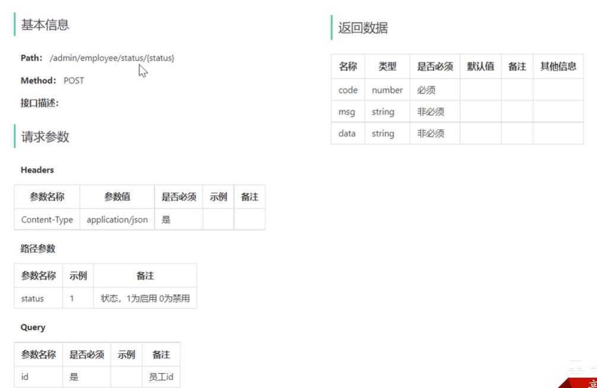
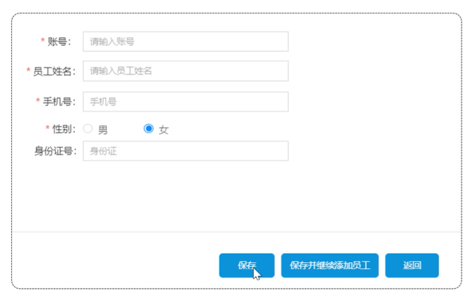
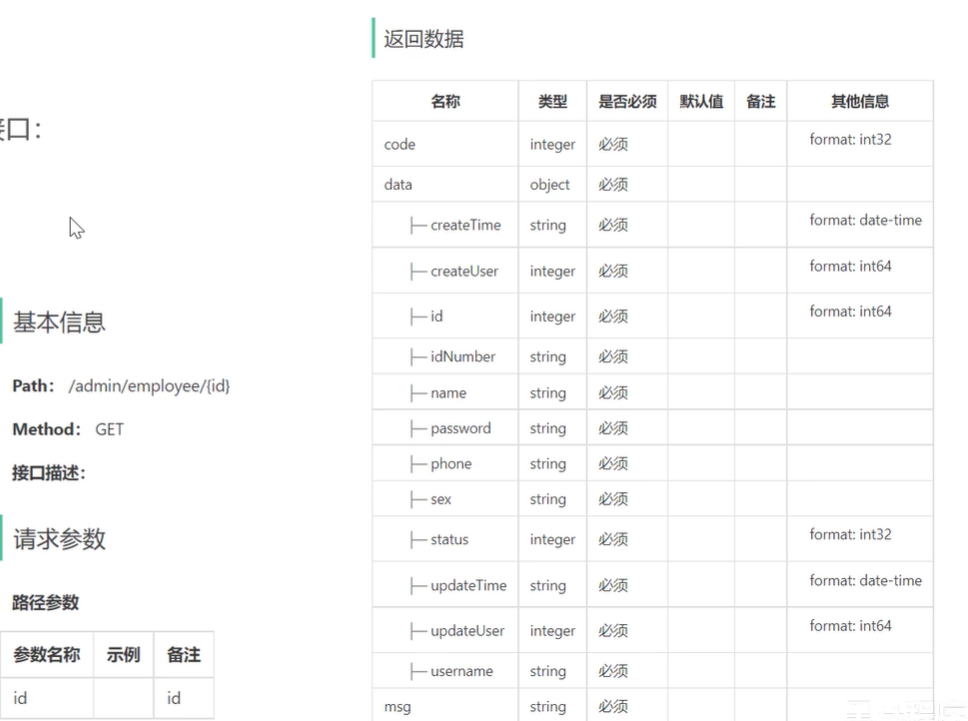
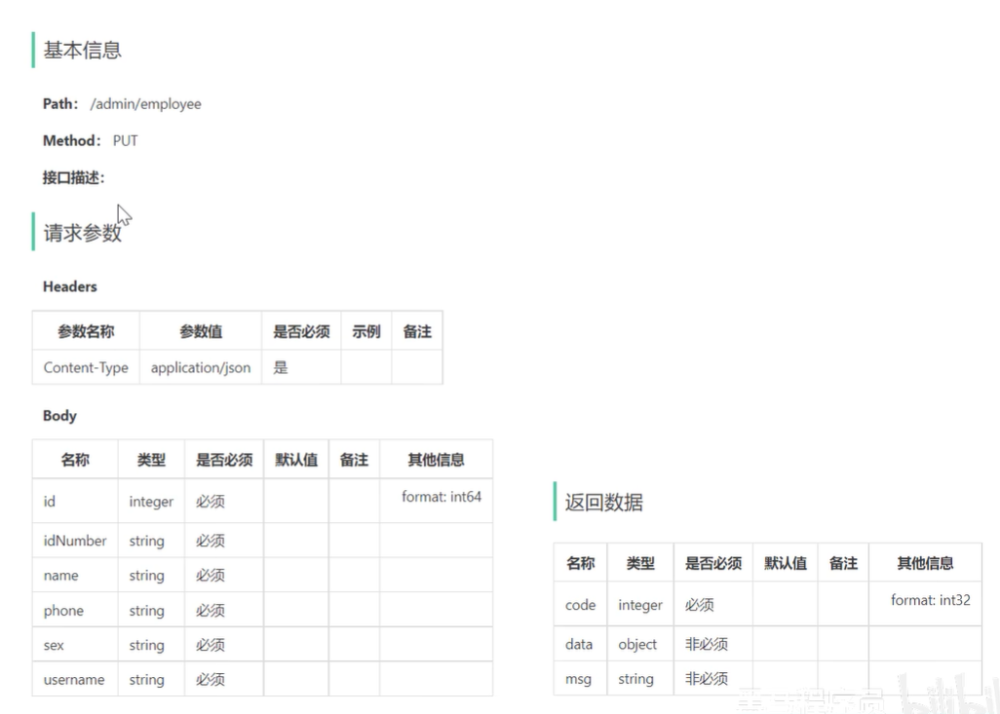
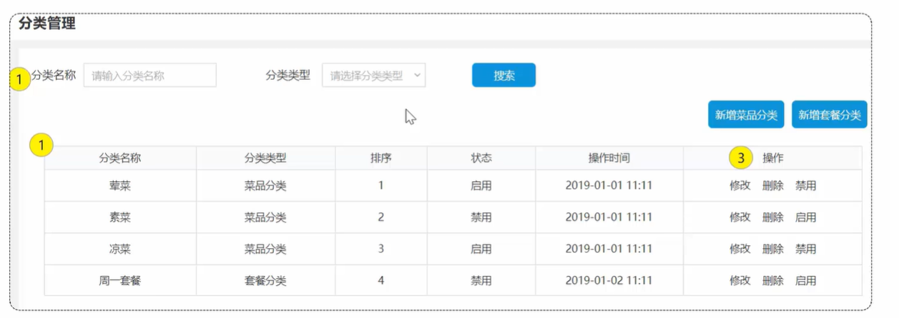
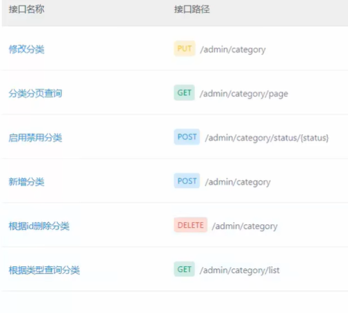

## 苍穹外卖

### 实现功能

- 新增员工
- 员工分页查询
- 启用禁用员工账号
- 编辑员工
- 导入分类模块功能代码

### 3. 启用禁用员工账号 `/admin/employee/status/{status}`

#### 产品原型



**业务规则：**

- 可以对状态为“启用” 的员工账号进行“禁用”操作
- 可以对状态为“禁用”的员工账号进行“启用”操作
- 状态为“禁用”的员工账号不能登录系统

#### 接口设计



1). 路径参数携带状态值。
2). 同时，把id传递过去，明确对哪个用户进行操作。
3). 返回数据code状态是必须，其它是非必须。

#### 代码开发

##### Controller层

在sky-server模块中，根据接口设计中的请求参数形式对应的在 EmployeeController 中创建启用禁用员工账号的方法：

```java
/**
 * 启用禁用员工账号
 * @param status
 * @param id
 * @return
 */
@PostMapping("/status/{status}")
@ApiOperation("启用禁用员工账号")
public Result startOrStop(@PathVariable Integer status,Long id){
    log.info("启用禁用员工账号：{},{}",status,id);
    employeeService.startOrStop(status,id);//后绪步骤定义
    return Result.success();
}
```

##### Service层接口

在 EmployeeService 接口中声明启用禁用员工账号的业务方法：

```java
/**
 * 启用禁用员工账号
 * @param status
 * @param id
 */
void startOrStop(Integer status, Long id);
```

##### Service层实现类

在 EmployeeServiceImpl 中实现启用禁用员工账号的业务方法：

```java
/**
 * 启用禁用员工账号
 *
 * @param status
 * @param id
 */
public void startOrStop(Integer status, Long id) {
    Employee employee = Employee.builder()
            .status(status)
            .id(id)
            .build();
    employeeMapper.update(employee);
}
```

##### Mapper层

在 EmployeeMapper 接口中声明 update 方法：

```java
    /**
     * 根据主键动态修改属性
     * @param employee
     */
    void update(Employee employee);
```

在 EmployeeMapper.xml 中编写SQL：

```sql
<update id="update" parameterType="Employee">
        update employee
    <set>
        <if test="name != null">name = #{name},</if>
        <if test="username != null">username = #{username},</if>
        <if test="password != null">password = #{password},</if>
        <if test="phone != null">phone = #{phone},</if>
        <if test="sex != null">sex = #{sex},</if>
        <if test="idNumber != null">id_Number = #{idNumber},</if>
        <if test="updateTime != null">update_Time = #{updateTime},</if>
        <if test="updateUser != null">update_User = #{updateUser},</if>
        <if test="status != null">status = #{status},</if>
    </set>
    where id = #{id}
</update>
```

##### 登录时根据status限制登录

```java
if (employee.getStatus() == StatusConstant.DISABLE) {
    //账号被锁定
    throw new AccountLockedException(MessageConstant.ACCOUNT_LOCKED);
}
```

### 4. 编辑员工

#### 产品原型

在员工管理列表页面点击 "编辑" 按钮，跳转到编辑页面，在编辑页面**回显**员工信息并进行修改，最后点击 "保存" 按钮完成编辑操作。



#### 接口设计

根据上述原型图分析，编辑员工功能涉及到两个接口：

- 根据id查询员工信息 `/admin/employee/{id}`



- 编辑员工信息 `/admin/employee` (`PUT`)



#### 代码开发

##### 1. 信息回显

###### `Controller`层

在 EmployeeController 中创建 getById 方法：

```java
/**
 * 根据id查询员工信息
 * @param id
 * @return
 */
@GetMapping("/{id}")
@ApiOperation("根据id查询员工信息")
public Result<Employee> getById(@PathVariable Long id){
    Employee employee = employeeService.getById(id);
    return Result.success(employee);
}
```

###### Service层接口

在 EmployeeService 接口中声明 getById 方法：

```java
/**
 * 根据id查询员工
 * @param id
 * @return
 */
Employee getById(Long id);
```

###### Service层实现类

在 EmployeeServiceImpl 中实现 getById 方法：

```java
/**
 * 根据id查询员工
 *
 * @param id
 * @return
 */
public Employee getById(Long id) {
    Employee employee = employeeMapper.getById(id);
    employee.setPassword("****");
    return employee;
}
```

###### Mapper层

在 EmployeeMapper 接口中声明 getById 方法：

```java
/**
 * 根据id查询员工信息
 * @param id
 * @return
 */
@Select("select * from employee where id = #{id}")
Employee getById(Long id);
```

##### 2. 信息修改

###### `Controller`层

在 EmployeeController 中创建 update 方法：

```java
/**
 * 编辑员工信息
 * @param employeeDTO
 * @return
 */
@PutMapping
@ApiOperation("编辑员工信息")
public Result update(@RequestBody EmployeeDTO employeeDTO){
    log.info("编辑员工信息：{}", employeeDTO);
    employeeService.update(employeeDTO);
    return Result.success();
}
```

###### Service层接口

在 EmployeeService 接口中声明 getById 方法：

```java
/**
 * 编辑员工信息
 * @param employeeDTO
 */
void update(EmployeeDTO employeeDTO);
```

###### Service层实现类

在 EmployeeServiceImpl 中实现 update 方法：

```java
/**
 * 编辑员工信息
 *
 * @param employeeDTO
 */
public void update(EmployeeDTO employeeDTO) {
    Employee employee = new Employee();
    BeanUtils.copyProperties(employeeDTO, employee);

    employee.setUpdateTime(LocalDateTime.now());
    employee.setUpdateUser(BaseContext.getCurrentId());

    employeeMapper.update(employee);
}
```

在实现**启用禁用员工账号**功能时，已实现`employeeMapper.update(employee)`，在此不需写Mapper层代码。

### 5. 分类模块功能代码 (与员工管理模块类似)

#### 产品原型



后台系统中可以管理分类信息，分类包括两种类型，分别是 **菜品分类** 和 **套餐分类** 。

先来分析**菜品分类**相关功能。

**新增菜品分类**：当我们在后台系统中添加菜品时需要选择一个菜品分类，在移动端也会按照菜品分类来展示对应的菜品。

**菜品分类分页查询**：系统中的分类很多的时候，如果在一个页面中全部展示出来会显得比较乱，不便于查看，所以一般的系统中都会以分页的方式来展示列表数据。

**根据id删除菜品分类**：在分类管理列表页面，可以对某个分类进行删除操作。需要注意的是当分类关联了菜品或者套餐时，此分类不允许删除。

**修改菜品分类**：在分类管理列表页面点击修改按钮，弹出修改窗口，在修改窗口回显分类信息并进行修改，最后点击确定按钮完成修改操作。

**启用禁用菜品分类**：在分类管理列表页面，可以对某个分类进行启用或者禁用操作。

**分类类型查询**：当点击分类类型下拉框时，从数据库中查询所有的菜品分类数据进行展示。

**业务规则：**

- 分类名称必须是唯一的
- 分类按照类型可以分为菜品分类和套餐分类
- 新添加的分类状态默认为“禁用”

#### 相关接口

根据上述原型图分析，菜品分类模块共涉及6个接口。

- 新增分类
- 分类分页查询
- 根据id删除分类
- 修改分类
- 启用禁用分类
- 根据类型查询分类



#### 数据表设计 `category`表

| **字段名**  | **数据类型** | **说明**     | **备注**            |
| ----------- | ------------ | ------------ | ------------------- |
| id          | bigint       | 主键         | 自增                |
| name        | varchar(32)  | 分类名称     | 唯一                |
| type        | int          | 分类类型     | 1菜品分类 2套餐分类 |
| sort        | int          | 排序字段     | 用于分类数据的排序  |
| status      | int          | 状态         | 1启用 0禁用         |
| create_time | datetime     | 创建时间     |                     |
| update_time | datetime     | 最后修改时间 |                     |
| create_user | bigint       | 创建人id     |                     |
| update_user | bigint       | 最后修改人id |                     |
