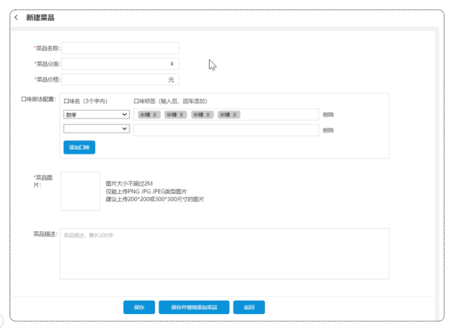
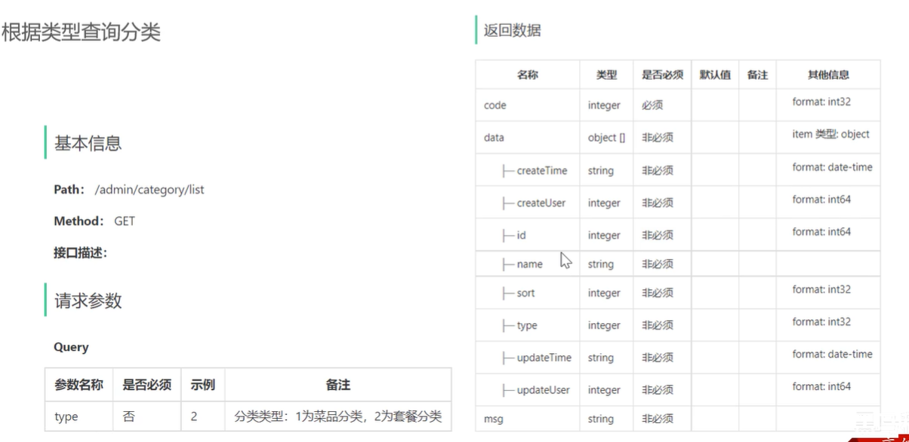
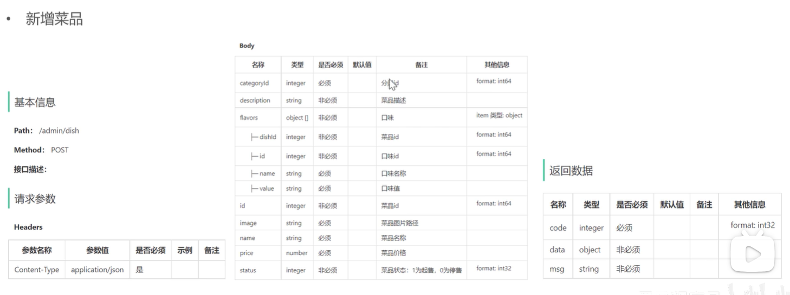

## 菜品管理模块1


### 实现功能

- 公共字段自动填充
- 新增菜品
- 菜品分页查询
- 删除菜品
- 修改菜品

### 1. 公共字段填充 (AOP操作)

#### 问题分析

在上一章节我们已经完成了后台系统的**员工管理功能**和**菜品分类功能**的开发，在**新增员工**或者**新增菜品分类**时需要设置创建时间、创建人、修改时间、修改人等字段，在**编辑员工**或者**编辑菜品分类**时需要设置修改时间、修改人等字段。这些字段属于公共字段，也就是也就是在我们的系统中很多表中都会有这些字段，如下：

| **序号** | **字段名**  | **含义** | **数据类型** |
| -------- | ----------- | -------- | ------------ |
| 1        | create_time | 创建时间 | datetime     |
| 2        | create_user | 创建人id | bigint       |
| 3        | update_time | 修改时间 | datetime     |
| 4        | update_user | 修改人id | bigint       |

而针对于这些字段，我们的赋值方式为：

1). 在新增数据时, 将createTime、updateTime 设置为当前时间, createUser、updateUser设置为当前登录用户ID。

2). 在更新数据时, 将updateTime 设置为当前时间, updateUser设置为当前登录用户ID。

目前,在我们的项目中处理这些字段都是在每一个业务方法中进行赋值操作

能不能对于这些公共字段在某个地方统一处理，来简化开发呢？

**答案是可以的，我们使用AOP切面编程，实现功能增强，来完成公共字段自动填充功能。**

#### 实现思路

在实现公共字段自动填充，也就是在插入或者更新的时候为指定字段赋予指定的值，使用它的好处就是可以统一对这些字段进行处理，避免了重复代码。在上述的问题分析中，我们提到有四个公共字段，需要在新增/更新中进行赋值操作, 具体情况如下:

| **序号** | **字段名**  | **含义** | **数据类型** | **操作类型**   |
| -------- | ----------- | -------- | ------------ | -------------- |
| 1        | create_time | 创建时间 | datetime     | insert         |
| 2        | create_user | 创建人id | bigint       | insert         |
| 3        | update_time | 修改时间 | datetime     | insert、update |
| 4        | update_user | 修改人id | bigint       | insert、update |

**实现步骤：**

1). 自定义注解 AutoFill，用于标识需要进行公共字段自动填充的方法

2). 自定义切面类 AutoFillAspect，统一拦截加入了 AutoFill 注解的方法，通过反射为公共字段赋值

3). 在 Mapper 的方法上加入 AutoFill 注解

#### 实现

##### 1. 自定义注解 AutoFill

进入到sky-server模块，创建com.sky.annotation包。

```java
package com.sky.annotation;

import com.sky.enumeration.OperationType;
import java.lang.annotation.ElementType;
import java.lang.annotation.Retention;
import java.lang.annotation.RetentionPolicy;
import java.lang.annotation.Target;

/**
 * 自定义注解，用于标识某个方法需要进行功能字段自动填充处理
 */
@Target(ElementType.METHOD)
@Retention(RetentionPolicy.RUNTIME)
public @interface AutoFill {
    //数据库操作类型：UPDATE INSERT
    OperationType value();
}
```

其中OperationType已在sky-common模块中定义

```java
package com.sky.enumeration;

/**
 * 数据库操作类型
 */
public enum OperationType {

    /**
     * 更新操作
     */
    UPDATE,

    /**
     * 插入操作
     */
    INSERT
}
```

##### 2. 自定义切面 AutoFillAspect

在sky-server模块，创建com.sky.aspect包。

1. 获取拦截方法对应 AutoFill 注解的value值
2. 准备赋值的数据
3. 根据当前不同的操作类型，为对应的属性通过反射来赋值

```java
package com.sky.aspect;

import com.sky.annotation.AutoFill;
import com.sky.constant.AutoFillConstant;
import com.sky.context.BaseContext;
import com.sky.enumeration.OperationType;
import lombok.extern.slf4j.Slf4j;
import org.aspectj.lang.JoinPoint;
import org.aspectj.lang.annotation.Aspect;
import org.aspectj.lang.annotation.Before;
import org.aspectj.lang.annotation.Pointcut;
import org.aspectj.lang.reflect.MethodSignature;
import org.springframework.stereotype.Component;
import java.lang.reflect.Method;
import java.time.LocalDateTime;

/**
 * 自定义切面，实现公共字段自动填充处理逻辑
 */
@Aspect
@Component
@Slf4j
public class AutoFillAspect {

    /**
     * 切入点
     */
    @Pointcut("execution(* com.sky.mapper.*.*(..)) && @annotation(com.sky.annotation.AutoFill)")
    public void autoFillPointCut(){}

    /**
     * 前置通知，在通知中进行公共字段的赋值
     */
    @Before("autoFillPointCut()")
    public void autoFill(JoinPoint joinPoint){
        log.info("开始进行公共字段自动填充...");

        //获取到当前被拦截的方法上的数据库操作类型
        MethodSignature signature = (MethodSignature) joinPoint.getSignature();//方法签名对象
        AutoFill autoFill = signature.getMethod().getAnnotation(AutoFill.class);//获得方法上的注解对象
        OperationType operationType = autoFill.value();//获得数据库操作类型

        //获取到当前被拦截的方法的参数--实体对象
        Object[] args = joinPoint.getArgs();
        if(args == null || args.length == 0){
            return;
        }

        Object entity = args[0];

        //准备赋值的数据
        LocalDateTime now = LocalDateTime.now();
        Long currentId = BaseContext.getCurrentId();

        //根据当前不同的操作类型，为对应的属性通过反射来赋值
        if(operationType == OperationType.INSERT){
            //为4个公共字段赋值
            try {
                Method setCreateTime = entity.getClass().getDeclaredMethod(AutoFillConstant.SET_CREATE_TIME, LocalDateTime.class);
                Method setCreateUser = entity.getClass().getDeclaredMethod(AutoFillConstant.SET_CREATE_USER, Long.class);
                Method setUpdateTime = entity.getClass().getDeclaredMethod(AutoFillConstant.SET_UPDATE_TIME, LocalDateTime.class);
                Method setUpdateUser = entity.getClass().getDeclaredMethod(AutoFillConstant.SET_UPDATE_USER, Long.class);

                //通过反射为对象属性赋值
                setCreateTime.invoke(entity,now);
                setCreateUser.invoke(entity,currentId);
                setUpdateTime.invoke(entity,now);
                setUpdateUser.invoke(entity,currentId);
            } catch (Exception e) {
                e.printStackTrace();
            }
        }else if(operationType == OperationType.UPDATE){
            //为2个公共字段赋值
            try {
                Method setUpdateTime = entity.getClass().getDeclaredMethod(AutoFillConstant.SET_UPDATE_TIME, LocalDateTime.class);
                Method setUpdateUser = entity.getClass().getDeclaredMethod(AutoFillConstant.SET_UPDATE_USER, Long.class);

                //通过反射为对象属性赋值
                setUpdateTime.invoke(entity,now);
                setUpdateUser.invoke(entity,currentId);
            } catch (Exception e) {
                e.printStackTrace();
            }
        }
    }
}
```

##### 3. 在Mapper接口的方法上加入 AutoFill 注解

分别在新增和修改方法添加@AutoFill()注解，**同时**，将业务层为公共字段赋值的代码注释掉。

### 2. 新增菜品

#### 产品原型



#### 业务规则

- 菜品名称必须是唯一的
- 菜品必须属于某个分类下，不能单独存在
- 新增菜品时可以根据情况选择菜品的口味
- 每个菜品必须对应一张图片

#### 接口设计

根据上述原型图先**粗粒度**设计接口，共包含3个接口。

**接口设计：**

- 根据类型查询分类（已完成）
- 文件上传
- 新增菜品

接下来**细粒度**分析每个接口，明确每个接口的请求方式、请求路径、传入参数和返回值。

##### 1. 根据类型查询分类 `admin/category/list`



##### 2. 文件上传 `/admin/common/upload`


##### 3. 新增菜品 `/admin/dish`



#### 数据库设计

新增菜品，其实就是将新增页面录入的菜品信息插入到dish表，如果添加了口味做法，还需要向dish_flavor表插入数据。所以在新增菜品时，涉及到两个表：

| 表名        | 说明       |
| ----------- | ---------- |
| dish        | 菜品表     |
| dish_flavor | 菜品口味表 |

##### `dish`菜品表

| **字段名**  | **数据类型**  | **说明**     | **备注**    |
| ----------- | ------------- | ------------ | ----------- |
| id          | bigint        | 主键         | 自增        |
| name        | varchar(32)   | 菜品名称     | 唯一        |
| category_id | bigint        | 分类id       | 逻辑外键    |
| price       | decimal(10,2) | 菜品价格     |             |
| image       | varchar(255)  | 图片路径     |             |
| description | varchar(255)  | 菜品描述     |             |
| status      | int           | 售卖状态     | 1起售 0停售 |
| create_time | datetime      | 创建时间     |             |
| update_time | datetime      | 最后修改时间 |             |
| create_user | bigint        | 创建人id     |             |
| update_user | bigint        | 最后修改人id |             |

##### `dish_flavor` 菜品口味表

| **字段名** | **数据类型** | **说明** | **备注** |
| ---------- | ------------ | -------- | -------- |
| id         | bigint       | 主键     | 自增     |
| dish_id    | bigint       | 菜品id   | 逻辑外键 |
| name       | varchar(32)  | 口味名称 |          |
| value      | varchar(255) | 口味值   |          |

逻辑外键意思：并没有把真的外键关系创建到数据库里，只是在代码处理上用了外键逻辑对应

#### 代码开发

##### 文件上传实现

因为在新增菜品时，需要上传菜品对应的图片(文件)，包括后绪其它功能也会使用到文件上传，故要实现通用的文件上传接口。

文件上传，是指将本地图片、视频、音频等文件上传到服务器上，可以供其他用户浏览或下载的过程。

实现文件上传服务，需要有存储的支持，那么我们的解决方案将以下几种：

1. 直接将图片保存到服务的硬盘（springmvc中的文件上传）
   1. 优点：开发便捷，成本低
   2. 缺点：扩容困难
2. 使用分布式文件系统进行存储
   1. 优点：容易实现扩容
   2. 缺点：开发复杂度稍大（有成熟的产品可以使用，比如：FastDFS,MinIO）
3. 使用第三方的存储服务（例如OSS）
   1. 优点：开发简单，拥有强大功能，免维护
   2. 缺点：付费

可以看教程的阿里云oss来操作，不过也可以用本地来简单实现

###### 本地操作

1.先在server文件夹中的\src\main\resources中创建一个存放图片的文件夹

2.修改WebMvcConfiguration里的 addResourceHandlers 方法

```java
protected void addResourceHandlers(ResourceHandlerRegistry registry) {
    registry.addResourceHandler("/doc.html").addResourceLocations("classpath:/META-INF/resources/");
    registry.addResourceHandler("/webjars/**").addResourceLocations("classpath:/META-INF/resources/webjars/");
    registry.addResourceHandler("/static/**").addResourceLocations("file:E:/java_items/sky-take-out/sky-server/src/main/resources/static/");
}
```

这里要说明:

- `addResourceHandler` 和 `addResourceLocations` 分别对应「哪些 URL 请求路径」会映射到「哪些资源目录」
  
- `addResourceHandler(String... pathPatterns)` 
    告诉 Spring MVC 哪些 URL 需要被当作静态资源来处理
    registry.addResourceHandler("/static/**")
    表示当访问路径是 /static/**（如 /static/css/main.css）时，
    Spring 会去查找静态资源，而不是去找 Controller

- `addResourceLocations(String... resourceLocations)`
    告诉 Spring MVC 在项目的哪里去找这些静态资源文件，指定静态资源文件所在的物理位置或 classpath 路径

    | 写法| 含义 |
    | ------------------------------------------ | ------------------------------------- |
    | `"classpath:/META-INF/resources/"`         | 在依赖包或项目的 `META-INF/resources` 目录中查找资源 |
    | `"classpath:/META-INF/resources/webjars/"` | WebJAR 格式的静态资源位置                      |
    | `"classpath:/static/"`                     | 在项目 `src/main/resources/static/` 下查找  |
    | `"file:/opt/app/static/"`                  | 从文件系统路径读取资源（非打包到 jar 内）               |

- 因为上传文件涉及上传操作，所以需要实际的文件系统路径，所以要用 `file:`, 不能用 `classpath`, 只适合读取打包进应用的静态资源，JAR 运行时是只读的，无法把上传文件写进去。

3.修改CommonController，直接把下面代码全部复制替换掉原来的

```java
package com.sky.controller.admin;

import com.sky.constant.MessageConstant;
import com.sky.result.Result;
import io.swagger.annotations.Api;
import lombok.extern.slf4j.Slf4j;
import org.springframework.web.bind.annotation.PostMapping;
import org.springframework.web.bind.annotation.RequestMapping;
import org.springframework.web.bind.annotation.ResponseBody;
import org.springframework.web.bind.annotation.RestController;
import org.springframework.web.multipart.MultipartFile;

import java.io.File;
import java.io.IOException;
import java.nio.file.Files;
import java.nio.file.Path;
import java.nio.file.Paths;
import java.nio.file.StandardCopyOption;
import java.util.UUID;

@RestController
@RequestMapping("/admin/common")
@Api(tags = "通用接口")
@Slf4j
public class CommonController {

    private static String FILE_UPLOAD_PATH = "E:\\java_items\\sky-take-out\\sky-server\\src\\main\\resources\\static\\";

    @PostMapping("/upload")
    @ResponseBody
    public Result<String> upload(MultipartFile file) {
        if(file.isEmpty()) {
            return Result.error("文件不能为空");
        }
        File dir = new File(FILE_UPLOAD_PATH);
        if (!dir.exists() || !dir.isDirectory()) {
            boolean created = dir.mkdirs();
            if(created) {
                log.info("创建文件夹成功: {}", FILE_UPLOAD_PATH);
            } else {
                log.warn("创建文件夹失败或已经存在: {}", FILE_UPLOAD_PATH);
            }
        }

        String originalFilename = file.getOriginalFilename();
        if (originalFilename == null || originalFilename.isEmpty()) {
            return Result.error("文件名无效");
        }
        // 获取后缀
        String extension = originalFilename.substring(originalFilename.lastIndexOf("."));
        if (!extension.equalsIgnoreCase(".png") && !extension.equalsIgnoreCase(".jpg") && !extension.equalsIgnoreCase(".jpeg")) {
            return Result.error("文件格式不支持");
        }
        // 拼接新的随机名称
        originalFilename = UUID.randomUUID().toString() + extension;

        // 确保文件路径安全，避免路径遍历攻击
        Path targetLocation = Paths.get(FILE_UPLOAD_PATH).resolve(originalFilename).normalize();
        try {
            Files.copy(file.getInputStream(), targetLocation, StandardCopyOption.REPLACE_EXISTING);
            log.info("文件上传成功: {}", originalFilename);
        } catch (IOException e) {
            log.error("文件上传失败: {}", originalFilename, e);
            return Result.error(MessageConstant.UPLOAD_FAILED);
        }

        // 你可以根据实际情况调整返回的文件访问链接
        String fileUrl = "http://localhost:8080/static/" + originalFilename;
        return Result.success(fileUrl);
    }
}
```

##### 新增菜品

- `DTO`设计

    在sky-pojo模块中

    ```java
    @Data
    public class DishDTO implements Serializable {

        private Long id;
        //菜品名称
        private String name;
        //菜品分类id
        private Long categoryId;
        //菜品价格
        private BigDecimal price;
        //图片
        private String image;
        //描述信息
        private String description;
        //0 停售 1 起售
        private Integer status;
        //口味
        private List<DishFlavor> flavors = new ArrayList<>();
    }
    ```

- `Controller`层 —— `DishController`模块

    ```java
    /**
    * 菜品管理
    */
    @RestController
    @RequestMapping("/admin/dish")
    @Api(tags = "菜品相关接口")
    @Slf4j
    public class DishController {

        @Autowired
        private DishService dishService;

        /**
        * 新增菜品
        *
        * @param dishDTO
        * @return
        */
        @PostMapping
        @ApiOperation("新增菜品")
        public Result save(@RequestBody DishDTO dishDTO) {
            log.info("新增菜品：{}", dishDTO);
            dishService.saveWithFlavor(dishDTO);//后绪步骤开发
            return Result.success();
        }
    }
    ```

    然后去 `Service` 层设计具体内容

- `Service`层接口

    ```java
    package com.sky.service;

    import com.sky.dto.DishDTO;
    import com.sky.entity.Dish;

    public interface DishService {

        /**
        * 新增菜品和对应的口味
        *
        * @param dishDTO
        */
        public void saveWithFlavor(DishDTO dishDTO);

    }
    ```

- `Service`层实现类

    ```java
    package com.sky.service.impl;

    @Service
    @Slf4j
    public class DishServiceImpl implements DishService {

        @Autowired
        private DishMapper dishMapper;
        @Autowired
        private DishFlavorMapper dishFlavorMapper;

        /**
        * 新增菜品和对应的口味
        *
        * @param dishDTO
        */
        @Transactional
        public void saveWithFlavor(DishDTO dishDTO) {

            Dish dish = new Dish();
            BeanUtils.copyProperties(dishDTO, dish);

            //向菜品表插入1条数据
            dishMapper.insert(dish);//后绪步骤实现

            //获取insert语句生成的主键值
            Long dishId = dish.getId();

            List<DishFlavor> flavors = dishDTO.getFlavors();
            if (flavors != null && flavors.size() > 0) {
                flavors.forEach(dishFlavor -> {
                    dishFlavor.setDishId(dishId);
                });
                //向口味表插入n条数据
                dishFlavorMapper.insertBatch(flavors);//后绪步骤实现
            }
        }

    }
    ```

    `@Transactional`：由于在两个数据库操作，要保证原子性，要么全成功，要么全失败

    具体的数据库操作给 `Mapper` 层实现

- `Mapper`层

    DishMapper.java中添加

    ```java
        /**
         * 插入菜品数据
         *
         * @param dish
         */
        @AutoFill(value = OperationType.INSERT)
        void insert(Dish dish);
    ```

    在/resources/mapper中创建DishMapper.xml

    ```xml
    <?xml version="1.0" encoding="UTF-8" ?>
    <!DOCTYPE mapper PUBLIC "-//mybatis.org//DTD Mapper 3.0//EN"
            "http://mybatis.org/dtd/mybatis-3-mapper.dtd" >
    <mapper namespace="com.sky.mapper.DishMapper">

        <insert id="insert" useGeneratedKeys="true" keyProperty="id">
            insert into dish (name, category_id, price, image, description, create_time, update_time, create_user,update_user, status)
            values (#{name}, #{categoryId}, #{price}, #{image}, #{description}, #{createTime}, #{updateTime}, #{createUser}, #{updateUser}, #{status})
        </insert>
    </mapper>

    ```

    DishFlavorMapper.java

    ```java
    package com.sky.mapper;

    import com.sky.entity.DishFlavor;
    import java.util.List;

    @Mapper
    public interface DishFlavorMapper {
        /**
         * 批量插入口味数据
         * @param flavors
         */
        void insertBatch(List<DishFlavor> flavors);

    }
    ```

    在/resources/mapper中创建DishFlavorMapper.xml

    ```xml
    <?xml version="1.0" encoding="UTF-8" ?>
    <!DOCTYPE mapper PUBLIC "-//mybatis.org//DTD Mapper 3.0//EN"
            "http://mybatis.org/dtd/mybatis-3-mapper.dtd" >
    <mapper namespace="com.sky.mapper.DishFlavorMapper">
        <insert id="insertBatch">
            insert into dish_flavor (dish_id, name, value) VALUES
            <foreach collection="flavors" item="df" separator=",">
                (#{df.dishId},#{df.name},#{df.value})
            </foreach>
        </insert>
    </mapper>
    ```