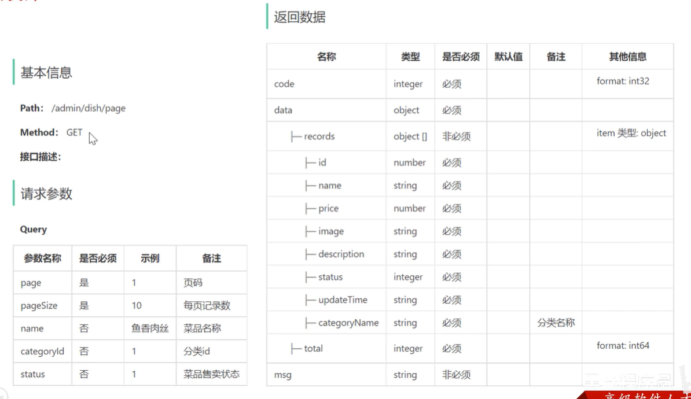
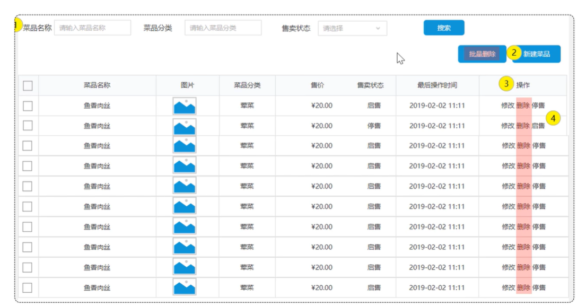
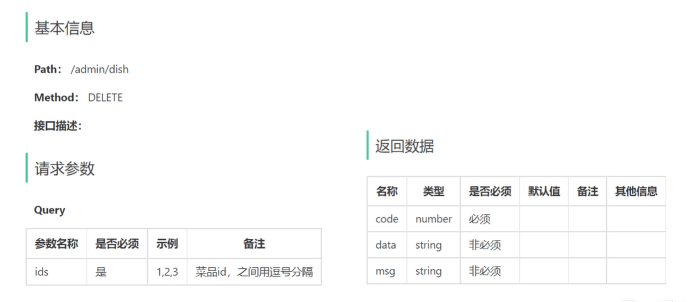
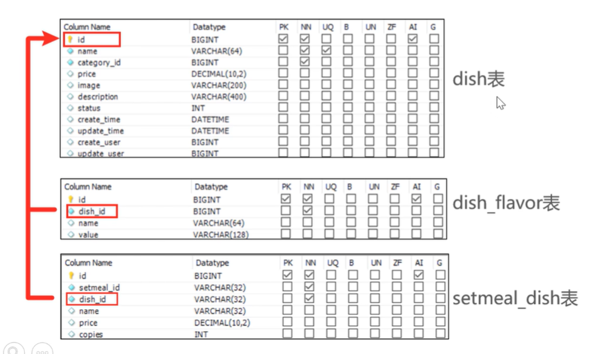
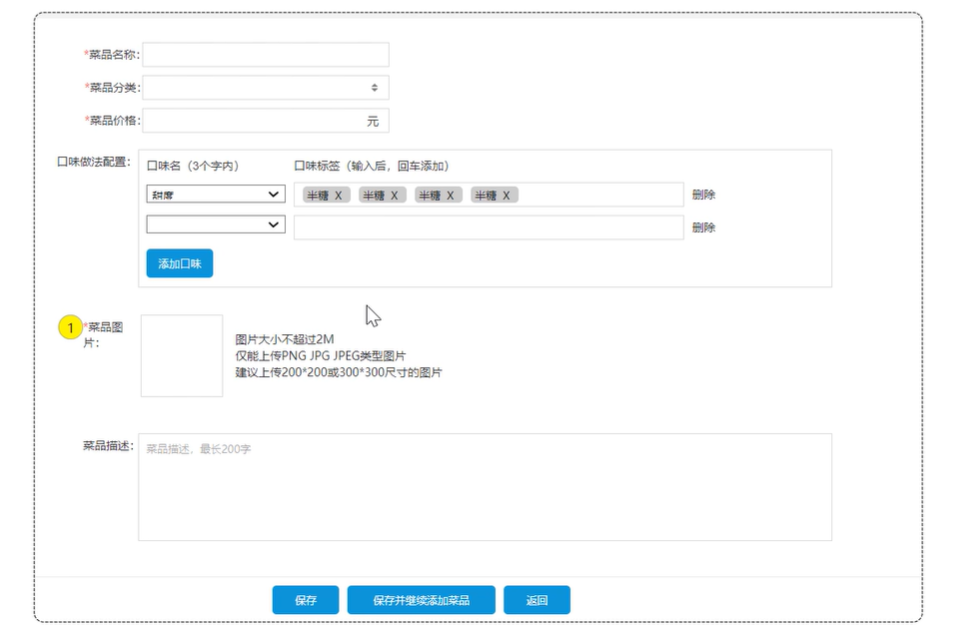
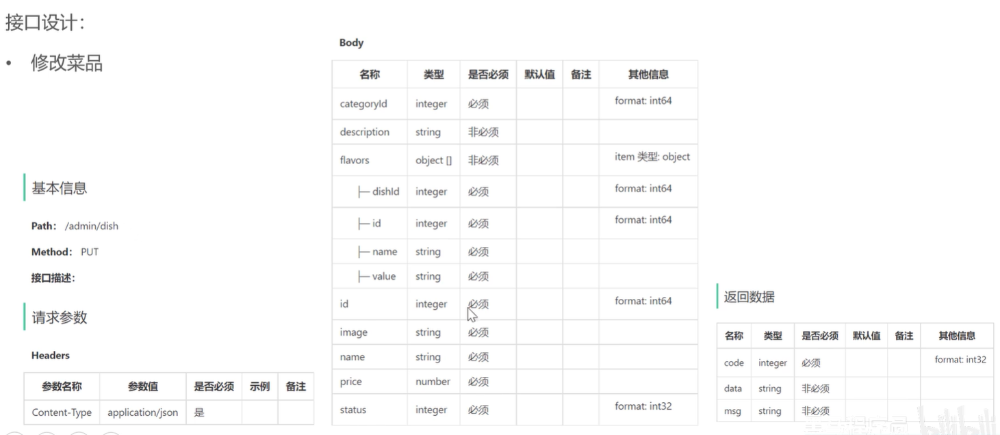

## 菜品管理模块2

### 实现功能

- 公共字段自动填充
- 新增菜品
- 菜品分页查询
- 删除菜品
- 修改菜品

### 3. 菜品分页查询

#### 产品原型


在菜品列表展示时，除了菜品的基本信息(名称、售价、售卖状态、最后操作时间)外，还有两个字段略微特殊，第一个是图片字段，我们从数据库查询出来的仅仅是图片的名字，图片要想在表格中回显展示出来，就需要下载这个图片。

第二个是菜品分类，这里展示的是分类名称，而不是分类ID，此时我们就需要根据菜品的分类ID，去分类表中查询分类信息，然后在页面展示。

**业务规则：**

- 根据页码展示菜品信息
- 每页展示10条数据
- 分页查询时可以根据需要输入菜品名称、菜品分类、菜品状态进行查询

#### 接口设计



#### 代码开发

##### 1. 对应DTO设计

查询Query对应的DTO: `DishPageQueryDTO`

```java
package com.sky.dto;
import lombok.Data;
import java.io.Serializable;
@Data
public class DishPageQueryDTO implements Serializable {
    private int page;
    private int pageSize;
    private String name;
    private Integer categoryId; //分类id
    private Integer status; //状态 0表示禁用 1表示启用
}
```

##### 2. 对应VO设计

返回结果`records`, 设计对应的VO: `DishVO`

```java
package com.sky.vo;

import com.sky.entity.DishFlavor;
import lombok.AllArgsConstructor;
import lombok.Builder;
import lombok.Data;
import lombok.NoArgsConstructor;
import java.io.Serializable;
import java.math.BigDecimal;
import java.time.LocalDateTime;
import java.util.ArrayList;
import java.util.List;

@Data
@Builder
@NoArgsConstructor
@AllArgsConstructor
public class DishVO implements Serializable {

    private Long id;
    //菜品名称
    private String name;
    //菜品分类id
    private Long categoryId;
    //菜品价格
    private BigDecimal price;
    //图片
    private String image;
    //描述信息
    private String description;
    //0 停售 1 起售
    private Integer status;
    //更新时间
    private LocalDateTime updateTime;
    //分类名称
    private String categoryName;
    //菜品关联的口味
    private List<DishFlavor> flavors = new ArrayList<>();
}
```

##### 3. `Controller`层

根据接口定义创建DishController的page分页查询方法

根据之前设计的 `PageResult`来设计

```java
  /**
     * 菜品分页查询
     *
     * @param dishPageQueryDTO
     * @return
     */
    @GetMapping("/page")
    @ApiOperation("菜品分页查询")
    public Result<PageResult> page(DishPageQueryDTO dishPageQueryDTO) {
        log.info("菜品分页查询:{}", dishPageQueryDTO);
        PageResult pageResult = dishService.pageQuery(dishPageQueryDTO);//后绪步骤定义
        return Result.success(pageResult);
    }
```

##### 4. `Service`层接口

**在 DishService 中扩展分页查询方法：**

```java
/**
  * 菜品分页查询
  *
  * @param dishPageQueryDTO
  * @return
  */
PageResult pageQuery(DishPageQueryDTO dishPageQueryDTO);
```

##### 4. `Service`层实现类

**在 DishServiceImpl 中实现分页查询方法：**

```java
/**
* 菜品分页查询
*
* @param dishPageQueryDTO
* @return
*/
public PageResult pageQuery(DishPageQueryDTO dishPageQueryDTO) {
    PageHelper.startPage(dishPageQueryDTO.getPage(), dishPageQueryDTO.getPageSize());
    Page<DishVO> page = dishMapper.pageQuery(dishPageQueryDTO);//后绪步骤实现
    return new PageResult(page.getTotal(), page.getResult());
}
```

##### 5. `Mapper`层

在 DishMapper 接口中声明 pageQuery 方法：

```java
/**
  * 菜品分页查询
  *
  * @param dishPageQueryDTO
  * @return
  */
Page<DishVO> pageQuery(DishPageQueryDTO dishPageQueryDTO);
```

**在 DishMapper.xml 中编写SQL：**

```xml
<select id="pageQuery" resultType="com.sky.vo.DishVO">
  select d.* , c.name as categoryName from dish d left outer join category c on d.category_id = c.id
  <where>
      <if test="name != null">
          and d.name like concat('%',#{name},'%')
      </if>
      <if test="categoryId != null">
          and d.category_id = #{categoryId}
      </if>
      <if test="status != null">
          and d.status = #{status}
      </if>
  </where>
  order by d.create_time desc
</select>
```

这里的SQL设计可以先去测试下，感觉需要了解下，并没有系统仔细学过SQL语句

### 4. 删除菜品

在菜品列表页面，每个菜品后面对应的操作分别为**修改**、**删除**、**停售**，可通过删除功能完成对菜品及相关的数据进行删除。

#### 产品原型



**业务规则：**

- 可以一次删除一个菜品，也可以批量删除菜品
- 起售中的菜品不能删除
- 被套餐关联的菜品不能删除
- 删除菜品后，关联的口味数据也需要删除掉

#### 接口设计 `DELETE`



#### 数据库设计

1. 删除的菜品需要看是否被套餐关联 (setmeal_dish)
2. 菜品删除对应的口味也要删除 (dish_flavor)



#### 代码开发

##### 1. Controller层

**根据删除菜品的接口定义在DishController中创建方法：**

```java
/**
 * 菜品批量删除
 *
 * @param ids
 * @return
 */
@DeleteMapping
@ApiOperation("菜品批量删除")
public Result delete(@RequestParam List<Long> ids) {
    log.info("菜品批量删除：{}", ids);
    dishService.deleteBatch(ids);//后绪步骤实现
    return Result.success();
}
```

##### 2. `Service`层接口

**在DishService接口中声明deleteBatch方法：**

```java
/**
 * 菜品批量删除
 *
 * @param ids
 */
void deleteBatch(List<Long> ids);
```

##### 2. `Service`层实现类

**在DishServiceImpl中实现deleteBatch方法：**

```java
@Autowired
private SetmealDishMapper setMealDishMapper;
/**
 * 菜品删除
 * @param ids
 */
@Override
@Transactional
public void deleteBatch(List<Long> ids) {
  //判断当前菜品是否能够删除---是否存在起售中的菜品
  for(Long id : ids) {
      Dish dish = dishMapper.getById(id);
      if(Objects.equals(dish.getStatus(), StatusConstant.ENABLE))
          throw new DeletionNotAllowedException(MessageConstant.DISH_ON_SALE);
  }

  //判断当前菜品是否能够删除---是否被套餐关联了
  List<Long> setMealIds = setMealDishMapper.getSetMealIdsByDishIds(ids);
  if(setMealIds != null && !setMealIds.isEmpty())
      throw new DeletionNotAllowedException(MessageConstant.DISH_BE_RELATED_BY_SETMEAL);

  //删除菜品表中的菜品数据
  dishMapper.deleteByIds(ids);
  dishFlavorMapper.deleteByDishIds(ids);
}
```

##### 3. `Mapper`层

1. `dishMapper.getById`

  ```java
  /**
   * 根据主键查询菜品
    *
    * @param id
    * @return
    */
  @Select("select * from dish where id = #{id}")
  Dish getById(Long id);
  ```

2. `setMealDishMapper` + `setMealDishMapper.getSetMealIdsByDishIds`

```java
package com.sky.mapper;
import org.apache.ibatis.annotations.Mapper;
import java.util.List;
@Mapper
public interface SetMealDishMapper {
    // select id from setmeal_dish where dish_id in (x,x,x);
    List<Long> getSetMealIdsByDishIds(List<Long> ids);
}
```

SetmealDishMapper.xml

```xml
<?xml version="1.0" encoding="UTF-8" ?>
<!DOCTYPE mapper PUBLIC "-//mybatis.org//DTD Mapper 3.0//EN"
        "http://mybatis.org/dtd/mybatis-3-mapper.dtd" >
<mapper namespace="com.sky.mapper.SetMealDishMapper">
    <select id="getSetMealIdsByDishIds" resultType="java.lang.Long">
        select setmeal_id from setmeal_dish where dish_id in
        <foreach collection="ids" item="id" open="(" separator="," close=")">
            #{id}
        </foreach>
    </select>
</mapper>
```

3. `dishMapper.deleteByIds`

    批量删除

    ```java
    /**
     * 根据菜品id列表批量删除
     * @param ids
     */
    void deleteByIds(List<Long> ids);
    ```

    ```xml
    <delete id="deleteByIds">
        delete from dish where id in
        <foreach collection="ids" item="id" open="(" separator="," close=")">
            #{id}
        </foreach>
    </delete>
    ```

4. `dishFlavorMapper.deleteByDishIds`

    批量删除

    ```java
    void deleteByDishIds(List<Long> setMealIds);
    ```

    ```xml
    <delete id="deleteByDishIds">
        delete from dish_flavor where dish_id in
        <foreach collection="setMealIds" item="id" open="(" separator="," close=")">
            #{id}
        </foreach>
    </delete>
    ```

### 5. 修改菜品

#### 产品原型

在菜品管理列表页面点击修改按钮，跳转到修改菜品页面，在修改页面回显菜品相关信息并进行修改，最后点击保存按钮完成修改操作。



#### 接口设计

**接口：**

- 根据id查询菜品
- 根据类型查询分类(已实现)
- 文件上传(已实现)
- 修改菜品

我们只需要实现**根据id查询菜品**和**修改菜品**两个接口，接下来，我们来重点分析这两个接口

##### 根据id查询菜品 `/admin/dish/{id}` GET


##### 修改菜品 `/admin/dish` PUT



#### 代码开发 —— 根据id查询菜品

##### `Controller`层

```java
/**
 * 根据id查询菜品
 *
 * @param id
 * @return
 */
@GetMapping("/{id}")
@ApiOperation("根据id查询菜品")
public Result<DishVO> getById(@PathVariable Long id) {
  log.info("根据id查询菜品：{}", id);
  DishVO dishVO = dishService.getByIdWithFlavor(id);//后绪步骤实现
  return Result.success(dishVO);
}
```

##### `Service`层接口

```java
/**
 * 根据id查询菜品和对应的口味数据
 *
 * @param id
 * @return
 */
DishVO getByIdWithFlavor(Long id);
```

##### `Service`层实现类

**在DishServiceImpl中实现getByIdWithFlavor方法：**

```java
/**
 * 根据id查询菜品和对应的口味数据
 *
 * @param id
 * @return
 */
public DishVO getByIdWithFlavor(Long id) {
  //根据id查询菜品数据
  Dish dish = dishMapper.getById(id);

  //根据菜品id查询口味数据
  List<DishFlavor> dishFlavors = dishFlavorMapper.getByDishId(id);//后绪步骤实现

  //将查询到的数据封装到VO
  DishVO dishVO = new DishVO();
  BeanUtils.copyProperties(dish, dishVO);
  dishVO.setFlavors(dishFlavors);

  return dishVO;
}
```

##### Mapper层

**在DishFlavorMapper中声明getByDishId方法，并配置SQL：**

```java
/**
 * 根据菜品id查询对应的口味数据
 * @param dishId
 * @return
 */
@Select("select * from dish_flavor where dish_id = #{dishId}")
List<DishFlavor> getByDishId(Long dishId);
```

#### 代码开发 —— 修改菜品

##### `Controller`层

根据修改菜品的接口定义在DishController中创建方法

```java
/**
 * 修改菜品
 * @param dishDTO
 * @return
 */
@PutMapping
@ApiOperation("修改菜品")
public Result<Void> update(@RequestBody DishDTO dishDTO) {
  log.info("修改菜品: {}", dishDTO);
  dishService.updateWithFlavor(dishDTO);
  return Result.success();
}
```

##### `Service`层接口

```java
/**
 * 修改菜品
 * @param dishDTO
 */
void updateWithFlavor(DishDTO dishDTO);
```

##### `Service`层实现类

在DishServiceImpl中实现updateWithFlavor方法：

```java
@Override
@Transactional
public void updateWithFlavor(DishDTO dishDTO) {
    Dish dish = new Dish();
    BeanUtils.copyProperties(dishDTO, dish);

    // 修改菜品基本信息
    dishMapper.update(dish);

    // 删除原有口味
    dishFlavorMapper.deleteByDishIds(List.of(dish.getId()));

    // 重新插入口味数据
    List<DishFlavor> flavors = dishDTO.getFlavors();
    if (flavors != null && !flavors.isEmpty()) {
        flavors.forEach(dishFlavor -> {
            dishFlavor.setDishId(dishDTO.getId());
        });
        //向口味表插入n条数据
        dishFlavorMapper.insertBatch(flavors);
    }
}
```

##### Mapper层

**在DishMapper中，声明update方法：**

```java
/**
 * 根据id动态修改菜品数据
 *
 * @param dish
 */
@AutoFill(value = OperationType.UPDATE)
void update(Dish dish);
```

**并在DishMapper.xml文件中编写SQL:**

```xml
<update id="update">
  update dish
  <set>
      <if test="name != null">name = #{name},</if>
      <if test="categoryId != null">category_id = #{categoryId},</if>
      <if test="price != null">price = #{price},</if>
      <if test="image != null">image = #{image},</if>
      <if test="description != null">description = #{description},</if>
      <if test="status != null">status = #{status},</if>
      <if test="updateTime != null">update_time = #{updateTime},</if>
      <if test="updateUser != null">update_user = #{updateUser},</if>
  </set>
  where id = #{id}
</update>
```
