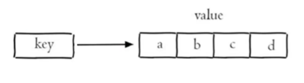

## 营业状态设置1

### Redis介绍

Redis是一个基于**内存**的key-value结构数据库。Redis 是互联网技术领域使用最为广泛的**存储中间件**。

**官网**: <https://redis.io>
**中文网**: <https://www.redis.net.cn/>

**key-value结构存储：**

**主要特点：**

- 基于内存存储，读写性能高  
- 适合存储热点数据（热点商品、资讯、新闻）
- 企业应用广泛

Redis是用C语言开发的一个开源的高性能键值对(key-value)数据库，官方提供的数据是可以达到100000+的QPS（每秒内查询次数）。它存储的value类型比较丰富，也被称为结构化的NoSql数据库。

NoSql（Not Only SQL），不仅仅是SQL，泛指**非关系型数据库**。NoSql数据库并不是要取代关系型数据库，而是关系型数据库的补充。

**关系型数据库(RDBMS)：**

- Mysql
- Oracle
- DB2
- SQLServer

**非关系型数据库(NoSql)：**

- Redis
- Mongo db
- MemCached

#### 基本命令

启动：`redis-server.exe redis.conf`

启动时默认创建了 16 个数据库

连接: `redis-cli.exe`

通过redis-cli.exe命令默认连接的是本地的redis服务，并且使用默认6379端口。也可以通过指定如下参数连接：

- -h ip地址
- -p 端口号
- -a 密码（如果需要）

### Redis数据类型

#### 5种常用数据类型

Redis存储的是key-value结构的数据，其中key是字符串类型，value有5种常用的数据类型：

- 字符串 string
- 哈希 hash
- 列表 list
- 集合 set
- 有序集合 sorted set / zset

#### 各自特点

- 字符串(string)：普通字符串，Redis中最简单的数据类型
- 哈希(hash)：也叫散列，类似于Java中的HashMap结构 (适合存对象)
- 列表(list)：按照插入顺序排序，可以有重复元素，类似于Java中的LinkedList (可以左右插入，适合存储跟顺序有关系的数据)
- 集合(set)：无序集合，没有重复元素，类似于Java中的HashSet
- 有序集合(sorted set/zset)：集合中每个元素关联一个分数(score)，根据分数升序排序，没有重复元素 (适合各种排行榜数据)

### Redis常用命令

在Mysql中是通过Sql语句来操作的，与数据类型无关，但在Redis中是不一样的，是根据数据类型不同，命令也不同

#### 字符串操作命令

Redis 中字符串类型常用命令：

- `SET key value`: 设置指定key的值
- `GET key`: 获取指定key的值
- `SETEX key seconds value`: 设置指定key的值，并将 key 的过期时间设为 seconds 秒 (短信验证码)
- `SETNX key value`: 只有在 key 不存在时设置 key 的值 (分布式锁)

更多命令可以参考Redis中文网：<https://www.redis.net.cn>

#### 哈希操作命令 `H`

Redis hash 是一个`string`类型的 field 和 value 的映射表，hash特别适合用于存储对象，常用命令：

- `HSET key field value`: 将哈希表 key 中的字段 field 的值设为 value
- `HGET key field`: 获取存储在哈希表中指定字段的值
- `HDEL key field`: 删除存储在哈希表中的指定字段
- `HKEYS key`: 获取哈希表中所有字段
- `HVALS key`: 获取哈希表中所有值

比如，存一个人的示例对象，key为对应id, 然后 field 和 value 为对应属性和值

#### 列表操作命令 `L|R|BR`

Redis 列表是简单的字符串列表，按照插入顺序排序，常用命令：

- `LPUSH key value1 [value2]`: 将一个或多个值插入到列表头部 (这样插入顺序是 value2 value1 相反的)
- `RPUSH key value1 [value2]`: 在列表中添加一个或多个值到列表尾部
- `LRANGE key start stop`: 获取列表指定范围内的元素 (全部返回 `lrange list 0 -1`)
- `RPOP key`: 移除并获取列表最后一个元素
- `LLEN key`: 获取列表长度
- `BRPOP key1 [key2 ] timeout`: 移出并获取列表的最后一个元素， 如果列表没有元素会阻塞列表直到等待超时或发现可弹出元素为止

#### 集合操作命令 `S`

Redis set 是string类型的无序集合。集合成员是唯一的，这就意味着集合中不能出现重复的数据，常用命令：

- `SADD key member1 [member2]`: 向集合添加一个或多个成员
- `SMEMBERS key`: 返回集合中的所有成员
- `SCARD key`: 获取集合的成员数
- `SINTER key1 [key2]`: 返回给定所有集合的交集
- `SUNION key1 [key2]`: 返回所有给定集合的并集
- `SREM key member1 [member2]`: 移除集合中一个或多个成员

#### 有序集合操作命令 `Z`

Redis有序集合是string类型元素的集合，且不允许有重复成员。每个元素都会**关联一个double类型的分数**。常用命令：

常用命令：

- `ZADD key score1 member1 [score2 member2]`: 向有序集合添加一个或多个成员
- `ZRANGE key start stop [WITHSCORES]`: 通过索引区间返回有序集合中指定区间内的成员
- `ZINCRBY key increment member`: 有序集合中对指定成员的分数加上增量 increment
- `ZREM key member [member ...]`: 移除有序集合中的一个或多个成员

#### 通用命令

Redis的通用命令是不分数据类型的，都可以使用的命令：

- `KEYS pattern`: 查找所有符合给定模式(pattern)的 key
- `EXISTS key`: 检查给定 key 是否存在
- `TYPE key` : 返回 key 所储存的值的类型
- `DEL key`:该命令用于在 key 存在是删除 key
