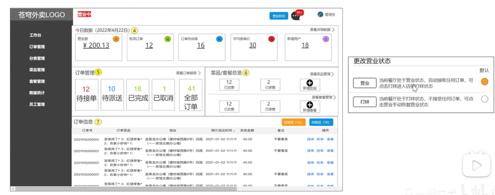
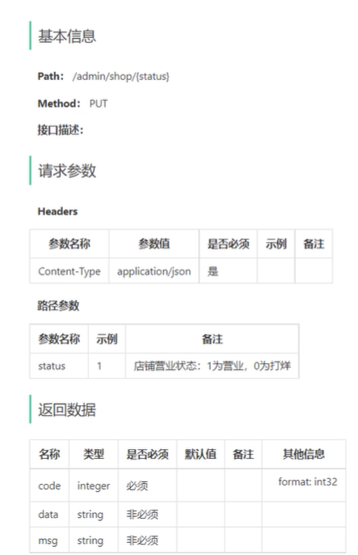
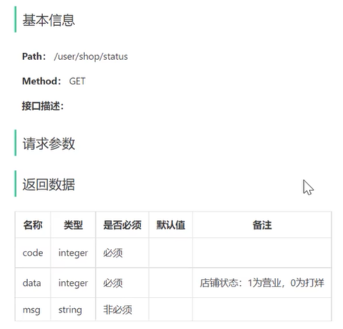

## 营业状态设置3

### 需求分析和设计

#### 产品原型

进到苍穹外卖后台，显示餐厅的营业状态，营业状态分为**营业中**和**打烊中**，若当前餐厅处于营业状态，自动接收任何订单，客户可在小程序进行下单操作；若当前餐厅处于打烊状态，不接受任何订单，客户便无法在小程序进行下单操作。

点击**营业状态**按钮时，弹出更改营业状态: 选择营业，设置餐厅为**营业中**状态; 选择打烊，设置餐厅为**打烊中**状态



#### 接口设计

根据上述原型图设计接口，共包含3个接口。

**接口设计：**

- 设置营业状态
- 管理端查询营业状态
- 用户端查询营业状态

**注：**从技术层面分析，其实管理端和用户端查询营业状态时，可通过一个接口去实现即可。因为营业状态是一致的。但是，本项目约定：

- **管理端**发出的请求，统一使用/admin作为前缀。
- **用户端**发出的请求，统一使用/user作为前缀。

因为访问路径不一致，故分为两个接口实现

##### 设置营业状态 `/admin/shop/{status}`



##### 管理端查询营业状态 `/admin/shop/status`


##### 用户端查询营业状态 `/user/shop/status`



#### 营业状态存储方式

虽然，可以通过一张表来存储营业状态数据，但整个表中只有一个字段，所以意义不大。

营业状态数据存储方式：基于Redis的字符串来进行存储

**约定：** 1表示营业 0表示打烊

#### 代码开发

##### 管理端设置和获取营业状态

在sky-server模块中，创建ShopController.java

```java
@RestController
@RequestMapping("/admin/shop")
@Slf4j
@Api(tags = "状态相关接口")
public class ShopController {

    public static final String KEY = "SHOP_STATUS";

    @Autowired
    private RedisTemplate redisTemplate;

    @PutMapping("/{status}")
    @ApiOperation("设置店铺的营业状态")
    public Result<Void> setStatus(@PathVariable Integer status) {
        log.info("设置店铺状态为：{}", status == 1 ? "营业中" : "打烊中");
        redisTemplate.opsForValue().set(KEY, status);
        return Result.success();
    }

    @GetMapping("/status")
    @ApiOperation("获取店铺的营业状态")
    public Result<Integer> getStatus() {
        Integer status = (Integer) redisTemplate.opsForValue().get(KEY);
        log.info("获取店铺营业状态");
        return Result.success(status);
    }
}
```

##### 用户端获取营业状态

创建com.sky.controller.user包，在该包下创建ShopController.java

```java
@RestController("userShopController")
@RequestMapping("/user/shop")
@Slf4j
@Api(tags = "状态相关接口")
public class ShopController {

    public static final String KEY = "SHOP_STATUS";

    @Autowired
    private RedisTemplate redisTemplate;

    @GetMapping("/status")
    @ApiOperation("获取店铺的营业状态")
    public Result<Integer> getStatus() {
        Integer status = (Integer) redisTemplate.opsForValue().get(KEY);
        log.info("获取店铺营业状态");
        return Result.success(status);
    }
}
```
