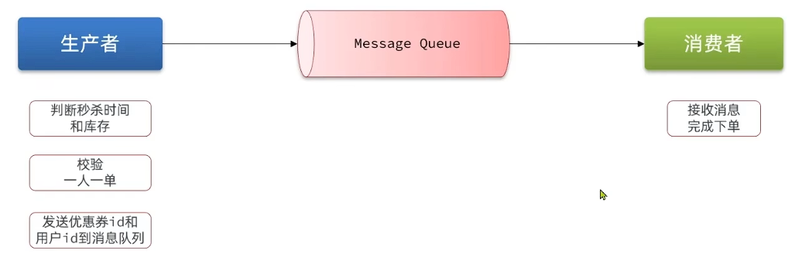
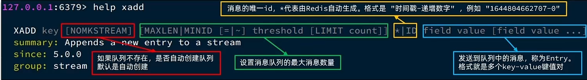
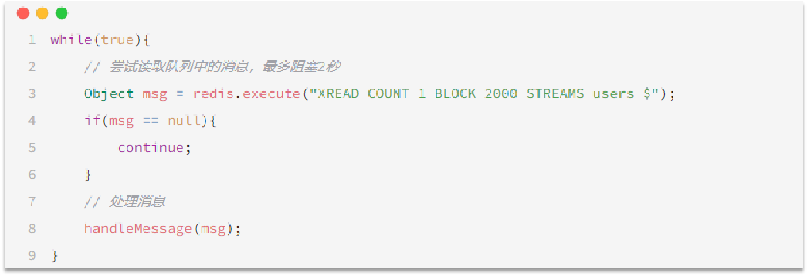
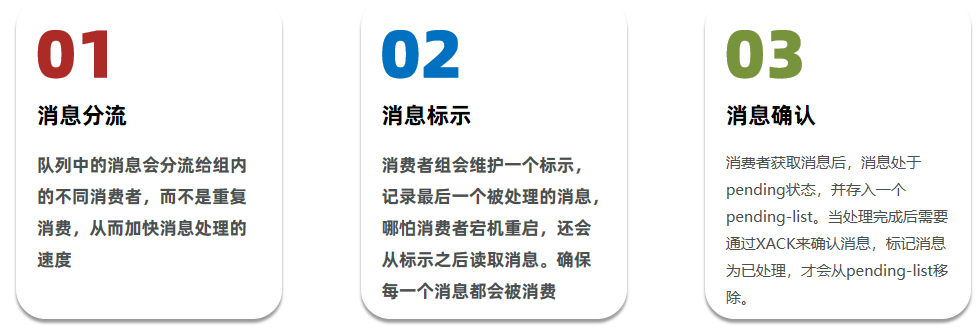
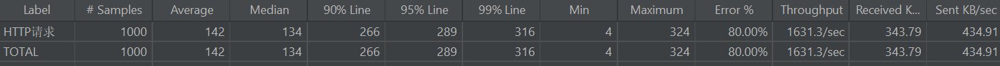

## Redis消息队列

### 消息队列

消息队列：字面意思就是存放消息的队列

最简单的消息队列模型包括3个角色：

- 消息队列：存储和管理消息，也被称为消息代理（Message Broker）
- 生产者：发送消息到消息队列
- 消费者：从消息队列获取消息并处理消息



使用队列的好处在于 **解耦**

所谓解耦，举一个生活中的例子就是：快递员(生产者)把快递放到快递柜里边(Message Queue)去，我们(消费者)从快递柜里边去拿东西，这就是一个异步，如果耦合，那么这个快递员相当于直接把快递交给你，这事固然好，但是万一你不在家，那么快递员就会一直等你，这就浪费了快递员的时间，所以这种思想在我们日常开发中，是非常有必要的。

这种场景在我们秒杀中就变成了：我们下单之后，利用redis去进行校验下单条件，再通过队列把消息发送出去，然后再启动一个线程去消费这个消息，完成解耦，同时也加快我们的响应速度。

与 JVM 阻塞队列对比的好处：

- 消息队列是在JVM以外的独立服务，所以不受JVM内存限制
- 消息队列不仅仅做数据存储，还确保数据安全以及持久化，避免数据丢失
- 当消息投递给消费者时，要求消费者进行确认，如果没有被确认，消息会依然存在在消息队列中，下次会继续投递，直到被确认 (确保消息至少被消费一次)

这里我们可以使用一些现成的mq，比如kafka，rabbitmq等等，但是呢，如果没有安装mq，我们也可以直接使用redis提供的mq方案，降低我们的部署和学习成本

### 基于List实现消息队列

Redis的list数据结构是一个双向链表，很容易模拟出队列效果

队列是入口和出口不在一边，因此我们可以利用：

`LPUSH` 结合 `RPOP`、或者 `RPUSH` 结合 `LPOP` 来实现

不过要注意的是，当队列中没有消息时RPOP或LPOP操作会返回null，并不像JVM的阻塞队列那样会阻塞并等待消息

因此这里应该使用`BRPOP`或者`BLPOP`来实现阻塞效果

即发送消息用 `LPUSH` 接受就用 `BRPOP`


#### 优缺点

优点：

- 利用Redis存储，不受限于JVM内存上限

- 基于Redis的持久化机制，数据安全性有保证

- 可以满足消息有序性

缺点：

- 无法避免消息丢失
  假设从 redis 队列取了一条消息，但并没有处理完成，服务出现异常或挂了，那消息就丢失了

- 只支持单消费者
  发送的消息，只能被一个人拿走，其他消费者拿不了，无法支持一条消息被很多人消费的需求

### 基于PubSub的消息队列

PubSub（发布订阅）是Redis2.0版本引入的消息传递模型。顾名思义，消费者可以订阅一个或多个channel，生产者向对应channel发送消息后，所有订阅者都能收到相关消息

这种 发布订阅模式 天生就是阻塞式的

- `PUBLISH channel msg`: 向一个频道发送消息

- `SUBSCRIBE channel [channel]`: 订阅一个或多个频道

- `PSUBSCRIBE pattern[pattern]`: 订阅与**pattern格式匹配**的所有频道


比如此时 生产者那边来了个消息 `publish order.queue msg1`

那么这边两个消费者 (`order.queue` 以及 `order.*`) 都可以接受到消息 msg1

但如果是 `publish order.q1 msg2` 那只有 `order.*` 这个消费者可以接收到 msg2

#### 优缺点

优点：

- 采用发布订阅模型，支持多生产、多消费

缺点：

- 不支持数据持久化
  list是用来消息存储的，只是我们间接将其作为消息队列，所以可以存数据
  但是 PubSub 这种发布一条消息时，如果这个频道没有被任何人订阅，这个消息就会丢失了，不会在 redis 保存

- 无法避免消息丢失

- 消息堆积有上限，超出时数据丢失
  会在消费者那里有个缓存区，把内容缓存下来，如果来了好多消息，又处理的慢，就会有丢失情况

### 基于Stream的消息队列

Stream 是 Redis 5.0 引入的一种**新数据类型**，可以实现一个功能非常完善的消息队列

- 发送消息的命令 `XADD`

    

    `XADD key [NOMKSTREAM] [MAXLEN|MINID [=|~] threshold [LIMIT count]] *|ID field value [field value ...]`

    前两个参数分别是设置队列不存在时是否自动创建以及队列的最大消息数量，可以不设置

    第三个 `*|ID field value` 表示消息的唯一id，来区分，用 `*` 表示由 redis 进行设置

    之后就是消息本体 由多个 `key value` 组成

    其中一个最简单的命令就是

    `xadd users * name penguin age 21`

- 读取消息的方式之一 `XREAD`
  
  

  `XREAD [COUNT count] [BLOCK milliseconds] STREAMS key [key ...] ID [ID ...]`

  - `[COUNT count]` 表示每次读取消息的最大值，一次可以读一条也可以读多条

  - `[BLOCK milliseconds]` 表示是否阻塞，如果不设置，就不阻塞，没有消息就返回空；如果设置了，就等待，最多等待 milliseconds. 0 表示永久等待

  - `STREAMS key [key ...]` 表示要订阅哪些队列的消息

  - `ID [ID ...]` 获取对应队列的大于该ID的信息  `$` 表示最新的消息开始获取 `0` 表示从第一个开始获取

在业务开发中，我们可以循环的调用XREAD阻塞方式来查询最新消息，从而实现持续监听队列的效果，伪代码如下



注意：当我们指定起始ID为$时，代表读取最新的消息，如果我们**处理一条消息的过程**中，**又有超过1条以上的消息到达队列**，则下次获取时也**只能获取到最新的一条**，会出现漏读消息的问题

STREAM类型消息队列的XREAD命令特点：

- 消息可回溯 (消息读完了不会消失，会永久保存在队列中)

- 一个消息可以被多个消费者读取

- 可以阻塞读取

- 有消息漏读的风险

### 基于Stream的消息队列 - 消费者组

消费者组 相当于是在 消息队列 和 消费者之间的一个中间件，来解决消息漏读和不好管理的问题

消费者组（Consumer Group）：将多个消费者划分到一个组中，监听同一个队列

具备下列特点



#### 相关指令

##### 创建消费者组

通过创建一个消费者组，来监听对应的消息队列，如果队列有内容，会根据 ID 来作为起始消息监听

这样，消费者就不是直接去从消息队列获取，而是与消费者组进行通信获取

```java
XGROUP CREATE key groupName ID [MKSTREAM]
```

- key：对应监听的消息队列名称
- groupName：消费者组名称
- ID：监听的起始ID标示，$代表队列中最后一个消息，0则代表队列中第一个消息
- MKSTREAM：队列不存在时自动创建队列

##### 其它常见命令

**删除指定的消费者组**

```java
XGROUP DESTORY key groupName
```

 **给指定的消费者组添加消费者**

```java
XGROUP CREATECONSUMER key groupname consumername
```

 **删除消费者组中的指定消费者**

```java
XGROUP DELCONSUMER key groupname consumername
```

##### 从指定的消费者组中读取消息

消费者可以从指定的消费者组内获取信息

```java
XREADGROUP GROUP group consumer [COUNT count] [BLOCK milliseconds] [NOACK] STREAMS key [key ...] ID [ID ...]
```

- group：消费组名称
- consumer：消费者名称，如果消费者不存在，会自动创建一个消费者
- count：本次查询的最大数量
- BLOCK milliseconds：当没有消息时最长等待时间
- NOACK：无需手动ACK，获取到消息后自动确认 (一般都是需要的)
- STREAMS key：指定队列名称
- ID：获取消息的起始ID
    ">"：从下一个未消费的消息开始
    其它：根据指定id从pending-list中获取已消费但未确认的消息，例如0，是从pending-list中的第一个消息开始

#### 消费者监听消息的基本思路


#### 对比

(与其他mq中间件相比，redis 容易占用更多的内存，且持久化时更容易丢失数据)

STREAM类型消息队列的XREADGROUP命令特点：

- 消息可回溯 (不同组的消费者可以共享)
- 可以多消费者争抢消息，加快消费速度 (同一组内的消费者争抢关系)
- 可以阻塞读取
- 没有消息漏读的风险
- 有消息确认机制，保证消息至少被消费一次


### 基于Redis的Stream结构作为消息队列，实现异步秒杀下单

需求：

- 创建一个Stream类型的消息队列，名为stream.orders
- 修改之前的秒杀下单Lua脚本，在认定有抢购资格后，直接向stream.orders中添加消息，内容包含voucherId、userId、orderId
- 项目启动时，开启一个线程任务，尝试获取stream.orders中的消息，完成下单

#### 主要步骤

##### 创建 `Stream` 消息队列

```java
XGROUP CREATE stream.orders g1 0 MKSTREAM
```

创建一个消费者组 `g1`，消费队列名为 `stream.orders`，从队列中第0条开始读取

##### 修改 lua 脚本

```lua
-- 1.参数列表
-- 1.1.优惠券id
local voucherId = ARGV[1]
-- 1.2.用户id
local userId = ARGV[2]
-- 1.3.订单id
local orderId = ARGV[3]

-- 2.数据key
-- 2.1.库存key
local stockKey = 'seckill:stock:' .. voucherId
-- 2.2.订单key
local orderKey = 'seckill:order:' .. voucherId

-- 3.脚本业务
-- 3.1.判断库存是否充足 get stockKey
if(tonumber(redis.call('get', stockKey)) <= 0) then
    -- 3.2.库存不足，返回1
    return 1
end
-- 3.2.判断用户是否下单 SISMEMBER orderKey userId
if(redis.call('sismember', orderKey, userId) == 1) then
    -- 3.3.存在，说明是重复下单，返回2
    return 2
end
-- 3.4.扣库存 incrby stockKey -1
redis.call('incrby', stockKey, -1)
-- 3.5.下单（保存用户）sadd orderKey userId
redis.call('sadd', orderKey, userId)
-- 3.6.发送消息到队列中， XADD stream.orders * k1 v1 k2 v2 ...
redis.call('xadd', 'stream.orders', '*', 'userId', userId, 'voucherId', voucherId, 'id', orderId)
return 0
```

##### 修改 `seckillVoucher`

```java
@Override
public Result seckillVoucher(Long voucherId) {
  Long userId = UserHolder.getUser().getId();
  long orderId = redisIdWorker.nextId("order");
  // 执行lua脚本
  // 变成 3 个参数
  // 这样就要先创建订单id
  // lua 脚本执行完 已经将订单信息放入 stream.orders 消息队列中
  Long result = stringRedisTemplate.execute(
          SECKILL_SCRIPT,
          Collections.emptyList(),
          voucherId.toString(), userId.toString(), String.valueOf(orderId));

  int r = result.intValue();
  // 判断结果是否为0
  if (r != 0) {
      // 不为0 ，代表没有购买资格
      return Result.fail(r == 1 ? "库存不足" : "不能重复下单");
  }
  
  // 获取代理对象
  proxy = (IVoucherOrderService) AopContext.currentProxy();

  // 返回订单id
  return Result.ok(orderId);
}
```

接下来，只需要开启一个子线程，来异步从消息队列中通过消费者组进行获取

##### 异步线程获取消息组内信息

```java
@PostConstruct
private void init() {
  SECKILL_ORDER_EXECUTOR.submit(new VoucherOrderHandler());
}


//异步处理线程池
private static final ExecutorService SECKILL_ORDER_EXECUTOR = Executors.newSingleThreadExecutor();

private class VoucherOrderHandler implements Runnable {
  String queueName = "stream.orders";
  @Override
  public void run() {
      while(true){
          // 获取消息队列订单信息
          try {
              // 获取消息队列订单信息
              List<MapRecord<String, Object, Object>> list = stringRedisTemplate.opsForStream().read(
                      Consumer.from("g1", "c1"),
                      StreamReadOptions.empty().count(1).block(Duration.ofSeconds(2)),
                      StreamOffset.create(queueName, ReadOffset.lastConsumed())
              );

              // 判断消息获取是否成功

              // 不存在 没有消息 继续下一次尝试获取
              if(list == null || list.isEmpty())
                  continue;

              // 存在 可以下单
              MapRecord<String, Object, Object> record = list.get(0);
              Map<Object, Object> values = record.getValue();
              VoucherOrder voucherOrder = BeanUtil.fillBeanWithMap(values, new VoucherOrder(), true);
              // 创建订单
              handleVoucherOrder(voucherOrder);

              // ACK确认
              stringRedisTemplate.opsForStream().acknowledge(queueName, "g1", record.getId());
          } catch (Exception e) {
              log.error("订单异常：", e);
              e.printStackTrace();
              //处理异常消息
              handlePendingList();
          }
      }
  }

  private void handlePendingList() {
      while (true) {
          try {
              // 1.获取pending-list中的订单信息 XREADGROUP GROUP g1 c1 COUNT 1 BLOCK 2000 STREAMS s1 0
              List<MapRecord<String, Object, Object>> list = stringRedisTemplate.opsForStream().read(
                      Consumer.from("g1", "c1"),
                      StreamReadOptions.empty().count(1),
                      StreamOffset.create("stream.orders", ReadOffset.from("0"))
              );
              // 2.判断订单信息是否为空
              if (list == null || list.isEmpty()) {
                  // 如果为null，说明没有异常消息，结束循环
                  break;
              }
              // 解析数据
              MapRecord<String, Object, Object> record = list.get(0);
              Map<Object, Object> value = record.getValue();
              VoucherOrder voucherOrder = BeanUtil.fillBeanWithMap(value, new VoucherOrder(), true);
              // 3.创建订单
              createVoucherOrder(voucherOrder);
              // 4.确认消息 XACK
              stringRedisTemplate.opsForStream().acknowledge("s1", "g1", record.getId());
          } catch (Exception e) {
              log.error("处理pendding订单异常", e);
              try{
                  Thread.sleep(20);
              }catch(Exception ec){
                  ec.printStackTrace();
              }
          }
      }
  }
}
```

### 1000个用户下 200 库存压力测试

创建1000个 token 实现压力测试



吞吐量以及最大时延都还行
