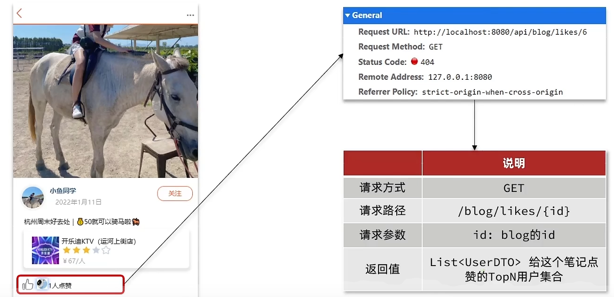

## 达人探店

### 达人探店-发布探店笔记

探店笔记类似点评网站的评价，往往是图文结合

对应的表有两个：

- `tb_blog`：探店笔记表，包含笔记中的标题、文字、图片等

- `tb_blog_comments`：其他用户对探店笔记的评价


#### 产品原型


#### 接口分析

包含了两个接口

- 图片上传接口 `POST /upload/blog`

- 发布笔记接口 `POST /blog`

#### 具体实现

##### 上传接口

```java
@Slf4j
@RestController
@RequestMapping("upload")
public class UploadController {

  @PostMapping("blog")
  public Result uploadImage(@RequestParam("file") MultipartFile image) {
    try {
        // 获取原始文件名称
        String originalFilename = image.getOriginalFilename();
        // 生成新文件名
        String fileName = createNewFileName(originalFilename);
        // 保存文件
        image.transferTo(new File(SystemConstants.IMAGE_UPLOAD_DIR, fileName));
        // 返回结果
        log.debug("文件上传成功，{}", fileName);
        return Result.ok(fileName);
    } catch (IOException e) {
        throw new RuntimeException("文件上传失败", e);
    }
  }

  private String createNewFileName(String originalFilename) {
      // 获取后缀
      String suffix = StrUtil.subAfter(originalFilename, ".", true);
      // 生成目录
      String name = UUID.randomUUID().toString();
      int hash = name.hashCode();
      // 哈希值最低四位(二进制)
      int d1 = hash & 0xF;
      // 哈希值最高四位(二进制)
      int d2 = (hash >> 4) & 0xF;
      // 判断目录是否存在
      File dir = new File(SystemConstants.IMAGE_UPLOAD_DIR, StrUtil.format("/blogs/{}/{}", d1, d2));
      if (!dir.exists()) {
          dir.mkdirs();
      }
      // 生成文件名
      return StrUtil.format("/blogs/{}/{}/{}.{}", d1, d2, name, suffix);
  }
}
```

需要修改 `SystemConstants.IMAGE_UPLOAD_DIR` 自己图片所在的地址，在实际开发中图片一般会放在nginx上或者是云存储上

##### 发布接口

`BlogController`

基于 `mybatis-plus`, 对应的 `Service` 和 `mapper` 都自动生成了

```java
@RestController
@RequestMapping("/blog")
public class BlogController {

    @Resource
    private IBlogService blogService;

    @PostMapping
    public Result saveBlog(@RequestBody Blog blog) {
        //获取登录用户
        UserDTO user = UserHolder.getUser();
        blog.setUpdateTime(user.getId());
        //保存探店博文
        blogService.saveBlog(blog);
        //返回id
        return Result.ok(blog.getId());
    }
}
```

#### 文件上传大小限制

##### 1. nginx配置

`client_max_body_size 100M;`

##### 2. springboot配置

```yaml
spring:
  servlet:
    multipart:
      max-file-size: 10MB
      max-request-size: 10MB
```

### 达人探店-查看探店笔记

#### 产品原型


#### 接口分析

实现 `GET /blog/{id}` 接口

请求参数: blog的id

返回: Blog (笔记信息，包含用户信息)

除了对应笔记信息，还需要包含发布该博客的用户的一些信息

#### 具体实现

视频是在 `Blog` 对象中通过 `@TableField(exist = false)` 来表示不在数据库里的属性值，包括 `icon` `name` 以及 `isLike`

其实也可以设计个 VO，来封装对应的所有属性，然后用 `BeanUtils.copyProperties` 来依次拷贝

##### `Controller`层

在 `BlogController`

```java
@GetMapping("/{id}")
public Result queryBlogById(@PathVariable Long id) {
  return blogService.queryBlogById(id);
}
```

##### `Service`层

接口层：

```java
public interface IBlogService extends IService<Blog> {
    Result queryHotBlog(Integer current);
    Result queryBlogById(Long id);
}
```

实现类：

```java
@Service
public class BlogServiceImpl extends ServiceImpl<BlogMapper, Blog> implements IBlogService {

    @Resource
    private IUserService userService;

    @Override
    public Result queryHotBlog(Integer current) {
        // 根据用户查询
        Page<Blog> page = query()
                .orderByDesc("liked")
                .page(new Page<>(current, SystemConstants.MAX_PAGE_SIZE));
        // 获取当前页数据
        List<Blog> records = page.getRecords();
        // 查询用户
        records.forEach(this::queryBlogUser);
        return Result.ok(records);
    }

    @Override
    public Result queryBlogById(Long id) {
        Blog blog = getById(id);
        if (blog == null) {
            return Result.fail("笔记不存在！");
        }
        // 2.查询blog有关的用户
        queryBlogUser(blog);

        return Result.ok(blog);
    }

    private void queryBlogUser(Blog blog){
        Long userId = blog.getUserId();
        User user = userService.getById(userId);
        blog.setName(user.getNickName());
        blog.setIcon(user.getIcon());
    }
}
```

### 达人探店-点赞功能

初始代码

```java
@GetMapping("/likes/{id}")
public Result queryBlogLikes(@PathVariable("id") Long id) {
    //修改点赞数量
    blogService.update().setSql("liked = liked +1 ").eq("id",id).update();
    return Result.ok();
}
```

问题分析：这种方式会导致一个用户无限点赞，明显是不合理的

造成这个问题的原因是，我们现在的逻辑，发起请求只是给数据库+1，所以才会出现这个问题


#### 需求分析

完善点赞功能

需求：

- 同一个用户只能点赞一次，再次点击则取消点赞
- 如果当前用户已经点赞，则点赞按钮高亮显示（前端已实现，判断字段Blog类的isLike属性）

实现步骤：

- 给Blog类中添加一个isLike字段，标示是否被当前用户点赞
- 修改点赞功能，利用Redis的set集合判断是否点赞过，未点赞过则点赞数+1，已点赞过则点赞数-1
- 修改根据id查询Blog的业务，判断当前登录用户是否点赞过，赋值给isLike字段
- 修改分页查询Blog业务，判断当前登录用户是否点赞过，赋值给isLike字段

#### 具体实现

##### `Controller`层

```java
@PutMapping("/like/{id}")
public Result likeBlog(@PathVariable("id") Long id) {
  return blogService.likeBlog(id);
}
```

##### `Service`层

接口：

```java
public interface IBlogService extends IService<Blog> {
  Result queryHotBlog(Integer current);
  Result queryBlogById(Long id);
  Result likeBlog(Long id);
}
```

实现类：

新增 `likeBlog` 方法

```java
@Override
public Result likeBlog(Long id) {
  // 获取当前用户
  Long userId = UserHolder.getUser().getId();

  // 判断当前用户是否点赞 ismember
  String key = "blog:liked:" + id;
  Boolean isMember = stringRedisTemplate.opsForSet().isMember(key, userId.toString());

  if(Boolean.FALSE.equals(isMember)){
    // 如果未点赞，可以点赞
    // 数据库点赞数 +1
    // update tb_blog set liked = liked + 1 where id = id
    boolean isSuccess = update().setSql("liked = liked + 1").eq("id", id).update();
    // 该用户id保存到 redis 集合 (blog) 笔记id为 key 点赞用户id 为 value
    if(isSuccess){
        stringRedisTemplate.opsForSet().add(key, userId.toString());
    }
  }else{
    // 已点赞
    // 数据库点赞数 -1
    boolean isSuccess = update().setSql("liked = liked - 1").eq("id", id).update();
    // 从redis集合移除
    if(isSuccess){
        stringRedisTemplate.opsForSet().remove(key, userId.toString());
    }
  }

  return null;
}
```

修改查询业务，判断是否点赞

```java
@Override
public Result queryHotBlog(Integer current) {
  // 根据用户查询
  Page<Blog> page = query()
          .orderByDesc("liked")
          .page(new Page<>(current, SystemConstants.MAX_PAGE_SIZE));
  // 获取当前页数据
  List<Blog> records = page.getRecords();
  // 查询用户
  records.forEach(blog -> {
      this.queryBlogUser(blog);
      this.isBlockLiked(blog);
  });
  return Result.ok(records);
}

@Override
public Result queryBlogById(Long id) {
  Blog blog = getById(id);
  if (blog == null) {
      return Result.fail("笔记不存在！");
  }
  // 2.查询blog有关的用户
  queryBlogUser(blog);
  // 查询Blog是否被点赞
  isBlockLiked(blog);
  return Result.ok(blog);
}

private void isBlockLiked(Blog blog) {
  UserDTO user = UserHolder.getUser();
  // 不判断 null 用户未登录时访问首页会报错
  if(user == null) {
      return;
  }
  Long userId = user.getId();
  String key = "blog:liked:" + blog.getId();
  Boolean isMember = stringRedisTemplate.opsForSet().isMember(key, userId.toString());
  blog.setIsLike(Boolean.TRUE.equals(isMember));
}
```

### 达人探店-点赞排行榜

在探店笔记的详情页面，应该把给该笔记点赞的人显示出来，比如最早点赞的TOP5，形成点赞排行榜



之前的点赞是放到set集合，但是set集合是不能排序的，所以这个时候，咱们可以采用一个可以排序的set集合，就是咱们的sortedSet

将 `Zset` 来设计排行榜

主要命令: `zadd, zscore, zrange, zremove`

#### 具体实现

##### 点赞功能修改为 `Zset`

```java
 private void isBlockLiked(Blog blog) {
  UserDTO user = UserHolder.getUser();
  if(user == null) {
      return;
  }
  Long userId = user.getId();
  String key = BLOG_LIKED_KEY + blog.getId();
  // 获取分数 为空表示未点赞
  Double score = stringRedisTemplate.opsForZSet().score(key, userId.toString());
  blog.setIsLike(score != null);
}

@Override
public Result likeBlog(Long id) {

  // 获取当前用户
  Long userId = UserHolder.getUser().getId();

  // 判断当前用户是否点赞 ismember
  String key = BLOG_LIKED_KEY + id;

  // 获取分数 为空表示未点赞
  Double score = stringRedisTemplate.opsForZSet().score(key, userId.toString());

  if(score == null){
      // 如果未点赞，可以点赞
      // 数据库点赞数 +1
      // update tb_blog set liked = liked + 1 where id = id
      boolean isSuccess = update().setSql("liked = liked + 1").eq("id", id).update();
      // 该用户id保存到 redis 集合 (blog) 笔记id为 key 点赞用户id 为 value
      if(isSuccess){
          stringRedisTemplate.opsForZSet().add(key, userId.toString(), System.currentTimeMillis());
      }
  }else{
      // 已点赞
      // 数据库点赞数 -1
      boolean isSuccess = update().setSql("liked = liked - 1").eq("id", id).update();
      // 从redis集合移除
      if(isSuccess){
          stringRedisTemplate.opsForZSet().remove(key, userId.toString());
      }
  }

  return null;
}
```

##### 具体blog的点赞排行查询

`Controller`层

```java
@GetMapping("/likes/{id}")
public Result queryBlogLikes(@PathVariable("id") Long id) {
  return blogService.queryBlogLikes(id);
}
```

`Service`实现层

```java
@Override
public Result queryBlogLikes(Long id) {
  String key = BLOG_LIKED_KEY + id;
  // 1.查询top5的点赞用户 zrange key 0 4
  Set<String> top5 = stringRedisTemplate.opsForZSet().range(key, 0, 4);
  if (top5 == null || top5.isEmpty()) {
      return Result.ok(Collections.emptyList());
  }
  // 2.解析出其中的用户id
  List<Long> ids = top5.stream().map(Long::valueOf).collect(Collectors.toList());
  String idStr = StrUtil.join(",", ids);
  // 3.根据用户id查询用户 WHERE id IN ( 5 , 1 ) ORDER BY FIELD(id, 5, 1)
  List<UserDTO> userDTOS = userService.query()
          .in("id", ids).last("ORDER BY FIELD(id," + idStr + ")").list()
          .stream()
          .map(user -> BeanUtil.copyProperties(user, UserDTO.class))
          .collect(Collectors.toList());
  // 4.返回
  return Result.ok(userDTOS);
}
```
