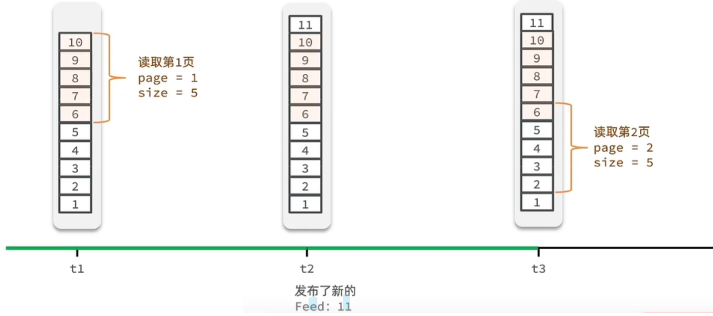
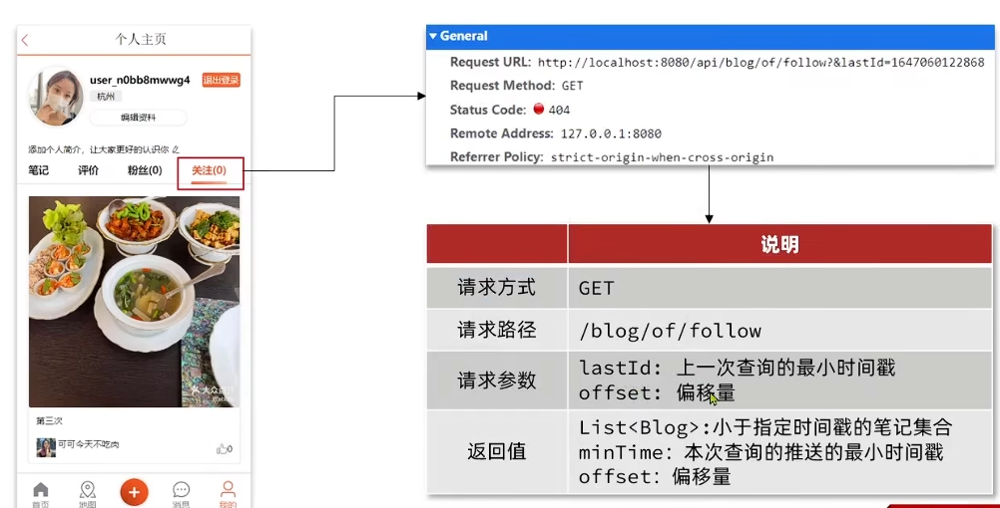

## 好友关注

### 关注和取消关注

针对用户的操作：可以对用户进行关注和取消关注功能


#### 实现思路

需求：基于 `tb_follow` 表数据结构，实现两个接口：

- 关注和取关接口
- 判断是否关注的接口

关注是User之间的关系，是博主与粉丝的关系，数据库中有一张`tb_follow`表来标示


#### 具体实现

##### `Controller`层

对应两个接口实现 `/{id}/{isFollow}` 以及 `/or/not/{id}`

```java
@RestController
@RequestMapping("/follow")
public class FollowController {
  @Resource
  IFollowService followService;

  /**
   * 根据 isFollow 来选择是否关注还是取关
   * @param followUserId
   * @param isFollow
   * @return
   */
  @PutMapping("/{id}/{isFollow}")
  public Result follow(@PathVariable("id") Long followUserId, @PathVariable boolean isFollow) {
      return followService.follow(followUserId, isFollow);
  }

  /**
   * 判断是否关注某用户
   * @param followUserId
   * @return
   */
  @GetMapping("/or/not/{id}")
  public Result isFollow(@PathVariable("id") Long followUserId) {
      return followService.isFollow(followUserId);
  }
}
```

##### `Service`实现

在实现类里，分别实现对应的 `关注/取关用户` 以及 `查询是否关注该用户`

```java
@Service
public class FollowServiceImpl extends ServiceImpl<FollowMapper, Follow> implements IFollowService {
  @Resource
  private FollowMapper followMapper;

  @Override
  public Result follow(Long followUserId, boolean isFollow) {
      // 1.获取登录用户
      Long userId = UserHolder.getUser().getId();

      // 1.判断到底是关注还是取关
      if (isFollow) {
          // 2.关注，新增数据
          Follow follow = new Follow();
          follow.setUserId(userId);
          follow.setFollowUserId(followUserId);
          save(follow);
      } else {
          // 3.取关，删除 delete from tb_follow where user_id = ? and follow_user_id = ?
          remove(new QueryWrapper<Follow>()
                  .eq("user_id", userId).eq("follow_user_id", followUserId));
          // followMapper.deleteByUserIdAndFollowId(userId, followUserId);
      }
      return Result.ok();
  }

  @Override
  public Result isFollow(Long followUserId) {
      // 1.获取登录用户
      Long userId = UserHolder.getUser().getId();
      // 2.查询是否关注 select count(*) from tb_follow where user_id = ? and follow_user_id = ?
      Integer count = query().eq("user_id", userId).eq("follow_user_id", followUserId).count();
      // 3.判断
      return Result.ok(count > 0);
  }
}
```

### 共同关注

感觉实现有点草率 有种强行用到redis，每次关注把对应信息放到redis，然后进行交集比较 暂时跳过

想要去看共同关注的好友，需要首先进入到这个页面，这个页面会发起两个请求

1、去查询用户的详情

2、去查询用户的笔记

以上两个功能和共同关注没有什么关系，大家可以自行将笔记中的代码拷贝到idea中就可以实现这两个功能了，我们的重点在于共同关注功能

```java
// UserController 根据id查询用户
@GetMapping("/{id}")
public Result queryUserById(@PathVariable("id") Long userId){
  // 查询详情
  User user = userService.getById(userId);
  if (user == null) {
      return Result.ok();
  }
  UserDTO userDTO = BeanUtil.copyProperties(user, UserDTO.class);
  // 返回
  return Result.ok(userDTO);
}

@GetMapping("/of/user")
public Result queryBlogByUserId(
  @RequestParam(value = "current", defaultValue = "1") Integer current,
  @RequestParam("id") Long id) {
  // 根据用户查询
  Page<Blog> page = blogService.query()
          .eq("user_id", id).page(new Page<>(current, SystemConstants.MAX_PAGE_SIZE));
  // 获取当前页数据
  List<Blog> records = page.getRecords();
  return Result.ok(records);
}
```

需求：利用Redis中恰当的数据结构，实现共同关注功能。在博主个人页面展示出当前用户与博主的共同关注呢。

当然是使用我们之前学习过的set集合咯，在set集合中，有交集并集补集的api，我们可以把两人的关注的人分别放入到一个set集合中，然后再通过api去查看这两个set集合中的交集数据

我们先来改造当前的关注列表

改造原因是因为我们需要在用户关注了某位用户后，需要将数据放入到set集合中，方便后续进行共同关注，同时当取消关注时，也需要从set集合中进行删除

FollowServiceImpl

```java
@Override
public Result follow(Long followUserId, Boolean isFollow) {
    // 1.获取登录用户
    Long userId = UserHolder.getUser().getId();
    String key = "follows:" + userId;
    // 1.判断到底是关注还是取关
    if (isFollow) {
        // 2.关注，新增数据
        Follow follow = new Follow();
        follow.setUserId(userId);
        follow.setFollowUserId(followUserId);
        boolean isSuccess = save(follow);
        if (isSuccess) {
            // 把关注用户的id，放入redis的set集合 sadd userId followerUserId
            stringRedisTemplate.opsForSet().add(key, followUserId.toString());
        }
    } else {
        // 3.取关，删除 delete from tb_follow where user_id = ? and follow_user_id = ?
        boolean isSuccess = remove(new QueryWrapper<Follow>()
                .eq("user_id", userId).eq("follow_user_id", followUserId));
        if (isSuccess) {
            // 把关注用户的id从Redis集合中移除
            stringRedisTemplate.opsForSet().remove(key, followUserId.toString());
        }
    }
    return Result.ok();
}
```

**具体的关注代码：**

FollowServiceImpl

```java
@Override
public Result followCommons(Long id) {
    // 1.获取当前用户
    Long userId = UserHolder.getUser().getId();
    String key = "follows:" + userId;
    // 2.求交集
    String key2 = "follows:" + id;
    Set<String> intersect = stringRedisTemplate.opsForSet().intersect(key, key2);
    if (intersect == null || intersect.isEmpty()) {
        // 无交集
        return Result.ok(Collections.emptyList());
    }
    // 3.解析id集合
    List<Long> ids = intersect.stream().map(Long::valueOf).collect(Collectors.toList());
    // 4.查询用户
    List<UserDTO> users = userService.listByIds(ids)
            .stream()
            .map(user -> BeanUtil.copyProperties(user, UserDTO.class))
            .collect(Collectors.toList());
    return Result.ok(users);
}
```

### 关注消息推送(Feed流实现方案)

当我们关注了用户后，这个用户发了动态，那么我们应该把这些数据推送给用户，这个需求，其实我们又把他叫做Feed流，关注推送也叫做Feed流，直译为投喂。为用户持续的提供“沉浸式”的体验，通过无限下拉刷新获取新的信息。

对于传统的模式的内容解锁：我们是需要用户去通过搜索引擎或者是其他的方式去解锁想要看的内容

对于新型的Feed流的的效果：不需要我们用户再去推送信息，而是系统分析用户到底想要什么，然后直接把内容推送给用户，从而使用户能够更加的节约时间，不用主动去寻找

#### 主要模式

Feed流产品有两种常见模式：

**Timeline**：不做内容筛选，简单的按照内容发布时间排序，常用于好友或关注。例如朋友圈

- 优点：信息全面，不会有缺失。并且实现也相对简单
- 缺点：信息噪音较多，用户不一定感兴趣，内容获取效率低

**智能排序**：利用智能算法屏蔽掉违规的、用户不感兴趣的内容。推送用户感兴趣信息来吸引用户

- 优点：投喂用户感兴趣信息，用户粘度很高，容易沉迷
- 缺点：如果算法不精准，可能起到反作用
  本例中的个人页面，是基于关注的好友来做Feed流，因此采用Timeline的模式。该模式的实现方案有三种：

#### Timeline模式分类

针对好友的操作，采用的就是Timeline的方式，只需要拿到我们关注用户的信息，然后按照时间排序即可

采用Timeline的模式，该模式的实现方案有三种：

- 拉模式
- 推模式
- 推拉结合

##### 拉模式

也叫做读扩散, 设计发件箱，创建消息只需要存一份

该模式的核心含义就是：当张三和李四和王五发了消息后，都会保存在自己的邮箱中，假设赵六要读取信息，那么他会从读取他自己的收件箱，此时系统会从他关注的人群中，把他关注人的信息全部都进行拉取，然后在进行排序


优点：比较节约空间，因为赵六在读信息时，并没有重复读取，而且读取完之后可以把他的收件箱进行清空

缺点：比较延迟，当用户读取数据时才去关注的人里边去读取数据，假设用户关注了大量的用户，那么此时就会拉取海量的内容，对服务器压力巨大

##### 推模式

也叫做写扩散，没有发件箱，用户发布了新的消息，会拷贝多份直接送到其他关注用户的收件箱里

推模式是没有写邮箱的，当张三写了一个内容，此时会主动的把张三写的内容发送到他的粉丝收件箱中去，假设此时李四再来读取，就不用再去临时拉取了


优点：时效快，不用临时拉取

缺点：内存压力大，假设一个大V写信息，很多人关注他，就会写很多分数据到粉丝那边去

##### 推拉结合模式

也叫做读写混合，兼具推和拉两种模式的优点

推拉模式是一个折中的方案

站在发件人这一段：

- 如果是个普通的人，那么我们采用写扩散的方式，直接把数据写入到他的粉丝中去，因为普通的人他的粉丝关注量比较小，所以这样做没有压力

- 如果是大V，那么他是直接将数据先写入到一份到发件箱里边去，然后再直接写一份到活跃粉丝收件箱里边去

现在站在收件人这端来看：

- 如果是活跃粉丝，那么大V和普通的人发的都会直接写入到自己收件箱里边来
- 而如果是普通的粉丝，由于他们上线不是很频繁，所以等他们上线时，再从发件箱里边去拉信息。


### 推送到粉丝收件箱

这里不考虑推拉结合的情况，采用 推模式

需求：

- 修改新增探店笔记的业务，在保存blog到数据库的同时，推送到粉丝的收件箱
- 收件箱满足可以根据时间戳排序，必须用Redis的数据结构实现
- 查询收件箱数据时，可以实现分页查询

#### 数据变化问题

Feed流中的数据会不断更新，所以数据的角标也在变化，因此不能采用传统的分页模式

传统了分页在feed流是不适用的，因为我们的数据会随时发生变化

假设在 t1 时刻，我们去读取第一页，此时page = 1, size = 5

那么我们拿到的就是 10~6 这几条记录

假设现在 t2 时候又发布了一条记录，此时 t3 时刻, 我们来读取第二页，读取第二页传入的参数是 page = 2, size = 5, 那么此时读取到的第二页实际上是从 6 开始，然后是 6~2

那么我们就读取到了重复的数据，所以feed流的分页，不能采用原始方案来做



因此在 redis 中，不能用 list 来存储，应该用 zset (sorted_set)

#### 1. 用户发送笔记时对应id保存到redis中

这个功能比较简单

只需要修改 `BlogController` 中的 保存blog 接口即可

在 `Service`层 实现类中对应功能 先去查询该用户的粉丝列表，然后遍历将该blog消息依次推送到粉丝的对应的 zset 中

##### `Controller`层

```java
 @PostMapping
public Result saveBlog(@RequestBody Blog blog) {
  return blogService.saveBlog(blog);
}
```

##### `Service`层

```java
@Override
public Result saveBlog(Blog blog) {
  // 获取登录用户
  UserDTO user = UserHolder.getUser();
  blog.setUserId(user.getId());
  // 保存探店博文
  save(blog);

  // 查询该用户的粉丝 select * from tb_follow where follow_user_id =
  List<Follow> follows = followService.query().eq("follow_user_id", user.getId()).list();

  // 将该blog id 推送到对应 粉丝的redis里
  for(Follow follow : follows){
      // 4.1.获取粉丝id
      Long userId = follow.getUserId();
      // 4.2.推送
      String key = FEED_KEY + userId;
      stringRedisTemplate.opsForZSet().add(key, blog.getId().toString(), System.currentTimeMillis());
  }

  // 返回id
  return Result.ok(blog.getId());
}
```

#### 2. 实现关注推送页面的分页查询 (滚动分页)

##### 介绍

当插入新数据时，第二次分页查询会导致角标混乱，需要滚动分页

`ZRANGE  ZREVRANGE ZRANGEBYSCORE`

`ZREVRANGEBYSCORE key max min [WITHSCORES] [LIMIT offset count]`

offest 表示从 max 开始的第几个元素开始查询 (0 从小于等于最大值的第一个元素查)

比如：

第一次查询

```java
// 表示开始查三个
ZREVRANGEBYSCORE z1 1000 0 WITHSCORES LIMIT 0 3
```

找到了3个元素，然后最小的对应value是5，接着新插了一条元素，那么此时滚动查询就是

```java
// 表示找小于等于5的第二个元素
ZREVRANGEBYSCORE z1 5 0 WITHSCORES LIMIT 1 3
```

每次查询都记录上一次的最小值是谁，从而避免重复查询，不用担心前面数据新增的情况

##### 滚动查询实现分析

主要命令:

```java
ZREVRANGEBYSCORE z1 1000 0 WITHSCORES LIMIT 0 3
```

显然需要改变的是 `max offset` 的值

第一次查询时，`offset == 0`

之后，`max = 上一次查询的最小值` 但是对于 `offset`, 不能想当然的设置为1，因为可能存在重复的元素，需要先对上一次查询数据最后进行统计，来设置 `offset` 的值

滚动分页查询参数：

- max: 当前时间戳 | 上一次查询的最小时间戳
- min: 0
- offset: 第一次 0 | 在上一次结果中，与最小值一样的元素个数
- count: 3

##### 接口分析



##### 具体实现

具体操作如下：

1、每次查询完成后，我们要分析出查询出数据的最小时间戳，这个值会作为下一次查询的条件 `lastId`

2、我们需要找到与上一次查询相同的查询个数作为偏移量，下次查询时，跳过这些查询过的数据，拿到我们需要的数据 `offset`

综上：

我们的请求参数中就需要携带 lastId：上一次查询的最小时间戳 和 offset: 偏移量这两个参数

这两个参数第一次会由前端来指定，以后的查询就根据后台结果作为条件，再次传递到后台。

#### 滚动分页实现

##### 1. DTO设计 `ScrollResult`

```java
@Data
public class ScrollResult {
    private List<?> list;
    private Long minTime;
    private Integer offset;
}
```

##### 2. `Controller`层

```java
@GetMapping("/of/follow")
public Result queryBlogOfFollow(
    @RequestParam("lastId") Long max, @RequestParam(value = "offset", defaultValue = "0") Integer offset){
    return blogService.queryBlogOfFollow(max, offset);
}
```

##### 3. `Service`层接口

```java
Result queryBlogOfFollow(Long max, Integer offset);
```

##### 3. `Service`层实现类 `BlogServiceImpl`

主要流程比较清晰，注意 `Set<ZSetOperations.TypedTuple<String>>` 这个类型，反正提供了一个 `getValue` 和 `getScore` 方法，用就是对应的即可了

```java
@Override
public Result queryBlogOfFollow(Long max, Integer offset) {
  // 1.获取当前用户
  Long userId = UserHolder.getUser().getId();

  // 2.查询收件箱 ZREVRANGEBYSCORE key Max Min LIMIT offset count
  String key = FEED_KEY + userId;

  // set里面一条数据 对应一个内容 (value score)
  Set<ZSetOperations.TypedTuple<String>> typedTuples = stringRedisTemplate.opsForZSet()
          .reverseRangeByScoreWithScores(key, 0, max, offset, 2);

  // 3.非空判断
  if (typedTuples == null || typedTuples.isEmpty()) {
      return Result.ok();
  }

  // 4.解析数据：blogId、minTime（时间戳）、offset
  List<Long> ids = new ArrayList<>(typedTuples.size());
  long minTime = 0; // 2
  int os = 1; // 2
  for (ZSetOperations.TypedTuple<String> tuple : typedTuples) {
      // 4.1.获取id
      ids.add(Long.valueOf(tuple.getValue()));
      // 4.2.获取分数(时间戳）
      long time = tuple.getScore().longValue();
      if(time == minTime){
          os++;
      }else{
          minTime = time;
          os = 1;
      }
  }
  os = minTime == max ? os : os + offset;

  // 5.根据id查询blog
  String idStr = StrUtil.join(",", ids);
  List<Blog> blogs = query().in("id", ids).last("ORDER BY FIELD(id," + idStr + ")").list();

  for (Blog blog : blogs) {
      // 5.1.查询blog有关的用户
      queryBlogUser(blog);
      // 5.2.查询blog是否被点赞
      isBlogLiked(blog);
  }

  // 6.封装并返回
  ScrollResult r = new ScrollResult();
  r.setList(blogs);
  r.setOffset(os);
  r.setMinTime(minTime);

  return Result.ok(r);
}
```
