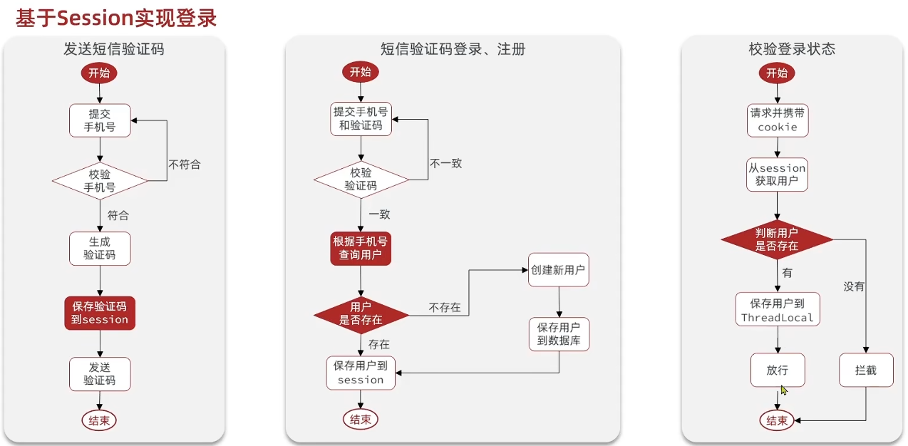

## 1. 短信登录

### 1.1 基于Session实现登录

#### 基本流程



##### 发送验证码

用户在提交手机号后，会校验手机号是否合法，如果不合法，则要求用户重新输入手机号

如果手机号合法，后台此时生成对应的验证码，同时将验证码进行保存，然后再通过短信的方式将验证码发送给用户

##### 短信验证码登录、注册

用户将验证码和手机号进行输入，后台从session中拿到当前验证码，然后和用户输入的验证码进行校验，如果不一致，则无法通过校验，如果一致，则后台根据手机号查询用户，如果用户不存在，则为用户创建账号信息，保存到数据库，无论是否存在，都会将用户信息保存到session中，方便后续获得当前登录信息

##### 校验登录状态

用户在请求时候，会从cookie中携带者JsessionId到后台，后台通过JsessionId从session中拿到用户信息，如果没有session信息，则进行拦截，如果有session信息，则将用户信息保存到threadLocal中，并且放行

#### 1) 实现发送短信验证码


##### 请求格式

- 方式：`Post`
- 路径：`/user/code`
- 请求参数：路径自带 `@RequestParam`

对应的 Controller Service 层代码：

##### `Controller` 层

`UserController`

```java
/**
 * 登录功能
 * @param loginForm 登录参数，包含手机号、验证码；或者手机号、密码
 */
@PostMapping("/login")
public Result login(@RequestBody LoginFormDTO loginForm, HttpSession session){
    // TODO 实现登录功能
    return Result.fail("功能未完成");
}
```

##### `Service`层

接口：

```java
public interface IUserService extends IService<User> {
  Result senCode(String phone, HttpSession session);
}
```

实现类：

```java
@Slf4j
@Service
public class UserServiceImpl extends ServiceImpl<UserMapper, User> implements IUserService {
  @Override
  public Result senCode(String phone, HttpSession session) {
      // 校验手机号
      if(RegexUtils.isPhoneInvalid(phone)){
          // 不符合 返回报错
          return Result.fail("手机号格式错误");
      }

      // 生成验证码
      String code = RandomUtil.randomNumbers(6);

      // 保存验证码到 session
      session.setAttribute("code",code);

      // 发送验证码
      log.debug("验证码：{}", code);

      // 返回
      return Result.ok();
  }
}
```

#### 2) 实现短信验证码登录


##### 请求格式

- 方式：`Post`
- 路径：`/user/login`
- 请求参数：Json格式 `@RequestBody`

##### `Controller`层

`UserController`

```java
@PostMapping("/login")
public Result login(@RequestBody LoginFormDTO loginForm, HttpSession session){
    // 实现登录功能
    return userService.login(loginForm, session);
}
```

##### `Service`层

**接口：**

```java
Result login(LoginFormDTO loginForm, HttpSession session);
```

**实现类：**

```java
@Override
public Result login(LoginFormDTO loginForm, HttpSession session) {
    String phone = loginForm.getPhone();
    // 校验手机号
    if(RegexUtils.isPhoneInvalid(phone)){
        // 不符合 返回报错
        return Result.fail("手机号格式错误");
    }

    // 校验验证码
    Object code = session.getAttribute("code");
    String userCode = loginForm.getCode();
    if(code == null || !code.toString().equals(userCode)){
        // 不一致报错
        return Result.fail("验证码错误");
    }

    // 一致 根据手机号查询用户
    User user = query().eq("phone", phone).one();

    // 不存在 创建新用户
    if(user == null){
        user = new User();
        user.setPhone(phone);
        user.setPassword("123456");
        user.setNickName("Penguin_"+RandomUtil.randomString(6));
        save(user);
    }

    // 保存信息到session
    session.setAttribute("user",user);
    return Result.ok();
}
```

#### 3) 校验登录状态


##### tomcat 运行原理


当用户发起请求时，会访问我们向tomcat注册的端口

任何程序想要运行，都需要有一个线程对当前端口号进行监听，tomcat也不例外

当监听线程知道用户想要和tomcat连接连接时，那会由监听线程创建socket连接，socket都是成对出现的，用户通过socket互相传递数据，当tomcat端的socket接受到数据后，此时监听线程会从tomcat的线程池中取出一个线程执行用户请求，在我们的服务部署到tomcat后，线程会找到用户想要访问的工程，然后用这个线程转发到工程中的controller，service，dao中，并且访问对应的DB，在用户执行完请求后，再统一返回，再找到tomcat端的socket，再将数据写回到用户端的socket，完成请求和响应

每个用户其实对应都是去找tomcat线程池中的一个线程来完成工作的， 使用完成后再进行回收，既然每个请求都是独立的，所以在每个用户去访问我们的工程时，我们可以使用threadlocal来做到线程隔离，每个线程操作自己的一份数据

在threadLocal中，无论是他的put方法和他的get方法， 都是先从获得当前用户的线程，然后从线程中取出线程的成员变量map，只要线程不一样，map就不一样，所以可以通过这种方式来做到线程隔离

##### 添加拦截器

`com.hmdp.interceptor`

```java
public class LoginInterceptor implements HandlerInterceptor {
  @Override
  public boolean preHandle(HttpServletRequest request, HttpServletResponse response, Object handler) throws Exception {
      //1.获取session
      HttpSession session = request.getSession();
      //2.获取session中的用户
      Object user = session.getAttribute("user");
      //3.判断用户是否存在
      if(user == null){
          //4.不存在，拦截，返回401状态码
          response.setStatus(401);
          return false;
      }
      //5.存在，保存用户信息到 Threadlocal
      UserHolder.saveUser((UserDTO) user);
      //6.放行
      return true;
  }
}
```

##### 注册拦截器

```java
@Configuration
public class MvcConfig implements WebMvcConfigurer {
  @Resource
  private StringRedisTemplate stringRedisTemplate;

  @Override
  public void addInterceptors(InterceptorRegistry registry) {
      // 登录拦截器
      registry.addInterceptor(new LoginInterceptor())
              .excludePathPatterns(
                      "/shop/**",
                      "/voucher/**",
                      "/shop-type/**",
                      "/upload/**",
                      "/blog/hot",
                      "/user/code",
                      "/user/login"
              ).order(1);
  }
}
```
