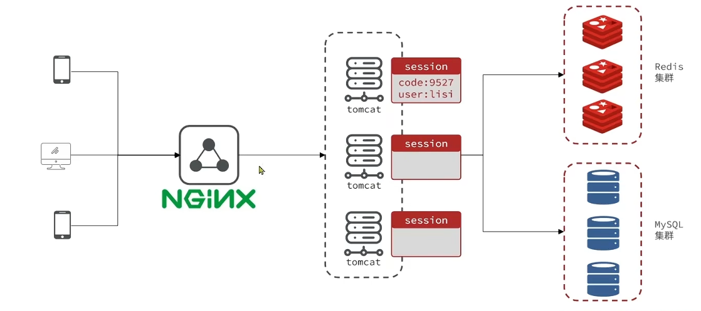
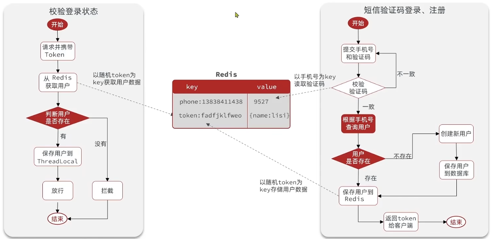
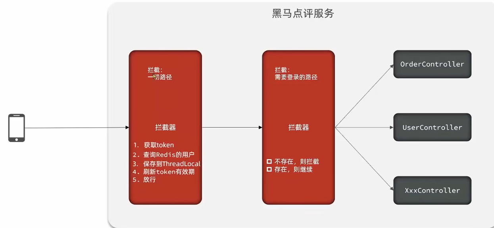

## 1. 短信登录

### 1.2、session共享问题



每个tomcat中都有一份属于自己的session,假设用户第一次访问第一台tomcat，并且把自己的信息存放到第一台服务器的session中，但是第二次这个用户访问到了第二台tomcat，那么在第二台服务器上，肯定没有第一台服务器存放的session，所以此时 整个登录拦截功能就会出现问题

我们能如何解决这个问题呢？

早期的方案是session拷贝，就是说虽然每个tomcat上都有不同的session，但是每当任意一台服务器的session修改时，都会同步给其他的Tomcat服务器的session，这样的话，就可以实现session的共享了

但是这种方案具有两个大问题

1、每台服务器中都有完整的一份session数据，服务器压力过大。

2、session拷贝数据时，可能会出现延迟

所以咱们后来采用的方案都是基于redis来完成，我们把session换成redis，redis数据本身就是共享的，就可以避免session共享的问题了

### 1.3 Redis代替session的业务流程

#### 存储结构

我们可以考虑使用String，或者是使用哈希

可以使用String结构，就是一个简单的key，value键值对的方式，但是关于key的处理，session他是每个用户都有自己的session，但是redis的key是共享的，咱们就不能使用code了

在设计这个key的时候，我们之前讲过需要满足两点

1、key要具有唯一性

2、key要方便携带

如果我们采用phone：手机号这个的数据来存储当然是可以的，但是如果把这样的敏感数据存储到redis中并且从页面中带过来毕竟不太合适，所以我们在后台生成一个随机串token，然后让前端带来这个token就能完成我们的整体逻辑

#### 整体流程



当注册完成后，用户去登录会去校验用户提交的手机号和验证码，是否一致，如果一致，则根据手机号查询用户信息，不存在则新建，最后将用户数据保存到redis，并且生成token作为redis的key

当我们校验用户是否登录时，会去携带着token进行访问，从redis中取出token对应的value，判断是否存在这个数据，如果没有则拦截，如果存在则将其保存到threadLocal中，并且放行。

#### 具体实现

##### 改动1 —— 发送短信验证码

保存时不再是保存到 session 中，而是存入 redis 里，其中 key 为手机号， value 为验证码

只需要改动 `sendCode`

```java
stringRedisTemplate.opsForValue().set(LOGIN_CODE_KEY + phone, code, LOGIN_CODE_TTL, TimeUnit.MINUTES);
```

##### 改动2 —— 短信验证码登录注册

将 session 读取的地方修改:

1. 修改为从 redis 中获取验证码
2. 随机生成 token 作为key，来存储用户信息至 redis
3. 由于是 `StringRedisTemplate` 其需要的是 `<String, String>`，因此对应的 `map` 需要转换

```java
@Override
public Result login(LoginFormDTO loginForm, HttpSession session) {
    String phone = loginForm.getPhone();
    // 校验手机号
    if(RegexUtils.isPhoneInvalid(phone)){
        // 不符合 返回报错
        return Result.fail("手机号格式错误");
    }

    // 校验验证码
    // 从redis中获取验证码
    String code = stringRedisTemplate.opsForValue().get(LOGIN_CODE_KEY + phone);
    String userCode = loginForm.getCode();
    if(code == null || !code.equals(userCode)){
        // 不一致报错
        return Result.fail("验证码错误");
    }

    // 一致 根据手机号查询用户
    User user = query().eq("phone", phone).one();

    // 不存在 创建新用户
    if(user == null){
        user = new User();
        user.setPhone(phone);
        user.setPassword("123456");
        user.setNickName("Penguin_"+RandomUtil.randomString(6));
        save(user);
    }

    // 保存信息到Redis
    // 随机生成 token 作为登录令牌
    String token = UUID.randomUUID().toString(true);

    // 将 User 转为 Hash 保存
    UserDTO userDTO = BeanUtil.copyProperties(user, UserDTO.class);
    Map<String, Object> userMap = BeanUtil.beanToMap(userDTO, new HashMap<>(),
            CopyOptions.create()
                    .setIgnoreNullValue(true)
                    .setFieldValueEditor((filedName, filedValue) -> filedValue.toString()));
    // 存入 redis
    String tokenKey = LOGIN_USER_KEY + token;
    stringRedisTemplate.opsForHash().putAll(tokenKey, userMap);
    // 设置有效期
    stringRedisTemplate.expire(tokenKey, LOGIN_USER_TTL, TimeUnit.MINUTES);

    // 返回 Token
    return Result.ok(token);
}
```

##### 改动3 —— 校验登录状态

拦截器修改, 基于 token 进行校验：

从请求头获取 token -> token作为key去redis查询用户信息 -> 校验，成功存入 `Threadlocal`

```java
@Component
public class LoginInterceptor implements HandlerInterceptor {
  @Autowired
  private StringRedisTemplate stringRedisTemplate;

  @Override
  public boolean preHandle(HttpServletRequest request, HttpServletResponse response, Object handler) throws Exception {
      //1.从请求头获取 token
      String token = request.getHeader("Authorization");
      if(StrUtil.isBlank(token)){
          response.setStatus(401);
          return false;
      }

      String key = RedisConstants.LOGIN_USER_KEY + token;

      //2.基于 token 获取redis 用户
      Map<Object, Object> userMap = stringRedisTemplate.opsForHash().entries(key);

      //3.判断用户是否存在
      if(userMap.isEmpty()){
          //4.不存在，拦截，返回401状态码
          response.setStatus(401);
          return false;
      }

      // 将 Map 转 UserDTO
      UserDTO userDTO = BeanUtil.fillBeanWithMap(userMap, new UserDTO(), false);

      //5.存在，保存用户信息到 Threadlocal
      UserHolder.saveUser(userDTO);

      // 刷新 token 存储时间
      stringRedisTemplate.expire(key, RedisConstants.LOGIN_USER_TTL, TimeUnit.MINUTES);

      //6.放行
      return true;
  }

  @Override
  public void afterCompletion(HttpServletRequest request, HttpServletResponse response, Object handler, Exception ex) throws Exception {
      UserHolder.removeUser();
  }
}
```

#### 拦截器优化


确实可以使用对应路径的拦截，同时刷新登录token令牌的存活时间，但是现在这个拦截器他只是拦截需要被拦截的路径，假设当前用户访问了一些不需要拦截的路径，那么这个拦截器就不会生效，所以此时令牌刷新的动作实际上就不会执行，所以这个方案他是存在问题的



既然之前的拦截器无法对不需要拦截的路径生效，那么我们可以添加一个拦截器，在第一个拦截器中拦截所有的路径，把第二个拦截器做的事情放入到第一个拦截器中，同时刷新令牌，因为第一个拦截器有了threadLocal的数据，所以此时第二个拦截器只需要判断拦截器中的user对象是否存在即可，完成整体刷新功能。

##### 添加 `RefreshTokenInterceptor` 拦截器

拦截所有请求，如果有 `token`，就进行查询并更新，从而刷新校验时间，若没有就放行

```java
@Component
public class RefreshTokenInterceptor implements HandlerInterceptor {

    @Autowired
    private StringRedisTemplate stringRedisTemplate;

    @Override
    public boolean preHandle(HttpServletRequest request, HttpServletResponse response, Object handler) throws Exception {
        //1.从请求头获取 token
        String token = request.getHeader("Authorization");

        if(StrUtil.isBlank(token))
            return true;

        String key = RedisConstants.LOGIN_USER_KEY + token;

        //2.基于 token 获取redis 用户
        Map<Object, Object> userMap = stringRedisTemplate.opsForHash().entries(key);

        //3.判断用户是否存在
        if(userMap.isEmpty())
            return true;

        // 将 Map 转 UserDTO
        UserDTO userDTO = BeanUtil.fillBeanWithMap(userMap, new UserDTO(), false);

        //5.存在，保存用户信息到 Threadlocal
        UserHolder.saveUser(userDTO);

        // 刷新 token 存储时间
        stringRedisTemplate.expire(key, RedisConstants.LOGIN_USER_TTL, TimeUnit.MINUTES);

        //6.放行
        return true;
    }

    @Override
    public void afterCompletion(HttpServletRequest request, HttpServletResponse response, Object handler, Exception ex) throws Exception {
        UserHolder.removeUser();
    }
}
```

相应简化 `LoginInterceptor`

```java
@Component
public class LoginInterceptor implements HandlerInterceptor {
    @Override
    public boolean preHandle(HttpServletRequest request, HttpServletResponse response, Object handler) throws Exception {
        // 判断是否需要拦截
        if(UserHolder.getUser() == null) {
            response.setStatus(401);
            return false;
        }
        //6.放行
        return true;
    }

    @Override
    public void afterCompletion(HttpServletRequest request, HttpServletResponse response, Object handler, Exception ex) throws Exception {
        UserHolder.removeUser();
    }
}
```

##### 注册拦截器

```java
@Configuration
public class MvcConfig implements WebMvcConfigurer {
  @Resource
  private StringRedisTemplate stringRedisTemplate;

  @Resource
  private RefreshTokenInterceptor refreshTokenInterceptor;

  @Resource
  private LoginInterceptor loginInterceptor;

  @Override
  public void addInterceptors(InterceptorRegistry registry) {
      // 登录拦截器
      registry.addInterceptor(loginInterceptor)
              .excludePathPatterns(
                      "/shop/**",
                      "/voucher/**",
                      "/shop-type/**",
                      "/upload/**",
                      "/blog/hot",
                      "/user/code",
                      "/user/login"
              ).order(1);

      // token刷新的拦截器
      registry.addInterceptor(refreshTokenInterceptor).addPathPatterns("/**").order(0);
  }
}
```
