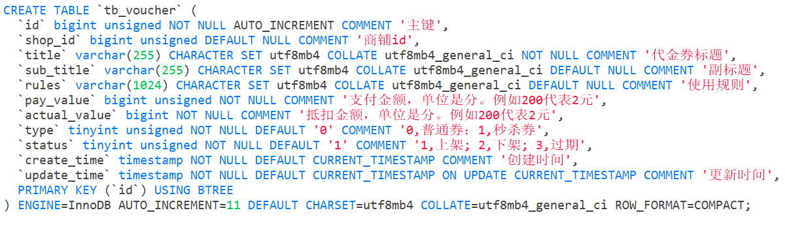
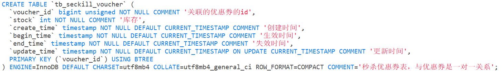
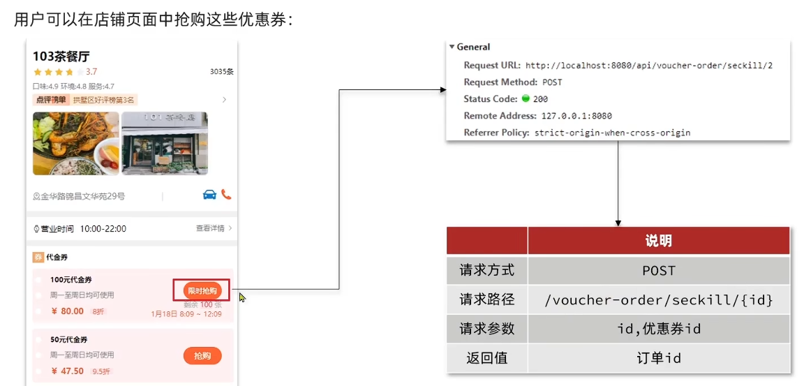
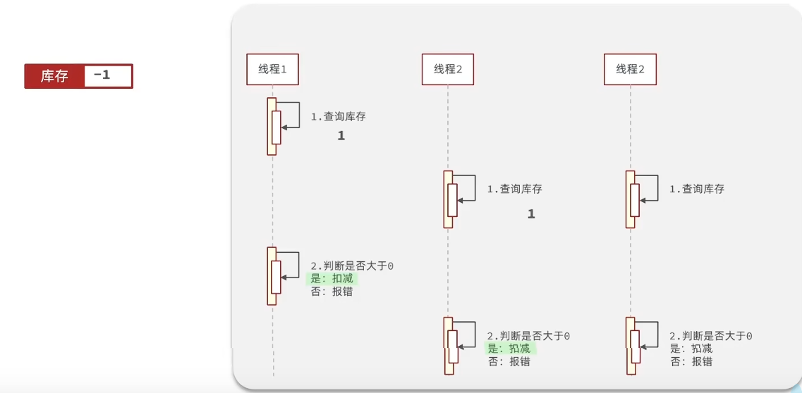
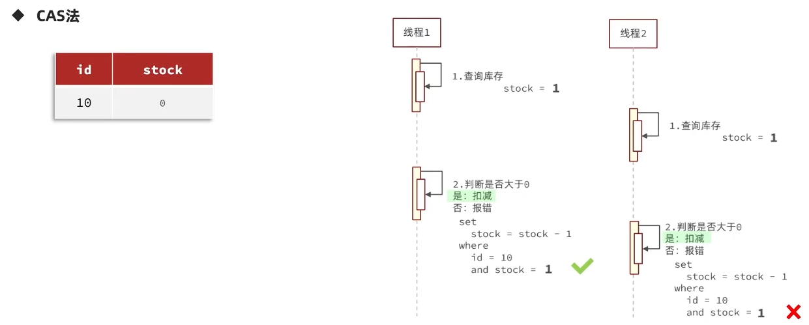
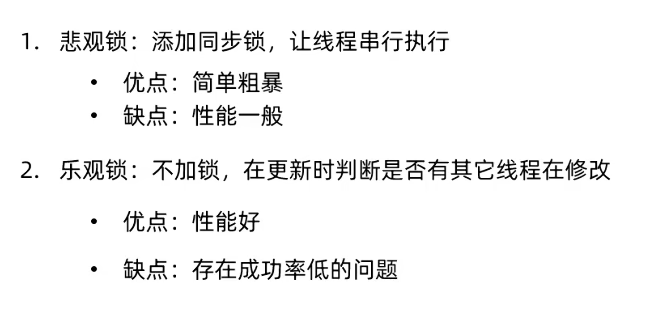

## 优惠卷秒杀

### 全局唯一ID

每个店铺都可以发布优惠券 (也可以理解为商品)，当用户抢购时，就会生成订单并保存到`tb_voucher_order`这张表中，而订单表如果使用数据库自增ID就存在一些问题：

- id的规律性太明显
- 受单表数据量的限制

场景分析：如果我们的id具有太明显的规则，用户或者说商业对手很容易猜测出来我们的一些敏感信息，比如商城在一天时间内，卖出了多少单，这明显不合适。

场景分析二：随着我们商城规模越来越大，mysql的单表的容量不宜超过500W，数据量过大之后，我们要进行拆库拆表，但拆分表了之后，他们从逻辑上讲他们是同一张表，所以他们的id是不能一样的， 于是乎我们需要保证id的唯一性。

#### 全局ID生成器

是一种在分布式系统下用来生成全局唯一ID的工具，一般要满足下列特性:

- 唯一性
- 高性能
- 安全性
- 递增型
- 高可用

为了增加ID的安全性，我们可以不直接使用Redis自增的数值，而是拼接一些其它信息：


ID的组成部分：符号位：1bit，永远为0

时间戳：31bit，以秒为单位，可以使用69年

序列号：32bit，秒内的计数器，支持每秒产生2^32个不同ID

#### 全局唯一ID生成策略

- UUID
- Redis自增
- snowflake算法
- 数据库自增

#### Redis自增实现全局唯一Id

- 每天一个key，方便统计订单量，避免可能的超出范围
- ID构造是 时间戳 + 计数器

```java
@Component
public class RedisIdWorker {
  /**
   * 开始时间戳
   */
  private static final long BEGIN_TIMESTAMP = 1735689600L;

  /**
   * 序列号的位数
   */
  private static final int COUNT_BITS = 32;

  private final StringRedisTemplate stringRedisTemplate;

  public RedisIdWorker(StringRedisTemplate stringRedisTemplate) {
      this.stringRedisTemplate = stringRedisTemplate;
  }

  public long nextId(String keyPrefix) {
      // 1.生成时间戳
      LocalDateTime now = LocalDateTime.now();
      long nowSecond = now.toEpochSecond(ZoneOffset.UTC);
      long timestamp = nowSecond - BEGIN_TIMESTAMP;

      // 2.生成序列号
      // 2.1.获取当前日期，精确到天
      String date = now.format(DateTimeFormatter.ofPattern("yyyy:MM:dd"));
      // 2.2.自增长
      long count = stringRedisTemplate.opsForValue().increment("icr:" + keyPrefix + ":" + date);

      // 3.拼接并返回
      return timestamp << COUNT_BITS | count;
  }

  public static void main(String[] args) {
      LocalDateTime time = LocalDateTime.of(2025, 1,1,0,0,0);
      System.out.println(time.toEpochSecond(ZoneOffset.UTC));
  }
}
```

##### 测试 `CountDownLatch`

> `countdownlatch`名为信号枪：主要的作用是同步协调在多线程的等待于唤醒问题
>
> 我们如果没有 `CountDownLatch`，那么由于程序是异步的，当异步程序没有执行完时，主线程就已经执行完了，然后我们期望的是分线程全部走完之后，主线程再走，所以我们此时需要使用到`CountDownLatch`
>
> `CountDownLatch` 中有两个最重要的方法
>
> 1、countDown
> 2、await
> await 方法 是阻塞方法，我们担心分线程没有执行完时，main线程就先执行，所以使用await可以让main线程阻塞，那么什么时候main线程不再阻塞呢？
> 当CountDownLatch 内部维护的变量变为0时，就不再阻塞，直接放行
> 那么什么时候CountDownLatch维护的变量变为0呢
> 我们只需要调用一次countDown ，内部变量就减少1，我们让分线程和变量绑定， 执行完一个分线程就减少一个变量，当分线程全部走完，`CountDownLatch`维护的变量就是0，此时await就不再阻塞，统计出来的时间也就是所有分线程执行完后的时间。

```java
@Resource
private RedisIdWorker redisIdWorker;
private ExecutorService es = Executors.newFixedThreadPool(500);
@Test
void testIdWorker() throws InterruptedException {
  CountDownLatch latch = new CountDownLatch(300);

  Runnable task = () -> {
      for (int i = 0; i < 100; i++) {
          long id = redisIdWorker.nextId("order");
          System.out.println("id = " + id);
      }
      latch.countDown();
  };
  long begin = System.currentTimeMillis();
  for (int i = 0; i < 300; i++) {
      es.submit(task);
  }
  latch.await();
  long end = System.currentTimeMillis();
  System.out.println("time = " + (end - begin));
}
```

### 1. 添加优惠卷

每个店铺都可以发布优惠券，分为平价券和特价券。平价券可以任意购买，而特价券需要秒杀抢购

#### 数据库设计

##### `tb_voucher`

(包含普通卷+秒杀券) 优惠券的基本信息，优惠金额、使用规则等



##### `tb_seckill_voucher`

(秒杀券) 优惠券的库存、开始抢购时间，结束抢购时间。特价优惠券才需要填写这些信息



平价卷由于优惠力度并不是很大，所以是可以任意领取

而代金券由于优惠力度大，所以像第二种卷，就得限制数量，从表结构上也能看出，特价卷除了具有优惠卷的基本信息以外，还具有库存，抢购时间，结束时间等等字段

### 2. 实现秒杀下单

下单核心思路：当我们点击抢购时，会触发右侧的请求，我们只需要编写对应的controller即可



#### 主要流程

下单时需要判断两点：

- 秒杀是否开始或结束，如果尚未开始或已经结束则无法下单
- 库存是否充足，不足则无法下单

下单核心逻辑分析：

当用户开始进行下单，我们应当去查询优惠卷信息，查询到优惠卷信息，判断是否满足秒杀条件

比如时间是否充足，如果时间充足，则进一步判断库存是否足够，如果两者都满足，则扣减库存，创建订单到对应数据表 `tb_voucher_order`中，然后返回订单id，如果有一个条件不满足则直接结束


#### 订单数据表 `tb_voucher_order`


#### 代码实现

##### `Controller`层

```java
@RestController
@RequestMapping("/voucher-order")
public class VoucherOrderController {
  @Autowired
  private IVoucherOrderService voucherOrderService;

  @PostMapping("seckill/{id}")
  public Result seckillVoucher(@PathVariable("id") Long voucherId) {
      return voucherOrderService.seckillVoucher(voucherId);
  }
}
```

##### `Service`层

接口层 `IVoucherOrderService`：

```java
public interface IVoucherOrderService extends IService<VoucherOrder> {
  Result seckillVoucher(Long voucherId);
}
```

实现类 `VoucherOrderServiceImpl`:

```java
@Service
public class VoucherOrderServiceImpl extends ServiceImpl<VoucherOrderMapper, VoucherOrder> implements IVoucherOrderService {
  @Autowired
  private ISeckillVoucherService seckillVoucherService;

  @Autowired
  private RedisIdWorker redisIdWorker;

  @Override
  @Transactional
  public Result seckillVoucher(Long voucherId) {
      // 查询优惠券
      SeckillVoucher voucher = seckillVoucherService.getById(voucherId);

      // 判断秒杀是否开始和结束
      if (voucher.getBeginTime().isAfter(LocalDateTime.now())) {
          return Result.fail("秒杀尚未开始");
      }

      if (voucher.getEndTime().isBefore(LocalDateTime.now())) {
          return Result.fail("秒杀已经结束");
      }

      // 判断库存是否充足
      if (voucher.getStock() < 1) {
          return Result.fail("库存不足");
      }

      // 扣减库存
      boolean success = seckillVoucherService.update()
              .setSql("stock = stock - 1")
              .eq("voucher_id", voucherId).update();
      // voucher.setStock(voucher.getStock() - 1);
      // seckillVoucherService.updateById(voucher);

      if(!success){
          return Result.fail("库存不足");
      }

      // 创建订单
      VoucherOrder voucherOrder = new VoucherOrder();
      Long orderId = redisIdWorker.nextId("order");
      voucherOrder.setId(orderId);
      Long userId = UserHolder.getUser().getId();
      voucherOrder.setUserId(userId);
      voucherOrder.setVoucherId(voucherId);

      save(voucherOrder);

      // 返回订单id
      return Result.ok(voucherOrder);
  }
}
```

### 3. 库存超卖问题分析

有关超卖问题分析：在我们原有代码中是这么写的

```java
if (voucher.getStock() < 1) {
  // 库存不足
  return Result.fail("库存不足！");
}
//5，扣减库存
boolean success = seckillVoucherService.update()
      .setSql("stock= stock -1")
      .eq("voucher_id", voucherId).update();
if (!success) {
  //扣减库存
  return Result.fail("库存不足！");
}
```

假设线程1过来查询库存，判断出来库存大于1，正准备去扣减库存，但是还没有来得及去扣减

此时线程2过来，线程2也去查询库存，发现这个数量一定也大于1，那么这两个线程都会去扣减库存，最终多个线程相当于一起去扣减库存，此时就会出现库存的超卖问题



超卖问题是典型的多线程安全问题，针对这一问题的常见解决方案就是加锁：

而对于加锁，通常有两种解决方案：


#### 悲观锁

悲观锁可以实现对于数据的串行化执行，比如syn，和lock都是悲观锁的代表，同时，悲观锁中又可以再细分为公平锁，非公平锁，可重入锁，等等

#### 乐观锁

乐观锁不是锁

##### 版本号法

会有一个版本号，每次操作数据会对版本号+1，再提交回数据时，会去校验是否比之前的版本大1, 如果大1，则进行操作成功

这套机制的核心逻辑在于，如果在操作过程中，版本号只比原来大1，那么就意味着操作过程中没有人对他进行过修改，他的操作就是安全的，如果不大1，则数据被修改过

##### CAS - CompareAndSwap

当然乐观锁还有一些变种的处理方式比如cas

乐观锁的典型代表就是cas

```java
int var5;
do {
    var5 = this.getIntVolatile(var1, var2);
} while(!this.compareAndSwapInt(var1, var2, var5, var5 + var4));

return var5;
```

利用cas进行无锁化机制加锁，var5 是操作前读取的内存值，while中的var1+var2 是预估值，如果预估值 == 内存值，则代表中间没有被人修改过，此时就将新值去替换 内存值

其中do while 是为了在操作失败时，再次进行自旋操作，即把之前的逻辑再操作一次

##### 实际做法

课程中的使用方式是没有像cas一样带自旋的操作，也没有对version的版本号+1



直接根据 stock 判断来代替 version，判断前后的 stock 是否被修改即可 (最终版本直接判断 stock > 0 更高效)

#### 解决方案

##### 乐观锁解决

VoucherOrderServiceImpl 在扣减库存时，改为：

```java
boolean success = seckillVoucherService.update()
      .setSql("stock= stock -1")
      //set stock = stock -1
      .eq("voucher_id", voucherId).eq("stock",voucher.getStock()).update();
      //where id = ？ and stock = ?
```

以上逻辑的核心含义是：只要我扣减库存时的库存和之前我查询到的库存是一样的，就意味着没有人在中间修改过库存，那么此时就是安全的

但是以上这种方式通过测试发现会有很多失败的情况，失败的原因在于：在使用乐观锁过程中假设**100个线程同时都拿到了100的库存**，然后大家一起去进行扣减，但是**100个人中只有1个人能扣减成功**，其他的人在处理时，他们在扣减时，库存已经被修改过了，所以此时其他线程**都会失败**


##### 调整乐观锁

成功的概率太低，所以我们的乐观锁需要变一下，改成stock大于0 即可

```java
boolean success = seckillVoucherService.update()
    .setSql("stock= stock -1")
    .eq("voucher_id", voucherId).update().gt("stock",0); 
    //where id = ? and stock > 0
```


#### 总结



也可以采用分批加锁(分段锁)，把相应资源分成几份，比如 100 库存分到10张表，每张10库存，提高成功率

### 4. 一人一单

需求：修改秒杀业务，要求同一个优惠券，一个用户只能下一单

**现在的问题在于**

优惠卷是为了引流，但是目前的情况是，一个人可以无限制的抢这个优惠卷，所以我们应当增加一层逻辑，让一个用户只能下一个单，而不是让一个用户下多个单

具体操作逻辑如下：比如时间是否充足，如果时间充足，则进一步判断库存是否足够，然后再根据优惠卷id和用户id查询是否已经下过这个订单，如果下过这个订单，则不再下单，否则进行下单


#### 初步代码

`VoucherOrderServiceImpl`

```java
@Override
public Result seckillVoucher(Long voucherId) {
    // 1.查询优惠券
    SeckillVoucher voucher = seckillVoucherService.getById(voucherId);
    // 2.判断秒杀是否开始
    if (voucher.getBeginTime().isAfter(LocalDateTime.now())) {
        // 尚未开始
        return Result.fail("秒杀尚未开始！");
    }
    // 3.判断秒杀是否已经结束
    if (voucher.getEndTime().isBefore(LocalDateTime.now())) {
        // 尚未开始
        return Result.fail("秒杀已经结束！");
    }
    // 4.判断库存是否充足
    if (voucher.getStock() < 1) {
        // 库存不足
        return Result.fail("库存不足！");
    }
    // 5.一人一单逻辑
    // 5.1.用户id
    Long userId = UserHolder.getUser().getId();
    int count = query().eq("user_id", userId).eq("voucher_id", voucherId).count();
    // 5.2.判断是否存在
    if (count > 0) {
        // 用户已经购买过了
        return Result.fail("用户已经购买过一次！");
    }

    //6，扣减库存
    boolean success = seckillVoucherService.update()
            .setSql("stock= stock -1")
            .eq("voucher_id", voucherId).update();
    if (!success) {
        //扣减库存
        return Result.fail("库存不足！");
    }
    //7.创建订单
    VoucherOrder voucherOrder = new VoucherOrder();
    // 7.1.订单id
    long orderId = redisIdWorker.nextId("order");
    voucherOrder.setId(orderId);

    voucherOrder.setUserId(userId);
    // 7.3.代金券id
    voucherOrder.setVoucherId(voucherId);
    save(voucherOrder);
    return Result.ok(orderId);
}
```

##### 存在问题

现在的问题还是和之前一样，并发过来，查询数据库，都不存在订单，所以我们还是需要加锁，但是乐观锁比较适合更新数据，而现在是插入数据，所以我们需要使用悲观锁操作

#### 悲观锁 synchronized

首先提取方法后，如果直接方法加锁，意思所有用户都用一把锁，效率慢

所以采用 `userId.toString().intern()` 作为锁来解决

此外由于我们操作需要保证原子性，用到了事务 `@Transitional`，因此如果是在方法内加锁，当锁放开，数据库才会直接事务方法，此时就有可能另一个线程获得锁来进行操作，还是有并发的风险，所以不能在方法内加锁

并且，如果直接

```java
Long userId = UserHolder.getUser().getId();
  synchronized (userId.toString().intern()) {
      return createVoucherOrder(voucherId);
  }
```

是不行的，因为你调用的方法，其实是this.的方式调用的，事务想要生效，还得利用代理来生效，所以这个地方，我们需要获得原始的事务对象来操作事务，这样才能保证事务结束时才释放锁

最终:

```java
@Override
public Result seckillVoucher(Long voucherId) {
    // 查询优惠券
    SeckillVoucher voucher = seckillVoucherService.getById(voucherId);

    // 判断秒杀是否开始和结束
    if (voucher.getBeginTime().isAfter(LocalDateTime.now())) {
        return Result.fail("秒杀尚未开始");
    }

    if (voucher.getEndTime().isBefore(LocalDateTime.now())) {
        return Result.fail("秒杀已经结束");
    }

    // 判断库存是否充足
    if (voucher.getStock() < 1) {
        return Result.fail("库存不足");
    }

    Long userId = UserHolder.getUser().getId();
    synchronized (userId.toString().intern()) {
        IVoucherOrderService proxy = (IVoucherOrderService) AopContext.currentProxy();
        return proxy.createVoucherOrder(voucherId);
    }

}

@Transactional
public Result createVoucherOrder(Long voucherId) {
    // 一人一单
    Long userId = UserHolder.getUser().getId();
    Integer count = query().eq("user_id", userId).eq("voucher_id", voucherId).count();
    if (count > 0) {
        return Result.fail("用户已购买");
    }

    // 扣减库存
    boolean success = seckillVoucherService.update()
            .setSql("stock = stock - 1")
            .eq("voucher_id", voucherId)
            .gt("stock", 0).update();

    if(!success){
        return Result.fail("库存不足");
    }

    // 创建订单
    VoucherOrder voucherOrder = new VoucherOrder();
    Long orderId = redisIdWorker.nextId("order");
    voucherOrder.setId(orderId);
    voucherOrder.setUserId(userId);
    voucherOrder.setVoucherId(voucherId);

    save(voucherOrder);

    // 返回订单id
    return Result.ok(voucherOrder);
}
```


##### 其他设置

在 `pom.xml`

```xml
<dependency>
  <groupId>org.aspectj</groupId>
  <artifactId>aspectjweaver</artifactId>
</dependency>
```

在启动项 `HmDianPingApplication`

```java
@EnableAspectJAutoProxy(exposeProxy=true)
@MapperScan("com.hmdp.mapper")
@SpringBootApplication
public class HmDianPingApplication {
  public static void main(String[] args) {
      SpringApplication.run(HmDianPingApplication.class, args);
  }
}
```
