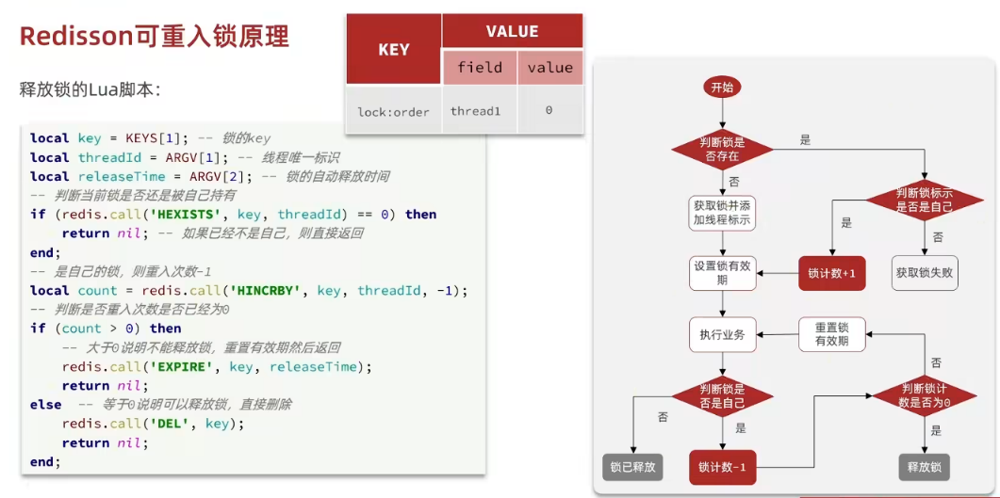
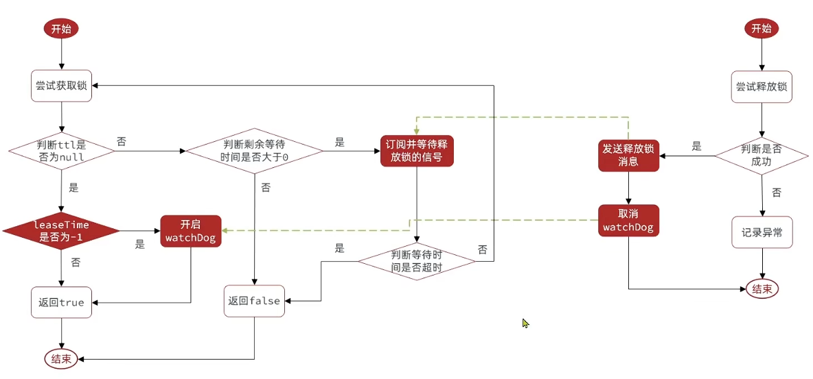
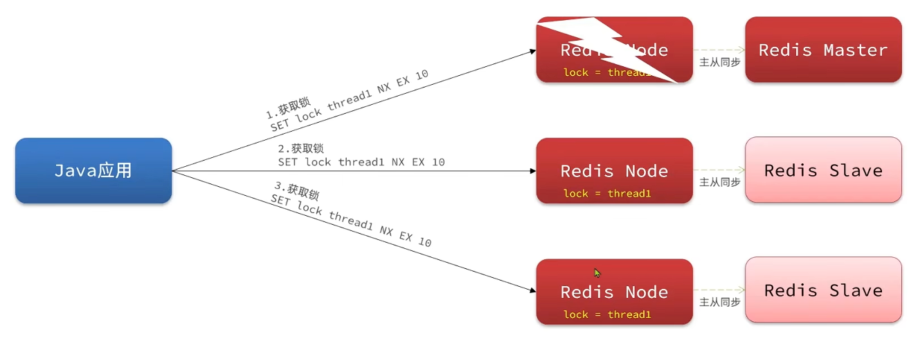

## 分布式锁-redission

### 简单介绍

#### 之前分布式锁问题

基于setnx实现的分布式锁存在下面的问题：

##### 重入问题(不可重入)

重入问题是指获得锁的线程可以再次进入到相同的锁的代码块中

可重入锁的意义在于防止死锁，比如HashTable这样的代码中，他的方法都是使用synchronized修饰的，假如他在一个方法内，调用另一个方法，那么此时如果是不可重入的，不就死锁了吗？

意思假如方法A先获取锁，然后执行中要用到方法B，然后在方法B中也需要获取相同的锁，但此时锁在方法A里，如果**不可重入**，就导致方法B一直等，死锁了就

所以可重入锁他的主要意义是防止死锁，我们的synchronized和Lock锁都是可重入的。

##### 不可重试

是指目前的分布式只能尝试一次(非阻塞式)，失败了直接返回 `false`

合理的情况是：当线程在获得锁失败后，可以再等一等再重试，再次尝试获得锁，可以重试

##### 超时释放

我们在加锁时增加了过期时间，这样的我们可以防止死锁，但是如果卡顿的时间超长，虽然我们采用了lua表达式防止删锁的时候，误删别人的锁，但是毕竟没有锁住，有安全隐患

##### 主从一致性

如果Redis提供了主从集群，当我们向集群写数据时，主机需要异步的将数据同步给从机，而万一在同步过去之前，主机宕机了，此时从节点没有锁的数据，导致其他线程可以获取锁，就会出现死锁问题

#### Redission

Redisson是一个在Redis的基础上实现的Java驻内存数据网格（In-Memory Data Grid）

官网：<https://redisson.org>

GitHub：<https://github.com/redisson/redisson>

它不仅提供了一系列的分布式的Java常用对象，还提供了许多分布式服务，其中就包含了各种分布式锁的实现。

Redission提供了分布式锁的多种多样的功能


### 快速入门

#### 配置

引入依赖：

```xml
<dependency>
    <groupId>org.redisson</groupId>
    <artifactId>redisson</artifactId>
    <version>3.13.6</version>
</dependency>
```

注册`Redisson`客户端配置项：

```java
@Configuration
public class RedissonConfig {
    @Bean
    public RedissonClient redissonClient(){
        // 配置
        Config config = new Config();
        config.useSingleServer().setAddress("redis://192.168.150.101:6379")
            .setPassword("123321");
        // 创建RedissonClient对象
        return Redisson.create(config);
    }
}
```

#### 简单示例

```java
@Resource
private RedissionClient redissonClient;

@Test
void testRedisson() throws Exception{
    //获取锁(可重入)，指定锁的名称
    RLock lock = redissonClient.getLock("anyLock");
    //尝试获取锁，参数分别是：获取锁的最大等待时间(期间会重试)，锁自动释放时间，时间单位
    boolean isLock = lock.tryLock(1,10,TimeUnit.SECONDS);
    //判断获取锁成功
    if(isLock){
        try{
            System.out.println("执行业务");          
        }finally{
            //释放锁
            lock.unlock();
        }
        
    }
}
```

#### 使用

在 `VoucherOrderServiceImpl`注入 `RedissonClient` 来替代我们自己建立的锁

通过 `getLock` 获取锁对象 -> 然后用锁对象来`trylock`尝试获取锁 -> 最后判断

```java
@Resource
private RedissonClient redissonClient;

@Override
public Result seckillVoucher(Long voucherId) {
        // 1.查询优惠券
        SeckillVoucher voucher = seckillVoucherService.getById(voucherId);
        // 2.判断秒杀是否开始
        if (voucher.getBeginTime().isAfter(LocalDateTime.now())) {
            // 尚未开始
            return Result.fail("秒杀尚未开始！");
        }
        // 3.判断秒杀是否已经结束
        if (voucher.getEndTime().isBefore(LocalDateTime.now())) {
            // 尚未开始
            return Result.fail("秒杀已经结束！");
        }
        // 4.判断库存是否充足
        if (voucher.getStock() < 1) {
            // 库存不足
            return Result.fail("库存不足！");
        }
        Long userId = UserHolder.getUser().getId();
        // 创建锁对象 这个代码不用了，因为我们现在要使用分布式锁
        // SimpleRedisLock lock = new SimpleRedisLock("order:" + userId, stringRedisTemplate);
        RLock lock = redissonClient.getLock("lock:order:" + userId);
        // 获取锁对象
        boolean isLock = lock.tryLock();
       
        // 加锁失败
        if (!isLock) {
            return Result.fail("不允许重复下单");
        }
        try {
            // 获取代理对象(事务)
            IVoucherOrderService proxy = (IVoucherOrderService) AopContext.currentProxy();
            return proxy.createVoucherOrder(voucherId);
        } finally {
            //释放锁
            lock.unlock();
        }
 }
```

### 原理分析

#### redission可重入锁原理

在Lock锁中，他是借助于底层的一个voaltile的一个state变量来记录重入的状态的，比如当前没有人持有这把锁，那么state=0，假如有人持有这把锁，那么state=1，如果持有这把锁的人再次持有这把锁，那么state就会+1

如果是对于synchronized而言，他在c语言代码中会有一个count，原理和state类似，也是重入一次就加一，释放一次就-1 ，直到减少成0时，表示当前这把锁没有被人持有。

在redission中，支持可重入锁

在分布式锁中，采用hash结构用来存储锁，其中大key表示表示这把锁是否存在，用小key表示当前这把锁被哪个线程持有，对应的 value 则是该锁被同一个线程获取的次数，类似的，当有人来再次持有这把锁，对应的 value + 1，释放一次就 -1、

##### 测试代码

```java
@SpringBootTest
@Slf4j
public class RedissonTest {

    @Resource
    private RedissonClient redissonClient;
    private RLock lock;

    @BeforeEach
    void setup(){
        lock = redissonClient.getLock("lock");
    }

    @Test
    void method1(){
        boolean isLock = lock.tryLock();
        if(!isLock){
            log.error("获取失败 1");
            return;
        }
        try{
            log.info("获取锁成功 1");
            method2();
            log.info("任务执行 1");
        }finally {
            log.warn("释放锁 1");
            lock.unlock();
        }
    }

    @Test
    void method2(){
        boolean isLock = lock.tryLock();
        if(!isLock){
            log.error("获取失败 2");
            return;
        }
        try{
            log.info("获取锁成功 2");
            log.info("任务执行 2");
        }finally {
            log.warn("释放锁 2");
            lock.unlock();
        }
    }
}

```

当执行第一个 test 时获取锁：


当进入 `method2` 时再次获取锁:


随后先 `method2` 释放锁 -1 然后 `method1` 释放锁 -1 最终真正释放



##### Redission源码分析

###### 获取锁 `lock.trylock()`

对于 `Lock` 的实现类 `RedissonLock`

```java
public boolean tryLock() {
    return (Boolean)this.get(this.tryLockAsync());
}

// 对应的tryLockAsync
public RFuture<Boolean> tryLockAsync() {
    return this.tryLockAsync(Thread.currentThread().getId());
}

public RFuture<Boolean> tryLockAsync(long threadId) {
    return this.tryAcquireOnceAsync(-1L, -1L, (TimeUnit)null, threadId);
}

private RFuture<Boolean> tryAcquireOnceAsync(long waitTime, long leaseTime, TimeUnit unit, long threadId) {
    // 先判断 leaseTime 是否为 -1 (所自动释放的时间)
    if (leaseTime != -1L) {
        return this.<Boolean>tryLockInnerAsync(waitTime, leaseTime, unit, threadId, RedisCommands.EVAL_NULL_BOOLEAN);
    } else {
        // 没有释放时间，设置默认值
        RFuture<Boolean> ttlRemainingFuture = this.<Boolean>tryLockInnerAsync(waitTime, this.commandExecutor.getConnectionManager().getCfg().getLockWatchdogTimeout(), TimeUnit.MILLISECONDS, threadId, RedisCommands.EVAL_NULL_BOOLEAN);

        ttlRemainingFuture.onComplete((ttlRemaining, e) -> {
            if (e == null) {
                if (ttlRemaining) {
                    this.scheduleExpirationRenewal(threadId);
                }

            }
        });
        return ttlRemainingFuture;
    }
}
```

分析对应的 `tryLockInnerAsync` 方法

```java
<T> RFuture<T> tryLockInnerAsync(long waitTime, long leaseTime, TimeUnit unit, long threadId, RedisStrictCommand<T> command) {
    this.internalLockLeaseTime = unit.toMillis(leaseTime);
    return this.<T>evalWriteAsync(this.getName(), LongCodec.INSTANCE, command, 
    "if (redis.call('exists', KEYS[1]) == 0) "+
    "then redis.call('hincrby', KEYS[1], ARGV[2], 1); "+
    "redis.call('pexpire', KEYS[1], ARGV[1]); "+
    "return nil; "+
    "end; "+
    "if (redis.call('hexists', KEYS[1], ARGV[2]) == 1) "+
    "then redis.call('hincrby', KEYS[1], ARGV[2], 1); "+
    "redis.call('pexpire', KEYS[1], ARGV[1]); "+
    "return nil; "+
    "end; "+
    "return redis.call('pttl', KEYS[1]);"
    , Collections.singletonList(this.getName()), this.internalLockLeaseTime, this.getLockName(threadId));
}
```

通过 `lua` 脚本来进行判断

先判断锁是不是存在-> 不存在, 创建锁自增1 + 设置过期时间, 返回 nil | 存在 -> 判断是不是自己的 -> 是 +1 重置过期时间 | 不是 失败

###### 释放锁 `lock.unlock()`

对应在 `RedissonLock`

```java
public void unlock() {
    try {
        this.get(this.unlockAsync(Thread.currentThread().getId()));
    } catch (RedisException e) {
        if (e.getCause() instanceof IllegalMonitorStateException) {
            throw (IllegalMonitorStateException)e.getCause();
        } else {
            throw e;
        }
    }
}

public RFuture<Void> unlockAsync(long threadId) {
    RPromise<Void> result = new RedissonPromise();
    RFuture<Boolean> future = this.unlockInnerAsync(threadId);
    future.onComplete((opStatus, e) -> {
        this.cancelExpirationRenewal(threadId);
        if (e != null) {
            result.tryFailure(e);
        } else if (opStatus == null) {
            IllegalMonitorStateException cause = new IllegalMonitorStateException("attempt to unlock lock, not locked by current thread by node id: " + this.id + " thread-id: " + threadId);
            result.tryFailure(cause);
        } else {
            result.trySuccess((Object)null);
        }
    });
    return result;
}
```

分析对应的 `unlickInnerAsync()`

```java
protected RFuture<Boolean> unlockInnerAsync(long threadId) {
    return this.<Boolean>evalWriteAsync(this.getName(), LongCodec.INSTANCE, RedisCommands.EVAL_BOOLEAN, 
    "if (redis.call('hexists', KEYS[1], ARGV[3]) == 0) "+
    "then return nil; "+
    "end; "+
    "local counter = redis.call('hincrby', KEYS[1], ARGV[3], -1); "+
    "if (counter > 0) "+
    "then redis.call('pexpire', KEYS[1], ARGV[2]); "+
    "return 0; "+
    "else redis.call('del', KEYS[1]); "+
    "redis.call('publish', KEYS[2], ARGV[1]); "+
    "return 1; "+
    "end; "+
    "return nil;", Arrays.asList(this.getName(), this.getChannelName()), LockPubSub.UNLOCK_MESSAGE, this.internalLockLeaseTime, this.getLockName(threadId));
}
```

同样也是利用 `lua` 脚本来判断删除锁的逻辑

先判断锁是不是自己 -> 是自己, 锁次数就减1 -> 判断锁重复次数是否为0 -> 大于0, 重置有效期 | 为0 删除锁，并进行通知

#### redission锁重试和WatchDog机制



##### `trylock`含参数下的锁重试 (waitTime)

`boolean isLock = lock.tryLock(1L, TimeUnit.SECONDS);`

此时设置了等待时间，对应的源码如下:

```java
// 给了 waitTime 所以存在等待时间 可能会锁重试
// leaseTime 为释放时间，-1为默认值 30s
public boolean tryLock(long waitTime, TimeUnit unit) throws InterruptedException {
    return this.tryLock(waitTime, -1L, unit);
}

public boolean tryLock(long waitTime, long leaseTime, TimeUnit unit) throws InterruptedException {
    long time = unit.toMillis(waitTime);
    long current = System.currentTimeMillis();
    long threadId = Thread.currentThread().getId();
    Long ttl = this.tryAcquire(waitTime, leaseTime, unit, threadId);
    ...
}
```

先分析 `this.tryAcquire(waitTime, leaseTime, unit, threadId);`

对应源码：

```java
// 现在版本加了一个 tryAcquireAsync0
// 原来是直接 return get(tryAcquireAsync(waitTime, leaseTime, unit, threadId));
// get 来等待阻塞获取最终的结果
private Long tryAcquire(long waitTime, long leaseTime, TimeUnit unit, long threadId) {
    return (Long)this.get(this.tryAcquireAsync0(waitTime, leaseTime, unit, threadId));
}

private RFuture<Long> tryAcquireAsync0(long waitTime, long leaseTime, TimeUnit unit, long threadId) {
    return this.getServiceManager().execute(() -> this.tryAcquireAsync(waitTime, leaseTime, unit, threadId));
}

private <T> RFuture<Long> tryAcquireAsync(long waitTime, long leaseTime, TimeUnit unit, long threadId) {
    RFuture<Long> ttlRemainingFuture;
    if (leaseTime > 0L) {
        // 如果给了释放时间
        ttlRemainingFuture = this.<Long>tryLockInnerAsync(waitTime, leaseTime, unit, threadId, RedisCommands.EVAL_LONG);
    } else {
        // 设定默认释放时间
        // this.internalLockLeaseTime = this.getServiceManager().getCfg().getLockWatchdogTimeout();
        // 依然是对应的看门狗时间 30000ms
        ttlRemainingFuture = this.<Long>tryLockInnerAsync(waitTime, this.internalLockLeaseTime, TimeUnit.MILLISECONDS, threadId, RedisCommands.EVAL_LONG);
    }
    // tryLockInnerAsync
    // 就是之前分析可重入时 调用 lua 脚本的函数

    // 好像是返回一个包装
    // 之前版本的定义比较简单 返回的是 RFuture<Long> 一个异步 来等待锁释放
    CompletionStage<Long> s = this.handleNoSync(threadId, ttlRemainingFuture);
    ttlRemainingFuture = new CompletableFutureWrapper(s);
    CompletionStage<Long> f = ttlRemainingFuture.thenApply((ttlRemaining) -> {
        if (ttlRemaining == null) {
            if (leaseTime > 0L) {
                this.internalLockLeaseTime = unit.toMillis(leaseTime);
            } else {
                this.scheduleExpirationRenewal(threadId);
            }
        }

        return ttlRemaining;
    });
    return new CompletableFutureWrapper(f);
}

// 如果锁不存在 redis.call('exists', KEYS[1]) == 0
// 或者 锁存在且有属于自己 redis.call('hexists', KEYS[1], ARGV[2]) == 1)
// 就自增1 并且更新 有效期
// 成功就返回 nil 否则返回锁的剩余有效期
<T> RFuture<T> tryLockInnerAsync(long waitTime, long leaseTime, TimeUnit unit, long threadId, RedisStrictCommand<T> command) {
    return this.commandExecutor.syncedEval(this.getRawName(), LongCodec.INSTANCE, command, 
    "if ((redis.call('exists', KEYS[1]) == 0) or (redis.call('hexists', KEYS[1], ARGV[2]) == 1)) then " + 
    "redis.call('hincrby', KEYS[1], ARGV[2], 1); " +
    "redis.call('pexpire', KEYS[1], ARGV[1]); " +
    "return nil; " +
    "end; "+
    "return redis.call('pttl', KEYS[1]);",
     Collections.singletonList(this.getRawName()), new Object[]{unit.toMillis(leaseTime), this.getLockName(threadId)});
}
// debug
// this.getRawName() ->返回的是 "lock"
// this.getLockName(threadId) -> "48820612-407a-4588-b79c-0b068041bd01:3"
```

在获取锁时，成功返回 `null`，失败返回 锁的剩余有效期 最终返回 `RFuture<Long> ttlRemainingFuture`

通过 `get` 来等待阻塞得到锁的剩余有效期后，回到 `tryLock`

```java
public boolean tryLock(long waitTime, long leaseTime, TimeUnit unit) throws InterruptedException {
    // 可以等待的时间
    long time = unit.toMillis(waitTime);
    long current = System.currentTimeMillis();
    long threadId = Thread.currentThread().getId();
    // 得到锁的有效期
    Long ttl = this.tryAcquire(waitTime, leaseTime, unit, threadId);
    if (ttl == null) {
        return true;
    } else {
        // 获取锁失败逻辑

        // 计算前面消耗的时间，然后得到剩余的等待时间
        time -= System.currentTimeMillis() - current;
        if (time <= 0L) {
            // 等待久了 获取锁失败 返回 false
            this.acquireFailed(waitTime, unit, threadId);
            return false;
        } else {
            
            // 继续尝试获取锁
            // 重新获取当前时间
            current = System.currentTimeMillis();

            // subscribe 订阅 来等待别人释放锁的信号
            // 因为在 释放锁中的 lua 脚本 
            // redis.call('publish', KEYS[2], ARGV[1]); 
            // 来通知
            CompletableFuture<RedissonLockEntry> subscribeFuture = this.subscribe(threadId);

            try {
                // 尝试等待
                subscribeFuture.get(time, TimeUnit.MILLISECONDS);
            } catch (TimeoutException var21) {
                // 等待时间超了 就false
                if (!subscribeFuture.completeExceptionally(new RedisTimeoutException("Unable to acquire subscription lock after " + time + "ms. Try to increase 'subscriptionsPerConnection' and/or 'subscriptionConnectionPoolSize' parameters."))) {
                    subscribeFuture.whenComplete((res, ex) -> {
                        if (ex == null) {
                            // 取消订阅
                            this.unsubscribe(res, threadId);
                        }

                    });
                }

                this.acquireFailed(waitTime, unit, threadId);
                return false;
            } catch (ExecutionException var22) {
                // 执行失败？
                this.acquireFailed(waitTime, unit, threadId);
                return false;
            }

            boolean e;
            try {
                // 成功得到通知 锁释放了
                // 计算剩余可以等待时间
                time -= System.currentTimeMillis() - current;
                if (time > 0L) {
                    // 如果还有剩余 可以再次尝试获取锁
                    do {
                        long currentTime = System.currentTimeMillis();
                        // 再次尝试获取
                        ttl = this.tryAcquire(waitTime, leaseTime, unit, threadId);

                        // 成功获取 返回true
                        if (ttl == null) {
                            boolean var32 = true;
                            return var32;
                        }

                        // 失败就在查看是否还有剩余时间
                        time -= System.currentTimeMillis() - currentTime;
                        if (time <= 0L) {
                            this.acquireFailed(waitTime, unit, threadId);
                            boolean var31 = false;
                            return var31;
                        }

                        currentTime = System.currentTimeMillis();
                        // 再试一次
                        // 采用的是信号量？来等待获取
                        if (ttl >= 0L && ttl < time) {
                            // ttl 小于我剩余的等待时间
                            // 表示我有足够的时间可以等到这个锁释放
                            // 所以就等 ttl 时间释放就立即尝试获取
                            ((RedissonLockEntry)this.commandExecutor.getNow(subscribeFuture)).getLatch().tryAcquire(ttl, TimeUnit.MILLISECONDS);
                        } else {
                            // 等time的时间 如果还没释放就没必要等了
                            ((RedissonLockEntry)this.commandExecutor.getNow(subscribeFuture)).getLatch().tryAcquire(time, TimeUnit.MILLISECONDS);
                        }

                        time -= System.currentTimeMillis() - currentTime;
                    } while(time > 0L);

                    // 等待时间没了 返回false
                    this.acquireFailed(waitTime, unit, threadId);
                    boolean var16 = false;
                    return var16;
                }

                // 没剩余 失败 false
                this.acquireFailed(waitTime, unit, threadId);
                e = false;
            } finally {
                // 取消订阅
                this.unsubscribe((RedissonLockEntry)this.commandExecutor.getNow(subscribeFuture), threadId);
            }

            return e;
        }
    }
}
```

##### 锁超时 — watchDog机制

必须确保我的锁是因为业务执行完释放，而不是超时释放，而我的业务还在阻塞没结束

在尝试获取锁的时候，会定义 `RFuture<Long> ttlRemainingFuture`，通过对应的异步完成机制来保证

```java
private <T> RFuture<Long> tryAcquireAsync(long waitTime, long leaseTime, TimeUnit unit, long threadId) {
    RFuture<Long> ttlRemainingFuture;
    if (leaseTime > 0L) {
        ttlRemainingFuture = this.<Long>tryLockInnerAsync(waitTime, leaseTime, unit, threadId, RedisCommands.EVAL_LONG);
    } else {
        ttlRemainingFuture = this.<Long>tryLockInnerAsync(waitTime, this.internalLockLeaseTime, TimeUnit.MILLISECONDS, threadId, RedisCommands.EVAL_LONG);
    }

    CompletionStage<Long> s = this.handleNoSync(threadId, ttlRemainingFuture);
    ttlRemainingFuture = new CompletableFutureWrapper(s);
    CompletionStage<Long> f = ttlRemainingFuture.thenApply((ttlRemaining) -> {
        // 回调成功执行
        // 剩余有效期为null (表示获取到锁了)
        if (ttlRemaining == null) {
            if (leaseTime > 0L) {
                this.internalLockLeaseTime = unit.toMillis(leaseTime);
            } else {
                // 重新定义锁的有效期
                this.scheduleExpirationRenewal(threadId);
            }
        }

        return ttlRemaining;
    });
    return new CompletableFutureWrapper(f);
}
```

具体实现：

```java
public RedissonBaseLock(CommandAsyncExecutor commandExecutor, String name) {
    super(commandExecutor, name);
    this.entryName = this.id + ":" + name;
}

protected String getEntryName() {
    return this.entryName;
}

protected void scheduleExpirationRenewal(long threadId) {
    // new一个新的entry
    // 里面封装了：当前线程id + 对应的定时刷新任务
    ExpirationEntry entry = new ExpirationEntry();
    // EXPIRATION_RENEWAL_MAP 是个ConcurrentMap 就是保证线程安全的map
    // this.getEntryName() 说可以理解为是锁的名称
    // 就是之前可以看到类似 48820612-407a-4588-b79c-0b068041bd01:3 这种

    // 不同的锁都会放在这个map里
    // 如果锁不存在 才放进去 返回为 null
    // 如果已经存在了 就不放 返回旧的 entry
    // 保证不管这个锁更新了几次 都是一个entry
    ExpirationEntry oldEntry = (ExpirationEntry)EXPIRATION_RENEWAL_MAP.putIfAbsent(this.getEntryName(), entry);

    if (oldEntry != null) {
        // 吧这个线程id放到 entry里
        // 因为定时任务有了 就不用存了
        oldEntry.addThreadId(threadId);
    } else {
        // 如果是第一次来 就会更新有效期
        entry.addThreadId(threadId);

        try {
            this.renewExpiration();
        } finally {
            if (Thread.currentThread().isInterrupted()) {
                this.cancelExpirationRenewal(threadId);
            }
        }
    }
}

// 创建一个延时任务 这个任务会在(默认10s)后执行
// 先刷新锁的有效期 然后又重新调用这个方法 来创建延时任务
private void renewExpiration() {
    ExpirationEntry ee = (ExpirationEntry)EXPIRATION_RENEWAL_MAP.get(this.getEntryName());
    if (ee != null) {
        // 定时 延时任务
        // 延时 this.internalLockLeaseTime / 3L (默认10s) 再执行
        Timeout task = this.getServiceManager().newTimeout(new TimerTask() {
            public void run(Timeout timeout) throws Exception {
                // 取出对应 entry
                ExpirationEntry ent = (ExpirationEntry)RedissonBaseLock.EXPIRATION_RENEWAL_MAP.get(RedissonBaseLock.this.getEntryName());
                if (ent != null) {
                    // 获取对应线程id
                    Long threadId = ent.getFirstThreadId();
                    if (threadId != null) {
                        // 刷新有效期
                        CompletionStage<Boolean> future = RedissonBaseLock.this.renewExpirationAsync(threadId);
                        future.whenComplete((res, e) -> {
                            if (e != null) {
                                RedissonBaseLock.log.error("Can't update lock {} expiration", RedissonBaseLock.this.getRawName(), e);
                                RedissonBaseLock.EXPIRATION_RENEWAL_MAP.remove(RedissonBaseLock.this.getEntryName());
                            } else {
                                if (res) {
                                    // 递归 重新调用自己来刷新锁
                                    RedissonBaseLock.this.renewExpiration();
                                } else {
                                    RedissonBaseLock.this.cancelExpirationRenewal((Long)null);
                                }

                            }
                        });
                    }
                }
            }
        }, this.internalLockLeaseTime / 3L, TimeUnit.MILLISECONDS);

        // entry来存定时任务
        ee.setTimeout(task);
    }
}

// 刷新当前线程持有锁有效期
protected CompletionStage<Boolean> renewExpirationAsync(long threadId) {
    return this.<Boolean>evalWriteAsync(this.getRawName(), LongCodec.INSTANCE, RedisCommands.EVAL_BOOLEAN, 
    "if (redis.call('hexists', KEYS[1], ARGV[2]) == 1) "+
    "then redis.call('pexpire', KEYS[1], ARGV[1]); "+
    "return 1; "+
    "end; return 0;", 
    Collections.singletonList(this.getRawName()), 
    this.internalLockLeaseTime, this.getLockName(threadId));
}
```

只有等释放锁的时候，才会停止任务，不刷新有效期

```java
public void unlock() {
    try {
        this.get(this.unlockAsync(Thread.currentThread().getId()));
    } catch (RedisException e) {
        if (e.getCause() instanceof IllegalMonitorStateException) {
            throw (IllegalMonitorStateException)e.getCause();
        } else {
            throw e;
        }
    }
}

public RFuture<Void> unlockAsync(long threadId) {
    return this.getServiceManager().execute(() -> this.unlockAsync0(threadId));
}

private RFuture<Void> unlockAsync0(long threadId) {
    CompletionStage<Boolean> future = this.unlockInnerAsync(threadId);
    CompletionStage<Void> f = future.handle((opStatus, e) -> {
        // 成功时 就会取消更新任务
        this.cancelExpirationRenewal(threadId);
        if (e != null) {
            if (e instanceof CompletionException) {
                throw (CompletionException)e;
            } else {
                throw new CompletionException(e);
            }
        } else if (opStatus == null) {
            IllegalMonitorStateException cause = new IllegalMonitorStateException("attempt to unlock lock, not locked by current thread by node id: " + this.id + " thread-id: " + threadId);
            throw new CompletionException(cause);
        } else {
            return null;
        }
    });
    return new CompletableFutureWrapper(f);
}

// 取消定时任务
protected void cancelExpirationRenewal(Long threadId) {
    // 获取对应定时任务
    ExpirationEntry task = (ExpirationEntry)EXPIRATION_RENEWAL_MAP.get(this.getEntryName());
    if (task != null) {
        if (threadId != null) {
            // 把id清空
            task.removeThreadId(threadId);
        }

        if (threadId == null || task.hasNoThreads()) {
            // 去除对应任务 cancel
            Timeout timeout = task.getTimeout();
            if (timeout != null) {
                timeout.cancel();
            }

            // 再把 entry 也去掉
            EXPIRATION_RENEWAL_MAP.remove(this.getEntryName());
        }

    }
}
```

##### 总结

waitTime 是获取锁失败后可等待时间，触发会进行锁重试

leaseTime 是锁的有效时间，默认为-1，会触发看门狗机制，不断刷新锁的有效期，确保只有在业务结束才释放锁，否则根据对应的时间释放


Redisson分布式锁原理：

- 可重入：利用 hash 结构记录线程id和重入次数，在redis中
- 可重试：利用信号量和PubSub功能实现等待、唤醒，获取锁失败的重试机制
- 超时续约：默认没设 leaseTime时，利用 watchDog，每个一段时间(releaseTime/2)重置超时时间


#### redission锁的MutiLock原理

为了提高redis的可用性，我们会搭建集群或者主从，现在以主从为例

此时我们去写命令，写在主机上， 主机会将数据同步给从机，但是假设在主机还没有来得及把数据写入到从机去的时候，此时主机宕机，哨兵会发现主机宕机，并且选举一个slave变成master，而此时新的master中实际上并没有锁信息，此时锁信息就已经丢掉了


为了解决这个问题，redission提出来了MutiLock锁，使用这把锁咱们就不使用主从了，每个节点的地位都是一样的， 这把锁加锁的逻辑需要写入到每一个主丛节点上，只有所有的服务器都写入成功，此时才是加锁成功，假设现在某个节点挂了，那么他去获得锁的时候，只要有一个节点拿不到，都不能算是加锁成功，就保证了加锁的可靠性



##### `MutiLock`原理

```java
void setUp(){
    Rlock lock1 = redissonClient.getLock("order");
    Rlock lock2 = redissonClient.getLock("order");
    Rlock lock3 = redissonClient.getLock("order");

    lock = redissonClient.getMultiLock(lock1, lock2, lock3)
}
```

当我们去设置了多个锁时，redission会将多个锁添加到一个集合中，然后用while循环去不停去尝试拿锁，但是会有一个总共的加锁时间，这个时间是用需要加锁的个数 * 1500ms

假设有3个锁，那么时间就是4500ms，假设在这4500ms内，所有的锁都加锁成功，那么此时才算是加锁成功，如果在4500ms有线程加锁失败，则会再次去进行重试


### 总结

1. 不可重入Redis分布式锁 (最简单, 自己实现的)
   - 原理：利用`setnx`命令的互斥性；利用`ex`避免死锁；释放锁时判断线程标示，避免误删
   - 缺陷：不可重入、无法重试、锁超时就直接失效

2. 可重入的Redis分布式锁 (Redisson中Lock)
   - 原理：利用hash结构，记录线程标示和重入次数 (可重入)；利用watchDog延续锁时间；利用信号量控制锁重试
   - 缺陷：多redis，主节点失效无法同步时不行

3. Redisson的 multiLock：
   - 原理：多个redis独立节点，必须在所有节点都获取重入锁，才算获取成功
   - 缺陷：运维成本高，实现复杂
