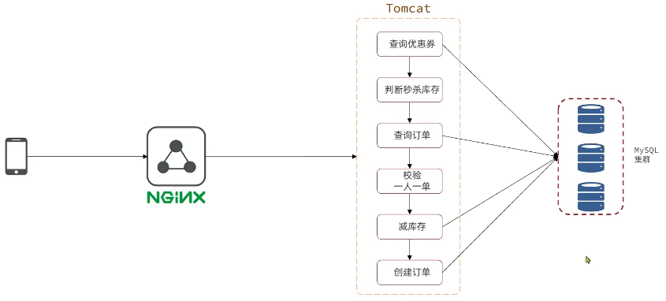

## 秒杀优化

### 秒杀优化思路

原来流程：

当用户发起请求，此时会请求nginx，nginx会访问到tomcat，而tomcat中的程序，会进行串行操作，分成如下几个步骤

1、查询优惠卷

2、判断秒杀库存是否足够

3、查询订单

4、校验是否是一人一单

5、扣减库存

6、创建订单

在这六步操作中，又有很多操作是要去操作数据库的，而且还是一个线程串行执行， 这样就会导致我们的程序执行的很慢，所以我们需要异步程序执行



#### 优化方案


我们将耗时比较短的逻辑判断放入到redis中，比如是否库存足够，比如是否一人一单，这样的操作

只要这种逻辑可以完成，就意味着我们是一定可以下单完成的，我们只需要进行快速的逻辑判断，根本就不用等下单逻辑走完，我们直接给用户返回成功

再在后台开一个线程，后台线程慢慢的去执行queue里边的消息，这样程序不就超级快了吗？

而且也不用担心线程池消耗殆尽的问题，因为这里我们的程序中并没有手动使用任何线程池，当然这里边有两个难点

第一个难点是我们怎么在redis中去快速校验一人一单，还有库存判断 (lua脚本)

第二个难点是由于我们校验和tomct下单是两个线程，那么我们如何知道到底哪个单他最后是否成功，或者是下单完成, 为了完成这件事我们在redis操作完之后，我们会将一些信息返回给前端，同时也会把这些信息丢到异步queue中去，后续操作中，可以通过这个id来查询我们tomcat中的下单逻辑是否完成了 (阻塞队列，元素有订单id)

#### 大致流程


Redis需要保存优惠券的库存信息 + 有关的订单信息

- 库存信息 (String类型) key: 优惠券id  value: 优惠券库存
- 订单信息 (set类型) key: 优惠券id value：买的用户id

判断库存是否充足 -> 否，返回1 | 是 再判断之前是否下过单 -> 是，返回 1 | 否，扣减库存 -> 将用户id存入对应的优惠券set集合 -> 返回 0

通过 lua 脚本确保原子性

后续如果用户具有购买资格，然后再将对应信息存入阻塞队列，通过异步进程进数据库操作

### 秒杀优化具体实现

实现秒杀资格判断 + 基于阻塞队列实现异步下单

需求：

- 新增秒杀优惠券的同时，将优惠券信息保存到Redis中

- 基于Lua脚本，判断秒杀库存、一人一单，决定用户是否抢购成功

- 如果抢购成功，将优惠券id和用户id封装后存入阻塞队列

- 开启线程任务，不断从阻塞队列中获取信息，实现异步下单功能

#### 实现秒杀资格判断

##### 新增时保存信息到Redis

按照需求，首先在添加秒杀优惠券时，除了保存在对应数据表里，还需要将对应的优惠券id和库存保存在redis中

Key: `seckill:stock:{voucher_id}`   Value: 对应库存

对应 `VoucherServiceImpl` 中：

```java
@Override
@Transactional
public void addSeckillVoucher(Voucher voucher) {
    // 保存优惠券
    save(voucher);
    // 保存秒杀信息
    SeckillVoucher seckillVoucher = new SeckillVoucher();
    seckillVoucher.setVoucherId(voucher.getId());
    seckillVoucher.setStock(voucher.getStock());
    seckillVoucher.setBeginTime(voucher.getBeginTime());
    seckillVoucher.setEndTime(voucher.getEndTime());
    seckillVoucherService.save(seckillVoucher);
    // 保存秒杀信息到 Redis 中
    stringRedisTemplate.opsForValue().set(SECKILL_STOCK_KEY + voucher.getId(), String.valueOf(voucher.getStock()));
}
```

##### 编写 lua 脚本 判断秒杀库存、一人一单，决定用户是否抢购成功

为了分离业务，将耗时比较短的逻辑判断放入到redis中，分别判断 库存是否充足 + 用户是否之前下过单 (因为 redis 是单线程，所以可以保证并发性)

对应业务的 `lua`脚本

```lua
-- 1.参数列表
-- 1.1.优惠券id
local voucherId = ARGV[1]
-- 1.2.用户id
local userId = ARGV[2]

-- 2.数据key
-- 2.1.库存key
local stockKey = 'seckill:stock:' .. voucherId
-- 2.2.订单key
local orderKey = 'seckill:order:' .. voucherId

-- 3.脚本业务
-- 3.1.判断库存是否充足 get stockKey
if(tonumber(redis.call('get', stockKey)) <= 0) then
    -- 3.2.库存不足，返回1
    return 1
end
-- 3.2.判断用户是否下单 SISMEMBER orderKey userId
if(redis.call('sismember', orderKey, userId) == 1) then
    -- 3.3.存在，说明是重复下单，返回2
    return 2
end
-- 3.4.扣库存 incrby stockKey -1
redis.call('incrby', stockKey, -1)
-- 3.5.下单（保存用户）sadd orderKey userId
redis.call('sadd', orderKey, userId)
return 0
```

然后，在 `VoucherOrderServiceImpl` 中修改秒杀的业务逻辑，通过 lua 脚本来判断，然后进行决策

```java
private static final DefaultRedisScript<Long> SECKILL_SCRIPT;
static {
    SECKILL_SCRIPT = new DefaultRedisScript<>();
    SECKILL_SCRIPT.setLocation(new ClassPathResource("seckill.lua"));
    SECKILL_SCRIPT.setResultType(Long.class);
}
@Override
public Result seckillVoucher(Long voucherId) {
    Long userId = UserHolder.getUser().getId();
    // 执行lua脚本
    Long result = stringRedisTemplate.execute(
            SECKILL_SCRIPT,
            Collections.emptyList(),
            voucherId.toString(), userId.toString());

    int r = result.intValue();
    // 判断结果是否为0
    if (r != 0) {
        // 不为0 ，代表没有购买资格
        return Result.fail(r == 1 ? "库存不足" : "不能重复下单");
    }
    
    // 0 有购买资格 将信息保存到阻塞队里
    long orderId = redisIdWorker.nextId("order");
    // 订单信息
    VoucherOrder voucherOrder = new VoucherOrder();
    voucherOrder.setId(orderId);
    voucherOrder.setUserId(userId);
    voucherOrder.setVoucherId(voucherId);
    // 放入阻塞队列
    orderTasks.add(voucherOrder);

    // 获取代理对象
    proxy = (IVoucherOrderService) AopContext.currentProxy();

    // 返回订单id
    return Result.ok(orderId);
}
```

#### 基于阻塞队列实现异步下单

现在我们去下单时，是通过lua表达式去原子执行判断逻辑，如果判断我出来不为0 ，则要么是库存不足，要么是重复下单，返回错误信息，如果是0，则把下单的逻辑保存到队列中去，然后异步执行

对于判断了有购买资格的用户，我们会将对应的订单信息保存到阻塞队列中，然后通过一个子线程不断获取队列的订单，来进一步实现下单的逻辑，从而异步下单

在 `VoucherOrderServiceImpl`

##### 创建阻塞队列 `BlockingQueue`

```java
private BlockingQueue<VoucherOrder> orderTasks =new ArrayBlockingQueue<>(1024 * 1024);
```

##### 开启异步线程，初始化时就进行监听阻塞队列

```java
//异步处理线程池
private static final ExecutorService SECKILL_ORDER_EXECUTOR = Executors.newSingleThreadExecutor();

@PostConstruct
private void init() {
    SECKILL_ORDER_EXECUTOR.submit(new VoucherOrderHandler());
}

private class VoucherOrderHandler implements Runnable {
    @Override
    public void run() {
        while(true){
            // 获取队列订单信息
            try {
                VoucherOrder voucherOrder = orderTasks.take();
                // 创建订单
                handleVoucherOrder(voucherOrder);
            } catch (Exception e) {
                log.error("订单异常：", e);
                e.printStackTrace();
            }
        }
    }
}

private void handleVoucherOrder(VoucherOrder voucherOrder) {
    Long userId = voucherOrder.getUserId();
    RLock lock = redissonClient.getLock("lock:order:" + userId.toString());
    //获取锁对象
    boolean isLock = lock.tryLock();
    // boolean isLock = lock.tryLock(10, 60, TimeUnit.SECONDS);
    //加锁失败
    if (!isLock) {
        log.error("不能重复下单!");
        return;
    }
    try {
        // 获取代理对象(事务)
        // IVoucherOrderService proxy = (IVoucherOrderService) AopContext.currentProxy();
        // 拿不到了 因为获取代理对象是通过 threadLocal 来的 但现在是子线程 拿不到父线程的内容
        proxy.createVoucherOrder(voucherOrder);
    } finally {
        //释放锁
        lock.unlock();
    }
}
```

##### 修改对应的 `createVoucherOrder` 逻辑

由于异步下单，子线程不能通过 ThreadLocal 获取用户信息，所以需要修改

```java
@Transactional
public void createVoucherOrder(VoucherOrder voucherOrder) {
  // 一人一单
  Long userId = voucherOrder.getUserId();
  Long voucherId = voucherOrder.getVoucherId();
  Integer count = query().eq("user_id", userId).eq("voucher_id", voucherId.toString()).count();
  if (count > 0) {
      log.error("不能重复订单");
      return;
  }

  // 扣减库存
  // 防止超卖
  boolean success = seckillVoucherService.update()
          .setSql("stock = stock - 1")
          .eq("voucher_id", voucherId.toString())
          .gt("stock", 0).update();

  if(!success){
      log.error("库存不足！");
      return;
  }

  // 创建订单
  save(voucherOrder);
}
```

##### 秒杀业务将订单信息放入阻塞队列中

由于获取代理对象是通过 threadLocal 来的 但现在是异步下单，开启了一个子线程，拿不到父线程的内容，因此只能设一个成员变量，然后初始化

```java
private IVoucherOrderService proxy;
@Override
public Result seckillVoucher(Long voucherId) {
    Long userId = UserHolder.getUser().getId();
    // 执行lua脚本
    Long result = stringRedisTemplate.execute(
            SECKILL_SCRIPT,
            Collections.emptyList(),
            voucherId.toString(), userId.toString());

    int r = result.intValue();
    // 判断结果是否为0
    if (r != 0) {
        // 不为0 ，代表没有购买资格
        return Result.fail(r == 1 ? "库存不足" : "不能重复下单");
    }
    
    // 0 有购买资格 将信息保存到阻塞队里
    long orderId = redisIdWorker.nextId("order");
    // 订单信息
    VoucherOrder voucherOrder = new VoucherOrder();
    voucherOrder.setId(orderId);
    voucherOrder.setUserId(userId);
    voucherOrder.setVoucherId(voucherId);

    // 放入阻塞队列
    orderTasks.add(voucherOrder);

    // 获取代理对象
    proxy = (IVoucherOrderService) AopContext.currentProxy();

    // 返回订单id
    return Result.ok(orderId);
}
```

##### 最终完整代码

```java
@Service
public class VoucherOrderServiceImpl extends ServiceImpl<VoucherOrderMapper, VoucherOrder> implements IVoucherOrderService {
  @Autowired
  private ISeckillVoucherService seckillVoucherService;

  @Autowired
  private RedisIdWorker redisIdWorker;

  @Autowired
  private StringRedisTemplate stringRedisTemplate;

  @Autowired
  private RedissonClient redissonClient;

  private static final DefaultRedisScript<Long> SECKILL_SCRIPT;
  static {
      SECKILL_SCRIPT = new DefaultRedisScript<>();
      SECKILL_SCRIPT.setLocation(new ClassPathResource("seckill.lua"));
      SECKILL_SCRIPT.setResultType(Long.class);
  }

  private BlockingQueue<VoucherOrder> orderTasks =new ArrayBlockingQueue<>(1024 * 1024);
  //异步处理线程池
  private static final ExecutorService SECKILL_ORDER_EXECUTOR = Executors.newSingleThreadExecutor();

  @PostConstruct
  private void init() {
      SECKILL_ORDER_EXECUTOR.submit(new VoucherOrderHandler());
  }

  private class VoucherOrderHandler implements Runnable {

      @Override
      public void run() {
          while(true){
              // 获取队列订单信息
              try {
                  VoucherOrder voucherOrder = orderTasks.take();
                  // 创建订单
                  handleVoucherOrder(voucherOrder);
              } catch (Exception e) {
                  log.error("订单异常：", e);
                  e.printStackTrace();
              }
          }
      }
  }

  private IVoucherOrderService proxy;

  private void handleVoucherOrder(VoucherOrder voucherOrder) {
      Long userId = voucherOrder.getUserId();
      RLock lock = redissonClient.getLock("lock:order:" + userId.toString());
      //获取锁对象
      boolean isLock = lock.tryLock();
      // boolean isLock = lock.tryLock(10, 60, TimeUnit.SECONDS);
      //加锁失败
      if (!isLock) {
          log.error("不能重复下单!");
          return;
      }
      try {
          // 获取代理对象(事务)
          // IVoucherOrderService proxy = (IVoucherOrderService) AopContext.currentProxy();
          // 拿不到了 因为获取代理对象是通过 threadLocal 来的 但现在是子线程 拿不到父线程的内容
          proxy.createVoucherOrder(voucherOrder);
      } finally {
          //释放锁
          lock.unlock();
      }
  }

  @Override
  public Result seckillVoucher(Long voucherId) {
      Long userId = UserHolder.getUser().getId();
      // 执行lua脚本
      Long result = stringRedisTemplate.execute(
              SECKILL_SCRIPT,
              Collections.emptyList(),
              voucherId.toString(), userId.toString());

      int r = result.intValue();
      // 判断结果是否为0
      if (r != 0) {
          // 不为0 ，代表没有购买资格
          return Result.fail(r == 1 ? "库存不足" : "不能重复下单");
      }
      
      // 0 有购买资格 将信息保存到阻塞队里
      long orderId = redisIdWorker.nextId("order");
      // 订单信息
      VoucherOrder voucherOrder = new VoucherOrder();
      voucherOrder.setId(orderId);
      voucherOrder.setUserId(userId);
      voucherOrder.setVoucherId(voucherId);
      // 放入阻塞队列
      orderTasks.add(voucherOrder);

      // 获取代理对象
      proxy = (IVoucherOrderService) AopContext.currentProxy();

      // 返回订单id
      return Result.ok(orderId);
  }

  @Transactional
  public void createVoucherOrder(VoucherOrder voucherOrder) {
      // 一人一单
      Long userId = voucherOrder.getUserId();
      Long voucherId = voucherOrder.getVoucherId();
      Integer count = query().eq("user_id", userId).eq("voucher_id", voucherId.toString()).count();
      if (count > 0) {
          log.error("不能重复订单");
          return;
      }

      // 扣减库存
      // 防止超卖
      boolean success = seckillVoucherService.update()
              .setSql("stock = stock - 1")
              .eq("voucher_id", voucherId.toString())
              .gt("stock", 0).update();

      if(!success){
          log.error("库存不足！");
          return;
      }

      // 创建订单
      save(voucherOrder);
  }
}
```

#### 总结

##### 知识点

`BlockingQueue`

JUC并行 (线程池 `ExecutorService` + `Runnable`)

`@PostConstruct`

不同线程之间的`ThreadLocal`不共享？

`lua`脚本

##### 秒杀业务的优化思路是什么？

- 先利用Redis完成库存余量、一人一单判断，完成抢单业务
- 再将下单业务放入阻塞队列，利用独立线程异步下单

##### 基于阻塞队列的异步秒杀存在哪些问题？

- 内存限制问题
- 数据安全问题
