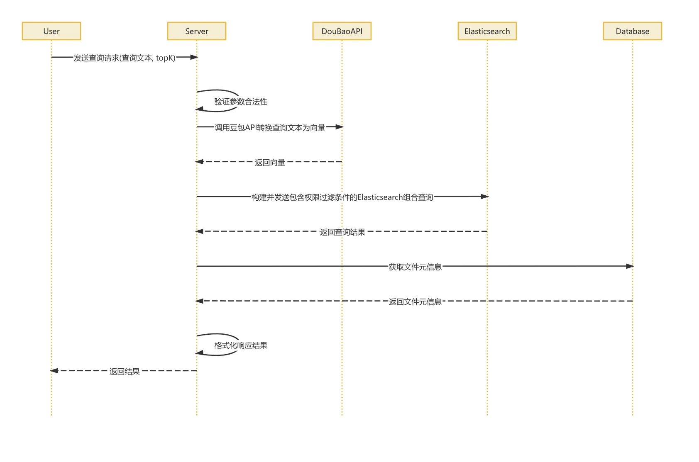
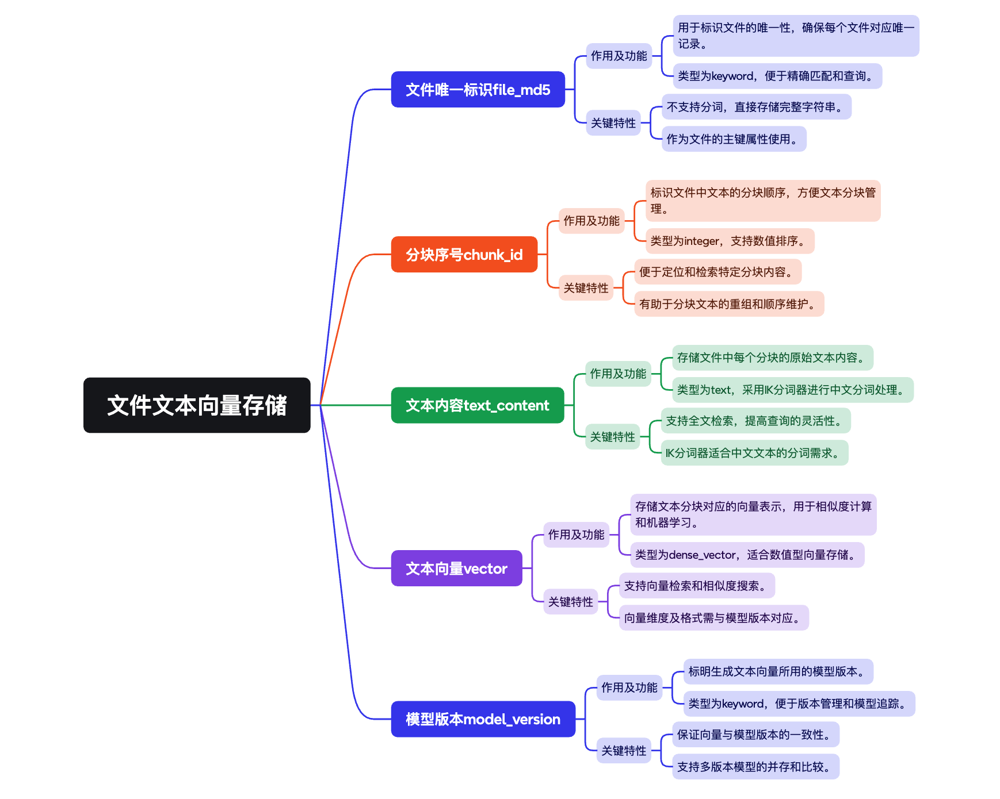
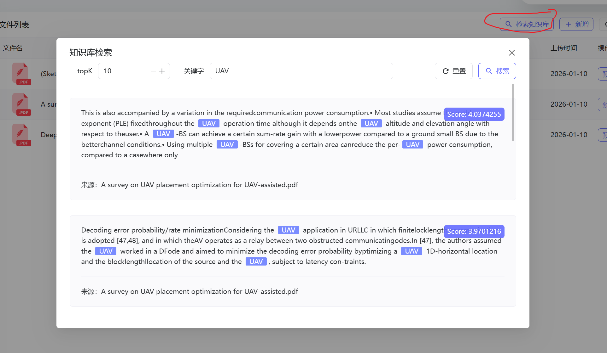

知识库检索模块主要是基于 Elasticsearch 实现的文档混合检索能力，将语义检索和关键词检索结果结合起来，为用户提供更高质量的搜索体验

该模块依赖于文件上传与解析模块完成的向量化处理，直接使用存储在 Elasticsearch 中的向量数据进行检索

通过 阿里千问Embedding模型成文本向量，并将向量存储在 Elasticsearch 中

## 主要模块

### 知识库检索

- 混合检索：结合语义检索和关键词检索结果，按权重排序返回搜索结果
- 支持指定返回结果数量：通过 topK 参数控制结果数量

### 权限控制

在进行知识库检索时，对于具体的用户，要根据其组织标签来控制检索范围

- 基于组织标签的数据权限：确保用户只能访问有权限的文档

- 支持层级权限验证：父标签权限自动包含所有子标签文档的访问权限

- 默认标签全局可访问：DEFAULT 标签资源对所有用户开放

## 整体流程



当用户发起一个查询请求时，系统首先会接收用户输入的查询文本，以及一些附带的检索参数，以及需要返回的结果数量（topK）。在这一步，系统会先对这些参数做一轮合法性校验，确保格式正确、数据合理。

接着，系统会把用户的查询文本交给阿里千问提供的向量化 API，通过这个接口把自然语言的文本转换成可以用于向量检索的向量表示

拿到查询向量后，系统会执行一套混合检索流程，也就是结合语义匹配和关键词匹配

在这一步，系统会构建一个 Elasticsearch 的查询语句，这个查询不仅包含了向量相似度的计算，还会结合全文搜索的匹配结果。同时，我们还会在查询中加入权限相关的过滤条件，确保用户只能看到自己“有权访问”的内容

权限规则主要有：

```markdown
1. 用户可以访问自己上传的文档；  
2. 用户可以访问被标记为公开的文档；  
3. 如果某些文档被打上了特定的权限标签（比如部门或层级权限），只要用户拥有这些标签，也可以访问这些文档。
```

带着这些权限条件，系统将完整的查询请求发送给 Elasticsearch，并基于设定好的策略对搜索结果进行打分，综合评估文本的相关性与权限匹配度。

最后，我们会根据 topK 参数，挑选出排名靠前的若干个文档，并从数据库中进一步获取这些文档的元数据信息，比如标题、作者、上传时间等。系统会对这些内容进行格式化处理，打包成清晰完整的响应结果，并最终返回给用户

## Elasticsearch的索引结构

将对应的文本块内容会存到 ES 的 `knowledge_base` 索引中，每个 Document 为一条记录，分别存了该文本块对应的文件MD5标识，分块序号id，原始的文本内容 (会被 `ik_max_word` 进行语义切割，从而实现倒排查询)，文本向量 (会基于此计算相似性查询)，以及Embedding模型版本



```json
{
  "mappings": {
    "properties": {
      "fileMd5": {
        "type": "keyword"
      },
      "chunkId": {
        "type": "integer"
      },
      "textContent": {
        "type": "text",
        "analyzer": "ik_max_word",
        "search_analyzer": "ik_smart"
      },
      "vector": {
        "type": "dense_vector",
        "dims": 2048,
        "index": true,
        "similarity": "cosine"
      },
      "modelVersion": {
        "type": "keyword"
      },
      "userId": {
        "type": "keyword"
      },
      "orgTag": {
        "type": "keyword"
      },
      "isPublic": {
        "type": "boolean"
      }
    }
  }
}
```

## 主要API

### 混合搜索接口

- URL: `/api/search/hybrid`
- Method: GET
- Parameters:
  - query: 搜索查询字符串（必需）
  - topK: 返回结果数量（可选，默认10）

示例: `/api/search/hybrid?query=Penguin&topK=10`

Response:

```json
[
  {
    "file_md5": "abc123...",
    "chunk_id": 1,
    "text_content": "Penguin!!",
    "score": 0.92,
    "file_name": "paismart.pdf"
  },
  // ...更多结果
]
```

### 文档删除接口

## 前端流程



主要是在 知识库 中可以点击 检索知识库 按钮，然后就会根据输入的关键字和topK数量的参数进行查询

最终可以得到返回结果

## 混合查询

主要实现的是混合搜索，大致思路是通过向量检索和倒排索引（关键词）检索，并施加了严格的权限控制

实际执行过程更像是一个 “并行执行 -> 合并 -> 最终重排” 的过程

可以想象成有两个小组在同时工作，最后交给经理审核：

- 小组 A（向量组）：负责 KNN 搜索。

- 小组 B（关键词组）：负责 倒排索引（关键词）搜索 + 权限过滤。

- 经理（Rescore）：对前两组提交的初选名单进行最终精选

### 原理

ES 会根据所给的查询语句，判断是否执行混合查询

当你把 knn 和 query 同时放进同一个 Search Request（s）里时，这本身就是一条指令。这条指令翻译成 Elasticsearch 能听懂的 DSL (JSON) 就像这样：

```json
{
  "knn": { ... },     // 指令 A：向量检索
  "query": { ... },   // 指令 B：关键词检索
  "rescore": { ... }  // 指令 C：重排序
}
```

Elasticsearch 服务端收到这个 JSON 后，它的底层逻辑是：

> 用户同时传了 knn 和 query，我必须执行 混合检索 (Hybrid Search) 模式。也就是：分别执行这两个搜索，然后把结果取并集 (OR 关系)。

所以，代码里“同时设置了这两个属性”这个动作，就是合并的指令

#### 内部合并操作

对于每一个文档，它的初步得分（在 Rescore 之前）通常是两个分数的加权和：

$$
Score_{final}=Score_{KNN}+Score_{Query}
$$

- 情况 A（双重命中）：如果不锈钢杯子既在 KNN 前 300 名里，又包含了关键词“不锈钢”
  - 它的分数 = 向量相似度分 + BM25关键词分
  - 结果：分数很高，排在最前面

- 情况 B（单侧命中）：如果某个文档只在 KNN 里找到了（语义相关但不含关键词）
  - 它的分数 = 向量相似度分 + 0
  - 结果：也能入围，但分数可能稍低

- 情况 C（单侧命中）：如果某个文档只包含关键词（但向量距离很远，没进 KNN 前 300）
  - 它的分数 = 0 + BM25关键词分
  - 结果：也能入围

如果都没有命中，才不会入围

| **特性** | **Query Context (查询上下文)** | **Filter Context (过滤上下文)** |
| --- | --- | --- |
| **关注点** | **“这个文档匹配得有多好？”** | **“这个文档匹配吗？”** (Yes / No) |
| **关键字** | `must`, `should` | `filter`, `must_not` |
| **是否打分** | **是** (计算 `_score`) | **否** (不计算分数，`_score` 通常为 0 或恒定值) |
| **性能** | 较慢 (需要计算 BM25/向量相似度) | **快** (位运算，结果会被缓存) |
| **典型场景** | 关键词检索、相似度检索 | 权限控制、时间范围、状态筛选 |

### 主要步骤

1.向量检索(KNN)

首先执行KNN召回阶段，使用查询的向量(`queryVector`)在`"vector"`字段中寻找与查询最相似的文档。通过设定`k(recallK)`来确定召回的候选文档数量。这个阶段会返回最相似的文档，但尚未对这些文档进行进一步的排序或过滤

2.关键词匹配和权限过滤

会应用关键词匹配和权限过滤, 利用倒排索引，快速找到包含 query 关键词的文档, 在这一步，文档需要满足以下条件：

- 文档的"textContent"字段必须与查询词匹配（通过match查询）。
- 还需要通过权限过滤确保用户能够访问这些文档，包括：
  - 用户只能访问与自己相关的文档（通过userId字段）
  - 用户可以访问公开的文档（通过public字段）
  - 用户可以访问与自己组织标签匹配的文档（通过orgTag字段）

最后，在KNN召回和权限过滤之后，仍然根据文档的"textContent"字段对结果进行BM25重排序

BM25算法会根据查询词与文档中词的匹配情况重新计算每个文档的相关性得分，KNN结果的部分权重会被保留（queryWeight(0.2d)），而BM25的重排序则会主导(rescoreQueryWeight(1.0d))，因此最终的排序是根据BM25算法来决定的

1. 并行执行：
   - s.knn(...) -> 派出小队 A，带回 300 个向量最像的文档
   - s.query(...) -> 派出小队 B，带回所有关键词匹配且有权限的文档

2. 隐式合并 (The Merge)：
   - ES 将 A 和 B 的名单合在一起，去重，算分
   - 注意：此时可能合并出了 500 个文档（300 个来自向量 + 200 个独有的关键词匹配文档）

3. 截断 (Window Size)：
   - 代码：s.rescore(r -> r.windowSize(recallK))
   - 这里告诉 ES：“合并完的那个大名单，我只要前 300 名 (recallK)。”剩下的被丢弃

4. 重排序 (Rescore)：

  对这幸存的 300 名，执行那段严苛的 match(operator=AND) 逻辑，重新打分

## 后端流程

主要实现流程对应 `SearchController` 以及 `HybridSearchService`

### `SearchController`

主要实现的混合搜索

根据请求传来的参数 `query` (查找的关键词) 以及 `topK` (返回的结果数量)

并根据过滤器后所设置的登录属性 `userId` 来进行判断是调用 `hybridSearchService.searchWithPermission` (带权限搜索)还是 `hybridSearchService.search` (普通搜索，仅限公开内容)

```java
// 提供混合检索接口
@RestController
@RequestMapping("/api/v1/search")
public class SearchController {
  @Autowired
  private HybridSearchService hybridSearchService;

  /**
   * 混合检索接口
   * 
   * URL: /api/v1/search/hybrid
   * Method: GET
   * Parameters:
   *   - query: 搜索查询字符串（必需）
   *   - topK: 返回结果数量（可选，默认10）
   * 
   * 示例: /api/v1/search/hybrid?query=人工智能的发展&topK=10
   * 
   * Response:
   * [
   *   {
   *     "fileMd5": "abc123...",
   *     "chunkId": 1,
   *     "textContent": "人工智能是未来科技发展的核心方向。",
   *     "score": 0.92,
   *     "userId": "user123",
   *     "orgTag": "TECH_DEPT",
   *     "isPublic": true
   *   }
   * ]
   */
  @GetMapping("/hybrid")
  public Map<String, Object> hybridSearch(@RequestParam String query,
    @RequestParam(defaultValue = "10") int topK,
    @RequestAttribute(value = "userId", required = false) String userId) {
    LogUtils.PerformanceMonitor monitor = LogUtils.startPerformanceMonitor("HYBRID_SEARCH");
    try {
      LogUtils.logBusiness("HYBRID_SEARCH", userId != null ? userId : "anonymous", "开始混合检索: query=%s, topK=%d", query, topK);
      
      List<SearchResult> results;
      if (userId != null) {
          // 如果有用户ID，使用带权限的搜索
          results = hybridSearchService.searchWithPermission(query, userId, topK);
      } else {
          // 如果没有用户ID，使用普通搜索（仅公开内容）
          results = hybridSearchService.search(query, topK);
      }
      
      LogUtils.logUserOperation(userId != null ? userId : "anonymous", "HYBRID_SEARCH", "search_query", "SUCCESS");
      LogUtils.logBusiness("HYBRID_SEARCH", userId != null ? userId : "anonymous", "混合检索完成: 返回结果数量=%d", results.size());
      monitor.end("混合检索成功");
      
      // 构造统一响应结构
      Map<String, Object> responseBody = new HashMap<>(4);
      responseBody.put("code", 200);
      responseBody.put("message", "success");
      responseBody.put("data", results);
      
      return responseBody;
    } catch (Exception e) {
      LogUtils.logBusinessError("HYBRID_SEARCH", userId != null ? userId : "anonymous", 
              "混合检索失败: query=%s", e, query);
      monitor.end("混合检索失败: " + e.getMessage());
      
      // 构造错误响应结构，保持与前端解析一致
      Map<String, Object> errorBody = new HashMap<>(4);
      errorBody.put("code", 500);
      errorBody.put("message", e.getMessage());
      errorBody.put("data", Collections.emptyList());
      return errorBody;
    }
  }
}
```

直接看 `hybridSearchService` 的带权限搜索

### `hybridSearchService`

#### `searchWithPermission`

##### 参数

```java
/**
 * 使用文本匹配和向量相似度进行混合搜索，支持权限过滤
 * 该方法确保用户只能搜索其有权限访问的文档（自己的文档、公开文档、所属组织的文档）
 *
 * @param query  查询字符串
 * @param userId 用户ID
 * @param topK   返回结果数量
 * @return 搜索结果列表
 */
public List<SearchResult> searchWithPermission(String query, String userId, int topK) { ... }
```

##### 根据 userId 提取组织信息

```java
// 获取用户有效的组织标签（包含层级关系）
List<String> userEffectiveTags = getUserEffectiveOrgTags(userId);
logger.debug("用户 {} 的有效组织标签: {}", userId, userEffectiveTags);

// 获取用户的数据库ID用于权限过滤
String userDbId = getUserDbId(userId);
logger.debug("用户 {} 的数据库ID: {}", userId, userDbId);
```

###### `getUserEffectiveOrgTags`

根据 userId 去对应的 `userRepository` 对应的数据表 `user` 找对应的用户的名字

再根据用户名字，去redis中找对应的组织信息 `orgTagCacheService.getUserEffectiveOrgTags`

key：`user:effective_org_tags:`

value: 组织信息列表 (`redisTemplate.opsForList().range(cacheKey, 0, -1);`)

```java
/**
 * 获取用户的有效组织标签（包含层级关系）
 */
private List<String> getUserEffectiveOrgTags(String userId) {
  logger.debug("获取用户有效组织标签，用户ID: {}", userId);
  try {
      // 获取用户名
      User user;
      try {
          Long userIdLong = Long.parseLong(userId);
          logger.debug("解析用户ID为Long: {}", userIdLong);
          user = userRepository.findById(userIdLong)
              .orElseThrow(() -> new CustomException("User not found with ID: " + userId, HttpStatus.NOT_FOUND));
          logger.debug("通过ID找到用户: {}", user.getUsername());
      } catch (NumberFormatException e) {
          // 如果userId不是数字格式，则假设它就是username
          logger.debug("用户ID不是数字格式，作为用户名查找: {}", userId);
          user = userRepository.findByUsername(userId)
              .orElseThrow(() -> new CustomException("User not found: " + userId, HttpStatus.NOT_FOUND));
          logger.debug("通过用户名找到用户: {}", user.getUsername());
      }
      
      // 通过orgTagCacheService获取用户的有效标签集合
      List<String> effectiveTags = orgTagCacheService.getUserEffectiveOrgTags(user.getUsername());
      logger.debug("用户 {} 的有效组织标签: {}", user.getUsername(), effectiveTags);
      return effectiveTags;
  } catch (Exception e) {
      logger.error("获取用户有效组织标签失败: {}", e.getMessage(), e);
      return Collections.emptyList(); // 返回空列表作为默认值
  }
}
```

###### `getUserDbId`

```java
/**
 * 获取用户的数据库ID用于权限过滤
 */
private String getUserDbId(String userId) {
  logger.debug("获取用户数据库ID，用户ID: {}", userId);
  try {
    // 获取用户名
    User user;
    try {
      Long userIdLong = Long.parseLong(userId);
      logger.debug("解析用户ID为Long: {}", userIdLong);
      user = userRepository.findById(userIdLong)
          .orElseThrow(() -> new CustomException("User not found with ID: " + userId, HttpStatus.NOT_FOUND));
      logger.debug("通过ID找到用户: {}", user.getUsername());
      return userIdLong.toString(); // 如果输入已经是数字ID，直接返回
    } catch (NumberFormatException e) {
      // 如果userId不是数字格式，则假设它就是username
      logger.debug("用户ID不是数字格式，作为用户名查找: {}", userId);
      user = userRepository.findByUsername(userId)
          .orElseThrow(() -> new CustomException("User not found: " + userId, HttpStatus.NOT_FOUND));
      logger.debug("通过用户名找到用户: {}, ID: {}", user.getUsername(), user.getId());
      return user.getId().toString(); // 返回用户的数据库ID
    }
  } catch (Exception e) {
    logger.error("获取用户数据库ID失败: {}", e.getMessage(), e);
    throw new RuntimeException("获取用户数据库ID失败", e);
  }
}
```

##### 将查询内容转高维度向量表示

```java
// 生成查询向量
final List<Float> queryVector = embedToVectorList(query);

// 如果向量生成失败，仅使用文本匹配
if (queryVector == null) {
  logger.warn("向量生成失败，仅使用文本匹配进行搜索");
  return textOnlySearchWithPermission(query, userDbId, userEffectiveTags, topK);
}
```

```java
/**
 * 生成查询向量，返回 List<Float>，失败时返回 null
 */
private List<Float> embedToVectorList(String text) {
  try {
    List<float[]> vecs = embeddingClient.embed(List.of(text));
    if (vecs == null || vecs.isEmpty()) {
        logger.warn("生成的向量为空");
        return null;
    }
    float[] raw = vecs.get(0);
    List<Float> list = new ArrayList<>(raw.length);
    for (float v : raw) {
        list.add(v);
    }
    return list;
  } catch (Exception e) {
    logger.error("生成向量失败", e);
    return null;
  }
}
```

##### 去 ES 进行检索

先用KNN, 即根据索引 `knowledge_base` 中所有document, 按照 查询向量 来找到其中中距离最近的 `recallK` 个邻居 (通过余弦相似度来选最近的邻居)

在 Elasticsearch 中，kNN 通过两类方式实现：

- Exact kNN：暴力计算目标向量与所有向量的距离，语法上用 knn 查询 + vector 字段。
- ANN（Approximate Nearest Neighbor）：使用 HNSW 算法（分层导航小世界）建立向量索引，语法上在创建索引时定义 `"type": "dense_vector" + "index": true`

随后再根据关键词+权限过滤进行进一步检索

最后使用 Elasticsearch 的 rescore 机制，根据 BM25 与向量匹配的得分对初步召回的结果进行重排序，找到最终排名靠前的文档，并打分后返回给前端

> 我感觉这里是个bug，就是说向量检索和文本检索是解耦的，两者分别检索到结果之后再一起进行rescore。但是这里只对文本检索进行权限过滤了，向量检索没有。我感觉这里就不对文本检索过滤了，得到结果之后统一过滤比较适合一些。(这样就没有在一次检索完成了)

```java
SearchResponse<EsDocument> response = esClient.search(s -> {
  s.index("knowledge_base");
  // KNN 召回
  int recallK = topK * 30; // KNN 召回窗口
  s.knn(kn -> kn
          .field("vector")
          .queryVector(queryVector)
          .k(recallK)
          .numCandidates(recallK)
  );
  // 必须命中关键词 + 权限过滤
  s.query(q -> q.bool(b -> b
          .must(mst -> mst.match(m -> m.field("textContent").query(query)))
          .filter(f -> f.bool(bf -> bf
                  // 条件1: 用户可访问自己的文档
                  .should(s1 -> s1.term(t -> t.field("userId").value(userDbId)))
                  // 条件2: 公开文档
                  .should(s2 -> s2.term(t -> t.field("public").value(true)))
                  // 条件3: 组织标签
                  .should(s3 -> {
                      if (userEffectiveTags.isEmpty()) {
                          return s3.matchNone(mn -> mn);
                      } else if (userEffectiveTags.size() == 1) {
                          return s3.term(t -> t.field("orgTag").value(userEffectiveTags.get(0)));
                      } else {
                          return s3.bool(inner -> {
                              userEffectiveTags.forEach(tag -> inner.should(sh2 -> sh2.term(t -> t.field("orgTag").value(tag))));
                              return inner;
                          });
                      }
                  })
          ))
  ));

  // 第二阶段 BM25 rescore
  s.rescore(r -> r
          .windowSize(recallK)
          .query(rq -> rq
                  .queryWeight(0.2d)               // 保留部分 KNN 分
                  .rescoreQueryWeight(1.0d)        // BM25 主导
                  .query(rqq -> rqq.match(m -> m
                          .field("textContent")
                          .query(query)
                          .operator(Operator.And)
                  ))
          )
  );
  s.size(topK);
  return s;
}, EsDocument.class);

logger.debug("Elasticsearch查询执行完成，命中数量: {}, 最大分数: {}", 
response.hits().total().value(), response.hits().maxScore());
```

##### 构建检索结果

```java
List<SearchResult> results = response.hits().hits().stream()
  .map(hit -> {
      assert hit.source() != null;
      logger.debug("搜索结果 - 文件: {}, 块: {}, 分数: {}, 内容: {}", 
          hit.source().getFileMd5(), hit.source().getChunkId(), hit.score(), 
          hit.source().getTextContent().substring(0, Math.min(50, hit.source().getTextContent().length())));
      return new SearchResult(
              hit.source().getFileMd5(),
              hit.source().getChunkId(),
              hit.source().getTextContent(),
              hit.score(),
              hit.source().getUserId(),
              hit.source().getOrgTag(),
              hit.source().isPublic()
      );
  })
  .toList();
```

- 第一个 hits() 拿到的是 “命中元数据对象”（包含总量 total、最高分 max_score 等）

- 第二个 hits() 拿到的是 “具体的命中列表”（也就是真正的文档数组）

- 外层 hits = 统计信息容器 (Metadata)

- 内层 hits = 数据列表 (Data List)

```json
{
  "took": 5,
  "timed_out": false,
  "_shards": { ... },
  
  // ▼▼▼ 第 1 个 hits (response.hits()) ▼▼▼
  "hits": {
    "total": { "value": 100, "relation": "eq" },
    "max_score": 5.2,
    
    // ▼▼▼ 第 2 个 hits (response.hits().hits()) ▼▼▼
    "hits": [
      {
        "_index": "knowledge_base",
        "_id": "1",
        "_score": 5.2,
        "_source": { "textContent": "..." }
      },
      {
        "_index": "knowledge_base",
        "_id": "2",
        "_score": 4.8,
        "_source": { "textContent": "..." }
      }
    ]
  }
}
```

##### 填充返回结果

```java
attachFileNames(results);
return results;
```

```java
private void attachFileNames(List<SearchResult> results) {
  if (results == null || results.isEmpty()) {
    return;
  }
  try {
    // 收集所有唯一的 fileMd5
    Set<String> md5Set = results.stream()
            .map(SearchResult::getFileMd5)
            .collect(Collectors.toSet());
    List<FileUpload> uploads = fileUploadRepository.findByFileMd5In(new java.util.ArrayList<>(md5Set));
    Map<String, String> md5ToName = uploads.stream()
            .collect(Collectors.toMap(FileUpload::getFileMd5, FileUpload::getFileName));
    // 填充文件名
    results.forEach(r -> r.setFileName(md5ToName.get(r.getFileMd5())));
  } catch (Exception e) {
    logger.error("补充文件名失败", e);
  }
}
```

##### 整体代码

```java
/**
 * 使用文本匹配和向量相似度进行混合搜索，支持权限过滤
 * 该方法确保用户只能搜索其有权限访问的文档（自己的文档、公开文档、所属组织的文档）
 *
 * @param query  查询字符串
 * @param userId 用户ID
 * @param topK   返回结果数量
 * @return 搜索结果列表
 */
public List<SearchResult> searchWithPermission(String query, String userId, int topK) {
  logger.debug("开始带权限搜索，查询: {}, 用户ID: {}", query, userId);
  
  try {
    // 获取用户有效的组织标签（包含层级关系）
    List<String> userEffectiveTags = getUserEffectiveOrgTags(userId);
    logger.debug("用户 {} 的有效组织标签: {}", userId, userEffectiveTags);

    // 获取用户的数据库ID用于权限过滤
    String userDbId = getUserDbId(userId);
    logger.debug("用户 {} 的数据库ID: {}", userId, userDbId);

    // 生成查询向量
    final List<Float> queryVector = embedToVectorList(query);

    // 如果向量生成失败，仅使用文本匹配
    if (queryVector == null) {
        logger.warn("向量生成失败，仅使用文本匹配进行搜索");
        return textOnlySearchWithPermission(query, userDbId, userEffectiveTags, topK);
    }

    logger.debug("向量生成成功，开始执行混合搜索 KNN");

    SearchResponse<EsDocument> response = esClient.search(s -> {
      s.index("knowledge_base");
      // KNN 召回
      int recallK = topK * 30; // KNN 召回窗口
      s.knn(kn -> kn
        .field("vector")
        .queryVector(queryVector)
        .k(recallK)
        .numCandidates(recallK)
      );
      // 必须命中关键词 + 权限过滤
      s.query(q -> q.bool(b -> b
        .must(mst -> mst.match(m -> m.field("textContent").query(query)))
        .filter(f -> f.bool(bf -> bf
          // 条件1: 用户可访问自己的文档
          .should(s1 -> s1.term(t -> t.field("userId").value(userDbId)))
          // 条件2: 公开文档
          .should(s2 -> s2.term(t -> t.field("public").value(true)))
          // 条件3: 组织标签
          .should(s3 -> {
              if (userEffectiveTags.isEmpty()) {
                  return s3.matchNone(mn -> mn);
              } else if (userEffectiveTags.size() == 1) {
                  return s3.term(t -> t.field("orgTag").value(userEffectiveTags.get(0)));
              } else {
                  return s3.bool(inner -> {
                      userEffectiveTags.forEach(tag -> inner.should(sh2 -> sh2.term(t -> t.field("orgTag").value(tag))));
                      return inner;
                  });
              }
          })
        ))
      ));

      // 第二阶段 BM25 rescore
      s.rescore(r -> r
              .windowSize(recallK)
              .query(rq -> rq
                      .queryWeight(0.2d)               // 保留部分 KNN 分
                      .rescoreQueryWeight(1.0d)        // BM25 主导
                      .query(rqq -> rqq.match(m -> m
                              .field("textContent")
                              .query(query)
                              .operator(Operator.And)
                      ))
              )
      );
      s.size(topK);
      return s;
    }, EsDocument.class);

    logger.debug("Elasticsearch查询执行完成，命中数量: {}, 最大分数: {}", 
        response.hits().total().value(), response.hits().maxScore());

    List<SearchResult> results = response.hits().hits().stream()
            .map(hit -> {
                assert hit.source() != null;
                logger.debug("搜索结果 - 文件: {}, 块: {}, 分数: {}, 内容: {}", 
                    hit.source().getFileMd5(), hit.source().getChunkId(), hit.score(), 
                    hit.source().getTextContent().substring(0, Math.min(50, hit.source().getTextContent().length())));
                return new SearchResult(
                        hit.source().getFileMd5(),
                        hit.source().getChunkId(),
                        hit.source().getTextContent(),
                        hit.score(),
                        hit.source().getUserId(),
                        hit.source().getOrgTag(),
                        hit.source().isPublic()
                );
            })
            .toList();

    logger.debug("返回搜索结果数量: {}", results.size());
    attachFileNames(results);
    return results;
  } catch (Exception e) {
      logger.error("带权限的搜索失败", e);
      // 发生异常时尝试使用纯文本搜索作为后备方案
      try {
          logger.info("尝试使用纯文本搜索作为后备方案");
          return textOnlySearchWithPermission(query, getUserDbId(userId), getUserEffectiveOrgTags(userId), topK);
      } catch (Exception fallbackError) {
          logger.error("后备搜索也失败", fallbackError);
          return Collections.emptyList();
      }
  }
}
```
