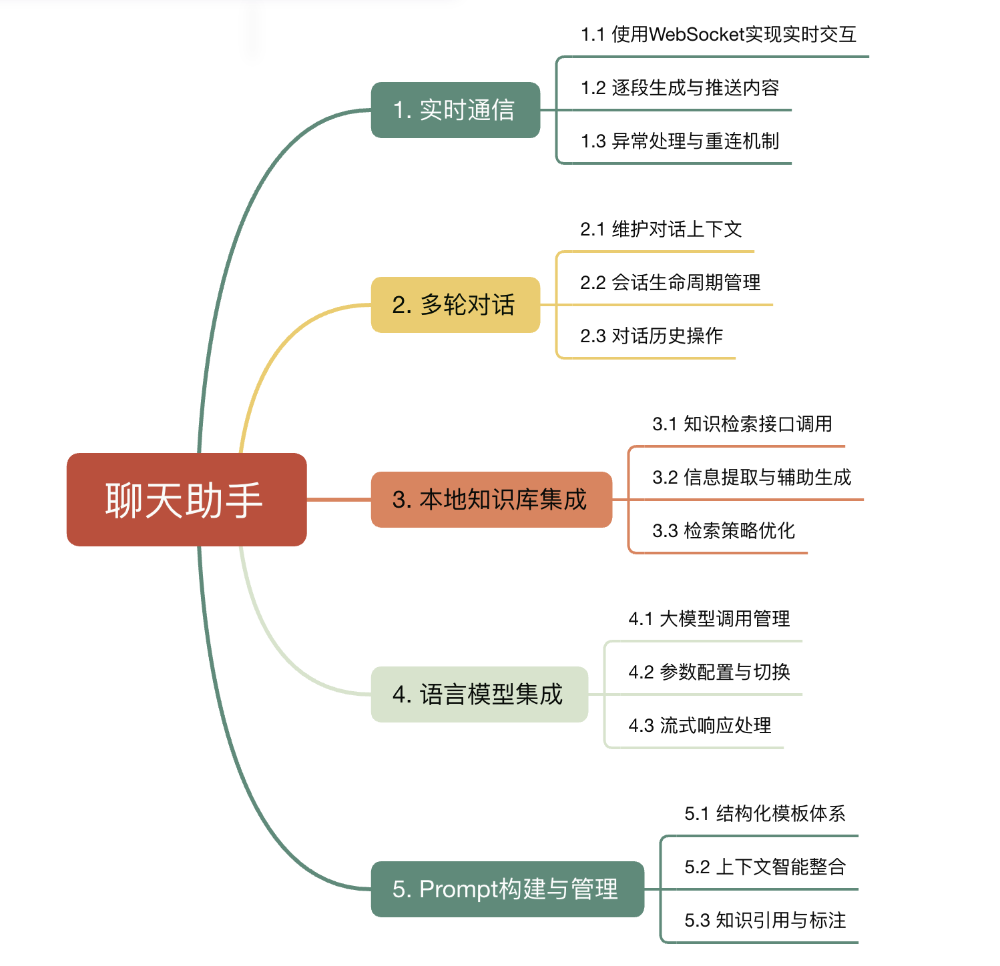

聊天模块通过 WebSocket 协议实现双向通信，支持大语言模型（接入了 DeepSeek）输出内容的流式返回；为支持多轮连续对话，该模块集成了 Redis 用于存储和维护用户会话上下文，确保大模型在生成回答时能够“记住”前文内容，维持语义连贯性

为了更好地引导大语言模型生成高质量回答，系统特别强化了 Prompt 构建与模板管理能力：

- 根据检索结果动态生成 Prompt；
- 支持多种 Prompt 模板配置与调优；
- 确保内容组织清晰、有重点，引导模型围绕核心信息生成响应

## 功能实现



## 技术选型

| 功能模块 | 技术选型 | 备注 |
| --- | --- | --- |
| 实时通信 | WebSocket（基于Spring WebSocket） | 支持STOMP子协议 |
| 对话上下文存储 | Redis（使用Spring Data Redis） | 高性能缓存，支持TTL |
| 本地知识库（当前） | Elasticsearch | 支持混合检索 |
| 本地知识库（规划） | Faiss | 提升向量检索性能 |
| 语言模型调用 | DeepSeek API | 通过WebClient调用 |
| Prompt管理 | 自研模板引擎 | 支持动态模板和变量替换 |
| 异步处理 | Spring WebFlux | 支持响应式编程 |
| 安全认证 | JWT | 确保WebSocket连接安全 |

### WebSocket

#### 简介

在 WebSocket 出现之前，如果你想让网页实时显示服务器的数据（比如股票走势、聊天消息），通常需要使用 轮询 — 即每隔几秒钟问服务器一次：“有新消息吗？”。这非常浪费资源且有延迟。

WebSocket 是一种基于 TCP 的网络协议。它只需完成一次“握手”，就能在客户端和服务器之间建立一条持久的、全双工 (Full-duplex) 的通道

典型应用场景：

- 即时通讯 (IM) / 聊天室
- 实时数据大屏 / 股票行情
- 多人在线游戏
- 在线文档协同编辑

#### Spring WebSocket 用法

在 Spring 生态中，主要有两种使用方式：

1. **原生 WebSocket (Low-level)**：直接处理原始连接，适合只需要简单点对点通信，或者需要自定义协议的场景。
2. **STOMP over WebSocket (High-level & 推荐)**：使用 STOMP 子协议。它提供了“消息代理（Broker）”、“订阅（Subscribe）”和“发布（Publish）”的概念，更像是一个轻量级的消息队列

#### 原生 WebSocket (`WebSocketHandler`)

没有使用 STOMP 协议，而是直接操作 WebSocketSession 来发送和接收文本

简单步骤包括：

- 写socket的处理逻辑 `Handler`：定义收到消息后做什么
- 写配置映射 (Config)：定义 WebSocket 的访问地址
- 写前端调用 (Client)：建立连接并收发消息

##### 依赖注入

```xml
<dependency>
  <groupId>org.springframework.boot</groupId>
  <artifactId>spring-boot-starter-websocket</artifactId>
</dependency>
```

##### 写处理逻辑 (继承 TextWebSocketHandler)

负责处理具体的业务, 即定义 Socket 需要怎么处理消息

需要继承 Spring 提供的 TextWebSocketHandler 类

主要需要实现几个方法

- `afterConnectionEstablished(WebSocketSession session)`: 在第一次建立连接时触发
- `handleTextMessage(WebSocketSession session, TextMessage message)`: 在接收用户消息时触发
- `afterConnectionClosed(WebSocketSession session, CloseStatus status)`: 连接关闭时触发

```java
import org.springframework.web.socket.handler.TextWebSocketHandler;
import org.springframework.web.socket.WebSocketSession;
import org.springframework.web.socket.TextMessage;

@Component
public class MyHandler extends TextWebSocketHandler {

  private final ConcurrentHashMap<String, WebSocketSession> sessions = new ConcurrentHashMap<>();

  // 1. 连接建立后触发
  @Override
  public void afterConnectionEstablished(WebSocketSession session) {
    System.out.println("用户来了，ID: " + session.getId());
    // 通常在这里把 session 存到一个 Map 里，方便后续推送
    sessions.put(session.getId(), session);
  }

  // 2. 收到消息时触发 (最重要)
  @Override
  protected void handleTextMessage(WebSocketSession session, TextMessage message) throws Exception {
    String payload = message.getPayload(); // 获取用户发的内容
    System.out.println("收到消息: " + payload);

    // 回复消息 (这就是原生写法，直接 send)
    session.sendMessage(new TextMessage("服务器收到了: " + payload));
  }

  // 3. 连接关闭后触发
  @Override
  public void afterConnectionClosed(WebSocketSession session, CloseStatus status) {
    System.out.println("用户走了");
    // 在这里把 session 从 Map 里移除
    sessions.remove(session.getId());
  }

  // 服务端主动推送/广播
  public void broadcast(String text) {
    TextMessage msg = new TextMessage(text);
    sessions.values().forEach(s -> {
        try {
            if (s.isOpen()) s.sendMessage(msg);
        } catch (IOException ignored) {}
    });
  }
}
```

##### 写配置映射 (实现 WebSocketConfigurer)

这是“门牌号”，告诉 Spring Boot 哪个 URL 对应上面的哪个 Handler

即可以建立不同的 socket 连接，spring boot 根据配置将其交给对应的 Handler 处理

```java
import org.springframework.context.annotation.Configuration;
import org.springframework.web.socket.config.annotation.EnableWebSocket;
import org.springframework.web.socket.config.annotation.WebSocketConfigurer;
import org.springframework.web.socket.config.annotation.WebSocketHandlerRegistry;
import org.springframework.beans.factory.annotation.Autowired;

@Configuration
@EnableWebSocket // 关键注解：开启 WebSocket 功能
public class WebSocketConfig implements WebSocketConfigurer {
  @Autowired
  private MyHandler myHandler; // 注入第一步写的 Handler

  @Override
  public void registerWebSocketHandlers(WebSocketHandlerRegistry registry) {
      // 核心配置：
      // 1. 绑定 handler
      // 2. 设定路径 "/ws/chat"
      // 3. 允许跨域 (setAllowedOrigins)
      registry.addHandler(myHandler, "/ws/chat")
              .setAllowedOrigins("*"); 
  }
}
```

##### 前端测试连接

不需要引入任何复杂的库（如 SockJS 或 Stomp.js），浏览器自带的 WebSocket 对象就够用了

```javascript
// 1. 建立连接 (注意协议是 ws://)
// 如果你的后端在本地，地址可能是 ws://localhost:8080/ws/chat
const ws = new WebSocket('ws://localhost:8080/ws/chat');

// 2. 监听连接成功
ws.onopen = function() {
    console.log('连接成功！');
    // 发送一条消息给服务器
    ws.send('你好，我是前端！');
};

// 3. 监听收到消息 (服务器 session.sendMessage 发过来的)
ws.onmessage = function(event) {
    console.log('收到服务器回复:', event.data);
};

// 4. 监听连接关闭
ws.onclose = function() {
    console.log('连接断开了');
};
```

#### STOMP

在原生 WebSocket 中，需要手动管理 Session 集合 (`ConcurrentHashMap<String, WebSocketSession>`)，手动遍历发送消息

而 STOMP 帮你在 WebSocket 之上加了一层“路由规则”和“消息代理”，Spring 会自动帮你把消息发给订阅了特定地址的人

需要定义两个东西：

- Endpoint：前端连接的“大门”
- Broker：消息的“邮局”，规定哪些前缀是发给服务器的，哪些是发给客户端的

##### 配置消息代理 - 实现 `WebSocketMessageBrokerConfigurer`

```java
import org.springframework.context.annotation.Configuration;
import org.springframework.messaging.simp.config.MessageBrokerRegistry;
import org.springframework.web.socket.config.annotation.EnableWebSocketMessageBroker;
import org.springframework.web.socket.config.annotation.StompEndpointRegistry;
import org.springframework.web.socket.config.annotation.WebSocketMessageBrokerConfigurer;

@Configuration
@EnableWebSocketMessageBroker // 开启 STOMP 代理
public class WebSocketStompConfig implements WebSocketMessageBrokerConfigurer {

  @Override
  public void registerStompEndpoints(StompEndpointRegistry registry) {
      // 1. 设定连接端点，前端连接这个地址: ws://localhost:8080/ws-stomp
      registry.addEndpoint("/ws-stomp")
              .setAllowedOriginPatterns("*") // 允许跨域
              .withSockJS(); // 开启 SockJS 支持（可选，推荐）
  }

  @Override
  public void configureMessageBroker(MessageBrokerRegistry registry) {
      // 2. 配置消息代理
      // 凡是客户端订阅 "/topic" 或 "/queue" 开头的，都由代理处理（发回给客户端）
      registry.enableSimpleBroker("/topic", "/queue");
      
      // 凡是客户端发往 "/app" 开头的消息，都会路由到 @Controller 里的方法
      registry.setApplicationDestinationPrefixes("/app");
  }
}
```

##### 写控制器 (Controller)

不再需要继承 `TextWebSocketHandler`，而是像写普通 REST API 一样写 Controller，使用 `@MessageMapping`

```java
import org.springframework.messaging.handler.annotation.MessageMapping;
import org.springframework.messaging.handler.annotation.SendTo;
import org.springframework.stereotype.Controller;

@Controller
public class StompChatController {

  // 1. 接收消息
  // 对应前端发送地址: /app/hello (因为配置了前缀 /app)
  @MessageMapping("/hello")
  // 2. 广播消息
  // 处理完后，返回值会自动发给订阅了 /topic/greetings 的所有人
  @SendTo("/topic/greetings")
  public String greeting(String message) {
      System.out.println("收到前端消息: " + message);
      return "服务器回复: " + message;
  }
}
```

##### 前端调用 (Client)

前端需要引入 sockjs-client 和 stompjs (或者 @stomp/stompjs)

核心逻辑：连接 -> 订阅 -> 发送

```javascript
// 1. 建立连接
var socket = new SockJS('http://localhost:8080/ws-stomp');
var stompClient = Stomp.over(socket);

stompClient.connect({}, function (frame) {
  console.log('STOMP 连接成功!');

  // 2. 订阅消息 (监听服务器发来的 /topic/greetings)
  stompClient.subscribe('/topic/greetings', function (response) {
      console.log("收到广播:", response.body);
  });

  // 3. 发送消息 (发给服务器的 /app/hello)
  stompClient.send("/app/hello", {}, JSON.stringify({'content': '你好'}));
});
```

### DeepSeekClient (WebClient)

Spring WebFlux

为了实现智能助手功能，需要与外部大模型进行调用设计，并且设计相应的流式相应处理 (WebFlux)

主要逻辑和功能实现在 `DeepSeekClient.java` 中

#### 构造函数分析

`@Value` 的作用：启动时由 Spring 从“环境(Environment)”里解析占位符，然后把值注入到这个字段/构造器参数里

然后基于对应参数，建立 `WebClient` 对象来与相应大模型API进行交互 `this.webClient`

```java
private final WebClient webClient;
private final String apiKey;
private final String model;
private final AiProperties aiProperties;
private static final Logger logger = LoggerFactory.getLogger(DeepSeekClient.class);

public DeepSeekClient(@Value("${deepseek.api.url}") String apiUrl,
  @Value("${deepseek.api.key}") String apiKey,
  @Value("${deepseek.api.model}") String model,
  AiProperties aiProperties) {
  WebClient.Builder builder = WebClient.builder().baseUrl(apiUrl);

  // 只有当 API key 不为空时才添加 Authorization header
  if (apiKey != null && !apiKey.trim().isEmpty()) {
    builder.defaultHeader(HttpHeaders.AUTHORIZATION, "Bearer " + apiKey);
  }

  this.webClient = builder.build();
  this.apiKey = apiKey;
  this.model = model;
  this.aiProperties = aiProperties;
}
```

#### 流式请求构建

```java
public void streamResponse(String userMessage, String context, List<Map<String, String>> history, Consumer<String> onChunk Consumer<Throwable> onError) {
  
  Map<String, Object> request = buildRequest(userMessage, context, history);
  
  webClient.post()
    .uri("/chat/completions")
    .contentType(MediaType.APPLICATION_JSON)
    .bodyValue(request)
    .retrieve()
    .bodyToFlux(String.class)
    .subscribe(
        chunk -> processChunk(chunk, onChunk),
        onError
    );
}
```

通过 `buildRequest(userMessage, context, history);` 组装请求体（JSON）

会生成类似下面的结构:

```json
{
  "model": "...",
  "messages": [...],
  "stream": true,
  "temperature": ...,
  "top_p": ...,
  "max_tokens": ...
}
```

随后发起 `POST` 请求

```java
webClient.post()
  .uri("/chat/completions")
  .contentType(MediaType.APPLICATION_JSON)
  .bodyValue(request)
  .retrieve()
```

`retrieve()` 表示开始准备读取响应

最后，把响应当作“数据流”来读

```java
.bodyToFlux(String.class)
```

意思是：不要一次性等整个响应结束，而是把响应按流（Flux）不断吐出多个 String 片段

订阅这个流：每来一段就处理

```java
.subscribe(
  chunk -> processChunk(chunk, onChunk),
  onError
);
```

- 每收到一段 chunk，就调用 `processChunk(chunk, onChunk)`
processChunk 里会解析 JSON，取出 choices[0].delta.content，然后 onChunk.accept(content) 把增量文本传给调用方（比如 WebSocket 推给前端）

- 如果请求或解析过程中出错，就走 onError.accept(异常)

##### 构建请求体 `buildRequest`

会生成类似下面的结构:

```json
{
  "model": "...",
  "messages": [...],
  "stream": true,
  "temperature": ...,
  "top_p": ...,
  "max_tokens": ...
}
```

```java
private Map<String, Object> buildRequest(String userMessage, String context, List<Map<String, String>> history) {
  logger.info("构建请求，用户消息：{}，上下文长度：{}，历史消息数：{}", 
    userMessage, 
    context != null ? context.length() : 0, 
    history != null ? history.size() : 0);
  
  Map<String, Object> request = new java.util.HashMap<>();
  request.put("model", model);
  request.put("messages", buildMessages(userMessage, context, history));
  request.put("stream", true);
  // 生成参数
  AiProperties.Generation gen = aiProperties.getGeneration();
  if (gen.getTemperature() != null) {
      request.put("temperature", gen.getTemperature());
  }
  if (gen.getTopP() != null) {
      request.put("top_p", gen.getTopP());
  }
  if (gen.getMaxTokens() != null) {
      request.put("max_tokens", gen.getMaxTokens());
  }
  return request;
}

private List<Map<String, String>> buildMessages(String userMessage, String context, List<Map<String, String>> history) {
  List<Map<String, String>> messages = new ArrayList<>();

  AiProperties.Prompt promptCfg = aiProperties.getPrompt();

  // 1. 构建统一的 system 指令（规则 + 参考信息）
  StringBuilder sysBuilder = new StringBuilder();
  String rules = promptCfg.getRules();
  if (rules != null) {
      sysBuilder.append(rules).append("\n\n");
  }

  String refStart = promptCfg.getRefStart() != null ? promptCfg.getRefStart() : "<<REF>>";
  String refEnd = promptCfg.getRefEnd() != null ? promptCfg.getRefEnd() : "<<END>>";
  sysBuilder.append(refStart).append("\n");

  if (context != null && !context.isEmpty()) {
      sysBuilder.append(context);
  } else {
      String noResult = promptCfg.getNoResultText() != null ? promptCfg.getNoResultText() : "（本轮无检索结果）";
      sysBuilder.append(noResult).append("\n");
  }

  sysBuilder.append(refEnd);

  String systemContent = sysBuilder.toString();
  messages.add(Map.of(
      "role", "system",
      "content", systemContent
  ));
  logger.debug("添加了系统消息，长度: {}", systemContent.length());

  // 2. 追加历史消息（若有）
  if (history != null && !history.isEmpty()) {
      messages.addAll(history);
  }

  // 3. 当前用户问题
  messages.add(Map.of(
      "role", "user",
      "content", userMessage
  ));

  return messages;
}
```

##### 处理返回分块信息 `processChunk`

```java
private void processChunk(String chunk, Consumer<String> onChunk) {
  try {
      // 检查是否是结束标记
      if ("[DONE]".equals(chunk)) {
          logger.debug("对话结束");
          return;
      }
      
      // 直接解析 JSON
      ObjectMapper mapper = new ObjectMapper();
      JsonNode node = mapper.readTree(chunk);
      String content = node.path("choices")
                          .path(0)
                          .path("delta")
                          .path("content")
                          .asText("");
      
      if (!content.isEmpty()) {
          onChunk.accept(content);
      }
  } catch (Exception e) {
      logger.error("处理数据块时出错: {}", e.getMessage(), e);
  }
}
```
