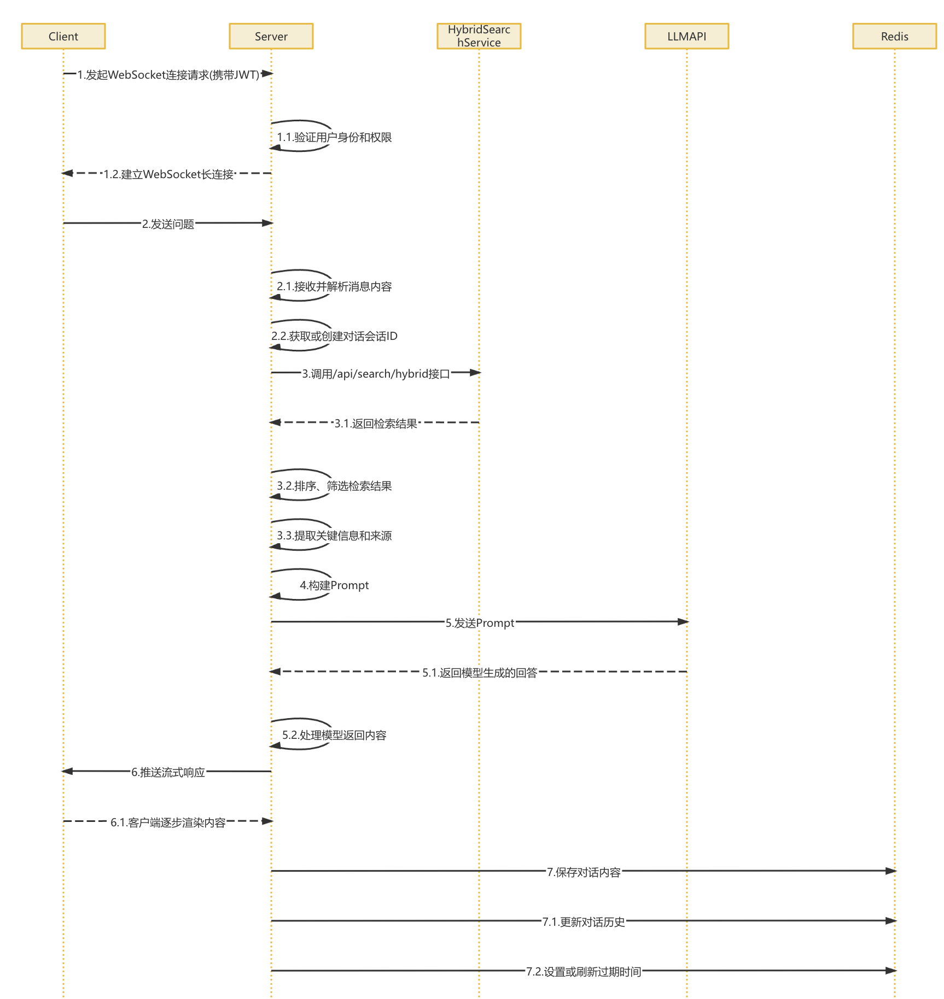

## Redis 接口设计

### 用户到会话的映射

- Key: `user:{userId}:current_conversation`
- Value: 当前用户的 conversationId
- TTL: 7 天
- 用途: 快速查找某个用户的当前会话 ID

### 对话历史记录

- Key: `conversation:{conversationId}`
- Value: JSON 格式的对话历史记录数组，每个元素包含 role、content、timestamp 字段
- TTL: 7 天
- 用途: 存储用户的对话上下文，支持多轮对话，限制最多保存 20 条消息
- 示例：

### 历史会话列表

- Key: `user:{userId}:conversations`
- Value: 用户的所有 conversationId 列表（JSON 格式）
- TTL: 7 天
- 用途: 支持用户查看历史会话记录

### Prompt 模板缓存

- Key: `prompt_templates:{templateName}`
- Value: 模板内容
- TTL: 无（或较长时间）
- 用途: 存储系统定义的 Prompt 模板

## 关键流程

### 用户对话流程

当用户在页面上开始一次对话时，系统的第一步是由客户端主动发起一个 WebSocket 连接请求，这个请求里会带上用户的 JWT 身份认证信息。

服务端收到请求后，会先验证用户的身份和权限，确认无误后，就会和客户端建立一个稳定的 WebSocket 长连接，用于后续的实时对话

连接建立之后，用户可以开始提问了。客户端会把用户输入的问题通过 WebSocket 发给服务端。服务端这边接收到消息后，会先解析内容，然后根据情况获取一个当前的会话 ID，如果是新的对话，就创建一个。

接着系统会启动知识库检索流程。它会调用内部的 /api/search/hybrid 接口，执行一轮“混合检索”，也就是结合关键词匹配和语义匹配的方式，快速从本地知识库中找出和用户问题最相关的文档。



### 新建对话流程

当用户打开对话页面，准备开始一次新的交流时，客户端会先通过一个 REST 接口向服务端发送“创建会话”的请求。这时候，服务端首先会对用户的身份进行校验，确保这是一个合法登录的用户。

验证通过后，系统会为这次新对话生成一个全局唯一的 conversationId，用作这轮会话的身份标识。同时，会为这次对话准备一份空的历史记录结构，方便后续存储每轮提问和回答内容。

接下来，系统会在 Redis 里建立用户和这个会话 ID 之间的映射关系，也就是说：这个会话是属于哪个用户的。为了防止会话无限制增长，系统还会给这个会话设置一个过期时间，比如 24 小时或 7 天，超时后自动清理。

最后，系统会把新生成的 conversationId 返回给客户端，表示这轮对话已经正式创建成功，用户可以开始提问。

### 查询历史对话流程

> 是用“睡眠 + 长度不变”来猜测流式响应结束，而不是用真实的 onComplete / [DONE] 结束信号。
所以非常容易在还没收到任何 chunk的时候就“判定完成”，把 "" 写进 Redis

糅合在新建对话流程里，也就是当用户发送消息时，会进行检测历史内容

在 `ChatHandler` 中的 `processMessage`

```java
// 2. 获取对话历史
List<Map<String, String>> history = getConversationHistory(conversationId);
logger.debug("获取到 {} 条历史对话", history.size());
```

当用户想要查看之前的聊天记录时，客户端会向服务端发送一个查询历史记录的 REST 请求。服务端收到请求后，第一步还是先对用户的身份进行校验，确认用户是合法且有权限访问对应数据的。

接着，系统会去 Redis 中查找当前用户对应的 conversationId，也就是这位用户当前正在使用的那一轮对话的标识。如果 Redis 中没有查到，或者这条会话已经过期失效，系统会及时返回提示信息，避免出现无效
