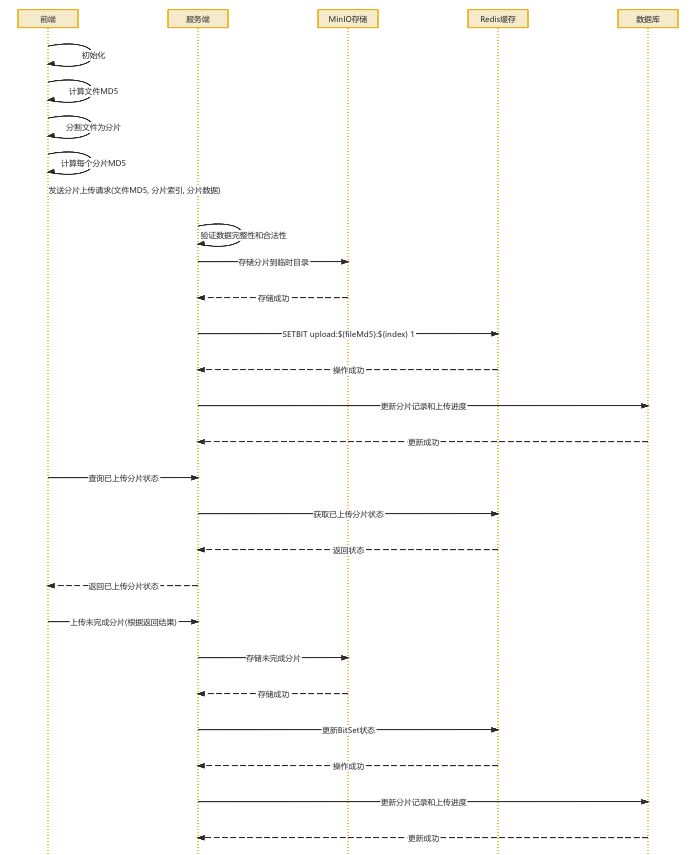

实现大文件的分片上传、断点续传、文件合并以及文档解析功能

## 目的

- 通过 Redis 和 MinIO 的结合，确保大文件上传的可靠性
- 并通过 Kafka 实现异步处理，进行文件解析等操作
- 模块支持多种文档格式（PDF、Word、Excel）的解析，并提取文本内容用于后续向量化处理
- 文本向量化通过调用阿里向量化 API 实现，生成的向量数据目前存储在 `Elasticsearch` 中，未来将同时支持 FAISS 存储

## 文件上传

首先前端对于用户上传的文件，由前端来计算对应的MD5值 (分片读取 + 增量计算)

然后根据分片策略逻辑 (5MB 为一个 chunk)，基于此开始不断地发送分片上传请求(文件MD5, 分片索引以及分片数据)

后端不断接受传来的分片，先校验其完整性和合法性

然后将分片存储到 MinIO 中，对应的在 MinIO 的临时路径 `/temp/{fileMd5}/{chunkIndex}`

之后在 Redis 上记录目前接受了哪些分片索引

然后将信息 (分片记录以及上传进度) 更新到 Mysql 的表内(chunk_info file_upload)



感觉前端那块处理的东西也有一些

### 前端分析

主要上传逻辑(点击保存按钮后)逻辑块 (在 views/knowledge-base/moudles/upload-dialog.vue 组件里)

```javascript
const store = useKnowledgeBaseStore();
async function handleSubmit() {
  // 表单校验 (必填项检查：组织标签、公开性、是否选了文件)
  await validate();
  // 出现上传动画
  loading.value = true;

  // 将数据“扔”给 Pinia Store
  // 注意：这里传进去的 model.value 包含了 fileList (也就是文件本身)
  await store.enqueueUpload(model.value);
  // 上传成功
  loading.value = false;
  close();
}
```

对应的上传逻辑就是在 `store.enqueueUpload(model.value)`

具体保存在 `store/knowledge-base/index.ts`

主要逻辑就是对于 `upload-dialog` 组件存的文件，先计算出 MD5 值，然后创建个上传任务，将文件大小以 5MB 为一个 chunk 进行切割，并限制一次可以并发传输的 chunk 数量来传输

```javascript
/**
 * 异步函数：将上传请求加入队列
 *
 * 本函数处理上传任务的排队和初始化工作它首先检查是否存在相同的文件， 如果不存在，则创建一个新的上传任务，并将其添加到任务队列中最后启动上传流程
 *
 * @param form 包含上传信息的表单，包括文件列表和是否公开的标签
 * @returns 返回一个上传任务对象，无论是已存在的还是新创建的
 */
async function enqueueUpload(form: Api.KnowledgeBase.Form) {
  // 获取文件列表中的第一个文件
  const file = form.fileList![0].file!;
  // 计算文件的MD5值，用于唯一标识文件
  const md5 = await calculateMD5(file);

  // 检查是否已存在相同文件
  const existingTask = tasks.value.find(t => t.fileMd5 === md5);
  if (existingTask) {
    // 如果存在相同文件，直接返回该上传任务
    if (existingTask.status === UploadStatus.Completed) {
      window.$message?.error('文件已存在');
      return;
    } else if (existingTask.status === UploadStatus.Pending || existingTask.status === UploadStatus.Uploading) {
      window.$message?.error('文件正在上传中');
      return;
    } else if (existingTask.status === UploadStatus.Break) {
      existingTask.status = UploadStatus.Pending;
      startUpload();
      return;
    }
  }

  // 创建新的上传任务对象
  const newTask: Api.KnowledgeBase.UploadTask = {
    file,
    chunk: null,
    chunkIndex: 0,
    fileMd5: md5,
    fileName: file.name,
    totalSize: file.size,
    isPublic: form.isPublic,
    uploadedChunks: [],
    progress: 0,
    status: UploadStatus.Pending,
    orgTag: form.orgTag
  };

  newTask.orgTagName = form.orgTagName ?? null;

  // 将新的上传任务添加到任务队列中
  tasks.value.push(newTask);
  // 启动上传流程
  startUpload();
  // 返回新的上传任务
}

/** 启动文件上传的异步函数 该函数负责从待上传队列中启动文件上传任务，并管理并发上传的数量 */
async function startUpload() {
  // 限制可同时上传的文件个数
  if (activeUploads.value.size >= 3) return;
  // 获取待上传的文件
  const pendingTasks = tasks.value.filter(
    t => t.status === UploadStatus.Pending && !activeUploads.value.has(t.fileMd5)
  );

  // 如果没有待上传的文件，则直接返回
  if (pendingTasks.length === 0) return;

  // 获取第一个待上传的文件
  const task = pendingTasks[0];
  task.status = UploadStatus.Uploading;
  activeUploads.value.add(task.fileMd5);

  // 计算文件总片数
  // chunkSize = 5 * 1024 * 1024;
  const totalChunks = Math.ceil(task.totalSize / chunkSize);

  try {
    if (task.uploadedChunks.length === totalChunks) {
      const success = await mergeFile(task);
      if (!success) throw new Error('文件合并失败');
    }
    // const promises = [];
    // 遍历所有片数
    for (let i = 0; i < totalChunks; i += 1) {
      // 如果未上传，则上传
      if (!task.uploadedChunks.includes(i)) {
        task.chunkIndex = i;
        // promises.push(uploadChunk(task))
        // eslint-disable-next-line no-await-in-loop
        // 主要逻辑，同时会检验当前文件是否已经传完
        // 如果全传了，那么会出发 merge
        const success = await uploadChunk(task);
        if (!success) throw new Error('分片上传失败');
      }
    }
    // await Promise.all(promises)
  } catch (e) {
    console.error('%c [ 👉 upload error 👈 ]-168', 'font-size:16px; background:#94cc97; color:#d8ffdb;', e);
    // 如果上传失败，则将任务状态设置为中断
    const index = tasks.value.findIndex(t => t.fileMd5 === task.fileMd5);
    tasks.value[index].status = UploadStatus.Break;
  } finally {
    // 无论成功或失败，都从活跃队列中移除
    activeUploads.value.delete(task.fileMd5);
    // 继续下一个任务
    startUpload();
  }
}
```

具体的文件 chunk 上传 以及 merge 代码

```javascript
async function uploadChunk(task: Api.KnowledgeBase.UploadTask): Promise<boolean> {
  const totalChunks = Math.ceil(task.totalSize / chunkSize);

  const chunkStart = task.chunkIndex * chunkSize;
  const chunkEnd = Math.min(chunkStart + chunkSize, task.totalSize);
  const chunk = task.file.slice(chunkStart, chunkEnd);

  task.chunk = chunk;
  const requestId = nanoid();
  task.requestIds ??= [];
  task.requestIds.push(requestId);
  const { error, data } = await request<Api.KnowledgeBase.Progress>({
    url: '/upload/chunk',
    method: 'POST',
    data: {
      file: task.chunk,
      fileMd5: task.fileMd5,
      chunkIndex: task.chunkIndex,
      totalSize: task.totalSize,
      fileName: task.fileName,
      orgTag: task.orgTag,
      isPublic: task.isPublic ?? false
    },
    headers: {
      'Content-Type': 'multipart/form-data',
      [REQUEST_ID_KEY]: requestId
    },
    timeout: 10 * 60 * 1000
  });

  task.requestIds = task.requestIds.filter(id => id !== requestId);

  if (error) return false;

  // 更新任务状态
  const updatedTask = tasks.value.find(t => t.fileMd5 === task.fileMd5)!;
  updatedTask.uploadedChunks = data.uploaded;
  updatedTask.progress = Number.parseFloat(data.progress.toFixed(2));

  if (data.uploaded.length === totalChunks) {
    const success = await mergeFile(task);
    if (!success) return false;
  }
  return true;
}

async function mergeFile(task: Api.KnowledgeBase.UploadTask) {
  try {
    const { error } = await request({
      url: '/upload/merge',
      method: 'POST',
      data: { fileMd5: task.fileMd5, fileName: task.fileName }
    });
    if (error) return false;

    // 更新任务状态为已完成
    const index = tasks.value.findIndex(t => t.fileMd5 === task.fileMd5);
    tasks.value[index].status = UploadStatus.Completed;
    return true;
  } catch {
    return false;
  }
}
```

对应的 文件MD5 计算逻辑 (utils/common.ts)：

`spark-md5` 是一个第三方库，专门用于在浏览器端高效计算 MD5

支持增量计算，也就是说你可以喂给它一部分数据，它算出中间状态，然后你再喂下一部分，它接着算。

```javascript
export async function calculateMD5(file: File): Promise<string> {
  return new Promise((resolve, reject) => {
    const chunkSize = 5 * 1024 * 1024; // 5MB
    const spark = new SparkMD5.ArrayBuffer();
    const reader = new FileReader();

    let currentChunk = 0;

    const loadNext = () => {
      const start = currentChunk * chunkSize;
      const end = Math.min(start + chunkSize, file.size);

      if (start >= file.size) {
        resolve(spark.end());
        return;
      }

      const blob = file.slice(start, end);
      reader.readAsArrayBuffer(blob);
    };

    reader.onload = e => {
      spark.append(e.target?.result as ArrayBuffer);
      currentChunk += 1;
      loadNext();
    };

    reader.onerror = () => reject(new Error('文件读取失败'));
    loadNext();
  });
}
```

### 后端分析

前端会计算出上传文件的MD5，然后不断调用后端的 `/upload/chunk` 接口来传输文件，同时每次成功上传后，会检查是否已经传输完成，如果都传输完成，前端会调用 `/upload/merge` 接口触发后端的文件合并操作

文件上传主要涉及的是 `UploadController` 以及对应的 `Service`模块代码

分片上传接口：

- URL: `/api/v1/upload/chunk`
- Method: POST
- Headers: Bearer {token}
- Body: (multipart/form-data)

  ```http
  fileMd5: d41d8cd98f00b204e9800998ecf8427e      // 文件MD5值（必需）
  chunkIndex: 3                                  // 分片索引（必需）
  totalSize: 15728640                            // 文件总大小（必需）
  fileName: 年度报告.pdf                         // 文件名（必需，现在支持中文）
  totalChunks: 64                               // 总分片数量（可选）
  orgTag: DEPT_A                                // 组织标签（可选，默认用户主组织标签）
  isPublic: true                                // 是否公开（可选，默认false）
  file: [分片二进制数据]                        // 分片文件数据（必需）
  ```

- Response

  ```json
  <!-- 成功 -->
  {
    "code": 200,
    "message": "分片上传成功",
    "data": {
      "uploaded": [0, 1, 2, 3],
      "progress": 75.0
    }
  }
  <!-- 失败 -->
  {
    "code": 500,
    "message": "分片上传失败: 具体错误信息"
  }
  ```

#### Contorller层 `UploadController`

`UploadController/uploadChunk` - `/chunk`接口

来接受前端的分块文件，并实现文件保存记录

- 如果是第一次传这个文件，会把总文件的基本信息保存在 `file_upload` 表
- 存 chunk 到 MinIO 指定临时路径
- 存 chunk 的基本信息到 `chunk_info` 表
- 接受完成，在 Redis 的标记 BitMap 对应位的值，作为成功上传

##### `MultipartFile` 对象

是 Spring Framework 中用于处理文件上传的核心接口：`org.springframework.web.multipart.MultipartFile`

是 Spring 对“上传文件”这个概念的抽象

无论底层使用的是 Tomcat 的标准 Servlet API 还是 Apache Commons FileUpload，Spring 都会把上传的文件封装成这个 MultipartFile 对象让你使用

在 HTTP multipart/form-data 请求中，每一个**文件部分**（File Part）在 Java 代码中的对象映射

存在几个方法可以使用

- 获取元数据：
  - `getName()`: 获取表单中 `<input type="file" name="file">` 的 name 属性值（表单字段名）
  - `getOriginalFilename()`: 获取用户电脑上文件的原始名称（例如 photo.jpg）
  - `getContentType()`: 获取文件的 MIME 类型（例如 image/jpeg）
  - `getSize()`: 获取文件大小（字节数）

- 读取文件内容：
  - `getBytes()`: 将文件内容一次性读入内存（byte[]）。注意：大文件慎用，容易导致内存溢出 (OOM)。
  - `getInputStream()`: 获取输入流。这是处理大文件的推荐方式，可以流式读取。

- 保存文件（最常用）：
  - `transferTo(File dest)`: 将上传的临时文件移动/写入到服务器磁盘上的指定位置。这是最方便的保存文件的方法。

  ```java
  // 1. 获取文件名
  String fileName = file.getOriginalFilename();
  // 2. 定义保存路径
  File dest = new File("/data/uploads/" + fileName);
  // 3. 保存文件 (核心方法调用)
  file.transferTo(dest);
  ```

##### 参数分析

前面几个都是由前端传来的参数 包括了 文件的MD5 分片索引 文件总大小 文件名 总分片数量等

但还有一个参数是从 Attribute 获取的，这是由于在到 Controller 处理之前，会经过组织验证过滤器，成功会将 userId 塞到该请求的 Attribute 中

Spring 都会把上传的文件封装成这个 `MultipartFile` 对象来使用

```java
 /**
 * 上传文件分片接口
 *
 * @param fileMd5 文件的MD5值，用于唯一标识文件
 * @param chunkIndex 分片索引，表示当前分片的位置
 * @param totalSize 文件总大小
 * @param fileName 文件名
 * @param totalChunks 总分片数量
 * @param orgTag 组织标签，如果未指定则使用用户的主组织标签
 * @param isPublic 是否公开，默认为false
 * @param file 分片文件对象
 * @return 返回包含已上传分片和上传进度的响应
 * @throws IOException 当文件读写发生错误时抛出
 */
// 其中 userId 参数是从 组织过滤器 中获取的
@PostMapping("/chunk")
public ResponseEntity<Map<String, Object>> uploadChunk(
        @RequestParam("fileMd5") String fileMd5,
        @RequestParam("chunkIndex") int chunkIndex,
        @RequestParam("totalSize") long totalSize,
        @RequestParam("fileName") String fileName,
        @RequestParam(value = "totalChunks", required = false) Integer totalChunks,
        @RequestParam(value = "orgTag", required = false) String orgTag,
        @RequestParam(value = "isPublic", required = false, defaultValue = "false") boolean isPublic,
        @RequestParam("file") MultipartFile file,
        @RequestAttribute("userId") String userId) throws IOException {
          ...
        }
```

##### 验证合理性

`fileTypeValidationService` | `userService`

如果 `chunkIndex == 0` 说明是第一个分片，会调用 `fileTypeValidationService.validateFileType` 来判断文件类型是否能支持，进而返回一个 文件类型验证结果类 `FileTypeValidationResult`

如果是不支持的类型 `!validationResult.isValid()`，进而就返回并通知前端

如果文件类型支持或者 `chunkIndex != 0` (文件没问题)，是否设置了文件属于哪个组织，即对应参数 `orgTag` 可选

当前端没有给定该参数，那么就需要给该文件默认一个组织参数 (当前用户的默认主组织)

通过 `userService.getUserPrimaryOrg(userId)` 获取，如果没有就报错，否则就将该文件属于该用户对应的主组织

```java
 // 文件类型验证（仅在第一个分片时进行验证）
if (chunkIndex == 0) {
  FileTypeValidationService.FileTypeValidationResult validationResult = 
      fileTypeValidationService.validateFileType(fileName);
  
  LogUtils.logBusiness("UPLOAD_CHUNK", userId, "文件类型验证结果: fileName=%s, valid=%s, fileType=%s, message=%s", 
          fileName, validationResult.isValid(), validationResult.getFileType(), validationResult.getMessage());
  
  if (!validationResult.isValid()) {
      LogUtils.logBusinessError("UPLOAD_CHUNK", userId, "文件类型验证失败: fileName=%s, fileType=%s", 
              new RuntimeException(validationResult.getMessage()), fileName, validationResult.getFileType());
      monitor.end("文件类型验证失败: " + validationResult.getMessage());
      
      Map<String, Object> errorResponse = new HashMap<>();
      errorResponse.put("code", HttpStatus.BAD_REQUEST.value());
      errorResponse.put("message", validationResult.getMessage());
      errorResponse.put("fileType", validationResult.getFileType());
      errorResponse.put("supportedTypes", fileTypeValidationService.getSupportedFileTypes());
      return ResponseEntity.status(HttpStatus.BAD_REQUEST).body(errorResponse);
  }
}

String fileType = getFileType(fileName);
String contentType = file.getContentType();

LogUtils.logBusiness("UPLOAD_CHUNK", userId, "接收到分片上传请求: fileMd5=%s, chunkIndex=%d, fileName=%s, fileType=%s, contentType=%s, fileSize=%d, totalSize=%d, orgTag=%s, isPublic=%s", fileMd5, chunkIndex, fileName, fileType, contentType, file.getSize(), totalSize, orgTag, isPublic);

// 如果未指定组织标签，则获取用户的主组织标签
if (orgTag == null || orgTag.isEmpty()) {
  try {
      LogUtils.logBusiness("UPLOAD_CHUNK", userId, "组织标签未指定，尝试获取用户主组织标签: fileName=%s", fileName);
      String primaryOrg = userService.getUserPrimaryOrg(userId);
      orgTag = primaryOrg;
      LogUtils.logBusiness("UPLOAD_CHUNK", userId, "成功获取用户主组织标签: fileName=%s, orgTag=%s", fileName, orgTag);
  } catch (Exception e) {
      LogUtils.logBusinessError("UPLOAD_CHUNK", userId, "获取用户主组织标签失败: fileName=%s", e, fileName);
      monitor.end("获取主组织标签失败: " + e.getMessage());
      Map<String, Object> errorResponse = new HashMap<>();
      errorResponse.put("code", HttpStatus.INTERNAL_SERVER_ERROR.value());
      errorResponse.put("message", "获取用户主组织标签失败: " + e.getMessage());
      return ResponseEntity.status(HttpStatus.INTERNAL_SERVER_ERROR).body(errorResponse);
  }
}

LogUtils.logFileOperation(userId, "UPLOAD_CHUNK", fileName, fileMd5, "PROCESSING");
```

##### 上传保存分块

`uploadService`

当文件没问题，对应属于哪个组织也确定了，那么就可以上传了，调用 `uploadService.uploadChunk` 来实现

并通过 `uploadService.getUploadedChunks` 来获取成功上传的 chunk 之后可以返回前端

以及实际总 chunks `uploadService.getTotalChunks` 以及当前的进度 `double progress = calculateProgress(uploadedChunks, actualTotalChunks);`

```java
uploadService.uploadChunk(fileMd5, chunkIndex, totalSize, fileName, file, orgTag, isPublic, userId);

List<Integer> uploadedChunks = uploadService.getUploadedChunks(fileMd5, userId);
int actualTotalChunks = uploadService.getTotalChunks(fileMd5, userId);
double progress = calculateProgress(uploadedChunks, actualTotalChunks);

LogUtils.logBusiness("UPLOAD_CHUNK", userId, "分片上传成功: fileMd5=%s, fileName=%s, fileType=%s, chunkIndex=%d, 进度=%.2f%%", 
        fileMd5, fileName, fileType, chunkIndex, progress);
monitor.end("分片上传成功");
```

```java
private double calculateProgress(List<Integer> uploadedChunks, int totalChunks) {
  if (totalChunks == 0) {
      LogUtils.logBusiness("CALCULATE_PROGRESS", "system", "计算上传进度时总分片数为0");
      return 0.0;
  }
  return (double) uploadedChunks.size() / totalChunks * 100;
}
```

##### 成功构建请求

包含了已上传的 chunks 和 当前进度百分比

```java
// 构建数据对象
Map<String, Object> data = new HashMap<>();
data.put("uploaded", uploadedChunks);
data.put("progress", progress);

// 构建统一响应格式
Map<String, Object> response = new HashMap<>();
response.put("code", 200);
response.put("message", "分片上传成功");
response.put("data", data);

return ResponseEntity.ok(response);
```

##### 异常捕获处理

会捕获当前的异常，来设置请求返回

```java
catch (Exception e) {
  String fileType = getFileType(fileName);
  LogUtils.logBusinessError("UPLOAD_CHUNK", userId, "分片上传失败: fileMd5=%s, fileName=%s, fileType=%s, chunkIndex=%d", e, fileMd5, fileName, fileType, chunkIndex);
  monitor.end("分片上传失败: " + e.getMessage());
  Map<String, Object> errorResponse = new HashMap<>();
  errorResponse.put("code", HttpStatus.INTERNAL_SERVER_ERROR.value());
  errorResponse.put("message", "分片上传失败: " + e.getMessage());
  return ResponseEntity.status(HttpStatus.INTERNAL_SERVER_ERROR).body(errorResponse);
}
```

#### Service层 — `UploadService`

主要是 `UploadService`，但也有 `fileTypeValidationService` 和 `userService`

重点分析 `UploadService` 的 `uploadChunk`方法

##### 主要参数

主要就是文件相关的信息以及用户信息

```java
/**
 * 上传文件分片
 *
 * @param fileMd5 文件的 MD5 值，用于唯一标识文件
 * @param chunkIndex 分片索引，表示这是文件的第几个分片
 * @param totalSize 文件总大小
 * @param fileName 文件名称
 * @param file 要上传的分片文件
 * @param orgTag 组织标签，指定文件所属的组织
 * @param isPublic 是否公开，标识文件访问权限
 * @param userId 上传用户ID
 * @throws IOException 如果文件读取失败
 */
public void uploadChunk(String fileMd5, int chunkIndex, long totalSize, String fileName, MultipartFile file, String orgTag, boolean isPublic, String userId) throws IOException { ... }
```

##### 主要步骤

- 检查分块对应的文件元信息是否存入 `file_upload` 表中；不在需要插入信息
- 检查分块是否已经上传过了 `isChunkUploaded(fileMd5, chunkIndex, userId)`
  
  分块上传信息保存在 redis 缓存中 (BitMap)
  
  key: `"upload:" + userId + ":" + fileMd5`
  
  `boolean isUploaded = redisTemplate.opsForValue().getBit(redisKey, chunkIndex);`

  对应返回判断 `chunkUploaded`

- 检查分块的元信息是否存入 `chunk_info` 表中，先进行判断 `chunkInfoExists`
- 根据 `chunkUploaded` 判断是否已经上传
  - 如果上传了，那么判断 `chunkInfoExists` 元信息是否存在数据库
    - 如果分片已上传但数据库中不存在记录，需要创建记录
    - 并检查MinIO中是否存在该分片
    - 如果MinIO中不存在，将chunkUploaded设为false以触发上传流程
- 进而，进入分块未上传逻辑 `!chunkUploaded`
  - 先计算 chunk 的 MD5 (chunkMd5) || 已知其总文件的 MD5 (fileMd5)
  - 构建分片的存储路径 `storagePath = "chunks/" + fileMd5 + "/" + chunkIndex;`
  - 存储到 MinIO, 路径为 `storagePath`, bucket 为 `uploads`
  - 如果成功了，标记已上传
    - 去 Redis 对应的 BitMap 位(chunkIndex)设为 true
- 不管分片是否已上传，都确保数据库中有分片信息 `(!chunkInfoExists && chunkMd5 != null && storagePath != null)`
  - 保存 chunk 元信息到 `chunk_info` 表中

    ```java
    saveChunkInfo(fileMd5, chunkIndex, chunkMd5, storagePath);
    ```

##### 检查文件元信息是否保存`file_upload` 表中

在 `file_upload` 表中元数据包括

- fileMd5 (文件的MD5)
- fileName (文件的原始名称)
- totalSize (文件的总大小)
- status (文件上传的状态 0表示文件正在上传中，1表示文件上传已完成)
- userId (上传文件的用户的标识符)
- orgTag (文件所属组织标签)
- isPublic (文件是否公开)
- createdAt
- mergeAt

对应的 Repository 为 `FileUploadRepository`

先根据文件的MD5值去 `file_upload` 表中检查是否已经保存了 `fileUploadRepository.findByFileMd5AndUserId(fileMd5, userId).isPresent()`

如果表内没有数据，那么就需要把该chunk对应的文件信息存入 `file_upload` 表中

```java
public void uploadChunk(String fileMd5, int chunkIndex, long totalSize, String fileName, MultipartFile file, String orgTag, boolean isPublic, String userId) throws IOException {
  // 获取文件类型信息
  String fileType = getFileType(fileName);
  String contentType = file.getContentType();
  
  logger.info("[uploadChunk] 开始处理分片上传请求 => fileMd5: {}, chunkIndex: {}, totalSize: {}, fileName: {}, fileType: {}, contentType: {}, fileSize: {}, orgTag: {}, isPublic: {}, userId: {}", 
              fileMd5, chunkIndex, totalSize, fileName, fileType, contentType, file.getSize(), orgTag, isPublic, userId);
  
  try {
    // 检查 file_upload 表中是否存在该 file_md5
    boolean fileExists = fileUploadRepository.findByFileMd5AndUserId(fileMd5, userId).isPresent();
    logger.debug("检查文件记录是否存在 => fileMd5: {}, fileName: {}, fileType: {}, exists: {}", fileMd5, fileName, fileType, fileExists);
    
    if (!fileExists) {
      logger.info("创建新的文件记录 => fileMd5: {}, fileName: {}, fileType: {}, totalSize: {}, userId: {}, orgTag: {}, isPublic: {}", fileMd5, fileName, fileType, totalSize, userId, orgTag, isPublic);
      // 插入 file_upload 表
      FileUpload fileUpload = new FileUpload();
      fileUpload.setFileMd5(fileMd5);
      fileUpload.setFileName(fileName); // 文件名可以从请求中获取
      fileUpload.setTotalSize(totalSize); // 文件总大小
      fileUpload.setStatus(0); // 0 表示上传中
      fileUpload.setUserId(userId); // 设置上传用户ID
      fileUpload.setOrgTag(orgTag); // 设置组织标签
      fileUpload.setPublic(isPublic); // 设置是否公开
      try {
        fileUploadRepository.save(fileUpload);
        logger.info("文件记录创建成功 => fileMd5: {}, fileName: {}, fileType: {}", fileMd5, fileName, fileType);
      } catch (Exception e) {
        logger.error("创建文件记录失败 => fileMd5: {}, fileName: {}, fileType: {}, 错误: {}", fileMd5, fileName, fileType, e.getMessage(), e);
        throw new RuntimeException("创建文件记录失败: " + e.getMessage(), e);
      }
    }
    ...
  }
  ...
}
```

##### 检查分片是否上传 (Redis内缓存)

将文件的分片上传信息存在 Redis 的BitMap中，对应位的信息 == chunkIndex是否成功上传

`redisKey = "upload:" + userId + ":" + fileMd5;`

```java
boolean chunkUploaded = isChunkUploaded(fileMd5, chunkIndex, userId);
logger.debug("检查分片是否已上传 => fileMd5: {}, fileName: {}, chunkIndex: {}, isUploaded: {}", fileMd5, fileName, chunkIndex, chunkUploaded);
```

对应的 `isChunkUploaded` 函数

```java
public boolean isChunkUploaded(String fileMd5, int chunkIndex, String userId) {
  logger.debug("检查分片是否已上传 => fileMd5: {}, chunkIndex: {}, userId: {}", fileMd5, chunkIndex, userId);
  try {
    if (chunkIndex < 0) {
        logger.error("无效的分片索引 => fileMd5: {}, chunkIndex: {}", fileMd5, chunkIndex);
        throw new IllegalArgumentException("chunkIndex must be non-negative");
    }
    String redisKey = "upload:" + userId + ":" + fileMd5;
    boolean isUploaded = redisTemplate.opsForValue().getBit(redisKey, chunkIndex);
    logger.debug("分片上传状态 => fileMd5: {}, chunkIndex: {}, userId: {}, isUploaded: {}", fileMd5, chunkIndex, userId, isUploaded);
    return isUploaded;
  } catch (Exception e) {
    logger.error("检查分片上传状态失败 => fileMd5: {}, chunkIndex: {}, userId: {}, 错误: {}", fileMd5, chunkIndex, userId, e.getMessage(), e);
    return false; // 或者根据业务需求返回其他值
  }
}
```

##### 检查分片元信息是否保存在 `chunk_info` 表中

`chunk_info`表中存储的字段主要包括

- id (分块信息的唯一标识符 由数据库自动生成，用于唯一确定一个分块信息)
- fileMd5 (文件的MD5, 同个文件的不同chunk的文件MD5都是一样的)
- chunkIndex (表示文件中的第几个分块，用于保持分块的顺序)
- chunkMd5 (分块的MD5值, 每个分块的唯一标识，用于校验分块的完整性和正确性)
- storagePath (分块的存储路径, 对应MinIO的存储, 表示分块在系统中的存储位置，可以是绝对路径或相对路径)

根据 fileMd5 去 `chunk_info` 中获取该文件的所有已保存的chunk的信息，然后遍历判断当前chunk是否保存

```java
// 检查数据库中是否存在分片信息
boolean chunkInfoExists = false;
try {
  List<ChunkInfo> chunkInfos = chunkInfoRepository.findByFileMd5OrderByChunkIndexAsc(fileMd5);
  chunkInfoExists = chunkInfos.stream().anyMatch(chunk -> chunk.getChunkIndex() == chunkIndex);
  logger.debug("检查数据库中分片信息 => fileMd5: {}, fileName: {}, chunkIndex: {}, exists: {}", fileMd5, fileName, chunkIndex, chunkInfoExists);
} catch (Exception e) {
  logger.warn("检查数据库中分片信息失败 => fileMd5: {}, fileName: {}, chunkIndex: {}, 错误: {}", fileMd5, fileName, chunkIndex, e.getMessage(), e);
  // 失败时假设不存在，继续处理
  chunkInfoExists = false;
}
```

##### 根据 `chunkUpload` 和 `chunkInfoExists` 结果来处理分片保存逻辑

##### 若 Redis 已记录文件上传，但表中没数据

如果分片已上传但数据库中不存在记录，需要去表里创建记录

首先先基于对应 MinIO 的路径 `storagePath = "chunks/" + fileMd5 + "/" + chunkIndex;`

进一步去查找是否存储，如果MinIO中不存在，将chunkUploaded设为false

```java
String chunkMd5 = null;
String storagePath = null;

if (chunkUploaded) {
  logger.warn("分片已在Redis中标记为已上传 => fileMd5: {}, fileName: {}, fileType: {}, chunkIndex: {}", fileMd5, fileName, fileType, chunkIndex);
  
  // 如果分片已上传但数据库中不存在记录，需要创建记录
  if (!chunkInfoExists) {
      logger.info("分片已上传但数据库无记录，需要补充分片信息 => fileMd5: {}, fileName: {}, chunkIndex: {}", fileMd5, fileName, chunkIndex);
      
      // 计算分片的MD5值
      byte[] fileBytes = file.getBytes();
      chunkMd5 = DigestUtils.md5Hex(fileBytes);
      
      // 构建存储路径
      storagePath = "chunks/" + fileMd5 + "/" + chunkIndex;
      
      // 检查MinIO中是否存在该分片
      try {
          StatObjectResponse stat = minioClient.statObject(
              StatObjectArgs.builder()
                  .bucket("uploads")
                  .object(storagePath)
                  .build()
          );
          logger.info("MinIO中存在分片文件 => fileMd5: {}, fileName: {}, chunkIndex: {}, path: {}, size: {}", fileMd5, fileName, chunkIndex, storagePath, stat.size());
      } catch (Exception e) {
          logger.warn("MinIO中不存在分片文件，需要重新上传 => fileMd5: {}, fileName: {}, chunkIndex: {}, 错误: {}", fileMd5, fileName, chunkIndex, e.getMessage());
          // 如果MinIO中不存在，将chunkUploaded设为false以触发上传流程
          chunkUploaded = false;
      }
  } else {
      logger.info("分片已上传且数据库有记录，跳过处理 => fileMd5: {}, fileName: {}, chunkIndex: {}", fileMd5, fileName, chunkIndex);
      return; // 完全跳过处理
  }
}
```

##### Redis 未记录且表内无数据 — 上传chunk至MinIO

经过上面的逻辑，即使 Redis 有数据但表中无数据，且发现 MinIO 没存，就把 `chunkUploaded` 设为 false，从而可以触发下面的逻辑

成功保存到 MinIO 中后，再将 Redis 对应的 chunkIndex 为设为 true

```java
// 如果分片未上传或需要重新上传
if (!chunkUploaded) {
  // 计算分片的 MD5 值
  logger.debug("计算分片MD5 => fileMd5: {}, fileName: {}, chunkIndex: {}", fileMd5, fileName, chunkIndex);
  byte[] fileBytes = file.getBytes();
  chunkMd5 = DigestUtils.md5Hex(fileBytes);
  logger.debug("分片MD5计算完成 => fileMd5: {}, fileName: {}, chunkIndex: {}, chunkMd5: {}", fileMd5, fileName, chunkIndex, chunkMd5);
              
  // 构建分片的存储路径
  storagePath = "chunks/" + fileMd5 + "/" + chunkIndex;
  logger.debug("构建分片存储路径 => fileName: {}, path: {}", fileName, storagePath);

  try {
    // 存储到 MinIO
    logger.info("开始上传分片到MinIO => fileMd5: {}, fileName: {}, fileType: {}, chunkIndex: {}, bucket: uploads, path: {}, size: {}, contentType: {}", fileMd5, fileName, fileType, chunkIndex, storagePath, file.getSize(), contentType);
    
    PutObjectArgs putObjectArgs = PutObjectArgs.builder()
            .bucket("uploads")
            .object(storagePath)
            .stream(file.getInputStream(), file.getSize(), -1)
            .contentType(file.getContentType())
            .build();
    
    minioClient.putObject(putObjectArgs);
    logger.info("分片上传到MinIO成功 => fileMd5: {}, fileName: {}, fileType: {}, chunkIndex: {}", fileMd5, fileName, fileType, chunkIndex);
  } catch (Exception e) {
    logger.error("分片上传到MinIO失败 => fileMd5: {}, fileName: {}, fileType: {}, chunkIndex: {}, 错误类型: {}, 错误信息: {}", 
              fileMd5, fileName, fileType, chunkIndex, e.getClass().getName(), e.getMessage(), e);
    
    // 详细记录不同类型的MinIO错误
    if (e instanceof io.minio.errors.ErrorResponseException) {
        io.minio.errors.ErrorResponseException ere = (io.minio.errors.ErrorResponseException) e;
        logger.error("MinIO错误响应详情 => fileName: {}, code: {}, message: {}, resource: {}, requestId: {}", 
                  fileName, ere.errorResponse().code(), ere.errorResponse().message(), 
                  ere.errorResponse().resource(), ere.errorResponse().requestId());
    }
    
    throw new RuntimeException("上传分片到MinIO失败: " + e.getMessage(), e);
  }

  // 标记分片已上传
  try {
      logger.debug("标记分片为已上传 => fileMd5: {}, fileName: {}, chunkIndex: {}", fileMd5, fileName, chunkIndex);
      markChunkUploaded(fileMd5, chunkIndex, userId);
      logger.debug("分片标记完成 => fileMd5: {}, fileName: {}, chunkIndex: {}", fileMd5, fileName, chunkIndex);
  } catch (Exception e) {
      logger.error("标记分片已上传失败 => fileMd5: {}, fileName: {}, chunkIndex: {}, 错误: {}", fileMd5, fileName, chunkIndex, e.getMessage(), e);
      // 这里不抛出异常，因为分片已经上传成功，即使标记失败也不影响后续操作
  }
}
```

对应在 Redis 记录文件成功上传逻辑

如果是第一次保存（Key 不存在），Redis 会创建一个刚好能容纳下这个 chunkIndex 的字节数组（String）

Redis 底层通过 Byte（字节） 来存储 Bitmap（位图），1 Byte = 8 Bits

```java
public void markChunkUploaded(String fileMd5, int chunkIndex, String userId) {
  logger.debug("标记分片为已上传 => fileMd5: {}, chunkIndex: {}, userId: {}", fileMd5, chunkIndex, userId);
  try {
    if (chunkIndex < 0) {
      logger.error("无效的分片索引 => fileMd5: {}, chunkIndex: {}", fileMd5, chunkIndex);
      throw new IllegalArgumentException("chunkIndex must be non-negative");
    }
    String redisKey = "upload:" + userId + ":" + fileMd5;
    redisTemplate.opsForValue().setBit(redisKey, chunkIndex, true);
    logger.debug("分片已标记为已上传 => fileMd5: {}, chunkIndex: {}, userId: {}", fileMd5, chunkIndex, userId);
  } catch (Exception e) {
    logger.error("标记分片为已上传失败 => fileMd5: {}, chunkIndex: {}, userId: {}, 错误: {}", fileMd5, chunkIndex, userId, e.getMessage(), e);
    throw new RuntimeException("Failed to mark chunk as uploaded", e);
  }
}
```

##### 最后保存 chunk 元信息至 `chunk_info` 表内

```java
// 不管分片是否已上传，都确保数据库中有分片信息
if (!chunkInfoExists && chunkMd5 != null && storagePath != null) {
  try {
    logger.debug("保存分片信息到数据库 => fileMd5: {}, fileName: {}, chunkIndex: {}, chunkMd5: {}, storagePath: {}", fileMd5, fileName, chunkIndex, chunkMd5, storagePath);
    saveChunkInfo(fileMd5, chunkIndex, chunkMd5, storagePath);
    logger.info("分片信息已保存到数据库 => fileMd5: {}, fileName: {}, chunkIndex: {}", fileMd5, fileName, chunkIndex);
  } catch (Exception e) {
    logger.error("保存分片信息到数据库失败 => fileMd5: {}, fileName: {}, chunkIndex: {}, 错误: {}", fileMd5, fileName, chunkIndex, e.getMessage(), e);
    throw new RuntimeException("保存分片信息失败: " + e.getMessage(), e);
  }
}

logger.info("分片处理完成 => fileMd5: {}, fileName: {}, fileType: {}, chunkIndex: {}", fileMd5, fileName, fileType, chunkIndex);
```

对应的保存逻辑 `ChunkInfoRepository`

```java
private void saveChunkInfo(String fileMd5, int chunkIndex, String chunkMd5, String storagePath) {
  logger.debug("保存分片信息到数据库 => fileMd5: {}, chunkIndex: {}, chunkMd5: {}, storagePath: {}", fileMd5, chunkIndex, chunkMd5, storagePath);
  try {
    ChunkInfo chunkInfo = new ChunkInfo();
    chunkInfo.setFileMd5(fileMd5);
    chunkInfo.setChunkIndex(chunkIndex);
    chunkInfo.setChunkMd5(chunkMd5);
    chunkInfo.setStoragePath(storagePath);
    
    chunkInfoRepository.save(chunkInfo);
    logger.debug("分片信息已保存 => fileMd5: {}, chunkIndex: {}", fileMd5, chunkIndex);
  } catch (Exception e) {
    logger.error("保存分片信息失败 => fileMd5: {}, chunkIndex: {}, 错误: {}", 
              fileMd5, chunkIndex, e.getMessage(), e);
    throw new RuntimeException("Failed to save chunk info", e);
  }
}
```

##### `uploadService.getUploadedChunks` 获取成功上传的chunk索引

```java
public List<Integer> getUploadedChunks(String fileMd5, String userId) {
  logger.info("获取已上传分片列表 => fileMd5: {}, userId: {}", fileMd5, userId);
  List<Integer> uploadedChunks = new ArrayList<>();
  try {
      // 优化：一次性获取所有分片状态
      String redisKey = "upload:" + userId + ":" + fileMd5;
      byte[] bitmapData = redisTemplate.execute((RedisCallback<byte[]>) connection -> {
          return connection.get(redisKey.getBytes());
      });
      
      if (bitmapData == null) {
          logger.info("Redis中无分片状态记录 => fileMd5: {}, userId: {}", fileMd5, userId);
          return uploadedChunks;
      }
      
      // 解析bitmap，找出已上传的分片
      for (int chunkIndex = 0; chunkIndex < totalChunks; chunkIndex++) {
          if (isBitSet(bitmapData, chunkIndex)) {
              uploadedChunks.add(chunkIndex);
          }
      }
      
      logger.info("获取到已上传分片列表 => fileMd5: {}, userId: {}, 已上传数量: {}, 总分片数: {}, 优化方式: 一次性获取", 
                fileMd5, userId, uploadedChunks.size(), totalChunks);
      return uploadedChunks;
  } catch (Exception e) {
      logger.error("获取已上传分片列表失败 => fileMd5: {}, userId: {}, 错误: {}", fileMd5, userId, e.getMessage(), e);
      throw new RuntimeException("Failed to get uploaded chunks", e);
  }
}
```

##### `redisTemplate.execute()`解析

```java
public <T> T execute(RedisCallback<T> action) {
  return (T)this.execute(action, this.isExposeConnection());
}
```

Execute 方法 (`connection.get(keyBytes)`)：直接给你返回 byte[]

对于 Bitmap（位图）操作，我们需要的就是原始的二进制字节，不需要 Spring 把它转成乱码字符串

他的参数是一个 `RedisCallback<T>` 接口，需要实现 `doInRedis` 方法，其参数是 `RedisConnection connection`, 直接拿到最底层的 Redis 连接（Connection） 进行操作

```java
public interface RedisCallback<T> {
  @Nullable
  T doInRedis(RedisConnection connection) throws DataAccessException;
}
```

所以这里是

```java
byte[] bitmapData = redisTemplate.execute((RedisCallback<byte[]>) connection -> {
  return connection.get(redisKey.getBytes());
});
```

从而避免Spring 的层层封装，根据你配置的序列化器（比如 Jackson/JSON）转成一个 Java 对象或字符串

##### `uploadService.getTotalChunks` 获取文件的总 chunk 数量

```java
public int getTotalChunks(String fileMd5, String userId) {
  logger.info("计算文件总分片数 => fileMd5: {}, userId: {}", fileMd5, userId);
  try {
    Optional<FileUpload> fileUpload = fileUploadRepository.findByFileMd5AndUserId(fileMd5, userId);
    
    if (fileUpload.isEmpty()) {
        logger.warn("文件记录不存在，无法计算分片数 => fileMd5: {}, userId: {}", fileMd5, userId);
        return 0;
    }
    
    long totalSize = fileUpload.get().getTotalSize();
    // 默认每个分片5MB
    int chunkSize = 5 * 1024 * 1024;
    int totalChunks = (int) Math.ceil((double) totalSize / chunkSize);
    
    logger.info("文件总分片数计算结果 => fileMd5: {}, userId: {}, totalSize: {}, chunkSize: {}, totalChunks: {}", fileMd5, userId, totalSize, chunkSize, totalChunks);
      return totalChunks;
  } catch (Exception e) {
    logger.error("计算文件总分片数失败 => fileMd5: {}, userId: {}, 错误: {}", fileMd5, userId, e.getMessage(), e);
    throw new RuntimeException("Failed to calculate total chunks", e);
  }
}
```

#### 文件合并

会自动触发，应该是每次成功上传完分片会检查是否全部完成了


