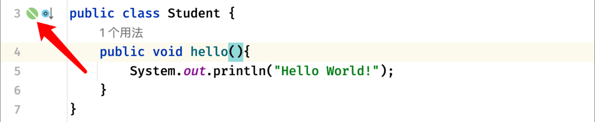
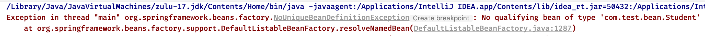
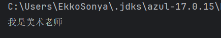
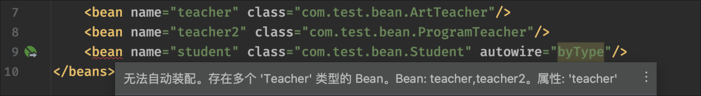

## IoC理论基础 2

### Bean注册与配置

详细了解一下如何向`Spring`注册`Bean`以及`Bean`的相关配置。

实际上我们的配置文件**可以有很多个**，并且这些配置文件是可以相互导入的：

```xml
<?xml version="1.0" encoding="UTF-8"?>
<beans ...>
    <import resource="test.xml"/>
</beans>
```

但是为了简单起见，我们还是从**单配置文件**开始讲起

#### 配置并注册`Bean`

首先我们需要知道如何配置Bean并注册。

要配置一个Bean，只需要添加：

```xml
<bean/>
```

但是这样写的话，Spring无法得知我们要配置的Bean到底是哪一个类，所以说我们还得指定对应的类才可以：

```xml
<bean class="com.test.bean.Student"/>
```



可以看到类的旁边出现了Bean的图标，表示我们的Bean已经注册成功了，这样，我们就可以根据类型向容器索要Bean实例对象了：

```java
public static void main(String[] args) {
    ApplicationContext context = new ClassPathXmlApplicationContext("test.xml");
    //getBean有多种形式，其中第一种就是根据类型获取对应的Bean
    //容器中只要注册了对应类的Bean或是对应类型子类的Bean，都可以获取到
    Student student = context.getBean(Student.class);
    student.hello();
}
```

表示，当我们尝试获取该类的`bean`来创建对象时，容器会去找注册的`bean`是否有对应的类或者其类的子类。

#### 创建对象的类存在多个对应`bean`

不过在有些时候，Bean的获取可能会出现歧义，我们可以来分别注册两个子类的Bean：

```java
public class ArtStudent extends Student{
    public void art(){
        System.out.println("我爱画画");
    }
}
```

```java
public class SportStudent extends Student{
        public void sport(){
        System.out.println("我爱运动");
    }
}
```

```xml
<bean class="com.test.bean.ArtStudent"/>
<bean class="com.test.bean.SportStudent"/>
```

但是此时我们在创建`Student`类时，获取`Bean`时会找到有两个子类都满足：

```java
Student student = context.getBean(Student.class);
student.hello();
```

运行时得到如下报错：



这里出现了一个`Bean`定义不唯一异常，很明显，因为我们需要的类型是`Student`，但是此时有两个`Bean`定义都满足这个类型，它们都是`Student`的子类，此时IoC容器不知道给我们返回哪一个`Bean`，所以就只能抛出异常了。

因此，如果我们需要一个Bean并且使用类型进行获取，那么必须要指明类型并且不能出现歧义：

```java
ArtStudent student = context.getBean(ArtStudent.class);
student.art();
```

#### `name`属性

那要是两个`Bean`的类型都是一样的呢？

```xml
<bean class="com.test.bean.Student"/>
<bean class="com.test.bean.Student"/>
```

这种情况下，就无法使用`Class`来进行区分了，除了为`Bean`指定对应类型之外，我们也可以为`Bean`指定一个名称用于区分：

```xml
<bean name="art" class="com.test.bean.ArtStudent"/>
<bean name="sport" class="com.test.bean.SportStudent"/>
```

`name`属性就是为这`个Bean`设定一个独一无二的名称（id属性也可以，跟name功能相同，但是会检查命名是否规范，否则会显示黄标）

不同的`Bean`名字不能相同，否则报错：

```xml
<bean name="a" class="com.test.bean.Student"/>
<bean name="b" class="com.test.bean.Student"/>
```

这样，这两个Bean我们就可以区分出来了：

```java
Student student = (Student) context.getBean("a");
student.hello();
```

虽然目前这两Bean定义都是一模一样的，也没什么区别，但是这确实是两个不同的Bean，只是类型一样而已，之后我们还可以为这两个Bean分别设置不同的其他属性。

#### `alias`别名

我们可以给Bean起名字，也可以起别名

```xml
<bean name="a" class="com.test.bean.Student"/>
<alias name="a" alias="test"/>
```

这样，我们使用别名也是可以拿到对应的Bean的：

```java
Student student = (Student) context.getBean("test");
student.hello();
```

#### IoC容器对象生成原理

那么现在又有新的问题了，IoC容器创建的Bean是只有一个还是每次索要的时候都会给我们一个新的对象？

我们现在在主方法中连续获取两次Bean对象：

```java
Student student1 = context.getBean(Student.class);
Student student2 = context.getBean(Student.class);
System.out.println(student1 == student2);   
//默认为单例模式，对象始终为同一个
```

我们发现，最后得到的结果为true

那么说明每次从IoC容器获取到的对象，**始终都是同一个**，默认情况下，通过IoC容器进行管理的Bean都是**单例模式**的，这个对象只会被创建一次。

如果我们希望每次拿到的对象都是一个新的，我们也可以将其**作用域进行修改**

这里一共有两种作用域，第一种是`singleton`，默认情况下就是这一种，当然还有`prototype`，表示为原型模式，这种模式每次得到的对象都是一个新的：

```java
Student student1 = context.getBean(Student.class);  
//原型模式下，对象不再始终是同一个了
Student student2 = context.getBean(Student.class);
System.out.println(student1 == student2);
```

实际上，当Bean的作用域为单例模式时，那么它会在**一开始（容器加载配置时）就被创建**，我们之后拿到的都是这个对象。

而处于原型模式下，**只有在获取时才会被创建**，也就是说，单例模式下，Bean会被IoC容器存储，只要容器没有被销毁，那么此对象将一直存在，而原型模式才是相当于在要用的时候直接new了一个对象，并不会被保存。

##### 懒加载 `lazy-init`

当然，如果我们希望单例模式下的Bean不用再一开始就加载，而是一样等到需要时再加载（加载后依然会被容器存储，之后一直使用这个对象了，不会再创建新的）我们也可以开启懒加载：

```xml
<bean class="com.test.bean.Student" lazy-init="true"/>
```

开启懒加载后，只有在真正第一次使用时才会创建对象。

##### 规定加载顺序 `depends-on`

因为单例模式下Bean是由IoC容器加载，但是加载顺序我们并不清楚，如果我们需要维护Bean的加载顺序（比如某个Bean必须要在另一个Bean之前创建）那么我们可以使用`depends-on`来设定前置加载Bean，这样被依赖的Bean一定会在之前加载，比如Teacher应该在Student之前加载：

```xml
<bean name="teacher" class="com.test.bean.Teacher"/>
<bean name="student" class="com.test.bean.Student" depends-on="teacher"/>
```

这样就可以保证Bean的加载顺序了。

### 依赖注入

依赖注入(Dependency Injection, DI)是一种设计模式，也是Spring框架的核心概念之一。

现在我们已经了解了如何注册和使用一个Bean，但是这样还远远不够，我们使用容器的目标之一是**消除类之间的强关联**.

其实现的主要功能是，IoC容器在创建对象时，会根据我们提供的信息作为对象的属性来提前注入到对象中

比如现在有一个教师接口：

```java
public interface Teacher {
    void teach();
}
```

具体的实现有两个：

```java
public class ArtTeacher implements Teacher{
    @Override
    public void teach() {
        System.out.println("我是美术老师，我教你画画！");
    }
}
```

```java
public class ProgramTeacher implements Teacher{
    @Override
    public void teach() {
        System.out.println("我是编程老师，我教你学Golang！");
    }
}
```

我们的学生一开始有一个老师教他，比如美术老师：

```java
public class Student {
    private Teacher teacher = new ArtTeacher();   
    //在以前，如果我们需要制定哪个老师教我们，直接new创建对应的对象就可以了
    public void study(){
        teacher.teach();
    }
}
```

但是我们发现，如果美术老师不教了，现在来了一个其他的老师教学生，那么就需要去修改`Student`类的定义：

```java
public class Student {
    private Teacher teacher = new ProgramTeacher();
    ...
}
```

可以想象一下，如果现在冒出来各种各样的类都需要这样去用`Teacher`，那么一旦`Teacher`的实现发生变化，会导致我们挨个对之前用到`Teacher`的类进行修改，这就很难受了。

而有了**依赖注入**之后，Student中的Teacher成员变量，可以由IoC容器来选择一个合适的Teacher对象进行赋值

也就是说，IoC容器在创建对象时，需要将我们预先给定的属性注入到对象中

#### `property` 标签

我们可以使用`property`标签来实现，将`bean`标签展开：

```xml
<bean name="mathTeacher" class="com.test.entity.MathTeacher"/>
<bean name="artTeacher" class="com.test.entity.ArtTeacher"/>
<bean class="com.test.entity.Student">
    <property name="teacher" ref="artTeacher"/>
</bean>
```

- `name`属性表示该注册的`bean`对应的对象的指定属性(`name`值)
- `ref`属性表示赋给这个属性的值来自另一个对应的`bean`注册对象中
- `value`属性表示赋给这个属性的值为`value`对应的值

同时我们还需要修改一下Student类，依赖注入要求对应的属性必须有一个set方法：

```java
public class Student {
    private Teacher teacher;
    //要使用依赖注入，我们必须提供一个set方法（无论成员变量的访问权限是什么）命名规则依然是驼峰命名法
    public void setTeacher(Teacher teacher) {
        this.teacher = teacher;
    }
    ...
}
```


使用`property`来指定需要注入的值是一个Bean，这里我们选择ProgramTeacher，那么在使用时，Student类中的得到的就是这个Bean的对象了：

```java
Student student = context.getBean(Student.class);
student.study();
```



可以看到，现在我们的Java代码中，没有出现任何的具体实现类信息（ArtTeacher、ProgramTeacher都没出现）取而代之的是那一堆xml配置

这样，就算我们切换老师的实现为另一个类，也不用去调整代码，只需要变动一下Bean的类型就可以：

```xml
<!--  只需要修改这里的class即可，现在改为ArtTeacher  -->
<bean name="mathTeacher" class="com.test.entity.MathTeacher"/>
<bean name="artTeacher" class="com.test.entity.ArtTeacher"/>
<bean class="com.test.entity.Student">
    <property name="teacher" ref="mathTeacher"/>
</bean>
```

这样，这个Bean的class就变成了新的类型，并且我们不需要再去调整其他位置的代码

通过依赖注入，是不是开始逐渐感受到Spring为我们带来的便利了？

当然，依赖注入并不一定要注入其他的Bean，也可以是一个简单的值：

```java
<bean name="student" class="com.test.bean.Student">
    <property name="name" value="卢本伟"/>
</bean>
```

直接使用`value`可以直接传入一个具体值。

#### 构造注入 `constructor-arg` 标签

实际上，在很多情况下，类中的某些参数是**在构造方法中就已经完成初始化**，而不是创建之后，比如：

```java
public class Student {
    private final Teacher teacher;   
    //构造方法中完成，所以说是一个final变量

    public Student(Teacher teacher){  
        //Teacher属性是在构造方法中完成的初始化
        this.teacher = teacher;
    }
    ...
}
```

很明显，是因为我们修改了构造方法，IoC容器默认只会调用无参构造，所以，我们需要指明一个可以用的构造方法

我们展开bean标签，添加一个`constructor-arg`标签：

```xml
<bean name="mathTeacher" class="com.test.entity.MathTeacher"/>
<bean name="artTeacher" class="com.test.entity.ArtTeacher"/>
<bean class="com.test.entity.Student">
    <constructor-arg name="teacher" ref="artTeacher"/>
</bean>
```

这里的`constructor-arg`就是构造方法的一个参数，这个参数可以写很多个，会自动匹配符合里面参数数量的构造方法，这里匹配的就是我们刚刚编写的需要一个参数的构造方法。

通过这种方式，我们也能实现依赖注入，只不过现在我们将依赖注入的时机**提前到了对象构造时**。

##### 多种构造函数情况

现在我们的Student类中是这样定义的：

```java
public class Student {
    private final String name;
    public Student(String name){
        System.out.println("我是一号构造方法");
        this.name = name;
    }

    public Student(int age){
        System.out.println("我是二号构造方法");
        this.name = String.valueOf(age);
    }
}
```

此时我们希望使用的是二号构造方法，那么怎么才能指定呢？

有2种方式，我们可以给标签添加类型：

```xml
<constructor-arg value="1" type="int"/>
```

也可以指定为对应的参数名称：

```xml
<constructor-arg value="1" name="age"/>
```

如果是参数数量不同，就根据参数数量来区分就行

反正只要能够保证**我们指定的参数匹配到目标构造方法**即可。

##### 集合类型情况

现在我们的类中出现了一个比较特殊的类型，它是一个集合类型：

```java
public class Student {
    private List<String> list;

    public void setList(List<String> list) {
        this.list = list;
    }
}
```

对于这种集合类型，有着特殊的支持：

```xml
<bean name="student" class="com.test.bean.Student">
    <!--  对于集合类型，我们可以直接使用标签编辑集合的默认值  -->
    <property name="list">
        <list>
            <value>AAA</value>
            <value>BBB</value>
            <value>CCC</value>
        </list>
    </property>
</bean>
```

不仅仅是List，Map、Set这类常用集合类包括数组在内，都是支持这样编写的，比如Map类型，我们也可以使用`entry`来注入：

```xml
<bean name="student" class="com.test.bean.Student">
    <property name="map">
        <map>
            <entry key="语文" value="100.0"/>
            <entry key="数学" value="80.0"/>
            <entry key="英语" value="92.5"/>
        </map>
    </property>
</bean>
```

至此，我们就已经完成了两种依赖注入的学习：

- Setter依赖注入：通过成员属性对应的set方法完成注入。
- 构造方法依赖注入：通过构造方法完成注入。

### 自动装配 `autowire` 属性

在之前，如果我们需要使用依赖注入的话，我们需要对`property`参数进行配置：

```xml
<bean name="student" class="com.test.bean.Student">
    <property name="teacher" ref="teacher"/>
</bean>
```

但是有些时候为了方便，我们也可以开启**自动装配**。

自动装配就是让IoC容器**自己去寻找需要填入的**值，我们只需要将set方法提供好就可以了，这里需要添加autowire属性：

```xml
<bean name="student" class="com.test.bean.Student" autowire="byType"/>
```

#### `byName` + `byType`

`autowire`属性最普通的有两个值

一个是byName，还有一个是byType

顾名思义，一个是根据类型(即对应的类或者其子类)去寻找合适的Bean自动装配

还有一个是根据名字(根据`setxxx`中的`xxx`)去找，这样我们就不需要显式指定`property`了。

此时set方法旁边会出现一个自动装配图标，效果和上面是一样的。

#### `constructor`

对于使用构造方法完成的依赖注入，也支持自动装配，我们只需要将autowire修改为：

```xml
<bean name="student" class="com.test.bean.Student" autowire="constructor"/>
```

这样，我们只需要提供一个对应参数的构造方法就可以了（这种情况**默认也是byType寻找**的）

这样同样可以完成自动注入

#### 候选名单 `autowire-candidate`

自动化的东西虽然省事，但是太过机械，有些时候，自动装配可能会遇到一些问题，比如出现了下面的情况：



此时，由于`autowire`的规则为byType，存在两个候选Bean，但是我们其实希望ProgramTeacher这个Bean在任何情况下都不参与到自动装配中，此时我们就可以将它的自动装配候选关闭：

```xml
<bean name="teacher" class="com.test.bean.ArtTeacher"/>
<bean name="teacher2" class="com.test.bean.ProgramTeacher" autowire-candidate="false"/>
<bean name="student" class="com.test.bean.Student" autowire="byType"/>
```

当`autowire-candidate`设定false时，这个Bean将不再作为自动装配的候选Bean，此时自动装配候选就只剩下一个唯一的Bean了，报错消失，程序可以正常运行。

#### 优先选择 `primary`

除了这种方式，我们也可以设定primary属性，表示这个Bean作为主要的Bean，当出现歧义时，也会优先选择：

```xml
<bean name="teacher" class="com.test.bean.ArtTeacher" primary="true"/>
<bean name="teacher2" class="com.test.bean.ProgramTeacher"/>
<bean name="student" class="com.test.bean.Student" autowire="byType"/>
```
