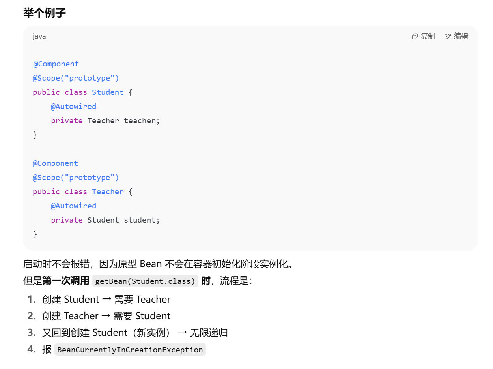
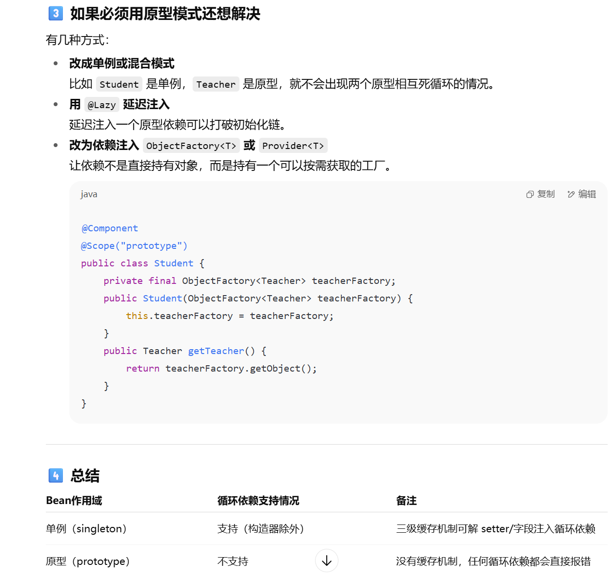

## IoC理论基础 5

### 使用注解开发

前面我们已经完成了大部分的配置文件学习，但是我们发现，使用配置文件进行配置，似乎有点复杂

可以想象一下，如果我们的项目非常庞大，整个配置文件将会充满Bean配置，并且会继续庞大下去。

所以可以用注解来进行配置

#### `AnnotationConfigApplicationContext()`

既然现在要使用注解来进行开发，那么我们就删掉之前的xml配置文件吧，我们来看看使用注解能有多方便。

```java
ApplicationContext context = new AnnotationConfigApplicationContext();
```

现在我们使用`AnnotationConfigApplicationContext`作为上下文实现，它是注解配置的。

既然现在采用注解，我们就需要使用类来编写配置文件

只需要创建一个配置类就可以了：

```java
@Configuration
public class MainConfiguration {
}
```

我们可以为`AnnotationConfigApplicationContext`指定一个默认的配置类：

这个构造方法可以接收多个配置类（更准确的说是多个组件）

```java
//这个构造方法可以接收多个配置类（更准确的说是多个组件）
ApplicationContext context = new AnnotationConfigApplicationContext(MainConfiguration.class);
```

#### 注册`Bean` (`@Bean(xxx)`)

那么现在我们该如何配置Bean呢？

`@Bean` 中包含的属性：

```java
@Target({ElementType.METHOD, ElementType.ANNOTATION_TYPE})
@Retention(RetentionPolicy.RUNTIME)
@Documented
public @interface Bean {
    @AliasFor("name")
    String[] value() default {};

    @AliasFor("value")
    String[] name() default {};

    boolean autowireCandidate() default true;

    String initMethod() default "";

    String destroyMethod() default "(inferred)";
}
```

具体例子：

```java
@Configuration
public class MainConfiguration {

    @Bean("student")
    public Student student(){
        return new Student();
    }
}
```

这样写相对于配置文件中的：

```xml
<?xml version="1.0" encoding="UTF-8"?>
<beans xmlns="http://www.springframework.org/schema/beans"
       xmlns:xsi="http://www.w3.org/2001/XMLSchema-instance"
       xsi:schemaLocation="http://www.springframework.org/schema/beans
        https://www.springframework.org/schema/beans/spring-beans.xsd">
    <bean name = "student" class="com.test.bean.Student"/>
</beans>
```

#### 引入其他配置类 `@Import`

多个配置合并成一个再集体导入

通过`@Import`还可以引入其他配置类：

```java
@Import(LBWConfiguration.class)
//在讲解到Spring原理时，我们还会遇到它，目前只做了解即可。
@Configuration
public class MainConfiguration {}
```

#### 具体使用

只不过现在变成了由Java代码为我们提供Bean配置，这样会更加的灵活，也更加便于控制Bean对象的创建。

```java
ApplicationContext context = new AnnotationConfigApplicationContext(MainConfiguration.class);
Student student = context.getBean(Student.class);
System.out.println(student);
```

使用方法是相同的，这跟使用XML配置是一样的。

#### `@Bean`设置的配置

初始化方法和摧毁方法、自动装配可以直接在@Bean注解中进行配置：

```java
@Bean(name = "", initMethod = "", destroyMethod = "", autowireCandidate = false)
public Student student(){
    return new Student();
}
```

#### 其他注解设置的配置 (lazy, 单例/原型@Scope 等)

其次，我们可以使用一些其他的注解来配置其他属性，比如：

```java
@Bean
@Lazy(true)     //对应lazy-init属性
@Scope("prototype")    //对应scope属性 是单例还是原型
@DependsOn("teacher")    //对应depends-on属性
public Student student(){
    return new Student();
}
```

#### 依赖注入的配置

对于那些我们需要通过构造方法或是Setter完成依赖注入的Bean，比如：

```xml
<bean name="teacher" class="com.test.bean.ProgramTeacher"/>
<bean name="student" class="com.test.bean.Student">
    <property name="teacher" ref="teacher"/>
</bean>
```

像这种需要引入其他Bean进行的注入，我们可以直接将其作为形式参数放到方法中：

```java
@Configuration
public class MainConfiguration {
    @Bean
    public Teacher teacher(){
        return new Teacher();
    }

    @Bean
    public Student student(Teacher teacher){
        return new Student(teacher);
        // 要有对应的构造函数或者对应setteacher
    }
}
```

此时我们可以看到，旁边已经出现图标了：


运行程序之后，我们发现，这样确实可以直接得到对应的Bean并使用。

##### 自动装配 `@Autowired`

只不过，除了这种基于构造器或是Setter的依赖注入之外，我们也可以直接到Bean对应的类中使用自动装配：

```java
public class Student {
    @Autowired   
    //使用此注解来进行自动装配，由IoC容器自动为其赋值
    private Teacher teacher;
}
```

现在，我们甚至连构造方法和Setter都不需要去编写了，就能直接完成自动装配

很快，应该是根据对应的属性的类去找有没有对应的`Bean`，不需要给`Bean`取别名对应

当然，`@Autowired`并不是只能用于字段，对于构造方法或是Setter，它同样可以：

```java
public class Student {
    private Teacher teacher;

    @Autowired
    public void setTeacher(Teacher teacher) {
        this.teacher = teacher;
    }
}
```

##### 指定装配 `@Qualifier`

`@Autowired`默认采用`byType`的方式进行自动装配，也就是说会使用类型进行配

那么要是出现了多个相同类型的Bean，如果我们想要指定使用其中的某一个该怎么办呢？

```java
@Bean("a")
public Teacher teacherA(){
    return new Teacher();
}

@Bean("b")
public Teacher teacherB(){
    return new Teacher();
}
```

此时，我们可以配合`@Qualifier`进行名称匹配：

```java
public class Student {
    @Autowired
    @Qualifier("a")   //匹配名称为a的Teacher类型的Bean
    private Teacher teacher;
}
```

##### `@Resource` (移除)

这里需要提一下，在我们旧版本的SSM教程中讲解了`@Resource`这个注解，但是现在它没有了。

随着Java版本的更新迭代，某些javax包下的包，会被逐渐弃用并移除。在JDK11版本以后，`javax.annotation`这个包被移除并且更名为`jakarta.annotation`

其中有一个非常重要的注解，叫做`@Resource`，它的作用与`@Autowired`时相同的，也可以实现自动装配，但是在IDEA中并不推荐使用`@Autowired`注解对成员字段进行自动装配，而是推荐使用`@Resource`，如果需要使用这个注解，还需要额外导入包：

```xml
<dependency>
    <groupId>jakarta.annotation</groupId>
    <artifactId>jakarta.annotation-api</artifactId>
    <version>2.1.1</version>
</dependency>
```

使用方法一样，直接替换掉就可以了：

```java
public class Student {
    @Resource
    private Teacher teacher;
}
```

只不过，他们两有些机制上的不同：

- @Resource默认**ByName**如果找不到则**ByType**，可以添加到set方法、字段上。
- @Autowired默认是**byType**，只会根据类型寻找，可以添加在构造方法、set方法、字段、方法参数上。

因为`@Resource`的匹配机制更加合理高效，因此官方并不推荐使用`@Autowired`字段注入

当然，实际上Spring官方更推荐我们使用基于构造方法或是Setter的`@Autowired`注入，比如S etter 注入的一个好处是，Setter 方法使该类的对象能够在以后重新配置或重新注入。

其实，最后使用哪个注解，还是看你自己，要是有强迫症不能忍受黄标但是又实在想用字段注入，那就用@Resource注解。

#### 初始化和销毁注解

除了这个注解之外，还有`@PostConstruct`和`@PreDestroy`，它们效果和`init-method`和`destroy-method`是一样的：

```java
@PostConstruct
public void init(){
    System.out.println("我是初始化方法");
}

@PreDestroy
public void destroy(){
    System.out.println("我是销毁方法");
}
```

我们只需要将其添加到对应的方法上即可：

```java
AnnotationConfigApplicationContext context = new AnnotationConfigApplicationContext(MainConfiguration.class);
Student student = context.getBean(Student.class);
context.close();
```

可以看到效果是完全一样的，这些注解都是`jakarta.annotation`提供的，有关Spring和JakartaEE的渊源，还请各位小伙伴自行了解。

#### `@Component`(常用注册Bean方式)

前面我们介绍了使用@Bean来注册Bean，但是实际上我们发现，如果只是简单将一个类作为Bean的话，这样写还是不太方便，因为都是固定模式，**就是单纯的new一个对象出来**，能不能像之前一样，让容器自己反射获取构造方法去生成这个对象呢？

肯定是可以的，我们可以在需要注册为Bean的类上添加`@Component`注解来将一个类进行注册(**现在最常用的方式**)

不过要实现这样的方式，我们需要添加一个自动扫描 `@ComponentScan` 来告诉Spring，它需要在哪些包中查找我们提供的`@Component`声明的Bean。

```java
@Component("penguin")   //同样可以自己起名字
public class Student {

}
```

要注册这个类的Bean，只需要添加`@Component`即可，然后配置一下包扫描：

```java
@Configuration
@ComponentScan("com.test.bean")   
//包扫描，这样Spring就会去扫描对应包下所有的类
public class MainConfiguration {

}
```

或者

```java
@Configuration
@ComponentScans({
    @ComponentScan("com.test.bean")
    ...
})
public class MainConfiguration {

}
```

Spring在扫描对应包下所有的类时，会自动将那些添加了@Component的类注册为Bean

只不过这种方式只适用于我们自己编写类的情况，如果是第三方包提供的类，只能使用前者完成注册，并且这种方式并不是那么的灵活。

#### 默认`name`命名

不过，无论是通过`@Bean`还是`@Component`形式注册的Bean，Spring都会为其添加一个默认的name属性，比如：

```java
@Component
public class Student {
}
```

它的默认名称生产规则依然是**类名并按照首字母小写的驼峰命名法**来的，所以说对应的就是student：

```java
Student student = (Student) context.getBean("student");   
//这样同样可以获取到
System.out.println(student);
```

同样的，如果是通过`@Bean`注册的，默认名称是对应的方法名称：

```java
@Bean
public Student artStudent(){
    return new Student();
}
```

```java
Student student = (Student) context.getBean("artStudent");
System.out.println(student);
```

#### 其他

相比传统的XML配置方式，注解形式的配置确实能够减少我们很多工作量。

并且，对于这种使用`@Component`注册的Bean，如果其构造方法不是默认无参构造，**那么默认会对其每一个参数都进行自动注入**：

```java
@Component
public class Student {
    Teacher teacher;
    public Student(Teacher teacher){   
        //如果有Teacher类型的Bean，那么这里的参数会被自动注入
        this.teacher = teacher;
    }
}
```

#### 工厂模式处理

最后，对于我们之前使用的工厂模式，Spring也提供了接口，我们可以直接实现接口表示这个Bean是一个工厂Bean：

```java
@Component
public class StudentFactory implements FactoryBean<Student> {
    @Override
    public Student getObject() {   //生产的Bean对象
        return new Student();
    }

    @Override
    public Class<?> getObjectType() {   //生产的Bean类型
        return Student.class;
    }

    @Override
    public boolean isSingleton() {   //生产的Bean是否采用单例模式
        return false;
    }
}
```

#### 讨论

实际上跟我们之前在配置文件中编写是一样的，这里就不多说了。

请注意，使用注解虽然可以省事很多，代码也能变得更简洁，但是这并不代表XML配置文件就是没有意义的，它们有着各自的优点，在不同的场景下合理使用，能够起到事半功倍的效果，官方原文：

> Are annotations better than XML for configuring Spring?
>
> The introduction of annotation-based configuration raised the question of whether this approach is “better” than XML. The short answer is “it depends.” The long answer is that each approach has its pros and cons, and, usually, it is up to the developer to decide which strategy suits them better. Due to the way they are defined, annotations provide a lot of context in their declaration, leading to shorter and more concise configuration. However, XML excels at wiring up components without touching their source code or recompiling them. Some developers prefer having the wiring close to the source while others argue that annotated classes are no longer POJOs and, furthermore, that the configuration becomes decentralized and harder to control.
>
> No matter the choice, Spring can accommodate both styles and even mix them together. It is worth pointing out that through its [JavaConfig](https://docs.spring.io/spring-framework/docs/current/reference/html/core.html#beans-java) option, Spring lets annotations be used in a non-invasive way, without touching the target components source code and that, in terms of tooling, all configuration styles are supported by the [Spring Tools for Eclipse](https://spring.io/tools).

在最后，留一个问题，现在有两个类：

```java
@Component
public class Student {
    @Resource
    private Teacher teacher;
}
```

```java
@Component
public class Teacher {
    @Resource
    private Student student;
}
```

这两个类互相需要注入对方的实例对象，这个时候Spring会怎么进行处理呢？

测试了，加了这种注解是可以正常运行的不会报错，但如果我改成这样：

```java
@Component
public class Student {
    @Autowired
    private Teacher teacher;
}
```

```java
@Component
public class Teacher {
    @Autowired
    private Student student;
}
```

就会报错：

```java
月 06, 2025 11:57:12 下午 org.springframework.context.support.AbstractApplicationContext refresh
警告: Exception encountered during context initialization - cancelling refresh attempt: org.springframework.beans.factory.UnsatisfiedDependencyException: 
    Error creating bean with name 'student' defined in file: Unsatisfied dependency expressed through constructor parameter 0: Error creating bean with name 'teacher' defined in file : Unsatisfied dependency expressed through constructor parameter 0: Error creating bean with name 'student': Requested bean is currently in creation: 
    Is there an unresolvable circular reference?
```

问了GPT回答：

在 构造器注入 的情况下，Spring 必须一次性把依赖注入进去，无法像 setter注入 或 字段注入 那样延迟注入，因此两个类互相通过构造器注入会导致无法完成初始化。

而采用 `@Autowired`，可以让 Spring 能先创建一个 Bean 再回头注入依赖。

或者如果一定用构造器注入，可以用 @Lazy 让其中一个依赖延迟到使用时再初始化。

```java
@Component
public class Student {
    private final Teacher teacher;
    public Student(@Lazy Teacher teacher) {
        this.teacher = teacher;
    }
}
```

这样 Spring 创建 Student 时不会立刻去创建 Teacher，避免循环依赖。

如果Bean变成原型模式，Spring又会怎么处理呢？

对于单例情况：

- 单例 Bean 的循环依赖（构造器以外）时，Spring 可以用 三级缓存（三级缓存机制） 暂存早期引用，允许先暴露一个“半成品”Bean，让另一个 Bean 注入，最后再完成填充。

- 但是 构造器注入 场景下没法这么干，因为构造函数必须一次性拿到所有参数，Spring 没法先造个半成品放进去。

但对于原型模式：

原型 Bean 是 每次请求都会新建一个实例，Spring 不会缓存它。
这意味着：

- 对于 原型 Bean 的循环依赖，Spring 完全没有缓存机制可用
  所以即使是 setter/字段注入，Spring 也无法像单例那样从缓存取“早期引用”来解循环
  
- 结果就是：无论是构造器注入还是 setter 注入，只要原型 Bean有循环依赖，都会直接报错



