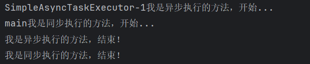
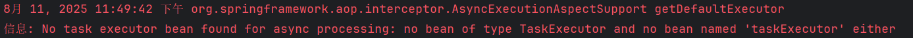
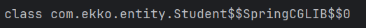
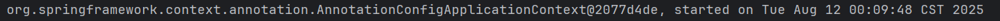

## Spring高级特性1

### Bean Aware

在Spring中提供了一些以`Aware`结尾的接口，实现了`Aware`接口的`bean`在被初始化之后，可以获取相应资源。

Aware的中文意思为**感知**。

简单来说，他就是一个标识，实现此接口的类会获得某些感知能力，Spring容器会**在Bean被加载时**，根据类实现的感知接口，**会调用类中实现的对应感知方法**。

比如`BeanNameAware`之类的以`Aware`结尾的接口，这个接口获取的资源就是`BeanName`：

```java
@Component
public class Student implements BeanNameAware {
    //我们只需要实现这个接口就可以了

    @Override
    public void setBeanName(String name) {   
        //Bean在加载的时候，容器就会自动调用此方法，将Bean的名称给到我们
        System.out.println("我在加载阶段获得了Bean名字："+name);
    }
}
```

又比如`BeanClassLoaderAware`，那么它能够使得我们可以在`Bean`加载阶段就获取到当前Bean的类加载器：

```java
@Component
public class Student implements BeanClassLoaderAware {

    @Override
    public void setBeanClassLoader(ClassLoader classLoader) {
        System.out.println(classLoader);
    }
}
```

### 任务调度

为了执行某些任务，我们可能需要一些非常规的操作

比如我们希望使用多线程来处理我们的结果或是执行一些定时任务，到达指定时间再去执行。

这时我们首先想到的就是创建一个新的线程来处理，或是使用TimerTask来完成定时任务

但是我们有了Spring框架之后，就不用这样了，因为Spring框架为我们提供了更加便捷的方式进行任务调度。

#### 异步任务执行 `@Async`

我们需要在配置类上添加`@EnableAsync`注解。

```java
@EnableAsync
@Configuration
@ComponentScan("com.test.bean")
public class MainConfiguration {
    ...
}
```

接着我们只需要在需要异步执行的方法上，添加`@Async`注解即可将此方法标记为异步，当此方法被调用时，会异步执行，也就是新开一个线程执行，而不是在当前线程执行。

```java
@Component
public class Student {
    public void syncTest() throws InterruptedException {
        System.out.println(Thread.currentThread().getName()+"我是同步执行的方法，开始...");
        Thread.sleep(3000);
        System.out.println("我是同步执行的方法，结束！");
    }

    @Async
    public void asyncTest() throws InterruptedException {
        System.out.println(Thread.currentThread().getName()+"我是异步执行的方法，开始...");
        Thread.sleep(3000);
        System.out.println("我是异步执行的方法，结束！");
    }
}
```

现在我们在主方法中分别调用一下试试看：

```java
public static void main(String[] args) throws InterruptedException {
    AnnotationConfigApplicationContext context = new AnnotationConfigApplicationContext(MainConfiguration.class);
    Student student = context.getBean(Student.class);
    student.asyncTest();   //异步执行
    student.syncTest();    //同步执行
}
```

执行结果为：



很明显，异步执行的任务并不是在当前线程启动的，而是在其他线程启动的，所以说并不会在当前线程阻塞，可以看到马上就开始执行下一行代码，调用同步执行的任务了。

因此，当我们要将`Bean`的某个方法设计为异步执行时，就可以直接添加这个注解。

但是需要注意，添加此注解要求方法的**返回值只能是void或是Future类型**才可以

还有，在使用时，可能还会出现这样的信息：



虽然出现了这样的信息，但是我们的程序依然可以正常运行，这是因为Spring默认会从容器中选择一个`Executor`类型（JUC有关）的实例，并使用它来创建线程执行任务

这是Spring推荐的方式，当然，如果没有找到，那么会使用自带的 `SimpleAsyncTaskExecutor` 处理异步方法调用。

##### 原理

这个方法很明显我们并没有去编写异步执行的逻辑，那么为什么会异步执行呢？

这里很明显是同步调用的方法。的确，如果这个Bean只是一个简简单单的Student类型的对象，确实做不到。但是它真的只是一个简简单单的Student类型对象吗？

```java
Student student = context.getBean(Student.class);
System.out.println(student.getClass());   
//这里我们通过getClass来获取一下类型，你会发现惊喜
```

我们来看看结果：



实际上Spring帮助我们动态生成的一个**代理类**，我们原本的类代码已经被修改了，当然，这只是冰山一角，能做到这样的操作，这其实都是`AOP`的功劳。

#### 定时任务 `@Scheduled`

定时任务其实就是指定在哪个时候再去执行，在JavaSE阶段使用过`TimerTask`来执行定时任务。

Spring中的定时任务是**全局性质**的，当我们的Spring程序启动后，那么定时任务也就跟着启动了，我们可以在配置类上添加`@EnableScheduling`注解：

不需要调用，默认启动就会运行

```java
@EnableScheduling
@Configuration
@ComponentScan("com.test.bean")
public class MainConfiguration {
    ...
}
```

接着我们可以直接在配置类里面编写定时任务，把我们要做的任务写成方法，并添加`@Scheduled`注解：

```java
@Scheduled(fixedRate = 2000)   //单位依然是毫秒，这里是每两秒钟打印一次
public void task(){
    System.out.println("我是定时任务！"+new Date());
}
```

我们注意到`@Scheduled`中有很多参数

我们需要指定'cron', 'fixedDelay(String)', or 'fixedRate(String)'的其中一个，否则无法创建定时任务，他们的区别如下：

- fixedDelay：在上一次定时任务执行完之后，间隔多久继续执行。
- fixedRate：无论上一次定时任务有没有执行完成，两次任务之间的时间间隔。
- cron：如果嫌上面两个不够灵活，你还可以使用cron表达式来指定任务计划。

这里简单讲解一下cron表达式：<https://blog.csdn.net/sunnyzyq/article/details/98597252>

### 监听器 `ApplicationListener<xxx>`

监听实际上就是**等待某个事件的触发**，当事件触发时，**对应事件的监听器就会被通知**

监听器可是很关键的，只不过在Spring中用的不是很频繁罢了。

但是这里还是要简单介绍一下：

```java
@Component
public class TestListener implements ApplicationListener<ContextRefreshedEvent> {
    @Override
    public void onApplicationEvent(ContextRefreshedEvent event) {
        System.out.println(event.getApplicationContext());
        //可以直接通过事件获取到事件相关的东西
    }
}
```

要编写监听器，我们只需要让`Bean`继承`ApplicationListener`就可以了，并且将类型指定为对应的`Event`事件

这样，当发生某个事件时就会通知我们，比如`ContextRefreshedEvent`，这个事件**会在Spring容器初始化完成会触发一次**：



#### 自定义事件 `ApplicationEvent`

Spring内部有各种各样的事件

我们也可以自己编写事件，然后在某个时刻发布这个事件到所有的监听器：

```java
public class TestEvent extends ApplicationEvent {   
    // 自定义事件需要继承ApplicationEvent
    public TestEvent(Object source) {
        super(source);
    }
}
```

对应设置监听器

```java
@Component
public class TestListener implements ApplicationListener<TestEvent> {
    @Override
    public void onApplicationEvent(TestEvent event) {
        System.out.println("发生了一次自定义事件，成功监听到！");
    }
}
```

比如现在我们希望在定时任务中每秒钟发生一次这个事件：

```java
@Component
public class TaskComponent implements ApplicationEventPublisherAware {  
    // 要发布事件，需要拿到ApplicationEventPublisher
    // 这里我们通过Aware在初始化的时候拿到
    // 实际上我们的ApplicationContext
    // 就是ApplicationEventPublisher的实现类
    // 这里拿到的就是 我们创建的ApplicationContext对象
    ApplicationEventPublisher publisher;

    @Scheduled(fixedRate = 1000)   //一秒一次
    public void task(){
        // 直接通过ApplicationEventPublisher的publishEvent方法发布事件
        // 这样，所有这个事件的监听器，都会监听到这个事件发生了
        publisher.publishEvent(new TestEvent(this));
    }

    @Override
    public void setApplicationEventPublisher(ApplicationEventPublisher publisher) {
        this.publisher = publisher;
    }
}
```

根据提示，其实我们可以在`main`里面直接发布事件：

```java
public class Main {
    public static void main(String[] args) throws InterruptedException {
        ApplicationContext context = new AnnotationConfigApplicationContext(MainConfiguration.class);
        context.publishEvent(new TestEvent(context.getBean(Student.class)));
    }
}
```

对应的事件的`source`参数随便给一个对象就行，表示这个事件的源头


