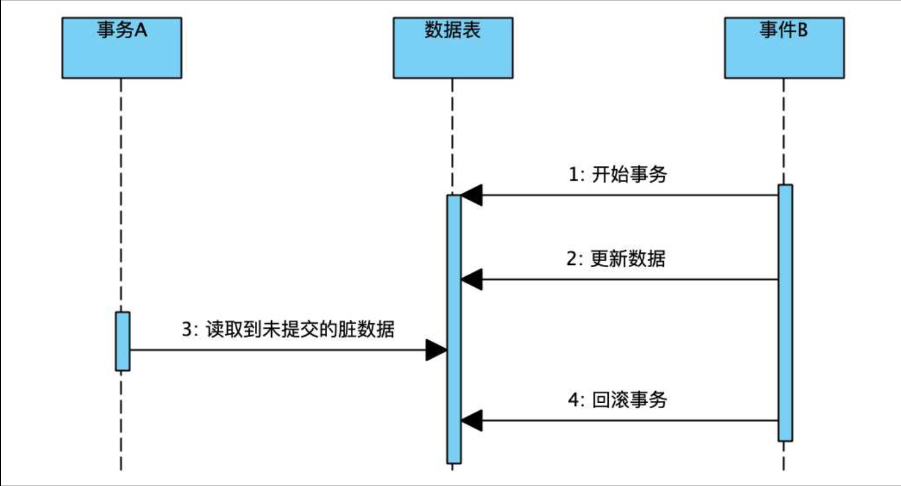
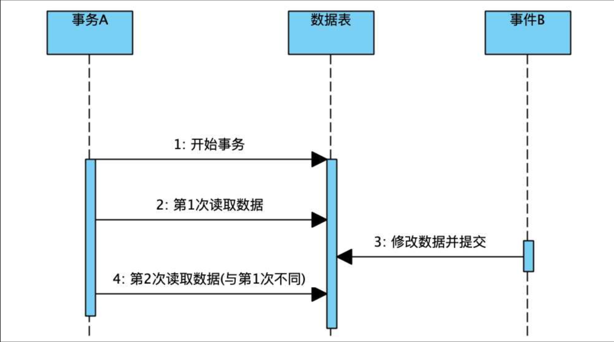
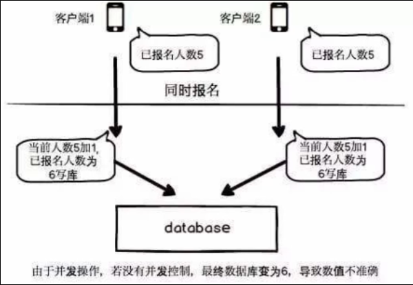
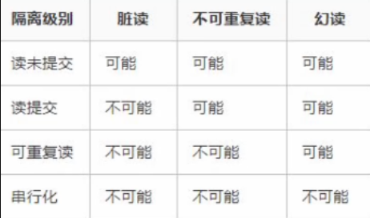
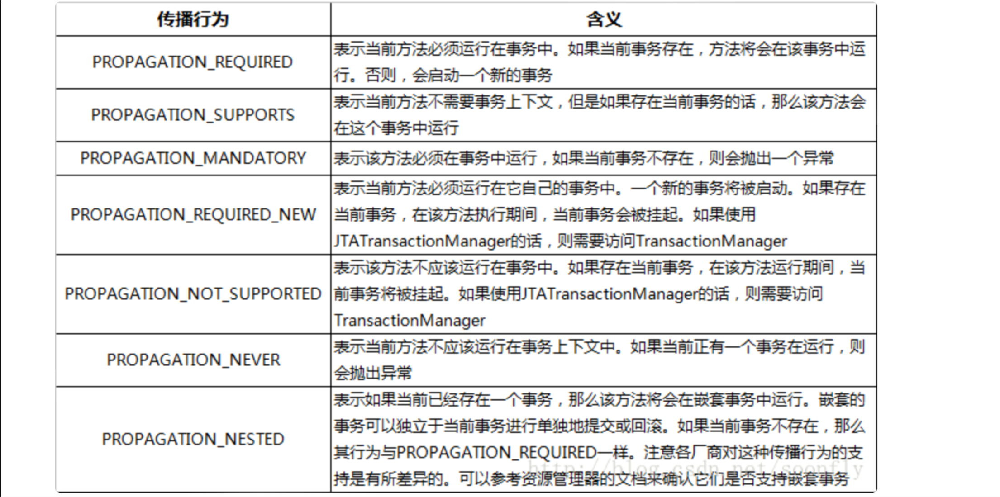

## 数据库框架整合3

### Mybatis事务管理

通过将对应的Bean类型注册到容器中，就能更加方便的去使用Mapper

接着来看Spring的事务控制。

#### 事务机制回顾

回顾一下事务机制。首先事务遵循一个`ACID`原则：

- 原子性（Atomicity）：事务是一个原子操作，由一系列动作组成。事务的原子性确保动作要么全部完成，要么完全不起作用。
- 一致性（Consistency）：一旦事务完成（不管成功还是失败），系统必须确保它所建模的业务处于一致的状态，而不会是部分完成部分失败。在现实中的数据不应该被破坏。类比银行转账，从一个账号扣款，另一个账号增款，必须保证总金额不变。
- 隔离性（Isolation）：可能有许多事务会同时处理相同的数据，因此每个事务都应该与其他事务隔离开来，防止数据损坏。类比多个人同时编辑同一文档，每个人看到的结果都是独立的，不会受其他人的影响，不过难免会存在冲突。
- 持久性（Durability）：一旦事务完成，无论发生什么系统错误，它的结果都不应该受到影响，这样就能从任何系统崩溃中恢复过来。通常情况下，事务的结果被写到持久化存储器中。类比写入硬盘的文件，即使关机重启，文件仍然存在。

简单来说，事务就是要么完成，要么就啥都别做！并且不同的事务之间相互隔离，互不干扰。

#### 隔离机制

那么我们接着来深入了解一下事务的**隔离机制**

> 个人理解：隔离机制就是规定不同事务来接触数据库时，所获得的数据信息的规则
> 当多个事务（Transaction）同时执行时，数据库需要通过一定的规则和策略，
> 保证这些事务之间不会互相干扰，从而确保数据的一致性和正确性。

事务之间是相互隔离互不干扰的，那么如果出现了下面的情况，会怎么样呢：

> 当两个事务同时在执行，并且同时在操作同一个数据，这样很容易出现并发相关的问题，比如一个事务先读取了某条数据，而另一个事务此时修改了此数据，当前一个事务紧接着再次读取时，会导致和前一次读取的数据不一致，这就是一种典型的数据虚读现象。

因此，为了解决这些问题，事务之间实际上是存在一些**隔离级别**的：

- ISOLATION_READ_UNCOMMITTED（读未提交）：其他事务会读取当前事务尚未更改的提交（相当于读取的是这个事务暂时缓存的内容，并不是数据库中的内容）
- ISOLATION_READ_COMMITTED（读已提交）：其他事务会读取当前事务已经提交的数据（也就是直接读取数据库中已经发生更改的内容）
- ISOLATION_REPEATABLE_READ（可重复读）：其他事务会读取当前事务已经提交的数据并且其他事务执行过程中**不允许再进行数据修改**（注意这里仅仅是不允许修改数据）
- ISOLATION_SERIALIZABLE（串行化）：它完全服从ACID原则，一个事务必须等待其他事务结束之后才能开始执行，相当于挨个执行，效率很低

我们依次来看看，不同的隔离级别会导致什么问题。

##### `读未提交`

首先是`读未提交`级别，此级别属于最低级别，相当于各个事务共享一个缓存区域，任何事务的操作都在这里进行。

那么它会导致以下问题 (脏读)：



也就是说，事务A最后得到的实际上是一个毫无意义的数据（事务B已经回滚了）

我们称此数据为"脏数据"，这种现象称为**脏读**

##### `读已提交`

我们接着来看`读已提交`级别，事务**只能读取其他事务已经提交的内容**，相当于直接从数据中读取数据，这样就可以避免**脏读**问题了，但是它还是存在以下问题：



这正是我们前面例子中提到的问题，虽然它避免了脏读问题，但是如果事件B修改并提交了数据，那么实际上事务A之前读取到的数据依然不是最新的数据，直接导致两次读取的数据不一致

这种现象称为**虚读**也可以称为**不可重复读**

##### `可重复读`

因此，下一个隔离级别`可重复读`就能够解决这样的问题（MySQL的默认隔离级别）

它规定**在其他事务执行时，不允许修改数据**，这样，就可以有效地避免不可重复读的问题

但是这里仅仅是禁止了事务执行过程中的UPDATE操作，但是它并没有禁止`INSERT`这类操作，因此，如果事务A执行过程中事务B插入了新的数据，那么A这时是毫不知情的，比如：



两个人同时报名一个活动，两个报名的事务同时在进行，但是他们一开始读取到的人数都是5，而这时，它们都会认为报名成功后人数应该变成6，而正常情况下应该是7

因此这个时候就发生了数据的**幻读**现象。

##### `串行化`

因此，要解决这种问题，只能使用最后一种隔离级别`串行化`来实现了，每个事务不能同时进行，直接避免所有并发问题，简单粗暴，但是效率爆减，并不推荐。

最后总结三种情况：

- 脏读：读取到了被回滚的数据，它毫无意义。
- 虚读（不可重复读）：由于其他事务更新数据，两次读取的数据不一致。
- 幻读：由于其他事务执行插入删除操作，而又无法感知到表中记录条数发生变化，当下次再读取时会莫名其妙多出或缺失数据，就像产生幻觉一样。

（对于虚读和幻读的区分：虚读是某个数据前后读取不一致，幻读是整个表的记录数量前后读取不一致

最后这张图，请务必记在你的脑海，记在你的心中：



#### Mybatis事务封装介绍

Mybatis对于数据库的事务管理，也有着相应的封装。

一个事务无非就是创建、提交、回滚、关闭，因此这些操作被Mybatis抽象为一个接口：

```java
public interface Transaction {
    Connection getConnection() throws SQLException;

    void commit() throws SQLException;

    void rollback() throws SQLException;

    void close() throws SQLException;

    Integer getTimeout() throws SQLException;
}
```

对于此接口的实现，MyBatis的事务管理分为两种形式：

1. 使用**JDBC**的事务管理机制：即利用对应数据库的驱动生成的`Connection`对象完成对事务的提交（commit()）、回滚（rollback()）、关闭（close()）等，对应的实现类为`JdbcTransaction`
2. 使用**MANAGED**的事务管理机制：这种机制MyBatis自身不会去实现事务管理，而是让程序的容器（比如Spring）来实现对事务的管理，对应的实现类为`ManagedTransaction`
3. 如果需要自定义，那么得实现`org.apache.ibatis.transaction.Transaction`接口，然后在`type`属性中指定其类名。使用自定义的事务管理器可以根据具体需求来实现一些特定的事务管理行为。

#### `Transaction`接口实现1 —— `JdbcTransaction`

而我们之前一直使用的其实就是JDBC的事务，相当于直接使用`Connection`对象（之前JavaWeb阶段已经讲解过了）在进行事务操作，并没有额外的管理机制，对应的配置为：

```xml
<transactionManager type="JDBC"/>
```

那么我们来看看`JdbcTransaction`：

```java
public class JdbcTransaction implements Transaction {
    private static final Log log = LogFactory.getLog(JdbcTransaction.class);
    protected Connection connection;
    protected DataSource dataSource;
    protected TransactionIsolationLevel level;
    protected boolean autoCommit;

    public JdbcTransaction(DataSource ds, TransactionIsolationLevel desiredLevel, boolean desiredAutoCommit) {
        // 数据源
        this.dataSource = ds;
        // 事务隔离级别，上面已经提到过了
        this.level = desiredLevel;
        // 是否自动提交
        this.autoCommit = desiredAutoCommit;
    }

    // 也可以直接给个Connection对象
   public JdbcTransaction(Connection connection) {
        this.connection = connection;
    }

    public Connection getConnection() throws SQLException {
        // 没有就通过数据源新开一个Connection
        if (this.connection == null) {
            this.openConnection();
        }

        return this.connection;
    }

    public void commit() throws SQLException {
        // 连接已经创建并且没开启自动提交才可以使用
        if (this.connection != null && !this.connection.getAutoCommit()) {
            if (log.isDebugEnabled()) {
                log.debug("Committing JDBC Connection [" + this.connection + "]");
            }
            // 实际上使用的是数据库驱动提供的Connection对象进行事务操作
            this.connection.commit();
        }
    }
    ...
}
```

相当于`JdbcTransaction`只是为数据库驱动提供的`Connection`对象套了层壳，所有的事务操作实际上是直接调用`Connection`对象。

那么我们接着来看`ManagedTransaction`的源码：

```java
public class ManagedTransaction implements Transaction {
    ...

    public void commit() throws SQLException {
    }

    public void rollback() throws SQLException {
    }

    ...
}
```

我们发现，大体内容和`JdbcTransaction`差不多，但是它并没有**实现任何的事务操作**。也就是说，它希望将实现交给其他的管理框架来完成，而Spring就为Mybatis提供了一个非常好的事务管理实现。

### Spring事务管理

现在我们来学习一下Spring提供的事务管理（Spring事务管理分为**编程式事务**和**声明式事**务，但是编程式事务过于复杂并且具有高度耦合性，违背了Spring框架的设计初衷，因此这里只讲解声明式事务）

声明式事务是基于AOP实现的。

使用声明式事务非常简单

只需要在配置类添加`@EnableTransactionManagement`注解即可

这样就可以开启Spring的事务支持了。

接着，我们**只需要把一个事务要做的所有事情**封装到`Service`层的一个方法中即可

#### 例子

##### 1. 事务管理器 `TransactionManager`

首先需要在配置文件中注册一个新的Bean，事务需要执行必须有一个**事务管理器**：

```java
@Configuration
@ComponentScan("org.example")
@MapperScan("org.example.mapper")
@EnableTransactionManagement
public class MainConfiguration {

    @Bean
    public TransactionManager transactionManager(DataSource dataSource){
        return new DataSourceTransactionManager(dataSource);
    }

    @Bean
    public DataSource dataSource() throws IOException {
        HikariDataSource dataSource = new HikariDataSource();
        dataSource.setJdbcUrl("jdbc:mysql://localhost:3306/study");
        dataSource.setDriverClassName("com.mysql.cj.jdbc.Driver");
        dataSource.setUsername("root");
        dataSource.setPassword("123456");
        return dataSource;
    }

    @Bean
    public SqlSessionFactoryBean sqlSessionFactoryBean(DataSource dataSource){  //直接参数得到Bean对象
        SqlSessionFactoryBean bean = new SqlSessionFactoryBean();
        bean.setDataSource(dataSource);
        return bean;
    }

}
```

##### 2. 对应示例操作

接着我们来编写一个简单的Mapper操作：

```java
@Mapper
public interface TestMapper {
    ...

    @Insert("insert into student(name, sex) values('测试', '男')")
    void insertStudent();
}
```

这样会向数据库中插入一条新的学生信息

接着，假设我们这里有一个业务需要连续插入两条学生信息

首先编写业务层的接口：

```java
public interface TestService {
    void test();
}
```

接着，我们再来编写业务层的实现，我们可以直接将其注册为`Bean`，交给Spring来进行管理

这样就可以自动将Mapper注入到类中了，并且可以支持事务：

```java
@Component
public class TestServiceImpl implements TestService{

    @Resource
    TestMapper mapper;

    @Transactional   
    // 此注解表示事务，之后执行的所有方法都会在同一个事务中执行
    public void test() {
        mapper.insertStudent();
        if(true) throw new RuntimeException("我是测试异常！");
        mapper.insertStudent();
    }
}
```

我们只需在方法上添加`@Transactional`注解，即可表示此方法执行的是一个事务操作

在调用此方法时，Spring会通过AOP机制为其进行增强，一旦发现异常，事务会自动回滚。

##### 3. 测试

最后我们来调用一下此方法：

```java
@Slf4j
public class Main {
    public static void main(String[] args) {
        log.info("项目正在启动...");
        ApplicationContext context = new AnnotationConfigApplicationContext(TestConfiguration.class);
        TestService service = context.getBean(TestService.class);
        service.test();
    }
}
```

得到的结果是出现错误：

```
12月 17, 2022 4:09:00 下午 com.zaxxer.hikari.HikariDataSource getConnection
信息: HikariPool-1 - Start completed.
Exception in thread "main" java.lang.RuntimeException: 我是测试异常！
    at org.example.service.TestServiceImpl.test(TestServiceImpl.java:17)
    at java.base/jdk.internal.reflect.NativeMethodAccessorImpl.invoke0(Native Method)
    at java.base/jdk.internal.reflect.NativeMethodAccessorImpl.invoke(NativeMethodAccessorImpl.java:77)
    at java.base/jdk.internal.reflect.DelegatingMethodAccessorImpl.invoke(DelegatingMethodAccessorImpl.java:43)
    at java.base/java.lang.reflect.Method.invoke(Method.java:568)
    at org.springframework.aop.support.AopUtils.invokeJoinpointUsingReflection(AopUtils.java:343)
    at org.springframework.aop.framework.ReflectiveMethodInvocation.invokeJoinpoint(ReflectiveMethodInvocation.java:196)
```

我们发现，整个栈追踪信息中包含了大量aop包下的内容，也就印证了它确实是通过AOP实现的

结果显而易见，第一次的插入操作确实被回滚了，数据库中没有任何新增的内容。

#### `@Transactional`

我们接着来研究一下`@Transactional`注解的一些参数：

```java
@Target({ElementType.TYPE, ElementType.METHOD})
@Retention(RetentionPolicy.RUNTIME)
@Inherited
@Documented
public @interface Transactional {
    @AliasFor("transactionManager")
    String value() default "";

    @AliasFor("value")
    String transactionManager() default "";

    String[] label() default {};

    Propagation propagation() default Propagation.REQUIRED;

    Isolation isolation() default Isolation.DEFAULT;

    int timeout() default -1;

    String timeoutString() default "";

    boolean readOnly() default false;

    Class<? extends Throwable>[] rollbackFor() default {};

    String[] rollbackForClassName() default {};

    Class<? extends Throwable>[] noRollbackFor() default {};

    String[] noRollbackForClassName() default {};
}
```

几个比较关键的属性：

- `transactionManager`：指定事务管理器
- `propagation`：事务传播规则，一个事务可以包括N个子事务
- `isolation`：事务隔离级别，不多说了
- `timeout`：事务超时时间
- `readOnly`：是否为只读事务，不同的数据库会根据只读属性进行优化，比如MySQL一旦声明事务为只读，那么久不允许增删改操作了。
- `rollbackFor`和`noRollbackFo`r：发生指定异常时回滚或是不回滚，默认发生任何异常都回滚。

#### 事务传播规则

除了事务的传播规则，其他的内容其实已经给大家讲解过了，那么我们就来看看事务的传播。

事务传播一共有七种级别：



##### `PROPAGATION_REQUIRED`级别

Spring默认的传播级别是`PROPAGATION_REQUIRED`

现在我们的`Service`类中一共存在两个事务，而一个事务方法包含了另一个事务方法：

```java
@Component
public class TestServiceImpl implements TestService{

    @Resource
    TestMapper mapper;

    @Transactional
    public void test() {
        test2();   
        // 包含另一个事务
        if(true) throw new RuntimeException("我是测试异常！");  
        // 发生异常时，会回滚另一个事务吗？
    }

    @Transactional
    public void test2() {
        mapper.insertStudent();
    }
}
```

最后我们得到结果，**另一个事务也被回滚了**

也就是说，相当于另一个事务直接加入到此事务中，也就是表中所描述的那样。

如果单独执行`test2()`则会开启一个新的事务，而执行`test()`则会直接让内部的`test2()`加入到当前事务中。

##### `PROPAGATION_SUPPROTS`级别

现在我们将`test2()`的传播级别设定为`SUPPORTS`

那么这时如果**单独调用**`test2()`方法，并**不会以事务的方式执行**，当发生异常时，虽然依然存在AOP增强，但是**不会进行回滚操作**

而现在再调用`test()`方法，才会以事务的方式执行，即只有别的事务调用该方法，才会作为事务的一部分：

```java
@Transactional
public void test() {
    test2();
}

@Transactional(propagation = Propagation.SUPPORTS)
public void test2() {
    mapper.insertStudent();
    if(true) throw new RuntimeException("我是测试异常！");
}
```

##### `PROPAGATION_MANDATORY`级别

我们接着来看`MANDATORY`，它非常严格，如果当前方法并没有在任何事务中进行，会直接出现异常：

```java
@Transactional
public void test() {
    test2();
}

@Transactional(propagation = Propagation.MANDATORY)
public void test2() {
    mapper.insertStudent();
    if(true) throw new RuntimeException("我是测试异常！");
}
```

直接运行`test2()`方法，报错如下：

```
Exception in thread "main" org.springframework.transaction.IllegalTransactionStateException: No existing transaction found for transaction marked with propagation 'mandatory'
    at org.springframework.transaction.support.AbstractPlatformTransactionManager.getTransaction(AbstractPlatformTransactionManager.java:362)
    at org.springframework.transaction.interceptor.TransactionAspectSupport.createTransactionIfNecessary(TransactionAspectSupport.java:595)
    at org.springframework.transaction.interceptor.TransactionAspectSupport.invokeWithinTransaction(TransactionAspectSupport.java:382)
    at org.springframework.transaction.interceptor.TransactionInterceptor.invoke(TransactionInterceptor.java:119)
    at org.springframework.aop.framework.ReflectiveMethodInvocation.proceed(ReflectiveMethodInvocation.java:186)
    at org.springframework.aop.framework.JdkDynamicAopProxy.invoke(JdkDynamicAopProxy.java:215)
    at com.sun.proxy.$Proxy29.test2(Unknown Source)
    at com.test.Main.main(Main.java:17)
```

##### 其他级别

`NESTED`级别表示如果存在外层事务，则此方法单独创建一个子事务，回滚只会影响到此子事务，实际上就是利用创建Savepoint，然后回滚到此保存点实现的。

`NEVER`级别表示此方法不应该加入到任何事务中，其余类型适用于同时操作多数据源情况下的分布式事务管理，这里暂时不做介绍。
