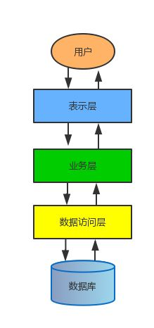
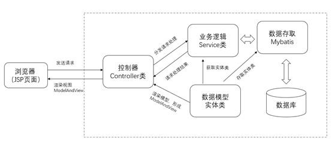
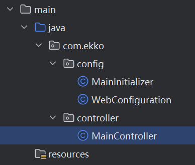
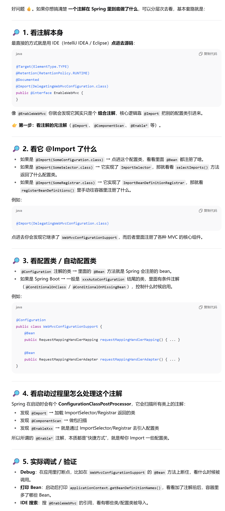
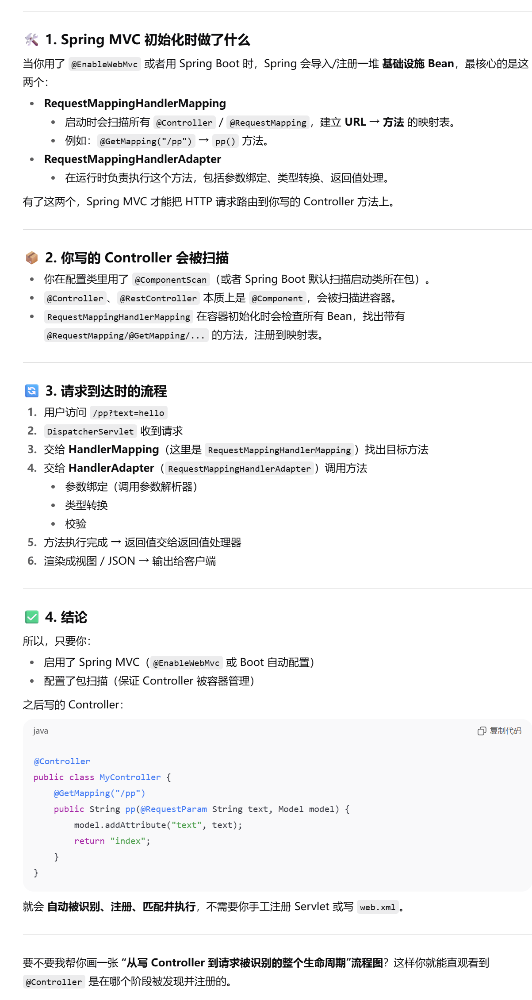

## MVC理论基础

SpringMVC - 表示层框架

MVC三层架构包括：



每一层都有着各自的职责

其中最关键的当属表示层，因为它相当于就是直接与用户的浏览器打交道的一层

并且所有的请求都会经过它进行解析，然后再告知业务层进行处理，任何页面的返回和数据填充也全靠表示层来完成，因此它实际上是整个三层架构中最关键的一层

而在之前的实战开发中，我们编写了大量的Servlet（也就是表示层实现）来处理来自浏览器的各种请求，但是我们发现，仅仅是几个很小的功能，以及几个很基本的页面，我们都要编写将近十个Servlet

如果是更加大型的网站系统，比如淘宝、B站，光是一个页面中可能就包含了几十甚至上百个功能，想想那样的话写起来得多恐怖。

因此，SpringMVC正是为了解决这种问题而生的，它是一个**非常优秀的表示层框架**，采用MVC思想设计实现。

### MVC介绍

MVC详细解释如下：

- M是指业务模型（Model）：通俗的讲就是我们之前用于封装数据传递的实体类。
- V是指用户界面（View）：一般指的是前端页面。
- C则是控制器（Controller）：控制器就相当于Servlet的基本功能，处理请求，返回响应。



SpringMVC正是希望这三者之间进行解耦，实现各干各的，更加精细地划分对应的职责。

最后再将View和Model进行渲染，得到最终的页面并返回给前端（就像之前使用Thymeleaf那样，把实体数据对象和前端页面都给到Thymeleaf，然后它会将其进行整合渲染得到最终有数据的页面

## 配置环境并搭建项目

这里我们继续使用之前的Tomcat10服务器，Spring6之后要求必须使用Tomcat10或更高版本

我们直接创建一个新的JakartaEE项目。

创建完成后会自动生成相关文件，但是还是请注意检查运行配置中的URL和应用程序上下文名称是否一致。

### 传统XML配置形式

SpringMvc项目依然支持多种配置形式，这里我们首先讲解最传统的XML配置形式。

#### 添加依赖

首先我们需要添加Mvc相关依赖：

```xml
<dependency>
    <groupId>org.springframework</groupId>
    <artifactId>spring-webmvc</artifactId>
    <version>6.1.13</version>
</dependency>
```

#### 配置 `web.xml`

用 `DispatcherServlet` 来替换 Tomcat自带的Servlet

这里url-pattern需要写为`/`，即可完成替换：

```xml
<?xml version="1.0" encoding="UTF-8"?>
<web-app xmlns="https://jakarta.ee/xml/ns/jakartaee"
         xmlns:xsi="http://www.w3.org/2001/XMLSchema-instance"
         xsi:schemaLocation="https://jakarta.ee/xml/ns/jakartaee https://jakarta.ee/xml/ns/jakartaee/web-app_5_0.xsd"
         version="5.0">
    <servlet>
        <servlet-name>mvc</servlet-name>
        <servlet-class>org.springframework.web.servlet.DispatcherServlet</servlet-class>
    </servlet>
    <servlet-mapping>
        <servlet-name>mvc</servlet-name>
        <url-pattern>/</url-pattern>
    </servlet-mapping>
</web-app>
```

#### 配置Spring上下文环境

接着需要为整个Web应用程序配置一个Spring上下文环境（也就是容器），因为SpringMVC是基于Spring开发的，它直接利用Spring提供的容器来实现各种功能

##### `resource/spring.xml`

那么第一步依然跟之前一样，需要编写一个配置文件(在 `resource/spring.xml`)：

```xml
<?xml version="1.0" encoding="UTF-8"?>
<beans xmlns="http://www.springframework.org/schema/beans"
       xmlns:xsi="http://www.w3.org/2001/XMLSchema-instance"
       xsi:schemaLocation="http://www.springframework.org/schema/beans
        https://www.springframework.org/schema/beans/spring-beans.xsd">
</beans>
```

##### `webapp/WRB-INF/web.xml`

接着我们需要为DispatcherServlet配置一些初始化参数来指定刚刚创建的配置文件：

```xml
<servlet>
    <servlet-name>mvc</servlet-name>
    <servlet-class>org.springframework.web.servlet.DispatcherServlet</servlet-class>
    <init-param>
        <!--     指定我们刚刚创建在类路径下的XML配置文件       -->
        <param-name>contextConfigLocation</param-name>
        <param-value>classpath:spring.xml</param-value>
    </init-param>
</servlet>
```

#### 测试，编写`Controller`

这样我们就完成了基本的配置，现在我们可以来测试一下是否配置正确

我们删除项目自带的Servlet类，创建一个Mvc中使用的`Controller`类：

```java
@Controller
public class HelloController {
    @ResponseBody
    @RequestMapping("/")
    public String hello(){
        return "HelloWorld!";
    }
}
```

接着我们需要将这个类注册为Bean才能正常使用，我们来编写一下Spring的配置文件，这里我们直接配置包扫描，XML下的包扫描需要这样开启：

```xml
<?xml version="1.0" encoding="UTF-8"?>
<beans xmlns="http://www.springframework.org/schema/beans"
       xmlns:xsi="http://www.w3.org/2001/XMLSchema-instance"
       xmlns:context="http://www.springframework.org/schema/context"
       xsi:schemaLocation="http://www.springframework.org/schema/beans
        https://www.springframework.org/schema/beans/spring-beans.xsd http://www.springframework.org/schema/context https://www.springframework.org/schema/context/spring-context.xsd">
    <!-- 需要先引入context命名空间，然后直接配置base-package属性就可以了 -->
    <context:component-scan base-package="com.ekko"/>
</beans>
```

如果可以成功在浏览器中出现HelloWorld则说明配置成功

实际上我们上面编写的Controller就是负责Servlet基本功能的，比如这里我们返回的是HelloWorld字符串，那么我们在访问这个地址的时候，的到的就是这里返回的字符串

可以看到写法非常简洁，至于这是怎么做到的的，怎么使用，我们会在本章进行详细介绍。

### 全注解配置形式

如果你希望完完全全丢弃配置文件，使用纯注解开发，可以直接添加一个类

Tomcat会在类路径中查找实现 `ServletContainerInitializer` 接口的类，如果发现的话，就用它来配置Servlet容器

Spring提供了这个接口的实现类 `SpringServletContainerInitializer`

```java
@HandlesTypes({WebApplicationInitializer.class})
public class SpringServletContainerInitializer implements ServletContainerInitializer {
    public void onStartup(@Nullable Set<Class<?>> webAppInitializerClasses, ServletContext servletContext) throws ServletException {
        List<WebApplicationInitializer> initializers = Collections.emptyList();
        ...
    }
}
```

通过`@HandlesTypes(WebApplicationInitializer.class)`设置，这个类反过来会查找实现 `WebApplicationInitializer` 的类，并将配置的任务交给他们来完成，



#### 添加依赖1

```xml
<dependency>
    <groupId>org.springframework</groupId>
    <artifactId>spring-webmvc</artifactId>
    <version>6.1.13</version>
</dependency>
```

#### 配置初始化接口

这里的 `AbstractAnnotationConfigDispatcherServletInitializer` 类 不断往上找最终继承的就是 `WebApplicationInitializer` 的类

因此直接实现接口即可：

```java
public class MainInitializer extends AbstractAnnotationConfigDispatcherServletInitializer {

    @Override
    protected Class<?>[] getRootConfigClasses() {
        return new Class[]{WebConfiguration.class};   //基本的Spring配置类，一般用于业务层配置
    }

    @Override
    protected Class<?>[] getServletConfigClasses() {
        return new Class[0];  //配置DispatcherServlet的配置类、主要用于Controller等配置，这里为了教学简单，就不分这么详细了，只使用上面的基本配置类
    }

    @Override
    protected String[] getServletMappings() {
        return new String[]{"/"};    //匹配路径，与上面一致
    }
}
```

#### 配置相应配置类 `@EnableWebMvc`

接着我们需要再配置类中添加一些必要的注解：

```java
@Configuration
@EnableWebMvc   
//快速配置SpringMvc注解，如果不添加此注解会导致后续无法通过实现WebMvcConfigurer接口进行自定义配置
@ComponentScan("com.example.controller")
public class WebConfiguration {
}
```

`@EnableWebMvc` 来启动 SpringMV

- `@EnableWebMvc` 的本质是导入 `DelegatingWebMvcConfiguration`；

- 它会注册 Spring MVC 的 核心 Bean（`HandlerMapping`、`HandlerAdapter`、`MessageConverter`等）；

- 同时允许你通过实现 `WebMvcConfigurer` 去扩展默认配置；

- 在 Spring Boot 里一般不用加，否则会屏蔽自动配置；

- 在 传统 Spring MVC 项目里必须加，否则注解模式跑不起来。



#### 编写对应`Controller`

```java
@Controller
public class MainController {
    @ResponseBody
    @RequestMapping("/")
    public String hello(){
        return "HelloWorld!";
    }
}
```

这样我们同样可以正常访问

之后为了方便，我们就统一使用全注解形式编写。


