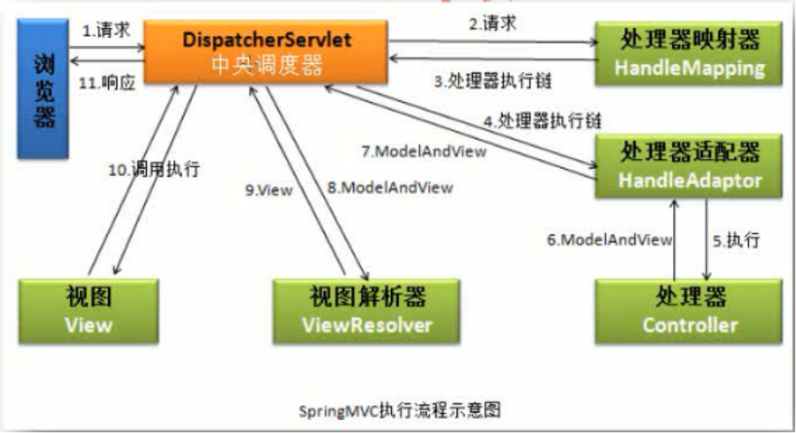
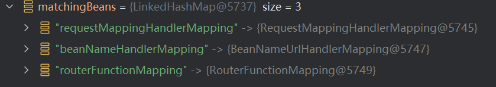
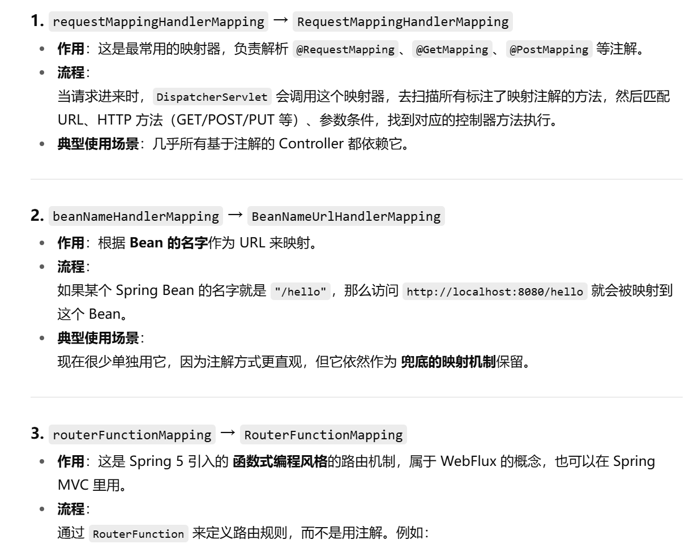
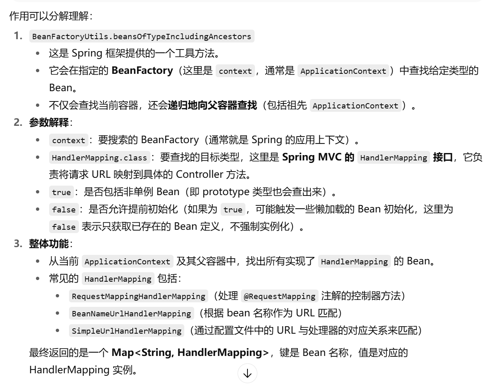

## MVC



### HandleMapping

可以看到有：



应该这是 Spring MVC 自带的三个 `HandleMapping`



```java
private void initHandlerMappings(ApplicationContext context) {
        this.handlerMappings = null;
        if (this.detectAllHandlerMappings) {
            Map<String, HandlerMapping> matchingBeans = BeanFactoryUtils.beansOfTypeIncludingAncestors(context, HandlerMapping.class, true, false);
            if (!matchingBeans.isEmpty()) {
                this.handlerMappings = new ArrayList(matchingBeans.values());
                AnnotationAwareOrderComparator.sort(this.handlerMappings);
            }
        }
        ...
}
```

这里主要会遍历，利用 `BeanFactoryUtils.beansOfTypeIncludingAncestors()` 去找对应的 `Bean`

