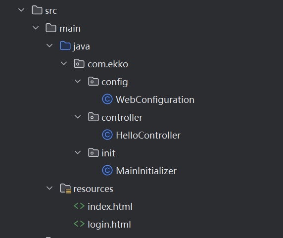

## SpringSecurity

SpringSecurity是一个基于Spring开发的非常强大的权限验证框架，其核心功能包括：

- 认证 （用户登录）
- 授权 （此用户能够做哪些事情）
- 攻击防护 （防止伪造身份攻击）

### 测试环境搭建

为了测试我们之前的网站安全性，这里我们基于Mvc框架重新搭建一个采用之前的验证方式的简易网站



首先是登录界面部分：

```html
<!DOCTYPE html>
<html lang="en">
<head>
    <meta charset="UTF-8">
    <title>登录白马银行</title>
</head>
<body>
  <form action="login" method="post">
    <label>
      用户名：
      <input name="username" type="text">
    </label>
    <label>
      密码：
      <input name="password" type="password">
    </label>
    <button type="submit">登录</button>
  </form>
  <div th:if="${status}">登录失败，用户名或密码错误！</div>
</body>
</html>
```

接着是登录之后的首页：

```html
<!DOCTYPE html>
<html lang="en">
<head>
    <meta charset="UTF-8">
    <title>白马银行 - 首页</title>
</head>
<body>

</body>
</html>
```

接着是`Controller`部分：

```java
@Controller
public class HelloController {
    //处理登录操作并跳转
    @PostMapping("/login")
    public String login(@RequestParam String username,
                        @RequestParam String password,
                        HttpSession session,
                        Model model){
        if("test".equals(username) && "123456".equals(password)) {
            session.setAttribute("login", true);
            return "redirect:/";
        } else {
            model.addAttribute("status", true);
            return "login";
        }
    }

    //处理首页或是登录界面跳转
    @GetMapping("/")
    public String index(HttpSession session){
        if(session.getAttribute("login") != null) {
            return "index";
        }else {
            return "login";
        }
    }
}
```

这样我们就可以进行简单登录了

接着我们在首页加一个转账操作，要求填写转账人账号名称：

```java
@ResponseBody
@PostMapping("/pay")
public JSONObject pay(@RequestParam String account,
                      HttpSession session){
    JSONObject object = new JSONObject();
    //登录之后才能转账
    if(session.getAttribute("login") != null) {
        System.out.println("转账给"+account+"成功，交易已完成！");
        object.put("success", true);
    } else {
        System.out.println("转账给"+account+"失败，用户未登录！");
        object.put("success", false);
    }
    return object;
}
```

接着我们在页面中添加一个简单的转账操作按键：

```html
<!DOCTYPE html>
<html lang="en">
<head>
    <meta charset="UTF-8">
    <title>白马银行 - 首页</title>
    <script src="https://unpkg.com/axios@1.1.2/dist/axios.min.js"></script>
</head>
<body>
    <div>
        <label>
            转账账号：
            <input type="text" id="account"/>
        </label>
        <button onclick="pay()">立即转账</button>
    </div>
</body>
</html>

<script>
function pay() {
    const account = document.getElementById("account").value
    axios.post('/mvc/pay', { account: account }, {
        headers: {
            'Content-Type': 'application/x-www-form-urlencoded'
        }
    }).then(({data}) => {
        if(data.success)
            alert("转账成功")
        else
            alert("转账失败")
    })
}
</script>
```

这样我们就成功搭建好网络安全的测试项目了
