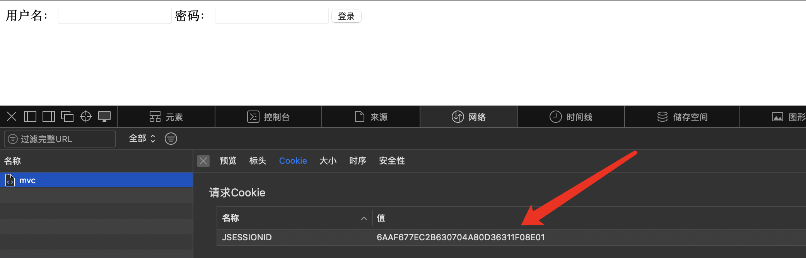
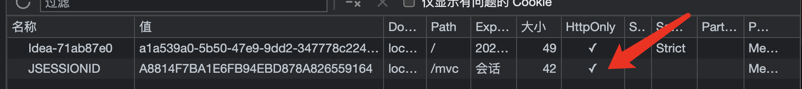
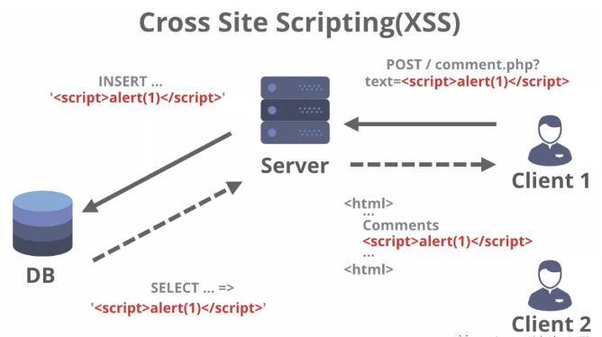

## SpringSecurity2

### CSRF跨站请求伪造攻击

CSRF是我们要介绍的第一种攻击形式，这种攻击方式非常好理解。

我们时常会在QQ上收到别人发送的钓鱼网站链接，只要你在上面登陆了你的QQ账号，那么不出意外，你的号已经在别人手中了。

实际上这一类网站都属于恶意网站，专门用于盗取他人信息，执行非法操作，甚至获取他人账户中的财产，非法转账等。而这里，我们需要了解一种比较容易发生的恶意操作，从不法分子的角度去了解整个流程。

我们在JavaWeb阶段已经了解了Session和Cookie的机制，在一开始的时候，服务端会给浏览器一个名为JSESSIONID的Cookie信息作为会话的唯一凭据，只要用户携带此Cookie访问我们的网站，那么我们就可以认定此会话属于哪个浏览器用户。

因此，只要此会话的用户执行了登录操作，那么就可以随意访问个人信息等内容。

我们来尝试模拟一下这种操作，来编写一个钓鱼网站：

```html
<!DOCTYPE html>
<html lang="en">
<head>
    <meta charset="UTF-8">
    <title>坤坤炒粉放鸡精视频在线观看</title>
    <script src="https://unpkg.com/axios@1.1.2/dist/axios.min.js"></script>
</head>
<body>
<iframe name="hiddenIframe" hidden></iframe>
<form action="http://localhost:8080/mvc/pay" method="post" target="hiddenIframe">
    <input type="text" name="account" value="黑客" hidden>
    <button type="submit">点击下载全套视频</button>
</form>
</body>
</html>
```

这个页面并不是我们官方提供的页面，而是不法分子搭建的恶意网站。我们发现此页面中有一个表单，但是表单中的输入框被隐藏了，而我们看到的只有一个按钮，我们不知道这是一个表单，也不知道表单会提交给那个地址，这时整个页面就非常有迷惑性了。

如果我们点击此按钮，那么整个表单的数据会以POST的形式发送给我们的服务端（会携带之前登陆我们网站的Cookie信息），但是这里很明显是另一个网站跳转，通过这样的方式，恶意网站就成功地在我们毫不知情的情况下引导我们执行了转账操作，当你发现上当受骗时，钱已经被转走了。

这种构建恶意页面，引导用户访问对应网站执行操作的方式称为：**跨站请求伪造**（CSRF，Cross Site Request Forgery）

显然，我们之前编写的图书管理系统就存在这样的安全漏洞，而SpringSecurity就解决了这样的问题。

当然，除了通过我们自己SpringSecurity使用去解决之外，随着现在的浏览器不断发展，安全性越来越受到重视，很多浏览器都有SameSite保护机制，当用户在两个不同域名的站点操作时，默认情况下Cookie就会被自动屏蔽：

SameSite是一种安全机制，旨在防止跨站点请求伪造（CSRF）攻击，它通过限制第三方Cookie的使用来实现这一目的。

在Chrome浏览器中，SameSite默认为Lax，这意味着第三方Cookie只能在用户导航到与原始站点相同的站点时发送。

### SFA会话固定攻击

这同样是利用Cookie中相同的JSESSIONID进行的攻击

会话固定攻击（Session fixation attack）是一种针对Web应用程序的安全漏洞攻击，攻击者利用这种漏洞，将一个有效的会话ID分配给用户，并诱使用户在该会话中进行操作，然后攻击者可以利用该会话ID获取用户的权限，或者通过此会话继续进行其他攻击。

简单来说，就是黑客把他的JSESSIONID直接给你，你一旦使用这个ID登录，那么在后端这个ID就被认定为已登录状态，那么也就等同于他直接进入了已登录状态，从而直接访问你账号的任意内容，执行任意操作。

攻击者通常使用以下几种方式进行会话固定攻击：

1. 会话传递：攻击者通过URL参数、表单隐藏字段、cookie等方式将会话ID传递给用户。当用户使用该会话ID登录时，攻击者就能利用该会话ID获取用户的权限。
2. 会话劫持：攻击者利用劫持用户与服务器之间的通信流量，获取到用户的会话ID，然后利用该会话ID冒充用户进行操作。
3. 会话劫持：攻击者事先获取到会话ID，并将其分配给用户，之后通过其他方式欺骗用户登录该会话。这样，攻击者就可以利用会话ID获取用户的权限。

这里我们来尝试一下第一种方案，这里我们首先用另一个浏览器访问目标网站，此时需要登录，开始之前记得先清理一下两个浏览器的缓存，否则可能无法生效：



这里我们直接记录下这个JSESSIONID，然后将其编写到我们的诈骗网站中，这里有一个恶意脚本，会自动将对应用户的Cookie进行替换，变成我们的JSESSIONID值：

```html
<!DOCTYPE html>
<html lang="en">
<head>
    <meta charset="UTF-8">
    <title>冠希哥全套视频</title>
    <script src="https://unpkg.com/axios@1.1.2/dist/axios.min.js"></script>
</head>
<body>
<script>
    //第三方网站恶意脚本，自动修改Cookie信息
    document.cookie = "JSESSIONID=6AAF677EC2B630704A80D36311F08E01; path=/mvc; domain=localhost"
    //然后给你弄到原来的网站
    location.href = 'http://localhost:8080/mvc/'
</script>
</body>
</html>
```

接着我们访问这个恶意网站，然后再作为用户，去正常访问目标网站进行登录操作

可以看到此时用户的浏览器JSESSIONID值为刚刚恶意网站伪造的值，现在我们来进行登录操作

此时我们回到一开始的浏览器，刷新之后，我们发现这个浏览器同样已经登录成功了，原理其实很简单，相当于让用户直接帮我们登录了，是不是感觉特别危险？

当然，现在的浏览器同样有着对应的保护机制，Tomcat发送的SESSIONID默认是勾选了**HttpOnly**选项的，一旦被设定是无法被随意修改的

当然前提是先得正常访问一次网站才行，否则仍然存在安全隐患。

> HttpOnly是Cookie中一个属性，用于防止客户端脚本通过document.cookie属性访问Cookie，有助于保护Cookie不被跨站脚本攻击窃取或篡改。但是，HttpOnly的应用仍存在局限性，一些浏览器可以阻止客户端脚本对Cookie的读操作，但允许写操作；此外大多数浏览器仍允许通过XMLHTTP对象读取HTTP响应中的Set-Cookie头。



为了彻底杜绝这个问题，登**录成功之后应该重新给用户分配一个新的JSESSIONID才行**，而这些都由SpringSecurity帮我们实现了。

### XSS跨站脚本攻击

前面我们介绍了两种攻击方式，不过都是从外部干涉，在外部无法干涉的情况下

我们也可以从内部击溃网站，接下来我们隆重介绍XSS跨站脚本攻击方式。

XSS（跨站脚本攻击）是一种常见的网络安全漏洞，攻击者通过在合法网站中注入恶意脚本代码来攻击用户。

当用户访问受到注入攻击的页面时，恶意代码会在用户的浏览器中执行，从而导致攻击者能够窃取用户的敏感信息、诱导用户操作、甚至控制用户的账号。

XSS攻击常见的方式有三种：

1. 存储型XSS攻击：攻击者**将恶意代码存储到目标网站的数据库**中，当其他用户访问包含恶意代码的页面时，恶意代码会被执行。
2. 反射型XSS攻击：攻击者**将恶意代码嵌入到URL中**，当用户点击包含恶意代码的URL时，恶意代码会被执行。
3. DOM-based XSS攻击：攻击者利用前端JavaScript代码的漏洞，通过修改页面的DOM结构来执行恶意代码。

在一些社交网站上，用户可以自由发帖，而帖子是以富文本形式进行编辑和上传的，发送给后台的帖子往往是直接以HTML代码的形式，这个时候就会给黑客可乘之机了。

正常情况下，用户发帖会向后端上传以下内容，这些是经过转换得到的正常HTML代码，方便后续直接展示：

```html
<div class="content ql-editor">
  <p>
    <strong>萨达睡觉了大数据</strong>
  </p>
  <p>撒大大撒大声地</p>
</div>
```

而现在，黑客不走常规的方式发帖，而是发送以下内容给服务端：

```html
<div class="content ql-editor">
  <p οnlοad="alert('xss')">
    <strong>萨达睡觉了大数据</strong>
  </p>
  <p>撒大大撒大声地</p>
</div>
```

可以看到`p`标签上添加了一段JS恶意脚本，黑客可以利用这种特性，获取用户的各种信息，甚至直接发送到他的后台，这样，我们的个人信息就从网站内部被泄露了。

XSS漏洞最早被发现是在1996年，由于JavaScript的出现，导致在Web应用程序中存在了一些安全问题。

在1997年，高智文(Gareth Owen)也就是“XSS之父”，在他的博客中描述了一种称为“脚本注入”(script injection)的攻击技术，这就是XSS漏洞的前身。从那时起，XSS漏洞便成为了Web应用程序中的一种常见安全漏洞。



这种攻击一般需要前端配合后端进行防御，或者后端对前端发送的内容进行安全扫描并处理，有机会我们会分享如何防范此类攻击。
