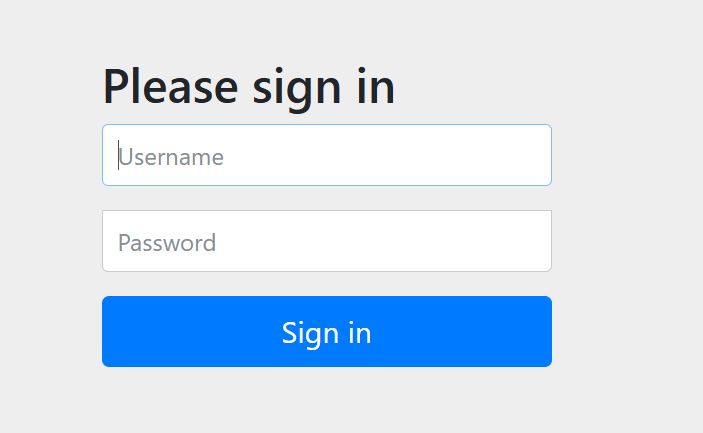

## SpringSecurity3

### SpringSecurity 环境配置

#### 模块导入

我们继续使用之前的测试项目进行教学，首先我们需要导入SpringSecurity的相关依赖

它不仅仅是一个模块，我们可以根据需求导入需要的模块，常用的是以下两个：

```xml
<dependency>
    <groupId>org.springframework.security</groupId>
    <artifactId>spring-security-web</artifactId>
    <version>6.1.1</version>
</dependency>
<dependency>
    <groupId>org.springframework.security</groupId>
    <artifactId>spring-security-config</artifactId>
    <version>6.1.1</version>
</dependency>
```

#### 初始化器配置

接着我们需要配置SpringSecurity，与Mvc一样，需要一个初始化器：

```java
public class SecurityInitializer extends AbstractSecurityWebApplicationInitializer {
    //不用重写任何内容
    //这里实际上会自动注册一个Filter，SpringSecurity底层就是依靠N个过滤器实现的，我们之后再探讨
}
```

#### 配置类

接着我们需要再创建一个配置类用于配置SpringSecurity：

```java
@Configuration
@EnableWebSecurity   //开启WebSecurity相关功能
public class SecurityConfiguration {

}
```

#### 添加配置类

接着在根容器中添加此配置文件即可：

```java
@Override
protected Class<?>[] getRootConfigClasses() {
    return new Class[]{MainConfiguration.class, SecurityConfiguration.class};
}
```

这样，SpringSecurity的配置就完成了，我们再次运行项目，会发现无法进入的我们的页面中，无论我们访问哪个页面，都会进入到SpringSecurity为我们提供的一个默认登录页面，之后我们会讲解如何进行配置。



至此，项目环境搭建完成。
