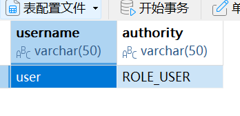

## 认证

认证是我们网站的第一步，用户需要登录之后才能进入

这一部分我们将详细介绍如何使用SpringSecurity实现用户登录。

### 基于内存验证

首先我们来看看最简单的基于内存的配置，也就是说我们直接以代码的形式配置我们网站的用户和密码

#### `UserDetailsService`

配置方式非常简单，只需要在Security配置类中注册一个Bean即可：

```java
@Configuration
@EnableWebSecurity
public class SecurityConfiguration {
    @Bean   //UserDetailsService就是获取用户信息的服务
    public UserDetailsService userDetailsService() {
        //每一个UserDetails就代表一个用户信息，其中包含用户的用户名和密码以及角色
        UserDetails user = User.withDefaultPasswordEncoder()
                .username("user")
                .password("password")
                .roles("USER")  //角色目前我们不需要关心，随便写就行，后面会专门讲解
                .build();
        UserDetails admin = User.withDefaultPasswordEncoder()
                .username("admin")
                .password("password")
                .roles("ADMIN", "USER")
                .build();
        return new InMemoryUserDetailsManager(user, admin); 
        //创建一个基于内存的用户信息管理器作为UserDetailsService
    }
}
```

配置完成后，我们就可以前往登录界面，进行登录操作了

登录成功后，就可以访问到我们之前的界面了

并且为了防止我们之前提到的会话固定问题，**在登录之后，JSESSIONID会得到重新分配**

当我们想要退出时，也可以直接访问：<http://localhost:8080/mvc/logout> 地址，我们会进入到一个退出登录界面：


退出登录后就需要重新登录才能访问我们的网站了。

可以发现，在有了SpringSecurity之后，我们网站的登录验证模块相当于直接被接管了，因此，从现在开始，我们的网站不需要再自己编写登录模块了，这里我们可以直接去掉，只留下主页面：

```java
@Controller
public class HelloController {

    //现在所有接口不需要任何验证了，因为Security已经帮我们做了，没登录是根本进不来的
    @GetMapping("/")
    public String index(){
        return "index";
    }

    @ResponseBody
    @PostMapping("/pay")
    public JSONObject pay(@RequestParam String account){
        JSONObject object = new JSONObject();
        System.out.println("转账给"+account+"成功，交易已完成！");
        object.put("success", true);
        return object;
    }
}
```

这样，我们的网站就成功用上了更加安全的SpringSecurity框架了。

#### 加密工具 `BCrypt`

我们在配置用户信息的时候，报了黄标，实际上这种方式存储密码并不安全：

这是因为SpringSecurity的密码校验不推荐直接使用原文进行比较，而是**使用加密算法将密码进行加密**（更准确地说应该进行Hash处理，此过程是不可逆的，无法解密），最后**将用户提供的密码以同样的方式加密后与密文进行比较**。

对于我们来说，用户提供的密码属于隐私信息，直接明文存储并不好，而且如果数据库内容被窃取，那么所有用户的密码将全部泄露，这是我们不希望看到的结果，

我们需要一种既能隐藏用户密码也能完成认证的机制，而Hash处理就是一种很好的解决方案，通过将用户的密码进行Hash值计算，计算出来的结果一般是单向的，无法还原为原文，如果需要验证是否与此密码一致，那么需要以同样的方式加密再比较两个Hash值是否一致，这样就很好的保证了用户密码的安全性。

因此，我们在配置用户信息的时候，可以使用官方提供的BCrypt加密工具：

```java
@Configuration
@EnableWebSecurity
public class SecurityConfiguration {
    
    //这里将BCryptPasswordEncoder直接注册为Bean，Security会自动进行选择
    @Bean
    public PasswordEncoder passwordEncoder(){
        return new BCryptPasswordEncoder();
    }

    @Bean
    public UserDetailsService userDetailsService(PasswordEncoder encoder) {
        UserDetails user = User
                .withUsername("user")
                .password(encoder.encode("password"))   
                //这里将密码进行加密后存储
                .roles("USER")
                .build();
        System.out.println(encoder.encode("password"));  //一会观察一下加密出来之后的密码长啥样
        UserDetails admin = User
                .withUsername("admin")
                .password(encoder.encode("password"))   //这里将密码进行加密后存储
                .roles("ADMIN", "USER")
                .build();
        return new InMemoryUserDetailsManager(user, admin);
    }
}
```

这样，我们存储的密码就是更加安全的密码了：


#### 403 权限问题 `csrf`

不过，可能会有小伙伴发现，所有的POST请求都被403了：


这是因为SpringSecurity自带了csrf防护，需求我们在POST请求中携带页面中的csrfToken才可以，否则一律进行拦截操作，这里我们可以将其嵌入到页面中，随便找一个地方添加以下内容：

```html
<input type="text" th:id="${_csrf.getParameterName()}" th:value="${_csrf.token}" hidden>
```

接着在axios发起请求时，携带这个input的value值：

```js
function pay() {
    const account = document.getElementById("account").value
    const csrf = document.getElementById("_csrf").value
    axios.post('/mvc/pay', {
        account: account,
        _csrf: csrf   //携带此信息即可，否则会被拦截
    }, {
      ...
```

如果后续各位小伙伴遇到那种需要再form表单中提交的情况，也可以直接像下面这样给塞到表单里：

```html
<form action="/xxxx" method="post">
    ...
    <input type="text" th:name="${_csrf.getParameterName()}" th:value="${_csrf.token}" hidden>
    ...
</form>
```

实际上现在的浏览器已经很安全了，完全不需要使用自带的csrf防护，后面我们会讲解如何通过配置关闭csrf防护。这里温馨提醒一下，在后续各位小伙伴跟我们的实战项目时，如果遇到诸如401、403这种错误时，优先查看你的SpringSecurity配置是否错误。

> 从Spring Security 4.0开始，默认情况下会启用CSRF保护，以防止CSRF攻击应用程序，Spring Security CSRF会针对PATCH，POST，PUT和DELETE方法的请求（不仅仅只是登陆请求，这里指的是任何请求路径）进行防护，而这里的登陆表单正好是一个POST类型的请求。在默认配置下，无论是否登陆，页面中只要发起了PATCH，POST，PUT和DELETE请求一定会被拒绝，并返回**403**错误**（注意，这里是个究极大坑，这个没有任何提示，直接403，因此如果你不知道的话根本不清楚是什么问题，就一直卡这里了）**，需要在请求的时候加入csrfToken才行，也就是"83421936-b84b-44e3-be47-58bb2c14571a"，正是csrfToken，如果提交的是表单类型的数据，那么表单中必须包含此Token字符串，键名称为"_csrf"；如果是JSON数据格式发送的，那么就需要在请求头中包含此Token字符串。

### 基于数据库验证

前面我们已经实现了直接认证的方式，但是实际项目中往往都是将用户信息存储在数据库中，那么如何将其连接到数据库，通过查询数据库中的用户信息来进行用户登录呢？

#### 建立数据库

官方默认提供了可以直接使用的用户和权限表设计，根本不需要我们来建表，直接在Navicat中执行以下查询：

```sql
create table users(username varchar(50) not null primary key,password varchar(500) not null,enabled boolean not null);
create table authorities (username varchar(50) not null,authority varchar(50) not null,constraint fk_authorities_users foreign key(username) references users(username));
create unique index ix_auth_username on authorities (username,authority);
```

#### 添加依赖

接着我们添加Mybatis和MySQL相关的依赖：

```xml
<dependency>
    <groupId>org.mybatis</groupId>
    <artifactId>mybatis</artifactId>
    <version>3.5.13</version>
</dependency>
<dependency>
    <groupId>org.mybatis</groupId>
    <artifactId>mybatis-spring</artifactId>
    <version>3.0.2</version>
</dependency>
<dependency>
    <groupId>com.mysql</groupId>
    <artifactId>mysql-connector-j</artifactId>
    <version>8.0.31</version>
</dependency>
<dependency>
    <groupId>org.springframework</groupId>
    <artifactId>spring-jdbc</artifactId>
    <version>6.0.10</version>
</dependency>
```

#### 配置类

接着我们编写配置类：

```java
@Configuration
@EnableWebSecurity
public class SecurityConfiguration {

    @Bean PasswordEncoder passwordEncoder(){
        return new BCryptPasswordEncoder();
    }

    @Bean
    public DataSource dataSource(){
        //数据源配置
        return new PooledDataSource("com.mysql.cj.jdbc.Driver",
                "jdbc:mysql://localhost:3306/test", "root", "123456");
    }

    @Bean
    public UserDetailsManager userDetailsService(
            DataSource dataSource,
            PasswordEncoder encoder
    ) {
        JdbcUserDetailsManager manager = new JdbcUserDetailsManager(dataSource);
        //仅首次启动时创建一个新的用户用于测试，后续无需创建
        manager.createUser(User.withUsername("user")
                .password(encoder.encode("password")).roles("USER").build());
        return manager;
    }
}
```

启动后，可以看到两张表中已经自动添加好对应的数据了：




我们可以直接尝试进行登录，使用方式和之前是完全一样的

这样，当我们下次需要快速创建一个用户登录的应用程序时，直接使用这种方式就能快速完成了，是不是感觉特别方便。

#### `UserDetailsManager` 接口

无论是我们上节课认识的`InMemoryUserDetailsManager`还是现在认识的`JdbcUserDetailsManager`，他们都是实现自`UserDetailsManager`接口

这个接口中有着一套完整的增删改查操作，方便我们直接对用户进行处理：

```java
public interface UserDetailsManager extends UserDetailsService {
        
    //创建一个新的用户
    void createUser(UserDetails user);

    //更新用户信息
    void updateUser(UserDetails user);

    //删除用户
    void deleteUser(String username);

    //修改用户密码
    void changePassword(String oldPassword, String newPassword);

    //判断是否存在指定用户
    boolean userExists(String username);
}
```

通过使用UserDetailsManager对象，我们就能快速执行用户相关的管理操作

#### 简单重置密码接口

比如我们可以直接在网站上添加一个快速重置密码的接口，首先需要配置一下`JdbcUserDetailsManager`，为其添加一个`AuthenticationManager`用于原密码的校验：

```java
@Configuration
@EnableWebSecurity
public class SecurityConfiguration {
    ...
    //手动创建一个AuthenticationManager用于处理密码校验
    private AuthenticationManager getAuthenticationManager(
            UserDetailsManager manager,
            PasswordEncoder encoder
    ){
        DaoAuthenticationProvider provider = new DaoAuthenticationProvider();
        provider.setUserDetailsService(manager);
        provider.setPasswordEncoder(encoder);
        return new ProviderManager(provider);
    }

    @Bean
    public UserDetailsManager userDetailsService(
            DataSource dataSource,
            PasswordEncoder encoder
    ) {
        JdbcUserDetailsManager manager = new JdbcUserDetailsManager(dataSource);
        manager.setAuthenticationManager(getAuthenticationManager(manager, encoder));
        return manager;
    }
}
```

接着我们编写一个快速重置密码的接口：

```java
@ResponseBody
@PostMapping("/change-password")
public JSONObject changePassword(@RequestParam String oldPassword,
                                 @RequestParam String newPassword) {
    manager.changePassword(oldPassword, encoder.encode(newPassword));
    JSONObject object = new JSONObject();
    object.put("success", true);
    return object;
}
```

接着我们在主界面中添加一个重置密码的操作：

```html
<div>
    <label>
        修改密码：
        <input type="text" id="oldPassword" placeholder="旧密码"/>
        <input type="text" id="newPassword" placeholder="新密码"/>
    </label>
    <button onclick="change()">修改密码</button>
</div>
```

```javascript
function change() {
    const oldPassword = document.getElementById("oldPassword").value
    const newPassword = document.getElementById("newPassword").value
    const csrf = document.getElementById("_csrf").value
    axios.post('/mvc/change-password', {
        oldPassword: oldPassword,
        newPassword: newPassword,
        _csrf: csrf
    }, {
        headers: {
            'Content-Type': 'application/x-www-form-urlencoded'
        }
    }).then(({data}) => {
        alert(data.success ? "密码修改成功" : "密码修改失败，请检查原密码是否正确")
    })
}
```

这样我们就可以在首页进行修改密码操作了

当然，这种方式的权限校验虽然能够直接使用数据库，但是存在一定的局限性，只适合快速搭建Demo使用，**不适合实际生产环境下编写**

### 自定义验证

有些时候，我们的数据库可能并不会像SpringSecurity默认的那样进行设计，而是采用自定义的表结构，这种情况下，上面两种方式就很难进行验证了，此时我们得编写自定义验证，来应对各种任意变化的情况。

既然需要自定义，那么我们就需要自行实现`UserDetailsService`或是功能更完善的`UserDetailsManager`接口

#### 自行实现 `UserDetailsService` 接口

```java
public interface UserDetailsService {
    UserDetails loadUserByUsername(String username) throws UsernameNotFoundException;
}
```

这里为了简单，我们直接选择前者进行实现：

```java
@Service
public class AuthorizeService implements UserDetailsService {

    @Override
    public UserDetails loadUserByUsername(String username) throws UsernameNotFoundException {
        return null;
    }
}
```

只需要去实现这个`loadUserByUsername`方法，表示在验证的时候通过自定义的方式，根据给定的用户名查询用户，并封装为`UserDetails`对象返回

然后由`SpringSecurity`将我们返回的对象与用户登录的信息进行核验，基本流程实际上跟之前是一样的，只是现在由我们自己来提供用户查询方式。

只需要将其注册为 `Bean` 即可

现在我们在数据库中创建一个自定义的用户表

##### 构建实体类

接着我们自行编写对应的查询操作，首先创建一个对应的实体类：

```java
@Data
public class Account {
    int id;
    String username;
    String password;
}
```

##### 构建对应 `Mapper` 接口

然后是根据用户名查询用户的Mapper接口：

```java
public interface UserMapper {
    @Select("select * from user where username = #{username}")
    Account findUserByName(String username);
}
```

##### 注册对应包扫描

最后我们在配置类上添加相应的包扫描，同时也需要对应的 `SqlSessionFactory`

```java
@EnableWebMvc
@Configuration
@ComponentScans({
        @ComponentScan("com.example.controller"),
        @ComponentScan("com.example.service")
})
@MapperScan("com.example.mapper")
public class WebConfiguration implements WebMvcConfigurer {
    ...
}
```

```java
@Bean
public SqlSessionFactoryBean sqlSessionFactoryBean(DataSource dataSource){
    SqlSessionFactoryBean bean = new SqlSessionFactoryBean();
    bean.setDataSource(dataSource);
    return bean;
}
```

##### `Service`端进行查询

然后我们来到Service这边进行一下完善，从数据库中进行查询：

```java
@Service
public class AuthorizeService implements UserDetailsService {

    @Resource
    UserMapper mapper;

    @Override
    public UserDetails loadUserByUsername(String username) throws UsernameNotFoundException {
        Account account = mapper.findUserByName(username);
        if(account == null)
            throw new UsernameNotFoundException("用户名或密码错误");
        return User
                .withUsername(username)
                .password(account.getPassword())
                .build();
    }
}
```

这样，我们就通过自定义的方式实现了数据库信息查询，并完成用户登录操作。
