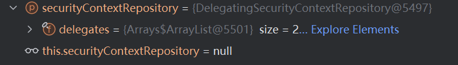
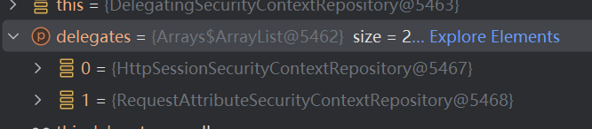

## 内部机制探究

### 安全上下文 `SecurityContext`

用户登录之后，怎么获取当前已经登录用户的信息呢？

#### `SecurityContext` 获取方式

通过使用`SecurityContextHolder`就可以很方便地得到`SecurityContext`对象

我们可以直接使用`SecurityContext`对象来获取当前的认证信息：

```java
@RequestMapping("/index")
    public String index(){
        SecurityContext context = SecurityContextHolder.getContext();
        Authentication authentication = context.getAuthentication();
        User user = (User) authentication.getPrincipal();
        System.out.println(user.getUsername());
        System.out.println(user.getAuthorities());
        return "index";
    }
```

通过SecurityContext我们就可以快速获取当前用户的名称和授权信息等

除了这种方式以外，我们还可以直接从Session中获取：

```java
@RequestMapping("/index")
public String index(@SessionAttribute("SPRING_SECURITY_CONTEXT") SecurityContext context){
    Authentication authentication = context.getAuthentication();
    User user = (User) authentication.getPrincipal();
    System.out.println(user.getUsername());
    System.out.println(user.getAuthorities());
    return "index";
}
```

#### `SecurityContextHolder` 存储策略

注意`SecurityContextHolder`是有一定的存储策略的，`SecurityContextHolder`中的`SecurityContext`对象会在一开始请求到来时被设定，至于存储方式其实是由存储策略决定的，如果我们这样编写，那么在默认情况下是无法获取到认证信息的：

```java
@RequestMapping("/index")
public String index(){
    new Thread(() -> {   //创建一个子线程去获取
        SecurityContext context = SecurityContextHolder.getContext();
        Authentication authentication = context.getAuthentication();
        User user = (User) authentication.getPrincipal();   //NPE
        System.out.println(user.getUsername());
        System.out.println(user.getAuthorities()); 
    }).start();
    return "index";
}
```

这是因为`SecurityContextHolder`的存储策略默认是`MODE_THREADLOCAL`，它是基于ThreadLocal实现的

`getContext()`方法本质上调用的是对应的存储策略实现的方法：

```java
public static SecurityContext getContext() {
    return strategy.getContext();
}
```

`SecurityContextHolderStrategy`有三个实现类：

- `GlobalSecurityContextHolderStrategy`：全局模式，不常用
- `ThreadLocalSecurityContextHolderStrategy`：基于ThreadLocal实现，线程内可见
- `InheritableThreadLocalSecurityContextHolderStrategy`：基于InheritableThreadLocal实现，线程和子线程可见

因此，如果上述情况需要在子线程中获取，那么需要修改`SecurityContextHolder`的存储策略，在初始化的时候设置：

```java
@PostConstruct
public void init(){
    SecurityContextHolder.setStrategyName(SecurityContextHolder.MODE_INHERITABLETHREADLOCAL);
}
```

这样在子线程中也可以获取认证信息了。

#### 自定义登录设置

因为用户的验证信息是基于`SecurityContext`进行判断的，我们可以直接修改`SecurityContext`的内容，来手动为用户进行登陆：

```java
@RequestMapping("/auth")
@ResponseBody
public String auth(){
    SecurityContext context = SecurityContextHolder.getContext();  
    // 获取SecurityContext对象（当前会话肯定是没有登陆的）
    UsernamePasswordAuthenticationToken token = new UsernamePasswordAuthenticationToken("Test", null,
            AuthorityUtils.commaSeparatedStringToAuthorityList("ROLE_user"));  
            // 手动创建一个UsernamePasswordAuthenticationToken对象，也就是用户的认证信息，角色需要添加ROLE_前缀，权限直接写
    context.setAuthentication(token);  
    // 手动为SecurityContext设定认证信息
    return "Login success！";
}
```

在未登陆的情况下，访问此地址将直接进行手动登陆，相当于配置了一个 Test 用户，权限是 `ROLE_user`

再次访问`/index`页面，可以直接访问，说明手动设置认证信息成功。

#### `SecurityContext` 声明周期

**疑惑：** `SecurityContext`这玩意不是默认线程独占吗，那**每次请求都是一个新的线程**，按理说上一次的`SecurityContext`对象应该没了才对啊，为什么再次请求依然能够继续使用上一次`SecurityContext`中的认证信息呢？

`SecurityContext`的生命周期：请求到来时从`Session`中取出，放入`SecurityContextHolder`中，请求结束时从`SecurityContextHolder`取出，并放到`Session`中，实际上就是依靠`Session`来存储的，一旦会话过期验证信息也跟着消失。

也就是本质是存到 `Session` 里的，只不过来请求了就从`Session`取出来，放到`SecurityContextHolder`中

### 安全上下文持久化过滤器

`SecurityContextHolderFilter`也是内置的`Filter`，它就是专门用于处理`SecurityContext`的，这里先说一下大致流程，以便我们后续更加方便地理解：

> 当过滤器链执行到`SecurityContextHolderFilter`时，它会从`HttpSession`中把`SecurityContext`对象取出来（是存在Session中的，跟随会话的消失而消失），然后放入`SecurityContextHolder`对象中。请求结束后，再把`SecurityContext`存入`HttpSession`中 (因为可能操作会修改 context，所以放回去覆盖)，并清除`SecurityContextHolder`内的`SecurityContext`对象。

#### `SecurityContextHolderFilter`源码

```java
public class SecurityContextHolderFilter extends GenericFilterBean {
    private static final String FILTER_APPLIED = SecurityContextHolderFilter.class.getName() + ".APPLIED";
    private final SecurityContextRepository securityContextRepository;
    private SecurityContextHolderStrategy securityContextHolderStrategy = SecurityContextHolder.getContextHolderStrategy();

    public SecurityContextHolderFilter(SecurityContextRepository securityContextRepository) {
        Assert.notNull(securityContextRepository, "securityContextRepository cannot be null");
        this.securityContextRepository = securityContextRepository;
    }

    public void doFilter(ServletRequest request, ServletResponse response, FilterChain chain) throws IOException, ServletException {
        // 套娃
        this.doFilter((HttpServletRequest)request, (HttpServletResponse)response, chain);
    }

    private void doFilter(HttpServletRequest request, HttpServletResponse response, FilterChain chain) throws ServletException, IOException {
        // 防止重复的安全需求，一般直接走else
        if (request.getAttribute(FILTER_APPLIED) != null) {
            chain.doFilter(request, response);
        } else {
            request.setAttribute(FILTER_APPLIED, Boolean.TRUE);
            // 通过 securityContextRepository 中的 loadDeferredContext 方法获取到 SecurityContext 对象 的Supplier方法
            Supplier<SecurityContext> deferredContext = this.securityContextRepository.loadDeferredContext(request);

            try {
                this.securityContextHolderStrategy.setDeferredContext(deferredContext);
                chain.doFilter(request, response);
            } finally {
                this.securityContextHolderStrategy.clearContext();
                request.removeAttribute(FILTER_APPLIED);
            }

        }
    }

    public void setSecurityContextHolderStrategy(SecurityContextHolderStrategy securityContextHolderStrategy) {
        Assert.notNull(securityContextHolderStrategy, "securityContextHolderStrategy cannot be null");
        this.securityContextHolderStrategy = securityContextHolderStrategy;
    }
}
```

```java
Supplier<SecurityContext> deferredContext = this.securityContextRepository.loadDeferredContext(request);
```

使用 `Supplier` 的目的是延迟创建，因为可能不是立刻需要创建 `context`, 所以在有需要时候，再通过 `deferredContext.get()` 创建

#### `SecurityContextRepository`

对于 `this.securityContextRepository` 在初始化时是外部传来赋值的，因为 `SecurityContextRepository` 是接口，其具体有其他实现类

```java
private final SecurityContextRepository securityContextRepository;
public SecurityContextHolderFilter(SecurityContextRepository securityContextRepository) {
        Assert.notNull(securityContextRepository, "securityContextRepository cannot be null");
        this.securityContextRepository = securityContextRepository;
    }
```

```java
public interface SecurityContextRepository {
    /** @deprecated */
    @Deprecated
    SecurityContext loadContext(HttpRequestResponseHolder requestResponseHolder);

    default DeferredSecurityContext loadDeferredContext(HttpServletRequest request) {
        Supplier<SecurityContext> supplier = () -> this.loadContext(new HttpRequestResponseHolder(request, (HttpServletResponse)null));
        return new SupplierDeferredSecurityContext(SingletonSupplier.of(supplier), SecurityContextHolder.getContextHolderStrategy());
    }

    void saveContext(SecurityContext context, HttpServletRequest request, HttpServletResponse response);

    boolean containsContext(HttpServletRequest request);
}
```

#### `loadDeferredContext`的实现细节

具体地，`SecurityContextRepository`的实现类是`DelegatingSecurityContextRepository`类



这个类中维护了多个`SecurityContextRepositor`实现类，而其本身并没有实现`loadDeferredContext`方法，而是靠内部维护的其他`SecurityContextRepository`实现类来完成：

```java
    @Override
    public DeferredSecurityContext loadDeferredContext(HttpServletRequest request) {
    // DeferredSecurityContext是一个支持延时生成的SecurityContext，本质是一个SecurityContext的Supplier
        DeferredSecurityContext deferredSecurityContext = null;
    // 遍历内部维护的其他SecurityContextRepository实现，一般包含以下两个：
    // 1. HttpSessionSecurityContextRepository
    // 2. RequestAttributeSecurityContextRepository
        for (SecurityContextRepository delegate : this.delegates) {
      // 这个if-else语句其实为了添加多个SecurityContextRepository提供的SecurityContext并将其组成一个链状结构的DelegatingDeferredSecurityContext（至于为什么，我们接着往下看）
            if (deferredSecurityContext == null) {
                deferredSecurityContext = delegate.loadDeferredContext(request);
            }
            else {
                DeferredSecurityContext next = delegate.loadDeferredContext(request);
                deferredSecurityContext = new DelegatingDeferredSecurityContext(deferredSecurityContext, next);
            }
        }
        return deferredSecurityContext;
    }
```

意思是，内部保存了多个 `SecurityContextRepository` 实现，保存在 `this.delegates`里面

```java
public DelegatingSecurityContextRepository(List<SecurityContextRepository> delegates) {
    Assert.notEmpty(delegates, "delegates cannot be empty");
    this.delegates = delegates;
}
```

一般有两个

1. `HttpSessionSecurityContextRepository`
2. `RequestAttributeSecurityContextRepository`



然后这个 `DelegatingSecurityContextRepository` 的 `doFilter` 就是遍历使用这些多个来依次 `delegate.loadDeferredContext(request);`

##### `HttpSessionSecurityContextRepository`

首先我们来看第一个`HttpSessionSecurityContextRepository`，它是第一个被遍历的实现，内部的 `loadDeferredContext(request)`：

```java
    @Override
    public DeferredSecurityContext loadDeferredContext(HttpServletRequest request) {
        Supplier<SecurityContext> supplier = () -> readSecurityContextFromSession(request.getSession(false));  
        // 从Session中取出SecurityContext
        return new SupplierDeferredSecurityContext(supplier, this.securityContextHolderStrategy);
    }

    public static final String SPRING_SECURITY_CONTEXT_KEY = "SPRING_SECURITY_CONTEXT";
    private String springSecurityContextKey = SPRING_SECURITY_CONTEXT_KEY;

    private SecurityContext readSecurityContextFromSession(HttpSession httpSession) {
        ...
    // 实际上这里就是从Session中通过键“SPRING_SECURITY_CONTEXT”取出的SecurityContext
    // 跟我们上一节使用的是完全一样的，这下就很清晰了
    // 如果用户没有登录验证，那么这里获取到的SecurityContext就是null了
        Object contextFromSession = httpSession.getAttribute(this.springSecurityContextKey);
        ...
        return (SecurityContext) contextFromSession;
    }
```

最后返回回去的是一个`SupplierDeferredSecurityContext`对象：

```java
final class SupplierDeferredSecurityContext implements DeferredSecurityContext {

    private static final Log logger = LogFactory.getLog(SupplierDeferredSecurityContext.class);

    private final Supplier<SecurityContext> supplier;

    private final SecurityContextHolderStrategy strategy;

    private SecurityContext securityContext;

    private boolean missingContext;

    SupplierDeferredSecurityContext(Supplier<SecurityContext> supplier, SecurityContextHolderStrategy strategy) {
        this.supplier = supplier;
        this.strategy = strategy;
    }

    @Override
    public SecurityContext get() {
    //在获取SecurityContext时会进行一次初始化
        init();
        return this.securityContext;
    }

    @Override
    public boolean isGenerated() {
        init();
        // 初始化后判断是否为未登录的SecurityContext
        return this.missingContext;
    }

    private void init() {
        // 如果securityContext不为null表示已经初始化过了
        if (this.securityContext != null) {
            return;
        }
        // 直接通过supplier获取securityContext对象
        this.securityContext = this.supplier.get();
        // 如果securityContext对象为null，那么就标记missingContext
        this.missingContext = (this.securityContext == null);
        if (this.missingContext) {
        // 当missingContext为真时，说明没有securityContext（一般是未登录的情况）
        // 那么就创建一个空的securityContext，不包含任何认证信息
            this.securityContext = this.strategy.createEmptyContext();
        //日志无视就好
            if (logger.isTraceEnabled()) {
                logger.trace(LogMessage.format("Created %s", this.securityContext));
            }
        }
    }
}
```

##### `RequestAttributeSecurityContextRepository`

接着是第二个被遍历的实现`RequestAttributeSecurityContextRepository`类：

```java
    @Override
    public DeferredSecurityContext loadDeferredContext(HttpServletRequest request) {
        Supplier<SecurityContext> supplier = () -> getContext(request);
        // 同样是返回SupplierDeferredSecurityContext对象
        return new SupplierDeferredSecurityContext(supplier, this.securityContextHolderStrategy);
    }

    private SecurityContext getContext(HttpServletRequest request) {
        // 通过HttpServletRequest的Attribute获取SecurityContext
        // 由于一般情况下没有设定过，因此得到的就是null
        return (SecurityContext) request.getAttribute(this.requestAttributeName);
    }
```

最后，两个SecurityContext就会以链式存放在`DelegatingDeferredSecurityContext`对象中，一并返回

因为在 `DelegatingDeferredSecurityContextRepository` 中的 `doFilter` 就是不断塞进去

```java
public DeferredSecurityContext loadDeferredContext(HttpServletRequest request) {
    DeferredSecurityContext deferredSecurityContext = null;

    for(SecurityContextRepository delegate : this.delegates) {
        if (deferredSecurityContext == null) {
            deferredSecurityContext = delegate.loadDeferredContext(request);
        } else {
            DeferredSecurityContext next = delegate.loadDeferredContext(request);
            deferredSecurityContext = new DelegatingDeferredSecurityContext(deferredSecurityContext, next);
        }
    }

    return deferredSecurityContext;
}
```

返回的对象就是 `DeferredSecurityContext`, 像是一个链式存储，返回最后一个元素的位置，然后可以通过 `previous` 和 `next` 来找

它的内部长这样：

```java
static final class DelegatingDeferredSecurityContext implements DeferredSecurityContext {
        private final DeferredSecurityContext previous;
        private final DeferredSecurityContext next;

        DelegatingDeferredSecurityContext(DeferredSecurityContext previous, DeferredSecurityContext next) {
            this.previous = previous;
            this.next = next;
        }

        @Override
        public SecurityContext get() {
            // 在获取SecurityContext时，会首先从最前面的开始获取
            SecurityContext securityContext = this.previous.get();
            // 如果最前面的SecurityContext是已登录的，那么直接返回这个SecurityContext
            if (!this.previous.isGenerated()) {
                return securityContext;
            }
            // 否则继续看后面的，也许后面的会有已登录的（实在没有就直接返回一个空的SecurityContext了）
            return this.next.get();
        }

        @Override
        public boolean isGenerated() {
            return this.previous.isGenerated() && this.next.isGenerated();
        }
}
```

#### 重新回到 `SecurityContextHolderFilter`

兜了这么大一圈，现在回到一开始的Filter中，也就是 `SecurityContextHolderFilter`：

```java
private void doFilter(HttpServletRequest request, HttpServletResponse response, FilterChain chain)
        throws ServletException, IOException {
        ...
    Supplier<SecurityContext> deferredContext = this.securityContextRepository.loadDeferredContext(request);
    // 拿到最终的SecurityContext的Supplier后，继续下面的语句
        try {
      // 向securityContextHolderStrategy中设置我们上面得到的DeferredSecurityContext
            this.securityContextHolderStrategy.setDeferredContext(deferredContext);
      // 请求前的任务已完成，继续其他过滤器了
            chain.doFilter(request, response);
        }
        finally {
      // 请求结束后，清理掉securityContextHolderStrategy中的DeferredSecurityContext
            this.securityContextHolderStrategy.clearContext();
            request.removeAttribute(FILTER_APPLIED);
        }
    }
```

也就是我们最后就是在 `SecurityContextHolderFilter` 中向 `securityContextHolderStrategy` 注入信息 `this.securityContextHolderStrategy.setDeferredContext(deferredContext);`

而对应的 `securityContextHolderStrategy` 就是来自 `SecurityContextHolder`

```java
public class SecurityContextHolderFilter extends GenericFilterBean {
    private static final String FILTER_APPLIED = SecurityContextHolderFilter.class.getName() + ".APPLIED";
    private final SecurityContextRepository securityContextRepository;
    private SecurityContextHolderStrategy securityContextHolderStrategy = SecurityContextHolder.getContextHolderStrategy();
    ...
}
```

#### `SecurityContextHolder` 分析

最后我们再来看一下我们之前通过`SecurityContextHolder`是如何获取到SecurityContext的：

```java
public class SecurityContextHolder {
    ...
  private static String strategyName = System.getProperty(SYSTEM_PROPERTY);
    private static SecurityContextHolderStrategy strategy;
    private static int initializeCount = 0;

    static {
    // 类加载时会进行一次初始化
        initialize();
    }

    private static void initialize() {
    // 初始化会将对应的SecurityContextHolderStrategy对象给创建
        initializeStrategy();
        initializeCount++;
    }

    // 初始化SecurityContextHolderStrategy对象
    private static void initializeStrategy() {
        if (strategyName.equals("MODE_THREADLOCAL")) {
            strategy = new ThreadLocalSecurityContextHolderStrategy();
        } else if (strategyName.equals("MODE_INHERITABLETHREADLOCAL")) {
            strategy = new InheritableThreadLocalSecurityContextHolderStrategy();
        } else if (strategyName.equals("MODE_GLOBAL")) {
            strategy = new GlobalSecurityContextHolderStrategy();
        } else {
            // 尝试加载系统配置中设定的Strategy实现类，默认是MODE_THREADLOCAL
            try {
                Class<?> clazz = Class.forName(strategyName);
                Constructor<?> customStrategy = clazz.getConstructor();
                // 这里直接根据配置中的类名，用反射怒艹一个对象出来
                strategy = (SecurityContextHolderStrategy) customStrategy.newInstance();
            }
            catch (Exception ex) {
                ReflectionUtils.handleReflectionException(ex);
            }
        }
    }

    // 清除Context中的内容，实际上就是清理SecurityContextHolderStrategy中的内容
    public static void clearContext() {
        strategy.clearContext();
    }

    // 获取SecurityContext对象
    public static SecurityContext getContext() {
    // 获取SecurityContext实际上也是通过SecurityContextHolderStrategy根据策略来获取
        return strategy.getContext();
    }
        
  ...
}
```

##### `SecurityContextHolderStrategy`

我们发现，实际上`SecurityContextHolder`获取`SecurityContext`对象，就是通过`SecurityContextHolderStrategy`根据策略来获取，我们直接来看`SecurityContextHolderStrategy`的实现类：

```java
final class ThreadLocalSecurityContextHolderStrategy implements SecurityContextHolderStrategy {

    // 内部维护一个ThreadLocal对象，按线程存储对应的DeferredSecurityContext
    private static final ThreadLocal<Supplier<SecurityContext>> contextHolder = new ThreadLocal<>();

    @Override
    public void clearContext() {
        // 清理实际上是直接清理掉ThreadLocal中存的对象
        contextHolder.remove();
    }

    @Override
    public SecurityContext getContext() {
        // 获取也很简单，直接通过Supplier拿到需要的SecurityContext对象
        return getDeferredContext().get();
    }

    @Override
    public Supplier<SecurityContext> getDeferredContext() {
        Supplier<SecurityContext> result = contextHolder.get();
        // 如果存储的DeferredSecurityContext为null，这里临时创建一个空的SecurityContext并保存
        if (result == null) {
            SecurityContext context = createEmptyContext();
            result = () -> context;
            contextHolder.set(result);
        }
        return result;
    }

    ...

}
```

这样，整个流程其实就很清楚了，项目启动时，`SecurityContextHolder`会自动根据配置创建对应的`SecurityContextHolderStrategy`对象。

当我们的请求到来之后，首先会经过`SecurityContextHolderFilter`，然后在这个阶段，通过`SecurityContextRepository`来将不同地方存储（一般是Session中存储）的`SecurityContext`对象取出并封装为`DefferdSecurityContext`，然后将其添加到一开始创建好的`SecurityContextHolderStrategy`对象中

这样，我们的`Controller`在处理时就能直接从`SecurityContextHolder`取出`SecurityContext`对象了，最后在处理结束返回响应时，`SecurityContextHolderFilter`也会将`SecurityContextHolderStrategy`存储的`DefferdSecurityContext`清除掉，至此，一个完整流程结束。
