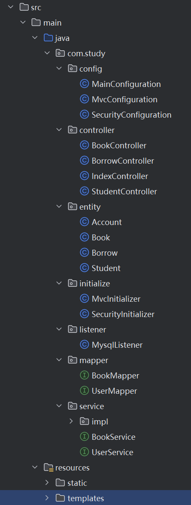
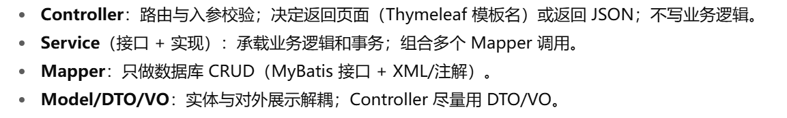
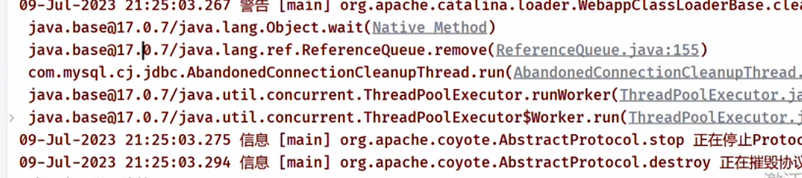
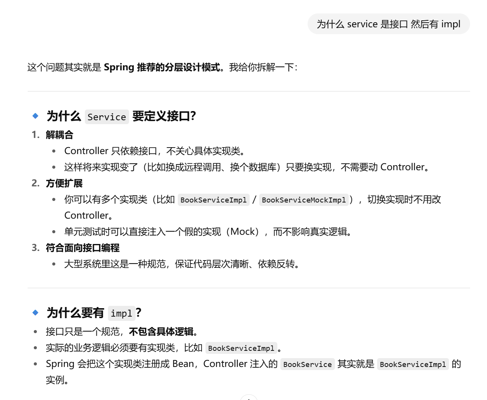

## 实战

### 图书管理系统

#### 依赖配置

```xml
<dependencies>
    <dependency>
        <groupId>jakarta.servlet</groupId>
        <artifactId>jakarta.servlet-api</artifactId>
        <version>6.1.0</version>
        <scope>provided</scope>
    </dependency>
    <dependency>
        <groupId>org.junit.jupiter</groupId>
        <artifactId>junit-jupiter-api</artifactId>
        <version>${junit.version}</version>
        <scope>test</scope>
    </dependency>
    <dependency>
        <groupId>org.junit.jupiter</groupId>
        <artifactId>junit-jupiter-engine</artifactId>
        <version>${junit.version}</version>
        <scope>test</scope>
    </dependency>

    <!--   日志依赖      -->
    <dependency>
        <groupId>org.slf4j</groupId>
        <artifactId>slf4j-api</artifactId>
        <version>1.7.33</version>
    </dependency>
    <dependency>
        <groupId>org.slf4j</groupId>
        <artifactId>slf4j-jdk14</artifactId>
        <version>1.7.33</version>
    </dependency>

    <!--    springmvc    -->
    <dependency>
        <groupId>org.springframework</groupId>
        <artifactId>spring-context</artifactId>
        <version>6.0.10</version>
    </dependency>
    <dependency>
        <groupId>org.springframework</groupId>
        <artifactId>spring-webmvc</artifactId>
        <version>6.0.10</version>
    </dependency>

    <!--    spring-security    -->
    <dependency>
        <groupId>org.springframework.security</groupId>
        <artifactId>spring-security-web</artifactId>
        <version>6.1.1</version>
    </dependency>
    <dependency>
        <groupId>org.springframework.security</groupId>
        <artifactId>spring-security-config</artifactId>
        <version>6.1.1</version>
    </dependency>

    <!--    数据库连接依赖    -->
    <dependency>
        <groupId>org.mybatis</groupId>
        <artifactId>mybatis</artifactId>
        <version>3.5.13</version>
    </dependency>
    <dependency>
        <groupId>com.mysql</groupId>
        <artifactId>mysql-connector-j</artifactId>
        <version>8.0.31</version>
    </dependency>
    <dependency>
        <groupId>org.mybatis</groupId>
        <artifactId>mybatis-spring</artifactId>
        <version>3.0.2</version>
    </dependency>
    <dependency>
        <groupId>org.springframework</groupId>
        <artifactId>spring-jdbc</artifactId>
        <version>6.0.10</version>
    </dependency>

    <!--   thymeleaf     -->
    <dependency>
        <groupId>org.thymeleaf</groupId>
        <artifactId>thymeleaf-spring6</artifactId>
        <version>3.1.1.RELEASE</version>
    </dependency>

    <!--   自动装配注解     -->
    <dependency>
        <groupId>jakarta.annotation</groupId>
        <artifactId>jakarta.annotation-api</artifactId>
        <version>2.1.1</version>
    </dependency>

    <!--   lombok   -->
    <dependency>
        <groupId>org.projectlombok</groupId>
        <artifactId>lombok</artifactId>
        <version>1.18.36</version>
    </dependency>
</dependencies>
```

#### 基本配置

主要文件结构为：



1. `pom`配置
2. `initialize` 和 `config`
    mvc配置
    security配置、登录校验配置、资源权限配置
    数据库连接配置
3. `service`, `mapper` 和 `entity`
   数据库简单获取+接口实现

#### 分析

1. 登陆后的主界面配置
    配置对应的`Controller`

`Controller` 是负责处理页面路径对应和逻辑

`service` 来实现具体的业务功能

`mapper` 负责实现与数据库交互的功能

#### 主要流程



根据一个页面 -> 创建对应的 `controller`
`controller` 负责页面路径对应，并且数据交互实现，具体的实现从`service`里调用

在`controller`里通过依赖注入获取对应的`service`对象, 类似

```java
@Resource
BookService service;
```

页面中需要的接口数据会想`controller`要，然后`controller`会从`service`调用对应的服务

需要实现的业务逻辑 -> 对应的`service`写，具体实现在 `service/impl` 里面

当`service`实现需要涉及数据库操作，从对应的`mapper`里取，在`service`就是对应的依赖注入

```java
@Resource
BookMapper mapper;
```

处理所涉及的实体类就存放在 `entity` 中

#### 功能

1. 登录 记住我 退出
2. 主页
   1. 书籍数量
   2. 学生数量
   3. 借阅数量
   4. 用户名
3. 借阅管理
   1. 登记借阅
   2. 还书
4. 书籍管理
   1. 借阅状态
   2. 添加书籍信息
   3. 删除书籍信息
5. 学生列表
   1. 获取学生信息

#### 结束时清理`sql`驱动



```java
@WebListener
public class MysqlListener implements ServletContextListener {
    @Override
    public void contextDestroyed(ServletContextEvent sce) {
        try{
            Enumeration<Driver> drivers = DriverManager.getDrivers();
            while (DriverManager.getDrivers().hasMoreElements())
                DriverManager.deregisterDriver(drivers.nextElement());
            AbandonedConnectionCleanupThread.checkedShutdown();
        }catch (SQLException e){
            e.printStackTrace();
        }

    }
}
```

#### 问题



只需要在 具体实现类 上标注 `@Service`，Spring 才能把它注册到容器里。
