## 简介

Spring Boot让您可以轻松地创建独立的、生产级别的Spring应用程序，并“直接运行”这些应用程序。

SpringBoot为大量的第三方库添加了支持，能够做到开箱即用，简化大量繁琐配置，用最少的配置快速构建你想要的项目。

在2023年，SpringBoot迎来了它的第三个大版本，随着SpringBoot 3的正式发布，整个生态也迎来了一次重大革新。

目前的最新版本以及对应的维护情况：

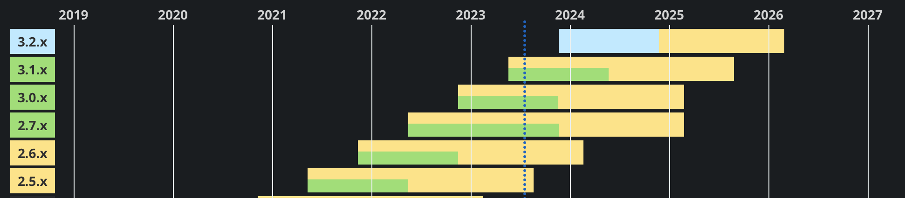

可以看到，曾经的SpringBoot 2.5版本将会在2023年8月底终止商业支持，届时将不会再对这类旧版本进行任何维护，因此，将我们的老版本SpringBoot项目进行升级已经迫在眉睫，目前最强的3.1正式版会维护到2025年中旬。

在3.X之后的变化相比2.X可以说是相当大，尤其是其生态下的SpringSecurity框架，旧版本项目在升级之后API已经完全发生改变；以及内置Tomcat服务器的升级，Servlet也升级到5以上，从`javax`全新升级到`jakarta`新包名；包括在3.X得到的大量新特性，如支持GraalVM打包本地镜像运行等；并且Java版本也强制要求为17版本。迁移到新版本不仅可以享受到免费维护支持，也可以感受Java17带来的全新体验。

介绍了这么多，我们首先还是来看看SpringBoot功能有哪些：

- 能够创建独立的Spring应用程序
- 内嵌Tomcat、Jetty或Undertow服务器（无需单独部署WAR包，打包成Jar本身就是一个可以运行的应用程序）
- 提供一站式的“starter”依赖项，以简化Maven配置（需要整合什么框架，直接导对应框架的starter依赖）
- 尽可能自动配置Spring和第三方库（除非特殊情况，否则几乎不需要进行任何配置）
- 提供生产环境下相关功能，如指标、运行状况检查和外部化配置
- 没有任何代码生成，也不需要任何XML配置（XML是什么，好吃吗）

SpringBoot是现在最主流的开发框架，国内的公司基本都在使用，也是我们出去找工作一定要会的框架，它提供了一站式的开发体验，能够大幅度提高我们的开发效率。

在SSM阶段，当我们需要搭建一个基于Spring全家桶的Web应用程序时，我们不得不做大量的依赖导入和框架整合相关的Bean定义，光是整合框架就花费了我们大量的时间，但是实际上我们发现，整合框架其实基本都是一些固定流程，我们每创建一个新的Web应用程序，基本都会使用同样的方式去整合框架，我们完全可以将一些重复的配置作为约定，只要框架遵守这个约定，为我们提供默认的配置就好，这样就不用我们再去配置了，**约定优于配置**！

而SpringBoot正是将这些过程大幅度进行了简化，它可以自动进行配置，我们只需要导入对应的启动器（starter）依赖即可。

## 快速上手

要感受SpringBoot带来的快速开发体验，我们就从创建一个项目开始。

### 极速创建项目

在过去，我们创建一个SSM项目，需要先导入各种依赖，进行大量的配置

现在，有了SpringBoot，我们可以享受超快的项目创建体验，只需要前往官网进行少量配置就能快速为你生成一个SpringBoot项目模版：<https://start.spring.io/>

不过，为了方便，IDEA已经将这个工具集成到内部了，我们可以直接在IDEA中进行创建，效果是一样的

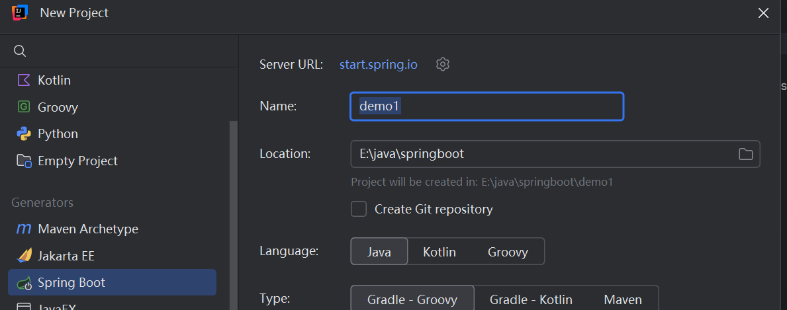

接着我们就可以配置项目的语言，并且选择项目需要使用的模块，这里我们简单选择两个依赖：

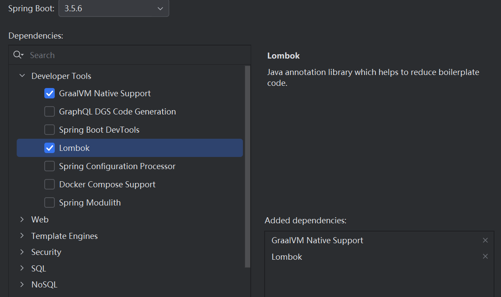

如果一开始不清楚自己需要哪些模块，我们也可以后续自己手动添加对应模块的starter依赖，使用非常简单。

项目自动生成之后，可以看到Spring相关的依赖已经全部自动导入

并且也自动为我们创建了一个主类用于运行我们的SpringBoot项目

我们可以一键启动我们的SpringBoot项目：

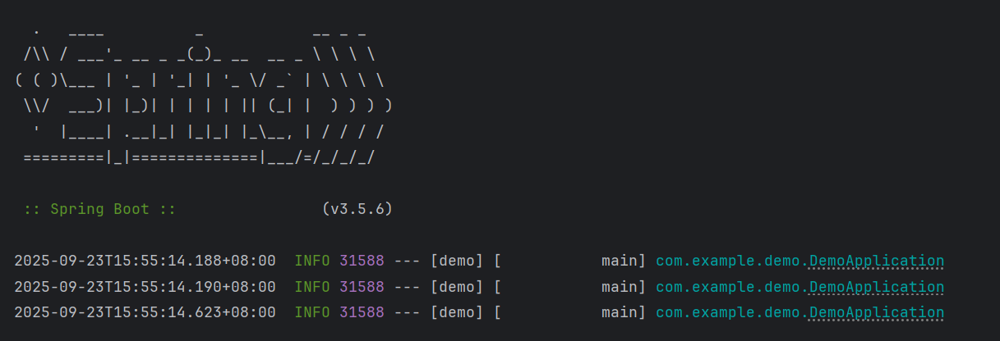

只不过由于我们没有添加任何有用的模块，也没有编写什么操作，因此启动之后项目就直接停止了。

### 常用模块快速整合

前面我们说了，SpringBoot的核心思想就是**约定大于配置**，能在一开始默认的就直接默认，不用我们自己来进行配置，我们只需要配置某些特殊的部分即可。

我们来尝试将我们之前使用过的模块进行一下快速整合，可以看到在一开始的时候，我们没有勾选其他的依赖

#### `spring-boot-starter`

因此这里只导入了最基本的`spring-boot-starter`依赖：

```xml
<dependency>
     <groupId>org.springframework.boot</groupId>
     <artifactId>spring-boot-starter</artifactId>
</dependency>
```

所有的SpringBoot依赖都是以starter的形式命名的，之后我们需要导入其他模块也是导入`spring-boot-starter-xxxx`这种名称格式的依赖。

##### SpringMvc相关依赖

首先我们还是从SpringMvc相关依赖开始。

SpringBoot为我们提供了**包含内置Tomcat服务器的Web模块**，我们只需要导入依赖就能直接运行服务器：

```xml
<dependency>
     <groupId>org.springframework.boot</groupId>
     <artifactId>spring-boot-starter-web</artifactId>
</dependency>
```

我们不需要进行任何配置，直接点击启动

它真的做到了开箱即用，我们现在可以直接访问这个网站：

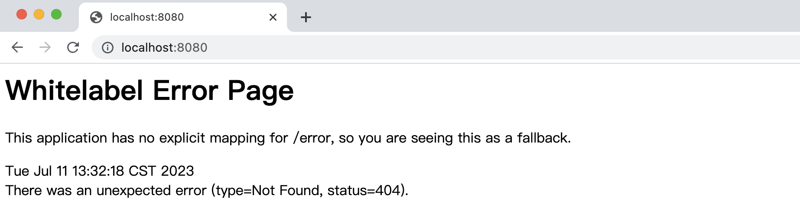

可以看到成功响应了404页面，相比之前的大量配置，可以说方便了很多，我们到目前为止仅仅是导入了一个依赖，就可以做到直接启动我们的Web服务器并正常访问。

##### 自动包扫描

SpringBoot支持**自动包扫描**，我们不需要编写任何配置，直接在任意路径（但是不能跑到主类所在包外面去了）下创建的组件（如Controller、Service、Component、Configuration等）都可以生效

比如我们这里创建一个测试的Controller试试看：

```java
@Controller
public class TestController {
    
    @ResponseBody
    @GetMapping("/")
    public String index(){
        return "Hello World";
    }
}
```

重启之后，可以看到直接就能访问到，而这期间我们只是创建了对应的Controller却没有进行任何配置，这真的太方便了

##### 自动转换JSON

包括一个对象现在也可以直接以JSON形式返回给客户端，无需任何配置：

```java
@Data
public class Student {
    int sid;
    String name;
    String sex;
}
```

```java
@ResponseBody
@GetMapping("/")
public Student index(){
    Student student = new Student();
    student.setName("小明");
    student.setSex("男");
    student.setSid(10);
    return student;
}
```

最后浏览器能够直接得到`application/json`的响应数据，就是这么方便，这都得归功于SpringBoot对应的start帮助我们自动将处理JSON数据的Converter进行了配置，我们不需要再单独去配置Converter了。

不过SpringBoot官方默认使用的是`Jackson`和`Gson` 的HttpMessageConverter来进行配置，不是我们之前教程中使用的FastJSON框架。

##### 相关依赖

我们最后来看看这个Start包含了哪些依赖：

```xml
<dependencies>
    <dependency>
      <groupId>org.springframework.boot</groupId>
      <artifactId>spring-boot-starter</artifactId>
      <version>3.1.1</version>
      <scope>compile</scope>
    </dependency>
    <dependency>
      <groupId>org.springframework.boot</groupId>
      <artifactId>spring-boot-starter-json</artifactId>
      <version>3.1.1</version>
      <scope>compile</scope>
    </dependency>
    <dependency>
      <groupId>org.springframework.boot</groupId>
      <artifactId>spring-boot-starter-tomcat</artifactId>
      <version>3.1.1</version>
      <scope>compile</scope>
    </dependency>
    <dependency>
      <groupId>org.springframework</groupId>
      <artifactId>spring-web</artifactId>
      <version>6.0.10</version>
      <scope>compile</scope>
    </dependency>
    <dependency>
      <groupId>org.springframework</groupId>
      <artifactId>spring-webmvc</artifactId>
      <version>6.0.10</version>
      <scope>compile</scope>
    </dependency>
  </dependencies>
```

里面包含了以下内容：

- spring-boot-starter  基础依赖starter
- spring-boot-starter-json  配置JSON转换的starter
- spring-boot-starter-tomcat   内置Tomcat服务器
- spring-web、spring-webmvc    不用多说了吧，之前已经讲过了

#### 配置类添加

如果需要像之前一样添加WebMvc的配置类，方法是一样的，直接创建即可：

```java
//只需要添加Configuration用于注册配置类，不需要其他任何注解，已经自动配置好了
@Configuration
public class WebConfiguration implements WebMvcConfigurer {
    @Override
    public void addInterceptors(InterceptorRegistry registry) {
        registry.addInterceptor(new HandlerInterceptor() {
            @Override
            public boolean preHandle(HttpServletRequest request, HttpServletResponse response, Object handler) throws Exception {
                return HandlerInterceptor.super.preHandle(request, response, handler);
            }
        });
    }
}
```

#### `SpringSecurity`

同样的，我们来看看SpringSecurity框架如何进行整合，也是非常简单，我们只需要直接导入即可：

```xml
<dependency>
    <groupId>org.springframework.boot</groupId>
    <artifactId>spring-boot-starter-security</artifactId>
</dependency>
```

导入完成后，再次访问网站，就可以看到熟悉的登录界面了

我们没有进行任何配置，而是对应的Starter帮助我们完成了默认的配置，并且在启动时，就已经帮助我们配置了一个随机密码的用户可以直接登录使用

密码直接展示在启动日志中，而默认用户名称为`user`，我们可以直接登录

同样没有进行任何配置，我们只需要添加对应的starter就能做到开箱即用，并且内置一套默认配置，自动帮助我们创建一个测试用户，方便我们快速搭建项目

##### 添加配置类

同样的，如果要进行额外配置，我们只需要直接添加配置类即可：

```java
//依然只需要Configuration注解即可，不需要其他配置
@Configuration
public class SecurityConfiguration {

    //配置方式跟之前SSM阶段是一样的
    @Bean
    public SecurityFilterChain filterChain(HttpSecurity http) throws Exception {
        return http
                .authorizeHttpRequests(auth -> {
                    auth.anyRequest().authenticated();
                })
                .formLogin(conf -> {
                    conf.loginPage("/login");
                    conf.loginProcessingUrl("/doLogin");
                    conf.defaultSuccessUrl("/");
                    conf.permitAll();
                })
                .build();
    }
}
```

#### `Thymeleaf`

同样的，我们也可以快速整合之前使用的模版引擎，比如Thymeleaf框架，直接上对应的Starter即可：

```xml
<dependency>
    <groupId>org.springframework.boot</groupId>
    <artifactId>spring-boot-starter-thymeleaf</artifactId>
</dependency>
```

在默认情况下，我们需要在`resources`目录下创建两个目录：

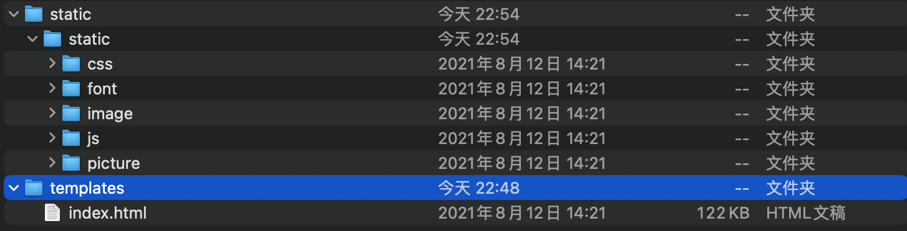

这两个目录是默认配置下需要的，名字必须是这个：

- `templates` - 所有模版文件都存放在这里
- `static` - 所有静态资源都存放在这里

我们只需要按照上面的样子放入我们之前的前端模版，就可以正常使用模版引擎了，同样不需要进入任何的配置，当然后续也可以进行修改。

我们不需要在controller中写任何内容，它默认会将index.html作为首页文件，我们直接访问服务器地址就能展示首页了：

```java
@Controller
public class TestController {
  //什么都不用写
}
```


这都是得益于**约定大于配置**的思想。

#### `Mybatis`

我们最后再来看看Mybatis如何进行整合，同样只需要一个starter即可，这里顺便把MySQL的驱动加上：

```xml
<dependency>
    <groupId>org.mybatis.spring.boot</groupId>
    <artifactId>mybatis-spring-boot-starter</artifactId>
    <version>3.0.2</version>
</dependency>
<dependency>
    <groupId>com.mysql</groupId>
    <artifactId>mysql-connector-j</artifactId>
    <scope>runtime</scope>
</dependency>
```

注意这里的`mybatis-spring-boot-starter`版本需要我们自己指定，因为它没有被父工程默认管理。


启动服务器时，我们发现这里出现了问题，导致无法启动。

这是因为我们没有**配置数据源**导致的，虽然SpringBoot采用约定大于配置的思想，但是数据库信息只有我们自己清楚，而且变化多样，根本没有办法提前完成约定，所以说这里我们还是需要再配置文件中编写。

### 自定义运行器

在项目中，可能会遇到这样一个问题：我们需要在项目启动完成之后，紧接着执行一段代码。

我们可以编写自定义的ApplicationRunner来解决，它会在项目启动完成后执行：

```java
@Component
public class TestRunner implements ApplicationRunner {
    @Override
    public void run(ApplicationArguments args) throws Exception {
        System.out.println("我是自定义执行！");
    }
}
```

当然也可以使用CommandLineRunner，它也支持使用@Order或是实现Ordered接口来支持优先级执行。

### 配置文件介绍

前面我们已经体验了SpringBoot带来的快捷开发体验，不过我们发现有些东西还是需要我们自己来编写配置才可以，不然SpringBoot项目无法正常启动，我们来看看如何编写配置。

#### `application.properties`

我们可以直接在`application.properties`中进行配置编写，它是整个SpringBoot的配置文件，比如要修改服务器的默认端口：

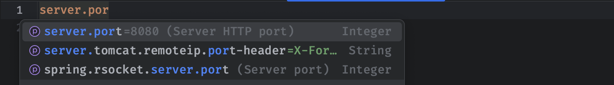

这些配置其实都是各种Starter提供的，部分配置在Starter中具有默认值，我们即使不配置也会使用默认值，比如这里的8080就是我们服务器的默认端口，我们也可以手动修改它，来变成我们需要的。

##### 自定义的配置

除了配置已经存在的选项，我们也可以添加自定义的配置，来方便我们程序中使用，比如我们这里创建一个测试数据：

```properties
test.data=100
```

我们可以直接在程序中通过`@Value`来访问到（跟我们之前Spring基础篇讲的是一样的）

```java
@Controller
public class TestController {
    @Value("${test.data}")
    int data;   //直接从配置中去取
}
```

#### yaml格式

配置文件除了使用`properties`格式以外，还有一种叫做`yaml`格式，它的语法如下：

```yaml
一级目录:
    二级目录:
      三级目录1: 值
      三级目录2: 值
      三级目录List: 
      - 元素1
      - 元素2
      - 元素3
```

**缩进只能空格，键和值之间要有空格**

我们可以看到，每一级目录都是通过缩进（不能使用Tab，只能使用空格）区分，并且**键和值之间**需要添加**冒号+空格**来表示。

SpringBoot也支持这种格式的配置文件，我们可以将`application.properties`修改为`application.yml`或是`application.yaml`来使用YAML语法编写配置：

```yaml
server:
  port: 80
```

##### 配置数据源

现在我们来尝试为之前的数据源进行一下配置，这样才能正常启动我们的服务器：

```yaml
spring:
  datasource:
    url: jdbc:mysql://localhost:3306/test
    username: root
    password: 123456
    driver-class-name: com.mysql.cj.jdbc.Driver
```

配置完成后，我们就可以正常启动服务器了。

#### 测试`MyBatis`

这里我们接续来测试一下MyBatis的配置，想要在SpringBoot中使用Mybatis也很简单，不需要进行任何配置，我们直接编写Mapper即可，这里我们随便创建一个表试试看：


```java
@Data
public class User {
    int id;
    String name;
    String email;
    String password;
}
```

注意，在SpringBoot整合之后，我们只需要直接在配置类上添加`@MapperScan`注解即可，跟我们之前的使用方法是一样的：

```java
@Configuration
@MapperScan("com.example.mapper")
public class WebConfiguration implements WebMvcConfigurer {
  ...
```

不过，为了方便，我们也可以直接为需要注册为Mapper的接口添加`@Mapper`注解，来表示这个接口作为Mapper使用：


这样，即使不配置MapperScan也能直接注册为Mapper正常使用，是不是感觉特别方便？

```java
@Mapper
public interface UserMapper {
    @Select("select * from user where id = #{id}")
    User findUserById(int id);
}
```

```java
@ResponseBody
@GetMapping("/test")
public User test(){
    return mapper.findUserById(1);
}
```

访问接口测试一下：


#### 常见配置项

最后，我们再来介绍一下常见的配置项，比如SpringSecurity和SpringBootMvc配置：

```yaml
spring:  
  #  Spring Mvc相关配置
  mvc:
    static-path-pattern: /static/**   #静态资源解析地址
  # Spring Security 相关配置
  security:
    filter:
      order: -100 #Spring Security 过滤器优先级
    user:
      name: 'admin'   #默认登录用户名
      password: '123456'   #默认登录密码
      roles:    #默认用户的角色
        - admin
        - user
```

更多的配置我们可以在后续的学习中继续认识，这些配置其实都是由Starter提供的，确实极大程度简化了我们对于框架的使用。

### 轻松打包运行

前面我们介绍了一个SpringBoot如何快捷整合其他框架以及进行配置编写，我们接着来看如何打包我们的SpringBoot项目使其可以正常运行

SpringBoot提供了一个非常便捷的打包插件，能够直接将我们的项目打包成一个jar包，然后使用java命令直接运行

我们直接点击Maven中的：

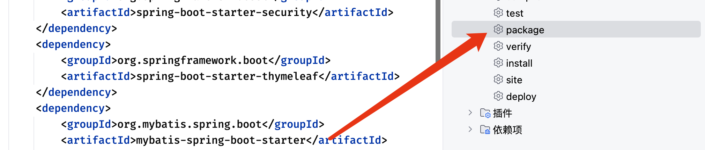

点击之后项目会自动打包构建

打包完成之后，会在target目录下出现一个打包好的jar文件

我们可以直接在命令行中运行这个程序，在CMD中进入到target目录，然后输入：

```sh
java -jar demo-0.0.1-SNAPSHOT.jar
```

这样就可以直接运行了

现在，我们的SpringBoot项目就可以快速部署到任何计算机了，只要能够安装JRE环境，都可以通过命令一键运行。

#### war包运行

当然，可能也会有小伙伴好奇，怎么才能像之前一样在我们的Tomcat服务器中运行呢？我们也可以将其打包为War包的形式部署到我们自己环境中的Tomcat服务器或是其他任何支持Servlet的服务器中，但是这种做法相对比较复杂，不太推荐采用这种方式进行项目部署，不过我们这里还是介绍一下。

首先我们需要排除掉`spring-boot-starter-web`中自带的Tomcat服务器依赖：

```xml
<dependency>
    <groupId>org.springframework.boot</groupId>
       <artifactId>spring-boot-starter-web</artifactId>
       <exclusions>
          <exclusion>
             <groupId>org.springframework.boot</groupId>
             <artifactId>spring-boot-starter-tomcat</artifactId>
          </exclusion>
       </exclusions>
</dependency>
```

然后自行添加Servlet依赖：

```xml
<dependency>
   <groupId>jakarta.servlet</groupId>
   <artifactId>jakarta.servlet-api</artifactId>
   <scope>provided</scope>
</dependency>
```

最后将打包方式修改为war包：

```xml
<packaging>war</packaging>
```

接着我们需要修改主类，将其继承`SpringBoot`需要的`Initializer`（又回到SSM阶段那烦人的配置了，所以说一点不推荐这种部署方式）

```java
@SpringBootApplication
public class DemoApplication extends SpringBootServletInitializer {  
    //继承专用的初始化器
    public static void main(String[] args) {
        SpringApplication.run(DemoApplication.class, args);
    }

    //重写configure方法，完成启动类配置
    @Override
    protected SpringApplicationBuilder configure(SpringApplicationBuilder builder) {
        return builder.sources(DemoApplication.class);
    }
}
```

最后，我们再次运行Maven 的package指令就可以打包为war包了

我们可以直接将其部署到Tomcat服务器中（webapps目录下）

接着启动服务器就能正常访问了

##### 在`war`情况下的IDEA运行

如果各位小伙伴需要在IDEA中进行调试运行，我们需要像之前一样配置一个Tomcat运行环境：

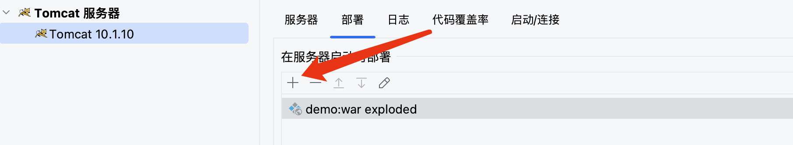

这样就可以跟之前一样使用外部Tomcat服务器了：

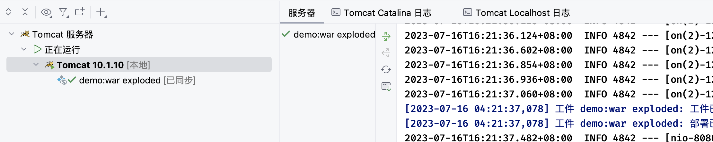

### 新特性 - `GraalVM` (了解)

最后，我们需要特别介绍一下新的特性，在SpringBoot3之后，特别对GraalVM进行了支持：

> GraalVM 是一种通用的虚拟机，最初由 Oracle 开发。它支持多种编程语言（例如 Java、JavaScript、Python 等），可以在不同的环境中运行，并提供高性能和低内存消耗。
>
> GraalVM的核心是一个即时编译器，它能够将各种语言的代码直接编译成本地机器码，以获得更高的性能。此外，GraalVM 还提供了一个强大的运行时环境，包括垃圾回收器、即时编译器、线程管理器等，可以提供更好的性能和可扩展性。
>
> GraalVM 的一个重要特性是它的跨语言互操作性。GraalVM 可以使不同语言之间的互操作更加容易。例如，你可以在 Java 代码中直接调用 JavaScript 函数，或者在 JavaScript 代码中直接调用 Java 类。这使得在不同语言之间共享和复用代码变得更加容易。
>
> 总的来说，GraalVM 是一个开创性的技术，可以提供出色的性能和灵活性，同时也为多语言开发提供了更好的支持。它是一个非常有潜力的工具，可以用于构建高效的应用程序和解决方案。

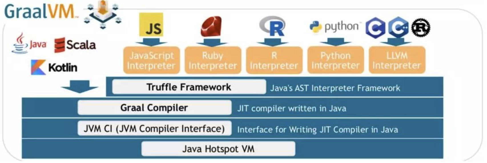

简而言之，我们的SpringBoot项目除了打包为传统的Jar包基于JVM运行之外，我们也可以将其直接编译为操作系统原生的程序来进行使用（这样会大幅提升程序的运行效率，但是由于编译为操作系统原生程序，这将**无法支持跨平台**）

首先我们需要安装GraalVM的环境才可以，这跟安装普通JDK的操作是完全一样的，下载地址：<https://github.com/graalvm/graalvm-ce-builds/releases/tag/jdk-17.0.7>

下载好对应系统架构的GraalVM环境之后，就可以安装部署了

首先我们需要为GraalVM配置环境变量，将GRAALVM_HOME作为环境变量指向你的安装目录的bin目录下

接着我们就可以开始进行打包了（注意，SpringBoot项目必须在创建的时候添加了Native支持才可以，否则无法正常打包）

注意，一定要将`GRAALVM_HOME`配置到环境变量中，否则会报错

一切无误后，我们直接在IDEA中或是命令行中输入：

```sh
mvn -Pnative -DskipTests native:compile
```

接着会自动安装`native-image`组件，然后进行本地镜像的编译（建议挂梯，不然卡一天都下不动）

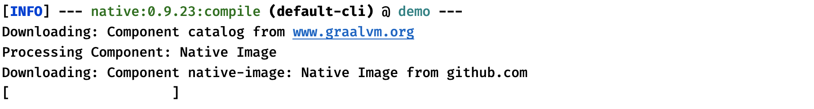

编译过程中比较消耗资源，建议CPU选择6核及以上，不然速度会很慢

这样一个系统原生的SpringBoot项目就打包好了，我们可以直接运行这个程序：

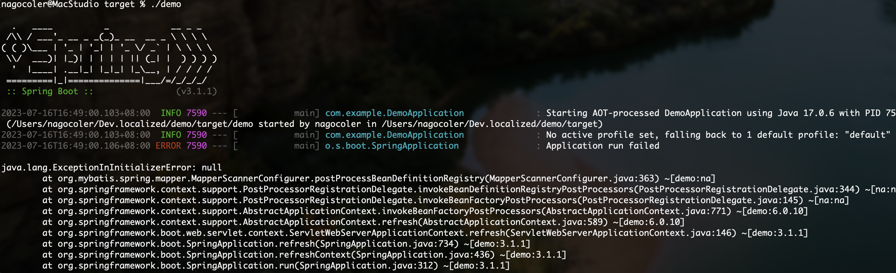
