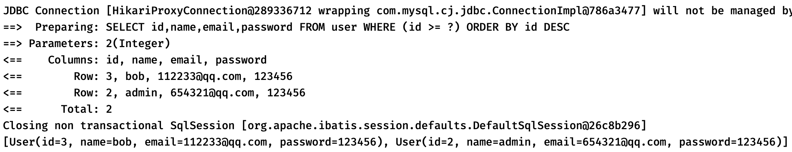
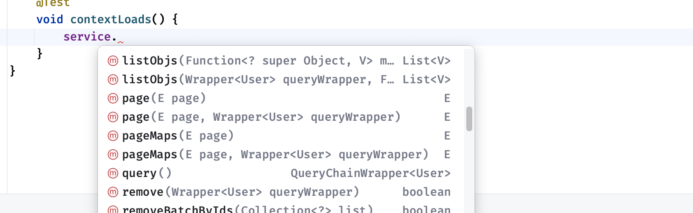
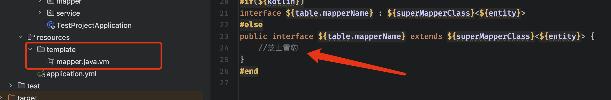
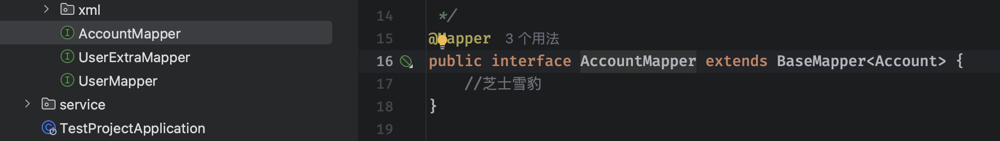

## MybatisPlus框架

前面我们体验了**JPA**带来的快速开发体验，但是我们发现，面对一些复杂查询时，JPA似乎有点力不从心，反观稍微麻烦一点的Mybatis却能够手动编写SQL，使用起来更加灵活，那么有没有一种既能灵活掌控逻辑又能快速完成开发的持久层框架呢？

> [MyBatis-Plus](https://github.com/baomidou/mybatis-plus)（简称 MP）是一个 [MyBatis](https://www.mybatis.org/mybatis-3/)的增强工具，在 MyBatis 的基础上只做增强不做改变，为简化开发、提高效率而生。
>
> MybatisPlus的愿景是成为 MyBatis 最好的搭档，就像 [魂斗罗](https://baomidou.com/img/contra.jpg) 中的 1P、2P，基友搭配，效率翻倍。


官方网站地址：https://baomidou.com

MybatisPlus具有以下特性：

- **无侵入**：只做增强不做改变，引入它不会对现有工程产生影响，如丝般顺滑
- **损耗小**：启动即会自动注入基本 CURD，性能基本无损耗，直接面向对象操作
- **强大的 CRUD 操作**：内置通用 Mapper、通用 Service，仅仅通过少量配置即可实现单表大部分 CRUD 操作，更有强大的条件构造器，满足各类使用需求
- **支持 Lambda 形式调用**：通过 Lambda 表达式，方便的编写各类查询条件，无需再担心字段写错
- **支持主键自动生成**：支持多达 4 种主键策略（内含分布式唯一 ID 生成器 - Sequence），可自由配置，完美解决主键问题
- **支持 ActiveRecord 模式**：支持 ActiveRecord 形式调用，实体类只需继承 Model 类即可进行强大的 CRUD 操作
- **支持自定义全局通用操作**：支持全局通用方法注入（ Write once, use anywhere ）
- **内置代码生成器**：采用代码或者 Maven 插件可快速生成 Mapper 、 Model 、 Service 、 Controller 层代码，支持模板引擎，更有超多自定义配置等您来使用
- **内置分页插件**：基于 MyBatis 物理分页，开发者无需关心具体操作，配置好插件之后，写分页等同于普通 List 查询
- **分页插件支持多种数据库**：支持 MySQL、MariaDB、Oracle、DB2、H2、HSQL、SQLite、Postgre、SQLServer 等多种数据库
- **内置性能分析插件**：可输出 SQL 语句以及其执行时间，建议开发测试时启用该功能，能快速揪出慢查询
- **内置全局拦截插件**：提供全表 delete 、 update 操作智能分析阻断，也可自定义拦截规则，预防误操作

框架整体结构如下：


不过，光说还是不能体会到它带来的便捷性，我们接着就来上手体验一下。

### 快速上手

跟之前一样，还是添加依赖：

```xml
<dependency>
     <groupId>com.baomidou</groupId>
     <artifactId>mybatis-plus-boot-starter</artifactId>
     <version>3.5.3.1</version>
</dependency>
<dependency>
     <groupId>com.mysql</groupId>
     <artifactId>mysql-connector-j</artifactId>
</dependency>
```

配置文件依然只需要配置数据源即可：

```yaml
spring:
  datasource:
    url: jdbc:mysql://localhost:3306/test
    username: root
    password: 123456
    driver-class-name: com.mysql.cj.jdbc.Driver
```

然后依然是实体类，可以直接映射到数据库中的表：

```java
@Data
@TableName("user")  //对应的表名
public class User {
    @TableId(type = IdType.AUTO)   //对应的主键
    int id;
    @TableField("name")   //对应的字段
    String name;
    @TableField("email")
    String email;
    @TableField("password")
    String password;
}
```

接着，我们就可以编写一个Mapper来操作了：

```java
@Mapper
public interface UserMapper extends BaseMapper<User> {
  	//使用方式与JPA极其相似，同样是继承一个基础的模版Mapper
  	//这个模版里面提供了预设的大量方法直接使用，跟JPA如出一辙
}
```

这里我们就来写一个简单测试用例：

```java
@SpringBootTest
class DemoApplicationTests {

    @Resource
    UserMapper mapper;

    @Test
    void contextLoads() {
        System.out.println(mapper.selectById(1));  //同样可以直接selectById，非常快速方便
    }
}
```

可以看到这个Mapper提供的方法还是很丰富的：


后续的板块我们将详细介绍它的使用方式。

### `Wrapper` 条件构造器

对于一些复杂查询的情况，MybatisPlus支持我们自己构造`QueryWrapper`用于复杂条件查询：

```java
@Test
void contextLoads() {
    QueryWrapper<User> wrapper = new QueryWrapper<>();    
    // 复杂查询可以使用QueryWrapper来完成
    wrapper
        .select("id", "name", "email", "password")    
        // 可以自定义选择哪些字段
        .ge("id", 2)     
        // 选择判断id大于等于1的所有数据
        .orderByDesc("id");   
        // 根据id字段进行降序排序
    System.out.println(mapper.selectList(wrapper));   
    // Mapper同样支持使用QueryWrapper进行查询
}
```

通过使用上面的`QueryWrapper`对象进行查询，也就等价于下面的SQL语句：

```sql
select id,name,email,password from user where id >= 2 order by id desc
```

我们可以在配置中开启SQL日志打印：

```yaml
mybatis-plus:
  configuration:
    log-impl: org.apache.ibatis.logging.stdout.StdOutImpl
```

最后得到的结果如下：



#### 批处理

有些时候我们遇到需要批处理的情况，也可以直接使用批处理操作：

```java
@Test
void contextLoads() {
    //支持批处理操作，我们可以一次性删除多个指定ID的用户
    int count = mapper.deleteBatchIds(List.of(1, 3));
    System.out.println(count);
}
```

#### 分页查询

我们也可以快速进行分页查询操作，不过在执行前我们需要先配置一下：

```java
@Configuration
public class MybatisConfiguration {
    @Bean
    public MybatisPlusInterceptor paginationInterceptor() {
        MybatisPlusInterceptor interceptor = new MybatisPlusInterceptor();
        // 添加分页拦截器到MybatisPlusInterceptor中
        interceptor.addInnerInterceptor(new PaginationInnerInterceptor(DbType.MYSQL));
        return interceptor;
    }
}
```

这样我们就可以愉快地使用分页功能了：

```java
@Test
void contextLoads() {
    // 这里我们将用户表分2页，并获取第一页的数据
    Page<User> page = mapper.selectPage(Page.of(1, 2), Wrappers.emptyWrapper());
    System.out.println(page.getRecords());   //获取分页之后的数据
}
```

#### 数据更新

对于数据更新操作，我们也可以使用UpdateWrapper非常方便的来完成：

```java
@Test
void contextLoads() {
    UpdateWrapper<User> wrapper = new UpdateWrapper<>();
    wrapper
            .set("name", "lbw")
            .eq("id", 1);
    System.out.println(mapper.update(null, wrapper));
}
```

这样就可以快速完成更新操作了

#### Lambda快速实现

QueryWrapper和UpdateWrapper还有专门支持Java 8新增的Lambda表达式的特殊实现，可以直接以函数式的形式进行编写，使用方法是一样的，这里简单演示几个：

```java
@Test
void contextLoads() {
        LambdaQueryWrapper<User> wrapper = Wrappers
                .<User>lambdaQuery()
                .eq(User::getId, 2)   
                // 比如我们需要选择id为2的用户，前面传入方法引用，后面比的值
                .select(User::getName, User::getId);   
                // 比如我们只需要选择name和id，那就传入对应的get方法引用
        System.out.println(mapper.selectOne(wrapper));
}
```

不过感觉可读性似乎没有不用Lambda高啊。

### 接口基本操作

虽然使用MybatisPlus提供的BaseMapper已经很方便了，但是我们的业务中，实际上很多时候也是一样的工作，都是去简单调用底层的Mapper做一个很简单的事情，那么能不能干脆把Service也给弄个模版？

MybatisPlus为我们提供了很方便的CRUD接口，直接实现了各种业务中会用到的增删改查操作。

我们只需要继承即可：

```java
@Service
public interface UserService extends IService<User> {
    // 除了继承模版，我们也可以把它当成普通Service添加自己需要的方法
}
```

接着我们还需要编写一个实现类，这个实现类就是UserService的实现：

```java
@Service   
//需要继承ServiceImpl才能实现那些默认的CRUD方法
public class UserServiceImpl extends ServiceImpl<UserMapper, User> implements UserService {
}
```

使用起来也很方便，整合了超多方法：



比如我们想批量插入一组用户数据到数据库中：

```java
@Test
void contextLoads() {
    List<User> users = List.of(new User("xxx"), new User("yyy"));
    // 预设方法中已经支持批量保存了，这相比我们直接用for效率高不少
    service.saveBatch(users);
}
```

还有更加方便快捷的保存或更新操作，当数据不存在时（通过主键ID判断）则插入新数据，否则就更新数据：

```java
@Test
void contextLoads() {
    service.saveOrUpdate(new User("aaa"));
}
```

我们也可以直接使用Service来进行链式查询，写法非常舒服：

```java
@Test
void contextLoads() {
    User one = service.query().eq("id", 1).one();
    System.out.println(one);
}
```

### 新版代码生成器

最后我们再来隆重介绍一下MybatisPlus的代码生成器，这个东西可谓是拯救了千千万万学子的毕设啊。

它能够根据数据库做到代码的一键生成，整个项目从Mapper到Controller，所有的东西全部都给你生成好了，你只管把需要补充的业务给写了就行，这是真正的把饭给喂到你嘴边的行为，是广大学子的毕设大杀器。

那么我们就来看看，这玩意怎么去用的，首先我们需要先把整个项目的数据库给创建好，创建好之后，我们继续下一步，这里我们从头开始创建一个项目，感受一下它的强大，首先创建一个普通的SpringBoot项目

接着我们导入一会需要用到的依赖：

```xml
<dependency>
    <groupId>com.baomidou</groupId>
    <artifactId>mybatis-plus-boot-starter</artifactId>
    <version>3.5.3.1</version>
</dependency>
<dependency>
    <groupId>com.baomidou</groupId>
    <artifactId>mybatis-plus-generator</artifactId>
    <version>3.5.3.1</version>
</dependency>
<dependency>
    <groupId>org.apache.velocity</groupId>
    <artifactId>velocity-engine-core</artifactId>
    <version>2.3</version>
</dependency>
```

然后再配置一下数据源：

```yaml
spring:
  datasource:
    url: jdbc:mysql://localhost:3306/test
    username: root
    password: 123456
    driver-class-name: com.mysql.cj.jdbc.Driver
```

接着我们就可以开始编写自动生成脚本了，这里依然选择测试类，用到`FastAutoGenerator`作为生成器：

```java
    @Test
    void contextLoads() {
        FastAutoGenerator
                //首先使用create来配置数据库链接信息
                .create(new DataSourceConfig.Builder(dataSource))
                .execute();
    }
```

接着我们配置一下全局设置，这些会影响一会生成的代码：

```java
@Test
void contextLoads() {
    FastAutoGenerator
            .create(new DataSourceConfig.Builder(dataSource))
            .globalConfig(builder -> {
                builder.author("lbw");              //作者信息，一会会变成注释
                builder.commentDate("2024-01-01");  //日期信息，一会会变成注释
                builder.outputDir("src/main/java"); //输出目录设置为当前项目的目录
            })
            .execute();
}
```

然后是打包设置，也就是项目的生成的包等等，这里简单配置一下：

```java
@Test
void contextLoads() {
    FastAutoGenerator
            ...
                //打包设置，这里设置一下包名就行，注意跟我们项目包名设置为一致的
                .packageConfig(builder -> builder.parent("com.example"))
                .strategyConfig(builder -> {
                    //设置为所有Mapper添加@Mapper注解
                    builder
                            .mapperBuilder()
                            .mapperAnnotation(Mapper.class)
                            .build();
            })
            .execute();
}
```

接着我们就可以直接执行了这个脚本了

现在，可以看到我们的项目中已经出现自动生成代码了

我们也可以直接运行这个项目

速度可以说是非常之快，一个项目模版就搭建完成了，我们只需要接着写业务就可以了，当然如果各位小伙伴需要更多定制化的话，可以在官网查看其他的配置：<https://baomidou.com/pages/981406/>

对于一些有特殊要求的用户来说，我们希望能够以自己的模版来进行生产，怎么才能修改它自动生成的代码模版呢，我们可以直接找到`mybatis-plus-generator`的源码

生成模版都在在这个里面有写，我们要做的就是去修改这些模版，变成我们自己希望的样子，由于默认的模版解析引擎为Velocity，我们需要复制以`.vm`结尾的文件到`resource`随便一个目录中，然后随便改：



接着我们配置一下模版：

```java
@Test
void contextLoads() {
    FastAutoGenerator
            ...
                .strategyConfig(builder -> {
                builder
                        .mapperBuilder()
                        .enableFileOverride()   //开启文件重写，自动覆盖新的
                        .mapperAnnotation(Mapper.class)
                        .build();
            })
            .templateConfig(builder -> {
                builder.mapper("/template/mapper.java.vm");
            })
            .execute();
}
```

这样，新生成的代码中就是按照我们自己的模版来定义了:



## Redis交互

## Elasticsearch交互
