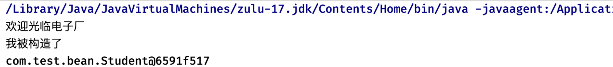
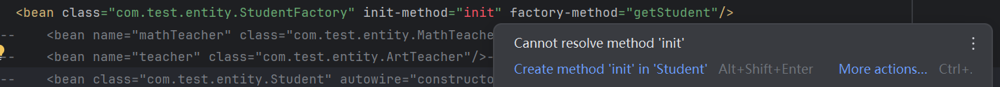

## IoC理论基础 4

### 工厂模式和工厂Bean

默认情况下，容器会调用Bean对应类型的构造方法进行对象创建

但是在某些时候，我们可能不希望外界使用类的构造方法完成对象创建，比如在工厂方法设计模式中

我们更希望 Spring 不要直接利用反射机制通过构造方法创建Bean对象, 而是利用反射机制先找到**对应的工厂类**，然后**利用工厂类去生成需要的Bean对象**：

```java
public class Student {
    Student() {
        System.out.println("我被构造了");
    }
}
```

```java
public class StudentFactory {
    public static Student getStudent(){
        System.out.println("欢迎光临电子厂");
        return new Student();
    }
}
```

#### `factory-method`

得到的`Bean`依然是对应对象的`Bean`, 而不是对应工厂的。

此时Student有一个工厂，我们正常情况下需要使用工厂才可以得到Student对象，现在我们希望Spring也这样做，不要直接去反射搞构造方法创建，我们可以通过`factory-method`进行指定：

```xml
<bean class="com.test.bean.StudentFactory" factory-method="getStudent"/>
```

注意，这里的Bean类型需要填写为**Student类的工厂类**，并且添加`factory-method`指定对应的工厂方法

但是**最后注册的是工厂方法的返回类型**，所以说依然是`Student`的Bean

此时我们再去进行获取，拿到的也是通过工厂方法得到的对象



> 这里有一个误区，千万不要认为是我们注册了StudentFactory这个Bean，class填写为这个类这个**只是为了告诉Spring我们的工厂方法在哪个位置**，真正注册的是工厂方法提供的东西。
> 也可以用`init-method`测试，当你把对应的`init`方法写在`StudentFactory`中，idea会自动报错，只有写在`Student`中才是正确的。
 

可以发现，当我们采用工厂模式后，我们就无法再通过配置文件对Bean进行依赖注入等操作了，而是只能在工厂方法中完成.

#### 工厂`Bean` - `factory-bean`

当然，可能某些工厂类需要构造出对象之后才能使用(比如对应构建实体类对象的方法不是`Static`)

就需要先将这个工厂类注册为一个`bean`，然后再基于这个`bean`作为新的`bean`的`factory-bean`的值

我们也可以将某个工厂类直接注册为工厂Bean：

```java
public class StudentFactory {
    public Student getStudent(){
        System.out.println("欢迎光临电子厂");
        return new Student();
    }
}
```

现在需要`StudentFactory`对象才可以获取到`Student`，此时我们就**只能先将其注册为Bean了**，像这样将工厂类注册为Bean，我们称其为工厂Bean，然后再使用`factory-bean`来指定Bean的工厂Bean：

```xml
<bean name="studentFactory" class="com.test.bean.StudentFactory"/>
<bean factory-bean="studentFactory" factory-method="getStudent"/>
```

注意，使用factory-bean之后，不再要求指定class，我们可以直接使用了：


此时可以看到，工厂方法上同样有了图标，这种方式，由于工厂类被注册为Bean，此时我们就可以在配置文件中为工厂Bean配置依赖注入等内容了。

这里还有一个很细节的操作，如果我们想获取工厂Bean为我们提供的Bean，**可以直接输入工厂Bean的名称，这样不会得到工厂Bean的实例，而是工厂Bean生产的Bean的实例**：

```java
Student bean = (Student) context.getBean("studentFactory");
```

当然，如果我们需要获取工厂类的实例，可以在名称前面添加`&`符号：

```java
StudentFactory bean = (StudentFactory) context.getBean("&studentFactory");
```

##### 直接继承`FactoryBean<?>`

不需要注册工厂`bean`，xml只需要：

```xml
<bean class="com.test.entity.StudentFactory"/>
```

然后让对应的工厂类继承`FactoryBean`:

```java
public class StudentFactory implements FactoryBean<Student> {
    public Student getStudent() {
        System.out.println("getStudent");
        return new Student();
    }

    @Override
    public Student getObject() throws Exception {
        return getStudent();
    }

    @Override
    public Class<?> getObjectType() {
        return Student.class;
    }
}
```
