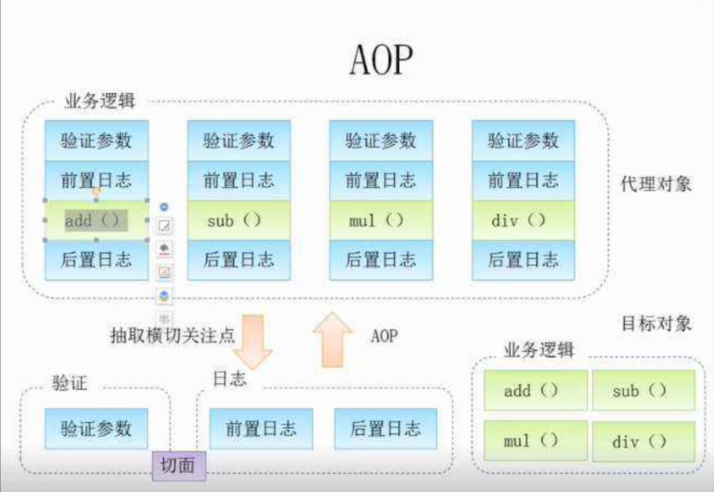
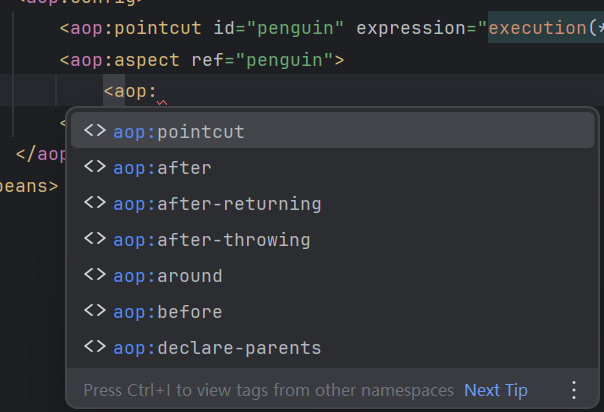
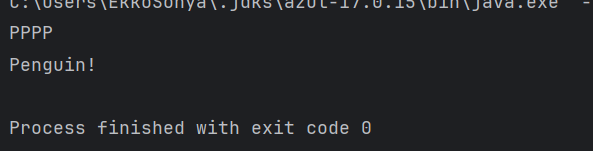
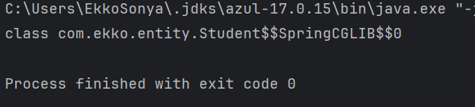
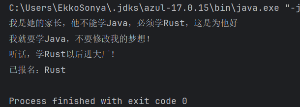
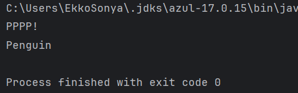

## AOP面向切片

AOP（Aspect Oriented Programming）思想实际上就是：在运行时，**动态地将代码切入**到类的指定方法、指定位置上。

也就是说，我们可以使用`AOP`来帮助我们在**方法执行前或执行之后，做一些额外的操作**，实际上，它就是代理！

通过AOP我们可以在保证原有业务不变的情况下，添加额外的动作

比如我们的某些方法执行完成之后，需要打印日志，那么这个时候，我们就可以使用AOP来帮助我们完成，它可以批量地为这些方法添加动作。可以说，它相当于将我们原有的方法，在**不改变源代码的基础上进行了增强处理**。



相当于我们的整个业务流程，被直接斩断，并在断掉的位置添加了一个额外的操作，再连接起来，也就是在一个切点位置插入内容。

它的原理实际上就是通过**动态代理机制**实现的。不过Spring底层并不是使用的JDK提供的动态代理，而是使用的第三方库实现，它能够以父类的形式代理，而不仅仅是接口。

### 使用配置实现AOP

#### 准备

在开始之前，先换回之前的XML配置模式

注意这里还入了一些新的AOP相关的约束进来：

```xml
<?xml version="1.0" encoding="UTF-8"?>
<beans xmlns="http://www.springframework.org/schema/beans"
       xmlns:xsi="http://www.w3.org/2001/XMLSchema-instance"
       xmlns:aop="http://www.springframework.org/schema/aop"
       xsi:schemaLocation="http://www.springframework.org/schema/beans http://www.springframework.org/schema/beans/spring-beans.xsd
       http://www.springframework.org/schema/aop http://www.springframework.org/schema/aop/spring-aop.xsd">
</beans>
```

Spring是支持AOP编程的框架之一（实际上它整合了AspectJ框架的一部分），要使用AOP我们需要先导入一个依赖：

```xml
<dependency>
    <groupId>org.springframework</groupId>
    <artifactId>spring-aspects</artifactId>
    <version>6.0.10</version>
</dependency>
```

那么，如何使用AOP呢？首先我们要明确，要实现AOP操作，我们需要知道这些内容：

1. 需要切入的类，类的哪个方法需要被切入
2. 切入之后需要执行什么动作
3. 是在方法执行前切入还是在方法执行后切入
4. 如何告诉Spring需要进行切入

#### 例子

比如现在我们希望对这个学生对象的`study`方法进行增强，在不修改源代码的情况下，增加一些额外的操作：

```java
public class Student {
    public void study(){
        System.out.println("PPPP"); 
        //现在我们希望在这个方法执行完之后，打印一些其他的内容，在不修改原有代码的情况下，该怎么做呢？
    }
}
```

```java
<bean class="org.example.entity.Student"/>
```

那么我们按照上面的流程，依次来看

首先需要解决的问题是，找到需要切入的类，很明显，就是这个Student类，我们要切入的是这个`study`方法。

第二步，我们切入之后要做什么呢？这里我们直接创建一个新的类，并将要执行的操作写成一个方法：

```java
public class StudentAOP {
    //这个方法就是我们打算对其进行的增强操作
    public void afterStudy() {
        System.out.println("Penguin");
    }
}
```

注意这个类也得注册为Bean才可以：

```xml
<bean id="studentAOP" class="org.example.entity.StudentAOP"/>
```

第三步，我们要明确这是在方法执行之前切入还是执行之后切入，很明显，按照上面的要求，我们需要执行之后进行切入。

第四步，最关键的来了，我们怎么才能告诉Spring我们要进行切入操作呢？这里我们需要在配置文件中进行AOP配置：

```xml
<aop:config>

</aop:config>
```

##### 建立切点 `<aop:pointcut>`

这个的目的就是来找那些满足条件的匹配的函数

接着我们需要添加一个新的切点，首先填写ID，这个随便起都可以：

```xml
<aop:pointcut id="test" expression=""/>
```

然后就是通过后面的`expression`表达式来选择到我们需要切入的方法，这个表达式支持很多种方式进行选择

Spring AOP支持以下AspectJ切点指示器（PCD）用于表达式，重点是 `execution`：

- `execution`：用于匹配方法执行连接点。这是使用Spring AOP时使用的主要点切割指示器。
- `within`：限制匹配到某些类型的连接点（使用Spring AOP时在匹配类型中声明的方法的执行）。
- `this`：限制与连接点匹配（使用Spring AOP时方法的执行），其中bean引用（Spring AOP代理）是给定类型的实例。
- `target`：限制匹配连接点（使用Spring AOP时方法的执行），其中目标对象（正在代理的应用程序对象）是给定类型的实例。
- `args`：限制与连接点匹配（使用Spring AOP时方法的执行），其中参数是给定类型的实例。
- `@target`：限制匹配连接点（使用Spring AOP时方法的执行），其中执行对象的类具有给定类型的注释。
- `@args`：限制匹配到连接点（使用Spring AOP时方法的执行），其中传递的实际参数的运行时类型具有给定类型的注释。
- `@within`：限制与具有给定注释的类型中的连接点匹配（使用Spring AOP时在带有给定注释的类型中声明的方法的执行）。
- `@annotation`：与连接点主体（在Spring AOP中运行的方法）具有给定注释的连接点匹配的限制。

更多详细内容请查阅：<https://docs.spring.io/spring-framework/docs/current/reference/html/core.html#aop-pointcuts-designators>

其中，`execution`填写格式如下：

```xml
修饰符 包名.类名.方法名称(方法参数)
```

- 修饰符：public、protected、private、包括返回值类型、static等等（使用*代表任意修饰符）
- 包名：如com.test（`*`代表全部，比如`com.*`代表com包下的全部包）
- 类名：使用*也可以代表包下的所有类
- 方法名称：可以使用*代表全部方法
- 方法参数：填写对应的参数即可，比如(String, String)，也可以使用*来代表任意一个参数，使用..代表所有参数。

也可以使用其他属性来进行匹配，比如`@annotation`可以用于表示标记了哪些注解的方法被切入，这里我们就只是简单的执行，所以说只需要这样写就可以了：

```xml
<aop:pointcut id="test" expression="execution(* org.example.entity.Student.study())"/>
```

这样，我们就指明了需要切入的方法

##### 选择增强方法`<aop:aspect>`

这则是来匹配满足条件的切点调用的是什么方法

然后就是将我们的增强方法，我们在里面继续添加`aop:aspect`标签，并使用`ref`属性将其指向我们刚刚注册的AOP类Bean：

```xml
<aop:config>
    <aop:pointcut id="test" expression="execution(* org.example.entity.Student.study())"/>
    <aop:aspect ref="studentAOP">

    </aop:aspect>
</aop:config>
```

接着就是添加后续动作了，当然，官方支持的有多种多样的，比如执行前、执行后、抛出异常后、方法返回后等等：



其中`around`方法为环绕方法，自定义度会更高。

这里我们按照上面的要求，直接添加后续动作，注意需要指明生效的切点：

```xml
<aop:aspect ref="studentAOP">
    <!-- method就是我们的增强方法，pointcut-ref指向我们刚刚创建的切点 -->
    <aop:after method="afterStudy" pointcut-ref="test"/>
</aop:aspect>
```

这样，我们就成功配置好了

##### 测试

```java
public static void main(String[] args) {
    ApplicationContext context = new ClassPathXmlApplicationContext("application.xml");
    Student bean = context.getBean(Student.class);
    bean.study();
}
```

结果如下：



可以看到在我们原本的方法执行完成之后，它还继续执行了我们的增强方法，这实际上就是动态代理做到的，实现在不修改原有代码的基础上，对方法的调用进行各种增强，在之后的SpringMVC学习中，我们甚至可以使用它来快速配置访问日志打印。

#### 分析

前面我们说了，AOP是基于**动态代理**实现的，所以说我们如果直接获取`Bean`的类型，会发现不是原本的类型了：

```java
Student bean = context.getBean(Student.class);
System.out.println(bean.getClass());
```



这里其实是Spring通过`CGLib`为我们生成的动态代理类，也就不难理解为什么调用方法会直接得到增强之后的结果了。

包括我们前面讲解Spring的异步任务调度时，为什么能够直接实现异步，**其实就是利用了AOP机制实现的方法增强**。

#### `JoinPoint` 获取切点信息

虽然这些功能已经非常强大了，但是仅仅只能简单的切入还是不能满足一些需求，在某些情况下，我们可以需求方法执行的一些参数，比如方法执行之后返回了什么，或是方法开始之前传入了什么参数等等

现在我们修改一下Student中`study`方法的参数：

```java
public class Student {
    public void study(String str){  
        //现在方法有一个String类型的参数
        System.out.println("都别学Java了，根本找不到工作，快去卷"+str);
    }
}
```

我们希望在增强的方法中**也能拿到这个参数**，然后进行处理

这个时候，我们可以为我们切入的方法添加一个`JoinPoint`参数，通过此参数就可以快速获取切点位置的一些信息：

```java
public void afterStudy(JoinPoint point) {   
    //JoinPoint实例会被自动传入
    //这里我们直接通过getArgs()返回的参数数组获取第1个参数
    System.out.println("学什么"+point.getArgs()[0]+"，Rust天下第一！");
}
```

接着我们修改一下刚刚的AOP配置（因为方法参数有变动）看看结果吧：

```xml
<aop:pointcut id="test" expression="execution(* org.example.entity.Student.study(String))"/>
```

#### `around`环绕方法

我们接着来看自定义度更高的环绕方法，现在我们希望在方法执行前和执行后都加入各种各样的动作,此时我们就可以使用环绕方法。

此时，我们就相当于需要自己来调用代理方法，然后就可以在其前后写我们的动作来执行

环绕方法相当于完全代理了此方法，**它完全将此方法包含在中间**，需要我们手**动调用才可以执行此方法**，并且**我们可以直接获取更多的参数**

注意，如果代理方法存在返回值，那么环绕方法也需要有一个返回值，通过`proceed`方法来执行代理的方法

也可以修改参数之后调用`proceed(Object[])`，使用我们给定的参数再去执行：

```java
public Object test1(ProceedingJoinPoint joinPoint) throws Throwable {
    System.out.println("方法开始之前");
    String arg = joinPoint.getArgs()[0] + "伞兵一号";
    Object value = joinPoint.proceed(new Object[]{arg});
    System.out.println("方法执行完成，结果为："+value);
    return value;
}
```

这里我们还是以`study`方法为例，现在我们希望在调用前修改这个方法传入的参数值，改成我们自己的，然后在调用之后对返回值结果也进行处理：

```java
public String study(String str){
    if(str.equals("Java"))
        System.out.println("我的梦想是学Java");
    else {
        System.out.println("我就要学Java，不要修改我的梦想！");
        str = "Java";
    }
    return str;
}
```

现在我们编写一个环绕方法，对其进行全方面处理：

```java
public Object test1(ProceedingJoinPoint joinPoint) throws Throwable {
    System.out.println("我是她的家长，他不能学Java，必须学Rust，这是为他好");
    Object value = joinPoint.proceed(new Object[]{"Rust"});
    if(value.equals("Java")) {
        System.out.println("听话，学Rust以后进大厂！");
        value = "Rust";
    }
    return value;
}
```

同样的，因为方法变动了，现在我们去修改一下我们的AOP配置：

```xml
<aop:pointcut id="test" expression="execution(* org.example.entity.Student.study(String))"/>
<aop:aspect ref="studentAOP">
    <aop:around method="test1" pointcut-ref="test"/>
</aop:aspect>
```

环绕方法的图标是全包的，跟我们之前的图标不太一样。

```java
public static void main(String[] args) {
    ApplicationContext context = new ClassPathXmlApplicationContext("application.xml");
    Student bean = context.getBean(Student.class);
    System.out.println("已报名："+bean.study("Java"));
}
```



这样，我们就实现了环绕方法，通过合理利用AOP带来的便捷，可以使得我们的代码更加清爽和优美。

##### 实现异步效果

实现异步效果，可以用`AOP`来实现

首先在`Student`类中创立一个`task`

```java
public class Student {
    public void task(Runnable runnable){
        runnable.run();
    }
}
```

这样在`main`里

```java
public static void main(String[] args) {
    ApplicationContext context = new ClassPathXmlApplicationContext("application.xml");
    Student student = (Student) context.getBean(Student.class);
    student.task(()->{
        try {
            Thread.sleep(3000);
            System.out.println("Penguin");
        } catch (InterruptedException e) {
            throw new RuntimeException(e);
        }
    });
    System.out.println("PPPP!");
}
```

此时显然是同步的，要等`task`结束才会输出`PPPP!`

这时候借助`AOP`, 我们在`StudentAOP`类用一个`async`

```java
public void async(ProceedingJoinPoint joinPoint) throws Throwable {
        new Thread(()->{
            try {
                joinPoint.proceed(joinPoint.getArgs());
            } catch (Throwable e) {
                throw new RuntimeException(e);
            }
        }).start();
    }
```

然后去配置文件修改

```xml
    <aop:config>
        <aop:pointcut id="task" expression="execution(* com.ekko.entity.Student.task(Runnable))"/>
        <aop:aspect ref="penguin">
            <aop:around method="async" pointcut-ref="task"/>
        </aop:aspect>
    </aop:config>
```

此时就可以实现异步，相当于调用`task`方法会独立开一个线程



#### 术语

这里介绍一下 AOP 领域中的特性术语，防止自己下来看不懂文章：

- 通知（Advice）: AOP 框架中的增强处理，通知描述了切面何时执行以及如何执行增强处理，也就是我们上面编写的方法实现。
- 连接点（join point）: 连接点表示应用执行过程中能够插入切面的一个点，这个点可以是方法的调用、异常的抛出，实际上就是我们在方法执行前或是执行后需要做的内容。
- 切点（PointCut）: 可以插入增强处理的连接点，可以是方法执行之前也可以方法执行之后，还可以是抛出异常之类的。
- 切面（Aspect）: 切面是通知和切点的结合，我们之前在xml中定义的就是切面，包括很多信息。
- 引入（Introduction）：引入允许我们向现有的类添加新的方法或者属性。
- 织入（Weaving）: 将增强处理添加到目标对象中，并创建一个被增强的对象，我们之前都是在将我们的增强处理添加到目标对象，也就是织入（这名字挺有文艺范的）
