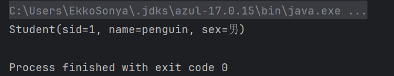

## 数据库框架整合2

### 整合Mybatis框架

通过了解数据源，我们已经清楚，Mybatis实际上是在使用自己编写的数据源（数据源实现其实有很多）默认使用的是池化数据源，它预先存储了很多的连接对象。

如何将Mybatis与Spring更好的结合

#### 使用例子

比如我们现在希望将`SqlSessionFactory`交给IoC容器进行管理，而不是我们自己创建工具类来管理（我们之前一直都在使用工具类管理和创建会话）

```xml
<!-- 这两个依赖不用我说了吧 -->
<dependency>
    <groupId>org.mybatis</groupId>
    <artifactId>mybatis</artifactId>
    <!-- 注意，对于Spring 6.0来说，版本需要在3.5以上 -->
    <version>3.5.13</version>
</dependency>
<dependency>
    <groupId>com.mysql</groupId>
    <artifactId>mysql-connector-j</artifactId>
    <version>8.0.31</version>
</dependency>
<!-- Mybatis针对于Spring专门编写的支持框架 -->
<dependency>
    <groupId>org.mybatis</groupId>
    <artifactId>mybatis-spring</artifactId>
    <version>3.0.2</version>
</dependency>
<!-- Spring的JDBC支持框架 -->
<dependency>
     <groupId>org.springframework</groupId>
     <artifactId>spring-jdbc</artifactId>
     <version>6.0.10</version>
</dependency>
```

##### `SqlSessionTemplate`类

在`mybatis-spring`依赖中，为我们提供了`SqlSessionTemplate`类，它其实就是官方封装的一个工具类，我们可以**将其注册为Bean**

这样我们随时都可以向IoC容器索要对象，而不用自己再去编写一个工具类了，我们可以直接在配置类中创建。

对于这种别人编写的类型，如果要注册为`Bean`，那么**只能在配置类**中完成：

```java
@Configuration
@ComponentScan("org.example.entity")
public class MainConfiguration {
    // 注册SqlSessionTemplate的Bean
    @Bean
    public SqlSessionTemplate sqlSessionTemplate() throws IOException {
        SqlSessionFactory factory = new SqlSessionFactoryBuilder().build(Resources.getResourceAsReader("mybatis-config.xml"));
        return new SqlSessionTemplate(factory);
    }
}
```

##### 其他配置

这里写一个测试的Mapper类：

```java
@Data
public class Student {
    private int sid;
    private String name;
    private String sex;
}
```

```java
public interface TestMapper {
    @Select("select * from student where sid = 1")
    Student getStudent();
}
```

最后是配置文件：

```xml
<?xml version="1.0" encoding="UTF-8" ?>
<!DOCTYPE configuration
        PUBLIC "-//mybatis.org//DTD Config 3.0//EN"
        "http://mybatis.org/dtd/mybatis-3-config.dtd">
<configuration>
    <environments default="development">
        <environment id="development">
            <transactionManager type="JDBC"/>
            <dataSource type="POOLED">
                <property name="driver" value="com.mysql.cj.jdbc.Driver"/>
                <property name="url" value="jdbc:mysql://localhost:3306/study"/>
                <property name="username" value="root"/>
                <property name="password" value="123456"/>
            </dataSource>
        </environment>
    </environments>
    <mappers>
        <mapper class="org.example.mapper.TestMapper"/>
    </mappers>
</configuration>
```

##### 测试

```java
public static void main(String[] args) {
    ApplicationContext context = new AnnotationConfigApplicationContext(MainConfiguration.class);
    SqlSessionTemplate template = context.getBean(SqlSessionTemplate.class);
    TestMapper testMapper = template.getMapper(TestMapper.class);
    System.out.println(testMapper.getStudent());
}
```



这样，我们就成功将Mybatis与Spring完成了初步整合，直接从容器中就能获取到`SqlSessionTemplate`，结合自动注入，我们的代码量能够进一步的减少。

虽然这样已经很方便了，但是还不够方便，我们依然需要手动去获取Mapper对象，那么能否直接得到对应的Mapper对象呢

##### 自动管理`Mapper`  `MapperScan`

我们希望让Spring直接帮助我们管理所有的Mapper，当需要时，可以直接从容器中获取，我们可以直接在配置类上方添加注解：

```java
@Configuration
@ComponentScan("org.example.entity")
@MapperScan("org.example.mapper")
public class MainConfiguration {

}
```

这样，Mybatis就会**自动扫描对应包下所有的接口**，并**直接被注册为对应的Mapper作为Bean管理**，那么我们现在就可以直接通过容器获取了：

```java
public static void main(String[] args) {
    ApplicationContext context = new AnnotationConfigApplicationContext(MainConfiguration.class);
    TestMapper mapper = context.getBean(TestMapper.class);
    System.out.println(mapper.getStudent());
}
```

在我们后续的SpringBoot学习阶段，会有更加方便的方式来注册Mapper，我们只需要一个`@Mapper`注解即可完成，非常简单。

请一定注意，必须存在`SqlSessionTemplate`或是`SqlSessionFactoryBean`的Bean，否则会无法初始化（毕竟要数据库的链接信息）

#### 全注解配置

我们接着来看，如果我们希望直接去除Mybatis的配置文件，完全实现全注解配置，那么改怎么去实现呢？

##### 继承`SqlSessionFactoryBean`类

我们可以使用`SqlSessionFactoryBean`类：

```java
@Configuration
@ComponentScan("org.example.entity")
@MapperScan("org.example.mapper")
public class MainConfiguration {
    @Bean   
    //单独创建一个Bean，方便之后更换
    public DataSource dataSource(){
        return new PooledDataSource("com.mysql.cj.jdbc.Driver",
                "jdbc:mysql://localhost:3306/study", "root", "123456");
    }

    @Bean
    public SqlSessionFactoryBean sqlSessionFactoryBean(DataSource dataSource){  //直接参数得到Bean对象
        SqlSessionFactoryBean bean = new SqlSessionFactoryBean();
        bean.setDataSource(dataSource);
        return bean;
    }
}
```

首先我们需要创建一个数据源的实现类，因为这是数据库最基本的信息，然后再给到`SqlSessionFactoryBean`实例

这样，我们相当于直接在一开始通过IoC容器配置了`SqlSessionFactory`，这里只需要传入一个`DataSource`的实现即可，我们采用池化数据源。

删除配置文件，重新再来运行，同样可以正常使用Mapper。

从这里开始，通过IoC容器，Mybatis已经**不再需要使用配置文件**了，在我们之后的学习中，基于Spring的开发**将不会再出现Mybatis的配置文件**。

### 使用HikariCP连接池

前面我们提到了数据源还有其他实现，比如C3P0、Druid等，它们都是非常优秀的数据源实现（可以自行了解），不过我们这里要介绍的，是之后在SpringBoot中还会遇到的HikariCP连接池。

> HikariCP是由日本程序员开源的一个数据库连接池组件，代码非常轻量，并且速度非常的快。根据官方提供的数据，在酷睿i7开启32个线程32个连接的情况下，进行随机数据库读写操作，HikariCP的速度是现在常用的C3P0数据库连接池的数百倍。在SpringBoot 3.0中，官方也是推荐使用HikariCP。


首先，我们需要导入依赖：

```xml
<dependency>
    <groupId>com.zaxxer</groupId>
    <artifactId>HikariCP</artifactId>
    <version>5.0.1</version>
</dependency>
```

要更换数据源实现，非常简单，我们可以直接声明一个Bean：

```java
@Bean
public DataSource dataSource() {
    HikariDataSource dataSource = new HikariDataSource();
    dataSource.setJdbcUrl("jdbc:mysql://localhost:3306/study");
    dataSource.setDriverClassName("com.mysql.cj.jdbc.Driver");
    dataSource.setUsername("root");
    dataSource.setPassword("123456");
    return dataSource;
}
```

最后我们发现，同样可以得到输出结果，但是出现了一个报错：

```
SLF4J: No SLF4J providers were found.
SLF4J: Defaulting to no-operation (NOP) logger implementation
SLF4J: See http://www.slf4j.org/codes.html#noProviders for further details.
```

此数据源实际上是采用了SLF4J日志框架打印日志信息，但是现在没有任何的日志实现（slf4j只是一个API标准，它规范了多种日志框架的操作，统一使用SLF4J定义的方法来操作不同的日志框架，我们会在SpringBoot篇进行详细介绍）我们这里就使用JUL作为日志实现，我们需要导入另一个依赖：

```xml
<dependency>
    <groupId>org.slf4j</groupId>
    <artifactId>slf4j-jdk14</artifactId>
    <version>1.7.25</version>
</dependency>
```

注意版本一定要和`slf4j-api`保持一致，我们可以在这里直接查看：


这样，HikariCP数据源的启动日志就可以正常打印出来了：

```
12月 17, 2022 3:41:38 下午 com.zaxxer.hikari.HikariDataSource getConnection
信息: HikariPool-1 - Starting...
12月 17, 2022 3:41:38 下午 com.zaxxer.hikari.pool.HikariPool checkFailFast
信息: HikariPool-1 - Added connection com.mysql.cj.jdbc.ConnectionImpl@4f8969b0
12月 17, 2022 3:41:38 下午 com.zaxxer.hikari.HikariDataSource getConnection
信息: HikariPool-1 - Start completed.
Student(sid=1, name=小明, sex=男)
```

在SpringBoot阶段，我们还会遇到`HikariPool-1 - Starting...`和`HikariPool-1 - Start completed.`同款日志信息。

当然，Lombok肯定也是支持这个日志框架快速注解的：

```java
@Slf4j
public class Main {
    public static void main(String[] args) {
        ApplicationContext context = new AnnotationConfigApplicationContext(MainConfiguration.class);
        TestMapper mapper = context.getBean(TestMapper.class);
        log.info(mapper.getStudent().toString());
    }
}
```

是不是感觉特别方便？
