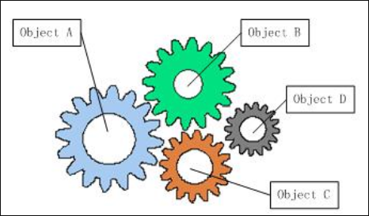
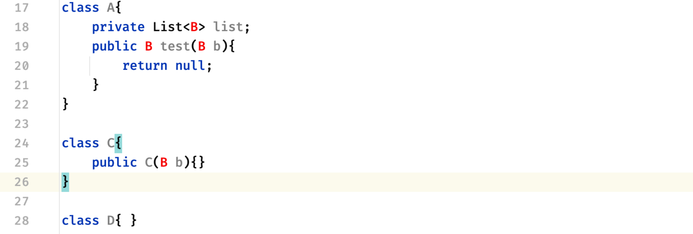
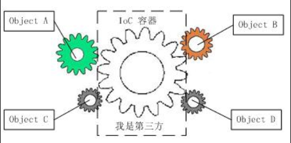
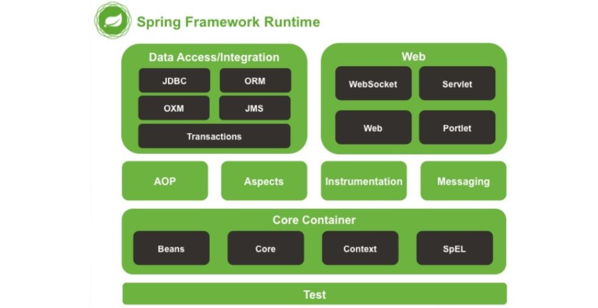
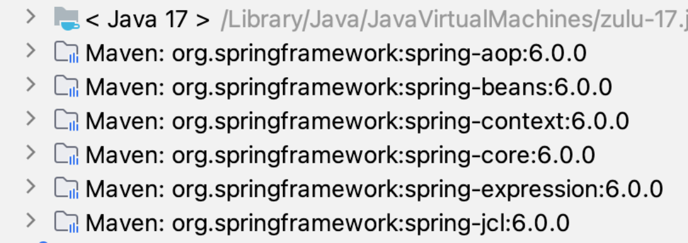
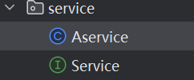
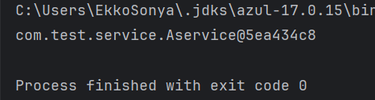
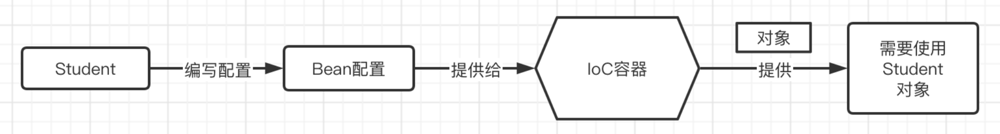

SSM（Spring+SpringMVC+Mybatis）

## Spring 简介

Spring是一个框架(文档：<https://docs.spring.io/spring-framework/docs/6.0.10/reference/html/core.html#spring-core>)

它是为了简化开发而生，它是轻量级的**IoC**和**AOP**的容器框架，主要是针对**Bean**的生命周期进行管理的轻量级容器，并且它的生态已经发展得极为庞大。

## IoC理论基础 1

Spring框架最核心的其实它的IoC容器

### IoC理论介绍

IOC是Inversion of Control的缩写，翻译为：“控制反转”

把复杂系统分解成相互合作的对象，这些对象类通过封装以后，内部实现对外部是透明的，从而降低了解决问题的复杂度，而且可以灵活地被重用和扩展。

#### 以前耦合情况

在我们之前的图书管理系统Web应用程序中，我们发现，整个程序其实是依靠各个部分相互协作，共同完成一个操作

比如要展示借阅信息列表，那么首先需要使用Servlet进行请求和响应的数据处理，然后请求的数据全部交给对应的Service（业务层）来处理，当Service发现要从数据库中获取数据时，再向对应的Mapper发起请求。

它们之间就像连接在一起的齿轮：



就像一个团队，每个人的分工都很明确，流水线上的一套操作必须环环相扣，这是一种**高度耦合**的体系。

但是这样存在一个很严重的问题，很容易出现，之前写好的代码，实现的功能，需要全部推翻，改成新的功能，那么我们就不得不去修改某些流水线上的模块，但是这样一修改，会直接导致整个流水线的引用关系大面积更新。

比如下面的情况：

```java
class A{
    private List<B> list;
    public B test(B b){
        return null;
    }
}

class C{
    public C(B b){}
}

class B{ }
```

可以看到，A和C在大量地直接使用B，但是某一天，这个B的实现已经过时了，此时来了个把功能实现的更好的D，我们需要用这个新的类来完成业务了：



可以看到，因为类之间的关联性太强了，会开始大面积报错，所有之前用了B的类，得挨个进行修改，全都改成D.

因此，高耦合度带来的缺点是很明显的，也是现代软件开发中很致命的问题。

如果要改善这种情况，我们只能将各个模块进行解耦，让各个模块之间的依赖性不再那么地强。

也就是说，Service的实现类，不再由我们决定，而是让程序自己决定，所有的实现类对象，全部交给程序来管理，所有对象之间的关系，也由程序来动态决定，这样就引入了IoC理论。

#### IoC理论



我们可以将对象交给**IoC容器进行管理**，比如当我们需要一个接口的实现时，由它根据**配置文件来决定到底给我们哪一个实现类**，这样，我们就可以不用再关心我们要去使用哪一个实现类了，我们只需要关心，给到我的一定是一个可以正常使用的实现类，能用就完事了，反正接口定义了啥，我只管调，这样，我们就可以放心地让一个人去写视图层的代码，一个人去写业务层的代码。

还是之前的代码，但是有了IoC容器加持之后：

```java
public static void main(String[] args) {
    A a = new A();
    a.test(IoC.getBean(Service.class));   
    //瞎编的一个容器类，但是是那个意思，即根据所给的接口确定类
    //比如现在在IoC容器中管理的Service的实现是B，那么我们从里面拿到的Service实现就是B
}

class A{
    private List<Service> list;   
    //一律使用Service，具体实现由IoC容器提供
    public Service test(Service b){
        return null;
    }
}

interface Service{ }   
//使用Service做一个顶层抽象

class B implements Service{}  
//B依然是具体实现类，并交给IoC容器管理
```

当具体实现类发生修改时，我们同样只需要将新的实现类交给IoC容器管理，这样我们无需修改之前的任何代码：

```java
interface Service{ }

class D implements Service{}   
//现在实现类变成了D，但是之前的代码并不会报错
```

这样，即使我们的底层实现类发生了修改，也不会导致与其相关联的类出现错误，而进行大面积修改，通过定义抽象+容器管理的形式，我们就可以将原有的强关联解除。

高内聚，低耦合，是现代软件的开发的设计目标，而Spring框架就给我们提供了这样的一个IoC容器进行对象的的管理，一个由Spring IoC容器实例化、组装和管理的对象，我们称其为`Bean`。

### 第一个Spring项目

首先一定要明确，使用Spring首要目的是为了使得软件项目进行解耦，而不是为了去简化代码。

Spring并不是一个独立的框架，它实际上包含了很多的模块：



而我们首先要去学习的就是`Core Container`，也就是核心容器模块，只有了解了Spring的核心技术，我们才能真正认识这个框架为我们带来的便捷之处。

Spring是一个**非入侵式**的框架，就像一个工具库一样，它可以很简单地加入到我们已有的项目中，因此，我们只需要直接导入其依赖就可以使用了，Spring核心框架的Maven依赖坐标：

```xml
<dependency>
    <groupId>org.springframework</groupId>
    <artifactId>spring-context</artifactId>
    <version>6.0.10</version>
</dependency>
```

**注意：** 与旧版教程不同的是，Spring 6要求你使用的Java版本为`17`及以上，包括后面我们在学习SpringMvc时，要求Tomcat版本必须为10以上。

这个依赖中包含了如下依赖：



这里出现的都是Spring核心相关的内容，如Beans、Core、Context、SpEL以及非常关键的AOP框架

#### 使用 `bean`

Spring会给我们提供IoC容器用于管理Bean，但是我们得先为这个容器编写一个配置文件，我们可以通过配置文件告诉容器需要管理哪些Bean以及Bean的属性、依赖关系等等。

首先我们需要在resource中创建一个Spring配置文件（在resource中创建的文件，会在编译时被一起放到类路径下），命名为test.xml，直接右键点击即可创建：

```xml
<?xml version="1.0" encoding="UTF-8"?>
<beans xmlns="http://www.springframework.org/schema/beans"
       xmlns:xsi="http://www.w3.org/2001/XMLSchema-instance"
       xsi:schemaLocation="http://www.springframework.org/schema/beans
        https://www.springframework.org/schema/beans/spring-beans.xsd">
</beans>
```

Spring为我们提供了一个IoC容器，用于去存放我们需要使用的对象，我们可以将对象交给IoC容器进行管理，当我们需要使用对象时，就可以向IoC容器去索要，并由它来决定给我们哪一个对象。

而我们如果需要使用Spring为我们提供的IoC容器，那么就需要创建一个应用程序上下文，它代表的就是IoC容器，它会负责实例化、配置和组装Bean：

```java
public static void main(String[] args) {
    //ApplicationContext是应用程序上下文的顶层接口，它有很多种实现，这里我们先介绍第一种
    //因为这里使用的是XML配置文件，所以说我们就使用 ClassPathXmlApplicationContext 这个实现类
    ApplicationContext context = new ClassPathXmlApplicationContext("test.xml");  //这里写上刚刚的名字
}
```

比如现在我们要让IoC容器帮助我们管理一个Student对象（Bean），当我们需要这个对象时再申请，那么就需要这样，首先先将Student类定义出来：

```java
package com.test.bean;

public class Student {
    public void hello(){
        System.out.println("Hello World!");
    }
}
```

既然现在要让别人帮忙管理对象，那么就不能再由我们自己去new这个对象了，而是编写对应的配置，我们打开刚刚创建的`test.xml`文件进行编辑，添加：

```java
<bean name="student" class="com.test.bean.Student"/>
```

这里我们就在配置文件中编写好了对应Bean的信息，之后容器就会根据这里的配置进行处理了。

现在，这个对象不需要我们再去创建了，而是由IoC容器自动进行创建并提供，我们可以直接从上下文中获取到它为我们创建的对象：

```java
public static void main(String[] args) {
    ApplicationContext context = new ClassPathXmlApplicationContext("test.xml");
    Student student = (Student) context.getBean("student");   //使用getBean方法来获取对应的对象（Bean）
    student.hello();
}
```

同理，我们也可以实现前面IoC提到的例子：

此时有 接口`Serivce` 和 对应实现类 `Aservice`



此时我们去配置文件注册好对应的`Aservice`的`bean`

```xml
<bean class="com.test.service.Aservice"/>
```

然后，我们在项目里使用`Service`来创建对象，向容器找到对应实现的类：

```java
public class Main {
    public static void main(String[] args) {
        ApplicationContext context = new ClassPathXmlApplicationContext("application.xml");
        Service service = (Service) context.getBean(Service.class);
        System.out.println(service);
    }
}
```

这样最终实现的类就是对应的 `Aservice`



所以，当`Aservice`被更新了，变成`Bservice`，将对应的配置文件修改就行，它会自动找到对应接口是否存在`bean`的实现类。

如果有多个的话，这样是会报错的，后续应该有解决方案。

```java
Exception in thread "main" org.springframework.beans.factory.NoUniqueBeanDefinitionException: 
  No qualifying bean of type 'com.test.service.Service' available: 
  expected single matching bean but found 2: com.test.service.Aservice#0,com.test.service.Bservice#0
```

实际上，这里得到的Student对象是由Spring通过反射机制帮助我们创建的


