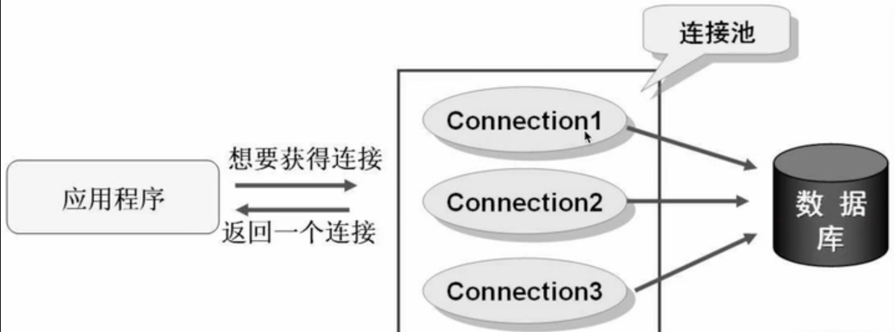

## 数据库框架整合1

学习了Spring之后，我们已经了解如何将一个类作为Bean交由IoC容器管理，这样，我们就可以通过更方便的方式来使用Mybatis框架，我们可以直接把SqlSessionFactory、Mapper交给Spring进行管理，并且可以通过注入的方式快速地使用它们。

### 数据源 `DataSource`接口

在之前，我们如果需要创建一个JDBC的连接，那么必须使用`DriverManager.getConnection()`来创建连接，连接建立后，通过创建`Statement`对象，就可以进行数据库操作。

而学习了Mybatis之后，我们就不用再去使用`DriverManager`为我们提供连接对象，而是直接使用Mybatis为我们提供的`SqlSessionFactory`工具类来获取对应的`SqlSession`通过会话对象去操作数据库。

那么，它到底是如何封装JDBC的呢？

我们可以试着来猜想一下，会不会是Mybatis每次都是帮助我们调用`DriverManager`来实现的数据库连接创建？

对应Mybatis的源码：

```java
public SqlSession openSession(boolean autoCommit) {
    return this.openSessionFromDataSource(this.configuration.getDefaultExecutorType(), (TransactionIsolationLevel)null, autoCommit);
}
```

在通过`SqlSessionFactory`调用`openSession`方法之后，它调用了内部的一个私有的方法`openSessionFromDataSource`，

这个方法里面定义了的内容：

```java
private SqlSession openSessionFromDataSource(ExecutorType execType, TransactionIsolationLevel level, boolean autoCommit) {
    Transaction tx = null;

    DefaultSqlSession var8;
    try {
        //获取当前环境（由配置文件映射的对象实体）
        Environment environment = this.configuration.getEnvironment();
        //事务工厂（暂时不提，下一板块讲解）
        TransactionFactory transactionFactory = this.getTransactionFactoryFromEnvironment(environment);
        //配置文件中：<transactionManager type="JDBC"/>
        //生成事务（根据我们的配置，会默认生成JdbcTransaction），这里是关键，我们看到这里用到了environment.getDataSource()方法
        tx = transactionFactory.newTransaction(environment.getDataSource(), level, autoCommit);
        //执行器，包括全部的数据库操作方法定义，本质上是在使用执行器操作数据库，需要传入事务对象
        Executor executor = this.configuration.newExecutor(tx, execType);
        //封装为SqlSession对象
        var8 = new DefaultSqlSession(this.configuration, executor, autoCommit);
    } catch (Exception var12) {
        this.closeTransaction(tx);
        throw ExceptionFactory.wrapException("Error opening session.  Cause: " + var12, var12);
    } finally {
        ErrorContext.instance().reset();
    }

    return var8;
}
```

也就是说，我们的数据源配置信息，存放在了`Transaction`对象中，那么现在我们只需要知道执行器到底是如何执行SQL语句的，我们就知道到底如何创建`Connection`对象了，这时就需要获取数据库的链接信息了，那么我们来看看，这个`DataSource`到底是个什么：

```java
public interface DataSource  extends CommonDataSource, Wrapper {

  Connection getConnection() throws SQLException;

  Connection getConnection(String username, String password)
    throws SQLException;
}
```

我们发现，它是在`javax.sql`定义的一个接口，它包括了两个方法，都是用于获取连接的。

因此，现在我们可以断定，并不是通过之前`DriverManager`的方法去获取连接了，而是使用`DataSource`的实现类来获取的，因此，也就正式引入到我们这一节的话题了：

> 数据库链接的建立和关闭是极其耗费系统资源的操作，通过`DriverManager`获取的数据库连接，一个数据库连接对象**均对应一个物理数据库连接**，每次操作都打开一个物理连接，使用完后立即关闭连接，频繁的打开、关闭连接会持续消耗网络资源，造成整个系统性能的低下。

因此，JDBC为我们定义了一个数据源的标准，也就是`DataSource`接口，告诉数据源数据库的连接信息，并将所有的连接全部交给数据源进行集中管理，当需要一个`Connection`对象时，可以向数据源申请，数据源会根据内部机制，合理地分配连接对象给我们。

一般比较常用的`DataSource`实现，都是采用**池化技术**，就是在一开始就创建好N个连接，这样之后使用就无需再次进行连接，而是直接使用现成的`Connection`对象进行数据库操作。



当然，也可以使用传统的即用即连的方式获取`Connection`对象，Mybatis为我们提供了几个默认的数据源实现，之前一直使用的是官方的默认配置，也就是池化数据源：

```xml
<?xml version="1.0" encoding="UTF-8" ?>
<!DOCTYPE configuration
        PUBLIC "-//mybatis.org//DTD Config 3.0//EN"
        "http://mybatis.org/dtd/mybatis-3-config.dtd">
<configuration>
    <environments default="development">
        <environment id="development">
            <transactionManager type="JDBC"/>
            <dataSource type="POOLED">
                <property name="driver" value="${驱动类（含包名）}"/>
                <property name="url" value="${数据库连接URL}"/>
                <property name="username" value="${用户名}"/>
                <property name="password" value="${密码}"/>
            </dataSource>
        </environment>
    </environments>
</configuration>
```

这里的`type`属性一共三个选项：

- `UNPOOLED`  不使用连接池的数据源
- `POOLED`    使用连接池的数据源
- `JNDI`     使用JNDI实现的数据源

### Mybatis数据源实现

前面我们介绍了DataSource数据源，那么我们就来看看，Mybatis到底是怎么实现的。

`Mybatis`总共就三种数据源

#### 不使用池化的数据源 `UnpooledDataSource`

我们先来看看，不使用池化的数据源实现，它叫做`UnpooledDataSource`，我们来看看源码：

```java
public class UnpooledDataSource implements DataSource {
    private ClassLoader driverClassLoader;
    private Properties driverProperties;
    private static Map<String, Driver> registeredDrivers = new ConcurrentHashMap();
    private String driver;
    private String url;
    private String username;
    private String password;
    private Boolean autoCommit;
    private Integer defaultTransactionIsolationLevel;
    private Integer defaultNetworkTimeout;
    ...
}
```

首先这个类中定义了很多的成员，包括数据库的连接信息、数据库驱动信息、事务相关信息等。

我们接着来看，它是如何实现`DataSource`中提供的接口方法的：

```java
public Connection getConnection() throws SQLException {
    return this.doGetConnection(this.username, this.password);
}

public Connection getConnection(String username, String password) throws SQLException {
    return this.doGetConnection(username, password);
}
```

实际上，这两个方法都指向了内部的一个`doGetConnection`方法，那么我们接着来看：

```java
private Connection doGetConnection(String username, String password) throws SQLException {
    Properties props = new Properties();
    if (this.driverProperties != null) {
        props.putAll(this.driverProperties);
    }

    if (username != null) {
        props.setProperty("user", username);
    }

    if (password != null) {
        props.setProperty("password", password);
    }

    return this.doGetConnection(props);
}
```

这里将用户名和密码配置封装为一个`Properties`对象，然后执行另一个重载同名的方法：

```java
private Connection doGetConnection(Properties properties) throws SQLException {
    //若未初始化驱动，需要先初始化，内部维护了一个Map来记录初始化信息，这里不多介绍了
    this.initializeDriver();
    //传统的获取连接的方式，是不是终于找到熟悉的味道了
    Connection connection = DriverManager.getConnection(this.url, properties);
    //对连接进行额外的一些配置
    this.configureConnection(connection);
    return connection;   //返回得到的Connection对象
}
```

到这里，就返回`Connection`对象了，而此对象正是通过`DriverManager`来创建的

因此，非池化的数据源实现依然使用的是传统的连接创建方式.

#### 池化的数据源 `PooledDataSource`

接着来看池化的数据源实现，它是`PooledDataSource`类：

```java
public class PooledDataSource implements DataSource {
    private static final Log log = LogFactory.getLog(PooledDataSource.class);
    private final PoolState state = new PoolState(this);
    //内部维护了一个非池化的数据源，这是要干嘛？
    private final UnpooledDataSource dataSource;
    protected int poolMaximumActiveConnections = 10;
    protected int poolMaximumIdleConnections = 5;
    protected int poolMaximumCheckoutTime = 20000;
    protected int poolTimeToWait = 20000;
    protected int poolMaximumLocalBadConnectionTolerance = 3;
    protected String poolPingQuery = "NO PING QUERY SET";
    protected boolean poolPingEnabled;
    protected int poolPingConnectionsNotUsedFor;
    private int expectedConnectionTypeCode;
    //并发相关类，我们在JUC篇视频教程中介绍过，感兴趣可以前往观看
    private final Lock lock = new ReentrantLock();
    private final Condition condition;
}
```

我们发现，在这里的定义就比非池化的实现复杂得多了，因为它还要考虑**并发的问题**，并且还要考虑如何**合理地存放大量的链接对象，该如何进行合理分配**

因此它的玩法非常之高级。

首先注意，它存放了一个`UnpooledDataSource`，此对象是在构造时就被创建，其实创建`Connection`还是依靠数据库驱动创建

首先我们来看看它是如何实现接口方法的：

```java
public Connection getConnection() throws SQLException {
    return this.popConnection(this.dataSource.getUsername(), this.dataSource.getPassword()).getProxyConnection();
}

public Connection getConnection(String username, String password) throws SQLException {
    return this.popConnection(username, password).getProxyConnection();
}
```

可以看到，它调用了`popConnection()`方法来获取连接对象，**然后进行了一个代理**

通过这方法名字我们可以猜测，有可能整个连接池就是一个类似于栈的集合类型结构实现的。

##### `popConnection`方法

那么我们接着来看看`popConnection`方法：

主要是用`PoolState`类中维护了两个列表进行管理

```java
private PooledConnection popConnection(String username, String password) throws SQLException {
    boolean countedWait = false;
    //返回的是PooledConnection对象，
    PooledConnection conn = null;
    long t = System.currentTimeMillis();
    int localBadConnectionCount = 0;

    while(conn == null) {
        // 现在加锁的源码，用 ReentrantLock
        // 直接 this.lock.lock();

        synchronized(this.state) {   
            // 加锁，因为有可能很多个线程都需要获取连接对象
            PoolState var10000;
            // PoolState存了两个List，一个是空闲列表，一个是活跃列表
            if (!this.state.idleConnections.isEmpty()) {   
                // 有空闲的连接时，可以直接分配Connection
                conn = (PooledConnection)this.state.idleConnections.remove(0);  
                //ArrayList中取第一个元素
                if (log.isDebugEnabled()) {
                    log.debug("Checked out connection " + conn.getRealHashCode() + " from pool.");
                }
            // 如果已经没有多余的连接可以分配，那么就检查一下活跃连接数是否达到最大的分配上限，如果没有，就new一个新的
            } else if (this.state.activeConnections.size() < this.poolMaximumActiveConnections) {
                // 注意new了之后并没有立即往List里面塞，只是存了一些基本信息
                // 我们发现，这里依靠UnpooledDataSource创建了一个Connection对象，并将其封装到PooledConnection中
                // 所以说内部维护的UnpooledDataSource对象其实是为了节省代码，因为创建数据库连接其实都是一样的方式
                conn = new PooledConnection(this.dataSource.getConnection(), this);
                if (log.isDebugEnabled()) {
                    log.debug("Created connection " + conn.getRealHashCode() + ".");
                }
              //以上条件都不满足，那么只能从之前的连接中寻找了，看看有没有那种卡住的链接（比如，由于网络问题有可能之前的连接一直被卡住，然而正常情况下早就结束并且可以使用了，所以这里相当于是优化也算是一种捡漏的方式）
            } else {
                // 获取最早创建的连接
                PooledConnection oldestActiveConnection = (PooledConnection)this.state.activeConnections.get(0);
                long longestCheckoutTime = oldestActiveConnection.getCheckoutTime();
                // 判断是否超过最大的使用时间
                if (longestCheckoutTime > (long)this.poolMaximumCheckoutTime) {
                    // 超时统计信息（不重要）
                    ++this.state.claimedOverdueConnectionCount;
                    var10000 = this.state;
                    var10000.accumulatedCheckoutTimeOfOverdueConnections += longestCheckoutTime;
                    var10000 = this.state;
                    var10000.accumulatedCheckoutTime += longestCheckoutTime;
                    // 从活跃列表中移除此链接信息
                    this.state.activeConnections.remove(oldestActiveConnection);
                    // 如果开启事务，还需要回滚一下
                    if (!oldestActiveConnection.getRealConnection().getAutoCommit()) {
                        try {
                            oldestActiveConnection.getRealConnection().rollback();
                        } catch (SQLException var15) {
                            log.debug("Bad connection. Could not roll back");
                        }
                    }

                    // 这里就根据之前的连接对象直接new一个新的连接（注意使用的还是之前的Connection对象，并没有创建新的对象，只是被重新封装了）
                    conn = new PooledConnection(oldestActiveConnection.getRealConnection(), this);
                    conn.setCreatedTimestamp(oldestActiveConnection.getCreatedTimestamp());
                    conn.setLastUsedTimestamp(oldestActiveConnection.getLastUsedTimestamp());
                    // 过期
                    oldestActiveConnection.invalidate();
                    if (log.isDebugEnabled()) {
                        log.debug("Claimed overdue connection " + conn.getRealHashCode() + ".");
                    }
                } else {
                  // 没有超时，那就确实是没连接可以用了，只能卡住了（阻塞）
                  // 然后顺手记录一下目前有几个线程在等待其他的任务搞完
                    try {
                        if (!countedWait) {
                            ++this.state.hadToWaitCount;
                            countedWait = true;
                        }

                        if (log.isDebugEnabled()) {
                            log.debug("Waiting as long as " + this.poolTimeToWait + " milliseconds for connection.");
                        }
                        // 最后再等等
                        long wt = System.currentTimeMillis();
                        this.state.wait((long)this.poolTimeToWait);
                        // 要是超过等待时间还是没等到，只能放弃了
                        // 注意这样的话con就为null了
                        var10000 = this.state;
                        var10000.accumulatedWaitTime += System.currentTimeMillis() - wt;
                    } catch (InterruptedException var16) {
                        break;
                    }
                }
            }

            // 经过之前的操作，并且已经成功分配到连接对象的情况下
            if (conn != null) {
                if (conn.isValid()) {
                    // 首先验证是否有效
                    if (!conn.getRealConnection().getAutoCommit()) {  
                        // 清理之前可能存在的遗留事务操作
                        conn.getRealConnection().rollback();
                    }

                    conn.setConnectionTypeCode(this.assembleConnectionTypeCode(this.dataSource.getUrl(), username, password));
                    conn.setCheckoutTimestamp(System.currentTimeMillis());
                    conn.setLastUsedTimestamp(System.currentTimeMillis());
                    // 添加到活跃表中
                    this.state.activeConnections.add(conn);
                    // 统计信息（不重要）
                    ++this.state.requestCount;
                    var10000 = this.state;
                    var10000.accumulatedRequestTime += System.currentTimeMillis() - t;
                } else {
                    // 无效的连接，直接抛异常
                    if (log.isDebugEnabled()) {
                        log.debug("A bad connection (" + conn.getRealHashCode() + ") was returned from the pool, getting another connection.");
                    }

                    ++this.state.badConnectionCount;
                    ++localBadConnectionCount;
                    conn = null;
                    if (localBadConnectionCount > this.poolMaximumIdleConnections + this.poolMaximumLocalBadConnectionTolerance) {
                        if (log.isDebugEnabled()) {
                            log.debug("PooledDataSource: Could not get a good connection to the database.");
                        }

                        throw new SQLException("PooledDataSource: Could not get a good connection to the database.");
                    }
                }
            }
        }
    }

    // 最后该干嘛干嘛，要是之前拿到的con是null的话，直接抛异常
    if (conn == null) {
        if (log.isDebugEnabled()) {
            log.debug("PooledDataSource: Unknown severe error condition.  The connection pool returned a null connection.");
        }

        throw new SQLException("PooledDataSource: Unknown severe error condition.  The connection pool returned a null connection.");
    } else {
        return conn;   
        // 否则正常返回
    }
}
```

经过上面操作之后，我们可以得到以下信息：

> 如果最后得到了连接对象（有可能是从空闲列表中得到，有可能是直接创建的新的，还有可能是经过回收策略回收得到的），那么连接(Connection)对象一定会被放在活跃列表中(state.activeConnections)

##### `getProxyConnection` 代理对象

那么肯定有一个疑问，现在我们已经知道获取一个链接会直接进入到活跃列表中，那么，如果一个连接被关闭，又会发生什么事情呢

在此方法返回之后，会调用`getProxyConnection`来获取一个代理对象，实际上就是`PooledConnection`类：

```java
class PooledConnection implements InvocationHandler {
  private static final String CLOSE = "close";
    private static final Class<?>[] IFACES = new Class[]{Connection.class};
    private final int hashCode;
    // 会记录是来自哪一个数据源创建的的
    private final PooledDataSource dataSource;
    // 连接对象本体
    private final Connection realConnection;
    // 代理的链接对象
    private final Connection proxyConnection;
    ...
}
```

它直接代理了构造方法中传入的Connection对象，也是使用JDK的动态代理实现的

那么我们来看一下，它是如何进行代理的：

```java
public Object invoke(Object proxy, Method method, Object[] args) throws Throwable {
    String methodName = method.getName();
    // 如果调用的是Connection对象的close方法，
    if ("close".equals(methodName)) {
        // 这里并不会真的关闭连接（这也是为什么用代理），而是调用之前数据源的pushConnection方法，将此连接改为为空闲状态
        this.dataSource.pushConnection(this);
        return null;
    } else {
        try {
            if (!Object.class.equals(method.getDeclaringClass())) {
                this.checkConnection();
                // 任何操作执行之前都会检查连接是否可用
            }

            // 原方法该干嘛干嘛
            return method.invoke(this.realConnection, args);
        } catch (Throwable var6) {
            throw ExceptionUtil.unwrapThrowable(var6);
        }
    }
}
```

这下，池化数据源的大致流程其实就已经很清晰了，那么我们最后再来看看`pushConnection`方法：

```java
protected void pushConnection(PooledConnection conn) throws SQLException {
    synchronized(this.state) {   
        // 老规矩，先来把锁
        // 先从活跃列表移除此连接
        this.state.activeConnections.remove(conn);
        // 判断此链接是否可用
        if (conn.isValid()) {
            PoolState var10000;
            // 看看闲置列表容量是否已满（容量满了就回不去了）
            if (this.state.idleConnections.size() < this.poolMaximumIdleConnections && conn.getConnectionTypeCode() == this.expectedConnectionTypeCode) {
                var10000 = this.state;
                var10000.accumulatedCheckoutTime += conn.getCheckoutTime();
                if (!conn.getRealConnection().getAutoCommit()) {
                    conn.getRealConnection().rollback();
                }

                // 把唯一有用的Connection对象拿出来，然后重新创建一个PooledConnection包装
                PooledConnection newConn = new PooledConnection(conn.getRealConnection(), this);
                // 放入闲置列表，成功回收
                this.state.idleConnections.add(newConn);
                newConn.setCreatedTimestamp(conn.getCreatedTimestamp());
                newConn.setLastUsedTimestamp(conn.getLastUsedTimestamp());
                conn.invalidate();
                if (log.isDebugEnabled()) {
                    log.debug("Returned connection " + newConn.getRealHashCode() + " to pool.");
                }

                this.state.notifyAll();
            } else {
                var10000 = this.state;
                var10000.accumulatedCheckoutTime += conn.getCheckoutTime();
                if (!conn.getRealConnection().getAutoCommit()) {
                    conn.getRealConnection().rollback();
                }

                conn.getRealConnection().close();
                if (log.isDebugEnabled()) {
                    log.debug("Closed connection " + conn.getRealHashCode() + ".");
                }

                conn.invalidate();
            }
        } else {
            if (log.isDebugEnabled()) {
                log.debug("A bad connection (" + conn.getRealHashCode() + ") attempted to return to the pool, discarding connection.");
            }

            ++this.state.badConnectionCount;
        }

    }
}
```

这样，我们就已经完全了解了Mybatis的池化数据源的执行流程了。

只不过，无论Connection管理方式如何变换，无论数据源再高级，我们要知道，它都最终都会使用`DriverManager`来创建连接对象，而最终使用的也是`DriverManager`提供的`Connection`对象。
