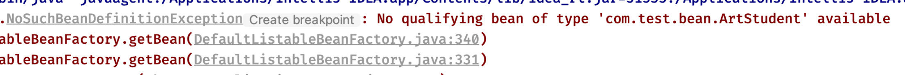
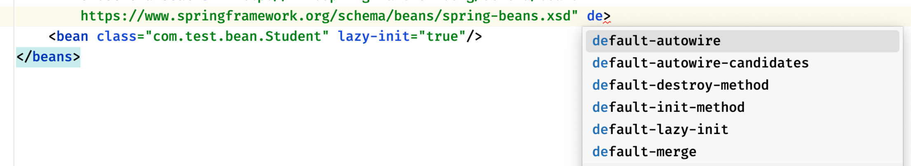

## IoC理论基础 3

### Bean生命周期与继承

#### 初始化 `init-method` 和 销毁 `destroy-method`

我们可以为`Bean`指定初始化方法和销毁方法，以便在对象创建和被销毁时执行一些其他的任务

通过`init-method`和`destroy-method`属性来指定：

```xml
<bean name="student" class="com.test.bean.Student" init-method="init" destroy-method="destroy"/>
```

其中的值为对应对象的某个函数

##### 初始化和销毁的时机

那么什么时候是初始化，什么时候又是销毁呢？

- 当容器创建时，默认情况下Bean都是单例的，那么都会在一开始就加载好，对象构造完成后，会执行`init-method`

- 我们可以调用`close`方法关闭容器，此时容器内存放的Bean也会被一起销毁，会执行`destroy-method`

```java
// 容器创建时，默认情况下Bean都是单例的
// 那么都会在一开始就加载好，对象构造完成后，会执行init-method
ClassPathXmlApplicationContext context = new ClassPathXmlApplicationContext("test.xml");
// 我们可以调用close方法关闭容器
// 此时容器内存放的Bean也会被一起销毁，会执行destroy-method
context.close();
```

注意，如果Bean不是单例模式，而是采用的**原型模式**，那么就**只会在获取时才创建，并调用`init-method`**，而对应的销毁方法不会被调用，即使你`contest.close()`

因此，对于**原型模式**下的Bean，Spring**无法顾及其完整生命周期**，而在单例模式下，Spring能够从Bean对象的创建**一直管理到对象的销毁**

官方文档原文如下：

> In contrast to the other scopes, Spring does not manage the complete lifecycle of a prototype bean. The container instantiates, configures, and otherwise assembles a prototype object and hands it to the client, with no further record of that prototype instance. Thus, although initialization lifecycle callback methods are called on all objects regardless of scope, in the case of prototypes, configured destruction lifecycle callbacks are not called. The client code must clean up prototype-scoped objects and release expensive resources that the prototype beans hold. To get the Spring container to release resources held by prototype-scoped beans, try using a custom [bean post-processor](https://docs.spring.io/spring-framework/docs/current/reference/html/core.html#beans-factory-extension-bpp), which holds a reference to beans that need to be cleaned up.

#### 继承 (属性继承) `parent`

Bean之间也是具备继承关系的，只不过这里的继承并不是类的继承，而是**属性的继承**，比如：

```java
public class SportStudent {
    private String name;

    public void setName(String name) {
        this.name = name;
    }
}
```

```java
public class ArtStudent {
    private String name;
   
    public void setName(String name) {
        this.name = name;
    }
}
```

此时，我们先将ArtStudent注册一个Bean：

```xml
<bean name="artStudent" class="com.test.bean.ArtStudent">
    <property name="name" value="小明"/>
</bean>
```

这里我们会注入一个name的初始值，此时我们创建了一个`SportStudent`的Bean，我们希望这个Bean的属性跟刚刚创建的Bean属性是一样的，那么我们可以写一个一模一样的：

```xml
<bean class="com.test.bean.SportStudent">
    <property name="name" value="小明"/>
</bean>
```

但是如果属性太多的话，写起来有点麻烦

这种情况，我们就可以配置Bean之间的继承关系了，我们可以让`SportStudent`这个Bean直接继承ArtStudent这个Bean配置的属性：

```xml
<bean class="com.test.bean.SportStudent" parent="artStudent"/>
```

这样，在ArtStudent Bean中配置的属性，会直接继承给SportStudent Bean（注意，所有配置的属性，在子Bean中必须也要存在，并且可以进行注入，否则会出现错误）

##### 单独配置其他属性

当然，如果子类中某些属性比较特殊，**也可以在继承的基础上单独配置**：

```xml
<bean name="artStudent" class="com.test.bean.ArtStudent" abstract="true">
    <property name="name" value="小明"/>
    <property name="id" value="1"/>
</bean>
<bean class="com.test.bean.SportStudent" parent="artStudent">
    <property name="id" value="2"/>
</bean>
```

##### 抽象`Bean`

如果我们只是希望某一个Bean仅作为一个配置模版供其他Bean继承使用，那么我们可以将其配置为abstract，这样，**容器就不会创建这个Bean的对象**了：

```xml
<bean name="artStudent" class="com.test.bean.ArtStudent" abstract="true">
    <property name="name" value="小明"/>
</bean>
<bean class="com.test.bean.SportStudent" parent="artStudent"/>
```

注意，一旦声明为抽象Bean，那么就无**法通过容器获取到其实例化对象**了。



不过Bean的继承使用频率不是很高，了解就行。

#### 默认全局配置

这里最后再提一下，我们前面已经学习了各种各样的Bean配置属性，如果我们希望整个上下文中所有的Bean都采用某种配置，我们可以在最外层的beans标签中进行默认配置：



这样，即使Bean没有配置某项属性，但是只要在最外层编写了默认配置，那么同样会生效，除非Bean自己进行配置覆盖掉默认配置。
